# Customer Schema Evolution with PySpark Structured Streaming

## A practical guide using one customer file stream

A data pipeline is usually built with an expected structure in mind. We decide which columns should exist, what each column means, and which datatype should be used.

The difficulty begins when the source system changes.

A customer file that originally looked like this:

```text
customer_id, customer_name, city, email
```

may later arrive like this:

```text
customer_id, customer_name, city, email, phone_number
```

Or it may arrive with renamed, reordered, removed, or differently typed columns.

The streaming job must decide whether the new file can still be processed safely.

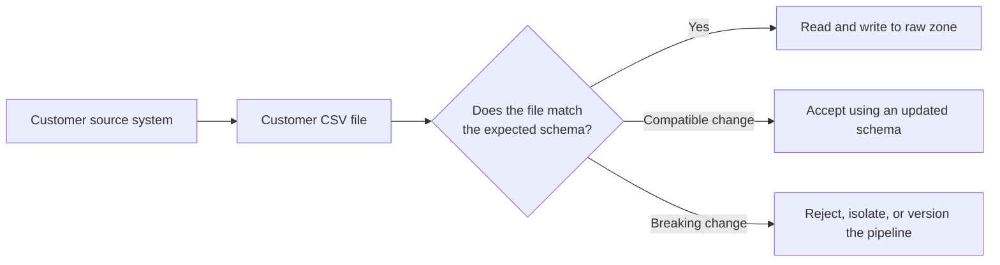

---

# 1. Why schema evolution matters

A pipeline can show a **successful status** and still produce incorrect data.

For example, suppose the pipeline expects:

```text
customer_id, customer_name, city, email
```

But the source sends:

```text
customer_id, customer_name, email, city
```

Because both `city` and `email` are strings, Spark may be able to read the row without a datatype error. The job can succeed while the values enter the wrong columns.

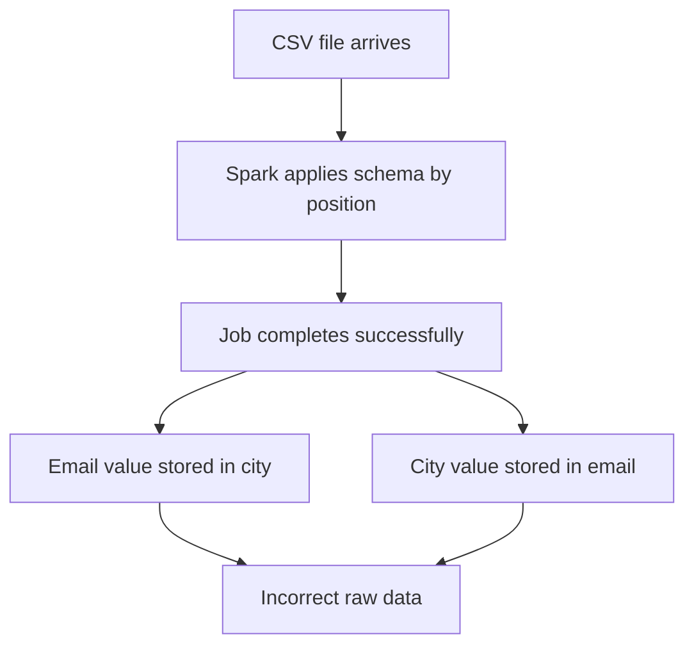

This is called **silent data corruption**.

A visible failure is often easier to fix than a successful pipeline that stores incorrect information.

---

# 2. Key terminology

## 2.1 Schema

A schema describes the expected structure of data.

It normally includes:

| Schema detail | Example |
|---|---|
| Column name | `customer_id` |
| Datatype | Integer |
| Column order | First column |
| Nullable or mandatory | Nullable |
| Business meaning | Unique customer identifier |

## 2.2 Schema evolution

A planned and controlled change to the data structure.

Example:

```text
Schema V1
customer_id, customer_name, city, email

Schema V2
customer_id, customer_name, city, email, phone_number
```

## 2.3 Schema drift

An unexpected difference between the structure the pipeline expects and the structure it receives.

Example:

```text
Expected:
customer_id, customer_name, city, email

Received:
customer_id, full_name, location, email_address
```

## 2.4 Compatible change

A change that can usually be supported without destroying the meaning of older data.

Example:

```text
Add an optional column at the end of the file.
```

## 2.5 Breaking change

A change that can cause failures, null business keys, incorrect mappings, or incompatibility with downstream systems.

Common examples:

- Renaming a column
- Reordering CSV columns
- Removing a required column
- Changing a business key from integer to string
- Changing the meaning of an existing column

## 2.6 Data contract

An agreement between the producer and the consumer of the data.

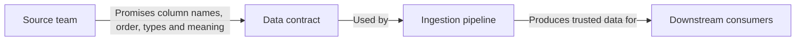

A data contract answers questions such as:

- Which columns must be present?
- Which columns are optional?
- Can columns be reordered?
- Can a datatype change without notice?
- How will a new schema version be announced?

---

# 3. Schemas used in the demonstration

## 3.1 Customer schema V1

```python
CUSTOMER_SCHEMA_V1 = StructType(
    [
        StructField("customer_id", IntegerType(), True),
        StructField("customer_name", StringType(), True),
        StructField("city", StringType(), True),
        StructField("email", StringType(), True),
    ]
)
```

Expected CSV header:

```text
customer_id,customer_name,city,email
```

## 3.2 Customer schema V2

Schema V2 adds `phone_number` at the end.

```python
CUSTOMER_SCHEMA_V2 = StructType(
    [
        StructField("customer_id", IntegerType(), True),
        StructField("customer_name", StringType(), True),
        StructField("city", StringType(), True),
        StructField("email", StringType(), True),
        StructField("phone_number", StringType(), True),
    ]
)
```

Expected CSV header:

```text
customer_id,customer_name,city,email,phone_number
```

## 3.3 Customer schema V3

Schema V3 changes `customer_id` from integer to string.

```python
CUSTOMER_SCHEMA_V3 = StructType(
    [
        StructField("customer_id", StringType(), True),
        StructField("customer_name", StringType(), True),
        StructField("city", StringType(), True),
        StructField("email", StringType(), True),
        StructField("phone_number", StringType(), True),
    ]
)
```

This version supports values such as:

```text
C110
C111
C112
```

---

# 4. Demonstration environment

The exercises use the following structure:

```text
customer_schema_evolution_pyspark_shell/
├── customer_schema_evolution_shell_helpers.py
├── sample_files/
│   ├── customers_01_baseline.csv
│   ├── customers_02_added_phone_old_schema.csv
│   ├── customers_03_old_file_new_schema.csv
│   ├── customers_04_reordered_columns.csv
│   ├── customers_05_renamed_columns.csv
│   └── customers_06_alphanumeric_id.csv
│
└── schema_evolution_runtime/
    ├── landing/customers/<scenario>/incoming/
    ├── raw_zone/customers/<scenario>/batches/
    └── checkpoints/customers/<scenario>/
```

Each scenario has a separate landing path, output path, and checkpoint path.

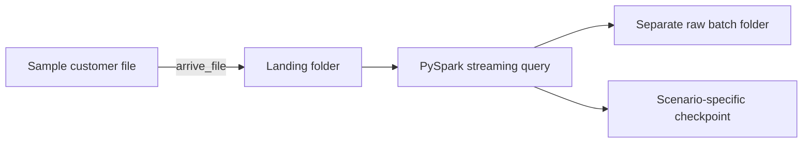

The separate locations make the output easier to compare and prevent one scenario from interfering with another.

---

# 5. Start the PySpark shell

Open PowerShell in the project directory:

```powershell
pyspark
```

Load the helper definitions:

```python
exec(
    open(
        "customer_schema_evolution_shell_helpers.py",
        encoding="utf-8",
    ).read()
)
```

Expected message:

```text
Customer schema-evolution helpers loaded.
Run list_scenarios() to see the available demonstrations.
```

List the available scenarios:

```python
list_scenarios()
```

---

# 6. Common flow used by every exercise

The same sequence is used throughout the session:

```python
scenario = "baseline"

prepare_scenario(scenario)
explain_scenario(scenario)
show_input_file(scenario)

q = start_customer_stream(scenario)
arrive_file(scenario)
process_available_data(scenario)

show_raw_output(scenario)
stop_customer_stream(scenario)
```

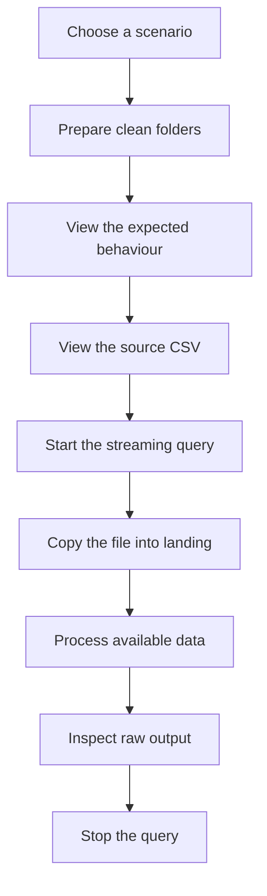

## What each command does

| Command | Purpose |
|---|---|
| `prepare_scenario()` | Creates clean landing, raw, and checkpoint folders |
| `explain_scenario()` | Displays the schema version and expected behaviour |
| `show_input_file()` | Prints the exact CSV content |
| `start_customer_stream()` | Starts the Structured Streaming query |
| `arrive_file()` | Copies the completed file into the monitored folder |
| `process_available_data()` | Processes all input currently waiting |
| `show_raw_output()` | Reads and displays the generated CSV data |
| `show_query_status()` | Shows status, progress, and exception details |
| `stop_customer_stream()` | Stops the selected query |

`process_available_data()` uses `processAllAvailable()` so the shell waits until Spark has processed everything currently available. This makes the demonstration predictable without waiting for several trigger intervals.

---

# 7. Exercise 1 — Baseline schema

## Scenario

The source file matches customer schema V1 exactly.

```csv
customer_id,customer_name,city,email
101,Amit Sharma,Pune,amit@example.com
102,Neha Singh,Mumbai,neha@example.com
```

## Flow

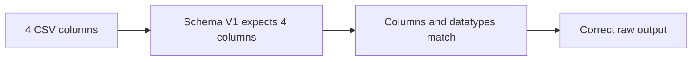

## Run

```python
scenario = "baseline"
prepare_scenario(scenario)
explain_scenario(scenario)
show_input_file(scenario)
q = start_customer_stream(scenario)
arrive_file(scenario)
process_available_data(scenario)
show_raw_output(scenario)
stop_customer_stream(scenario)
```

## Expected observation

```text
customer_id     = 101
customer_name   = Amit Sharma
city            = Pune
email           = amit@example.com
schema_version  = v1
```

## Why this baseline is important

Before testing schema changes, we need one known-good result. Every later scenario can be compared against this output.

---

# 8. Exercise 2 — A new column arrives, but Spark still uses the old schema

## Scenario

The source adds `phone_number`, but the pipeline still uses schema V1.

```csv
customer_id,customer_name,city,email,phone_number
103,Priya Shah,Pune,priya@example.com,9876543210
104,Rohan Das,Delhi,rohan@example.com,9812345678
```

Schema V1 still expects only:

```text
customer_id, customer_name, city, email
```

## Flow

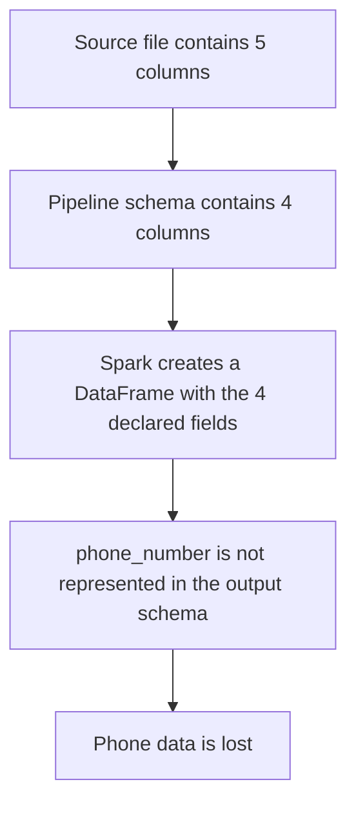

## Run

```python
scenario = "added_column_old_schema"
prepare_scenario(scenario)
explain_scenario(scenario)
show_input_file(scenario)
q = start_customer_stream(scenario)
arrive_file(scenario)
process_available_data(scenario)
show_raw_output(scenario)
stop_customer_stream(scenario)
```

## Expected observation

The output still contains only the V1 customer columns. `phone_number` is not retained.

```text
root
 |-- customer_id: integer
 |-- customer_name: string
 |-- city: string
 |-- email: string
```

## Important lesson

An explicit Spark schema does not automatically change merely because a new column arrives in a source file.

```text
Source changed
      ≠
Pipeline changed
```

The pipeline must be deliberately upgraded to schema V2 if the new field needs to be stored.

## Interview connection

**Question:** The source added a new CSV column, but no pipeline failure occurred. Is the change safely handled?

**Answer:** Not necessarily. The pipeline may continue using the old explicit schema and silently ignore information that is not represented in that schema. The raw output must be inspected and the schema must be deliberately versioned.

---

# 9. Exercise 3 — An old file arrives after upgrading to schema V2

## Scenario

The pipeline now expects five columns, but an older producer still sends the V1 format.

```csv
customer_id,customer_name,city,email
105,Anita Rao,Bengaluru,anita@example.com
106,Manish Gupta,Indore,manish@example.com
```

Schema V2 expects:

```text
customer_id, customer_name, city, email, phone_number
```

## Flow

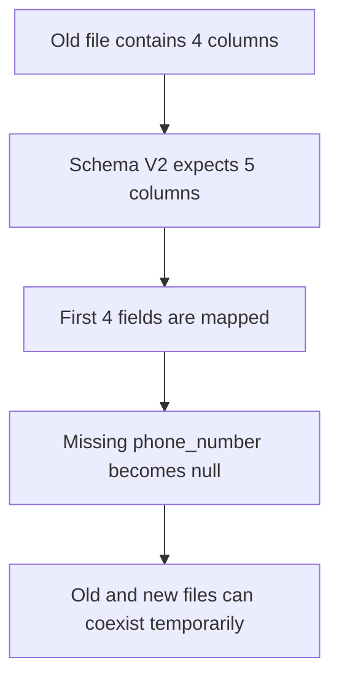

## Run

```python
scenario = "old_file_new_schema"
prepare_scenario(scenario)
explain_scenario(scenario)
show_input_file(scenario)
q = start_customer_stream(scenario)
arrive_file(scenario)
process_available_data(scenario)
show_raw_output(scenario)
stop_customer_stream(scenario)
```

## Expected observation

```text
customer_id      = 105
customer_name    = Anita Rao
city             = Bengaluru
email            = anita@example.com
phone_number     = null
schema_version   = v2
```

## Why this can be compatible

A new field is easier to introduce when:

- It is added at the end of a positional file.
- It is nullable.
- Older producers are allowed to omit it temporarily.
- Downstream consumers can tolerate null values.

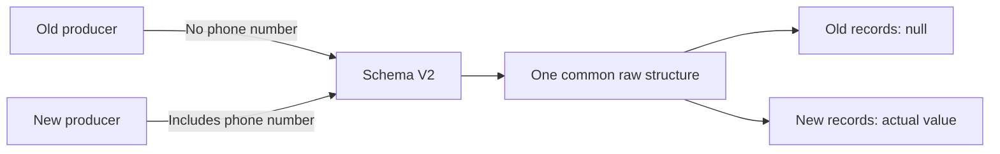

## Interview connection

**Question:** How would you roll out a newly added customer field without breaking older source systems?

**Answer:** Add it as a nullable field, support both old and new producers during a transition period, record the schema version, monitor missing values, and agree on a deadline for retiring the old format.

---

# 10. Exercise 4A — Reordered columns with positional mapping

## Scenario

The pipeline expects:

```text
customer_id, customer_name, city, email, phone_number
```

The source sends:

```text
customer_id, customer_name, email, city, phone_number
```

File content:

```csv
customer_id,customer_name,email,city,phone_number
107,Vikas Kumar,vikas@example.com,Hyderabad,9898989898
```

The third and fourth columns have exchanged positions.

## Flow

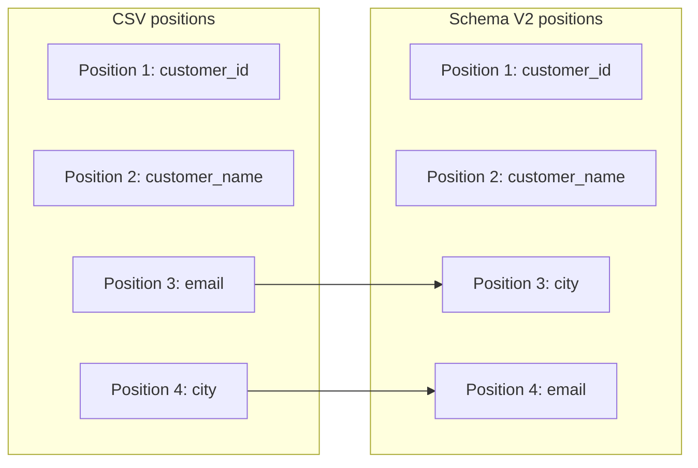

Because `city` and `email` are both strings, Spark can place the values into the wrong fields without a datatype failure.

## Run

```python
scenario = "reordered_columns_unsafe"
prepare_scenario(scenario)
explain_scenario(scenario)
show_input_file(scenario)
q = start_customer_stream(scenario)
arrive_file(scenario)
process_available_data(scenario)
show_raw_output(scenario)
stop_customer_stream(scenario)
```

## Expected observation

```text
city  = vikas@example.com
email = Hyderabad
```

The query may remain successful.

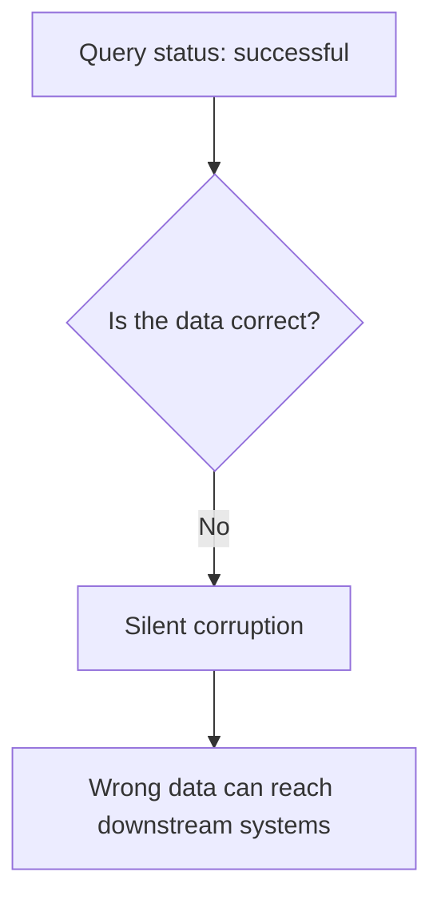

## Important lesson

CSV is a positional format. A header may be visible to us, but values can still be interpreted according to the supplied schema position.

A successful query does not prove that the column meanings are correct.

---

# 11. Exercise 4B — Reordered columns with header validation

## Scenario

The file is the same reordered file, but now the query uses:

```python
.option("enforceSchema", "false")
```

This asks Spark to compare the CSV header with the supplied schema instead of blindly accepting the positional structure.

## Flow

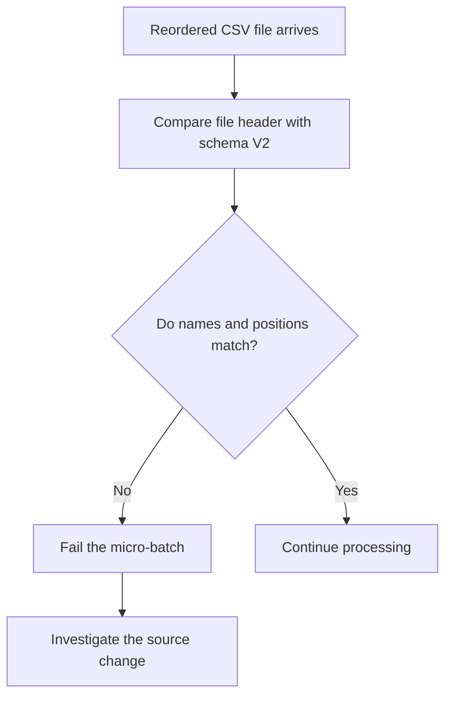

## Run

```python
scenario = "reordered_columns_safe"
prepare_scenario(scenario)
explain_scenario(scenario)
show_input_file(scenario)
q = start_customer_stream(scenario)
arrive_file(scenario)
process_available_data(scenario)
```

The last command is expected to report a header mismatch.

Inspect the query:

```python
show_query_status(scenario)
```

Stop it:

```python
stop_customer_stream(scenario)
```

## Expected observation

The file should be rejected rather than written with incorrect mappings.

The exact error text may differ by Spark version, but the important result is:

```text
Expected header order
      ≠
Received header order
      ↓
Visible failure
```

## Why this is safer

```text
Unsafe approach:
Pipeline succeeds + data is wrong

Safer approach:
Pipeline fails + problem is visible
```

---

# 12. Exercise 5 — Renamed columns

## Scenario

The source changes:

```text
customer_name → full_name
email         → email_address
```

File content:

```csv
customer_id,full_name,city,email_address,phone_number
109,Meera Joshi,Jaipur,meera@example.com,9696969696
```

Schema V2 still expects:

```text
customer_id,customer_name,city,email,phone_number
```

## Flow

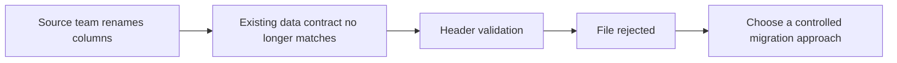

## Run

```python
scenario = "renamed_columns"
prepare_scenario(scenario)
explain_scenario(scenario)
show_input_file(scenario)
q = start_customer_stream(scenario)
arrive_file(scenario)
process_available_data(scenario)
```

Inspect the failed query:

```python
show_query_status(scenario)
```

Stop it:

```python
stop_customer_stream(scenario)
```

## Why a rename is a breaking change

Even when the values have not changed, the contract has changed.

Potentially affected components include:

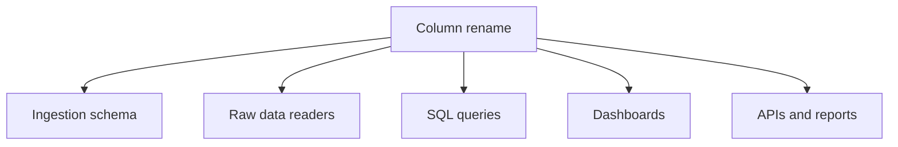

## Possible production responses

### Reject the new file

Use this when the producer changed the contract without approval.

### Support both versions temporarily

Example mapping:

```text
full_name     → customer_name
email_address → email
```

This should be explicit and temporary, not an accidental positional mapping.

### Release a new version

```text
customers_v1 → old column names
customers_v2 → new column names
```

This is useful when downstream consumers need time to migrate.

## Interview connection

**Question:** The source changed only the column name, not the value. Why can this still be breaking?

**Answer:** Pipelines and downstream systems refer to fields by their agreed names. A rename can break header validation, transformations, SQL queries, mappings, reports, and APIs even though the underlying values look similar.

---

# 13. Exercise 6A — Datatype change using the old schema

## Scenario

The source changes `customer_id` from a numeric value to an alphanumeric value.

Old values:

```text
101
102
103
```

New value:

```text
C110
```

File content:

```csv
customer_id,customer_name,city,email,phone_number
C110,Arjun Mehta,Jaipur,arjun@example.com,9595959595
```

Schema V2 still defines:

```python
StructField("customer_id", IntegerType(), True)
```

## Flow

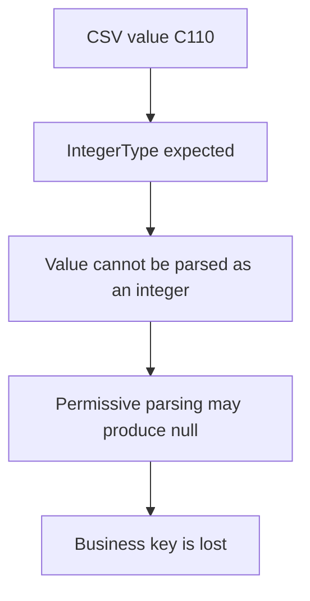

## Run

```python
scenario = "datatype_change_old_schema"
prepare_scenario(scenario)
explain_scenario(scenario)
show_input_file(scenario)
q = start_customer_stream(scenario)
arrive_file(scenario)
process_available_data(scenario)
show_raw_output(scenario)
stop_customer_stream(scenario)
```

## Expected observation

```text
customer_id = null
```

The query can still complete because the reader uses permissive parsing.

## Why this is serious

`customer_id` is not just another field. It is the business key used to identify a customer.

A missing business key can affect:

- Deduplication
- Joins
- Updates
- Customer history
- Reconciliation
- Reporting

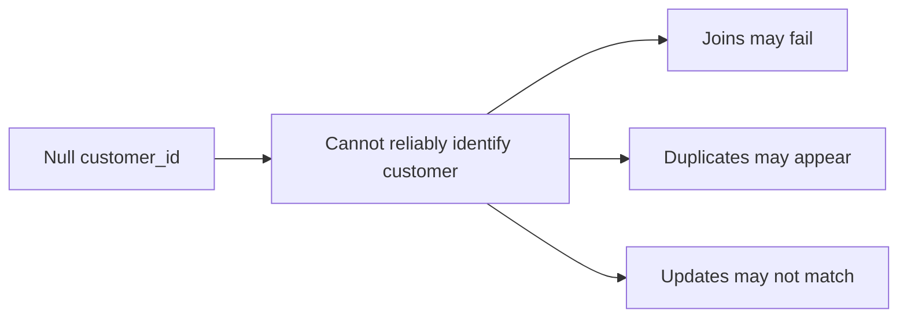

## Interview connection

**Question:** Should a pipeline continue when a business key cannot be parsed?

**Answer:** Usually the record or file should be rejected or isolated, and an alert should be raised. Allowing a null business key into trusted processing can create larger downstream problems.

---

# 14. Exercise 6B — Controlled upgrade to schema V3

## Scenario

The pipeline is deliberately changed so that `customer_id` is stored as a string.

```python
StructField("customer_id", StringType(), True)
```

## Flow

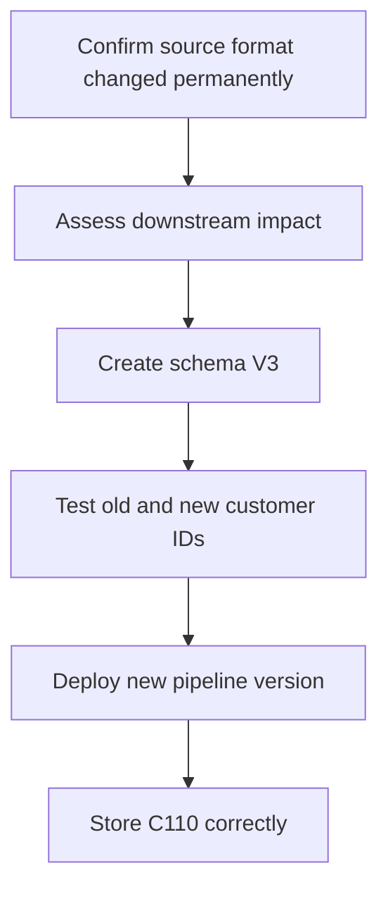

## Run

```python
scenario = "datatype_change_new_schema"
prepare_scenario(scenario)
explain_scenario(scenario)
show_input_file(scenario)
q = start_customer_stream(scenario)
arrive_file(scenario)
process_available_data(scenario)
show_raw_output(scenario)
stop_customer_stream(scenario)
```

## Expected observation

```text
customer_id    = C110
schema_version = v3
```

## Important lesson

Changing the datatype in Spark code is only one part of the solution.

A production change also requires:

```text
Source confirmation
      ↓
Impact analysis
      ↓
Schema versioning
      ↓
Testing
      ↓
Controlled deployment
      ↓
Monitoring
```

Downstream systems must also be checked. A table, API, or report that expects an integer may not accept `C110`.

---

# 15. Compatible versus breaking changes

| Change | Typical classification | Main risk | Common response |
|---|---|---|---|
| Add nullable column at the end | Often compatible | Old files have null | Upgrade schema and monitor |
| Old file missing new trailing column | Often compatible | Null values | Allow during transition |
| Add column but keep old Spark schema | Unsafe | New data silently lost | Update and version schema |
| Reorder CSV columns | Breaking | Values enter wrong fields | Validate headers and reject |
| Rename column | Breaking | Contract mismatch | Map explicitly or version |
| Remove required column | Breaking | Missing business data | Reject or isolate |
| Change integer key to string | Breaking | Null or downstream failure | New schema version and impact analysis |
| Change field meaning without renaming | Highly dangerous | Semantically incorrect data | Treat as a contract change |

---

# 16. A practical production decision flow

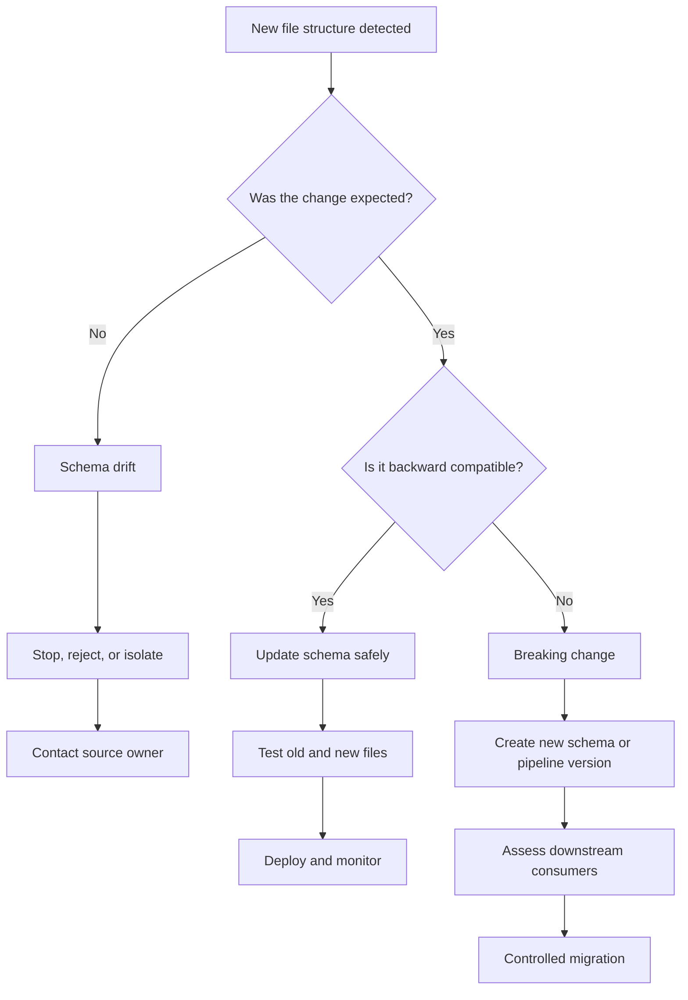

## Questions to ask before accepting a change

1. Was the change announced?
2. Is the new column optional or mandatory?
3. Can old files still arrive?
4. Has the column order changed?
5. Has a column been renamed or removed?
6. Has the datatype changed?
7. Is a business key affected?
8. Can downstream systems read the new structure?
9. Should the same checkpoint and output location still be used?
10. How will failures and nulls be monitored?

---

# 17. Why schema version metadata helps

The demonstration adds:

```python
.withColumn("schema_version", lit(config["schema_version"]))
```

Example output:

```text
customer_id     = C110
schema_version  = v3
scenario_name   = datatype_change_new_schema
```

Schema versioning provides traceability.

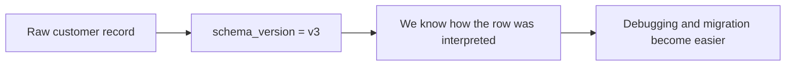

It helps answer:

- Which contract was used to parse this row?
- Did the row come from the old or new pipeline?
- When did the datatype change occur?
- Which consumers may need migration?

---

# 18. Why every scenario uses a separate checkpoint

Structured Streaming stores query progress in the checkpoint location.

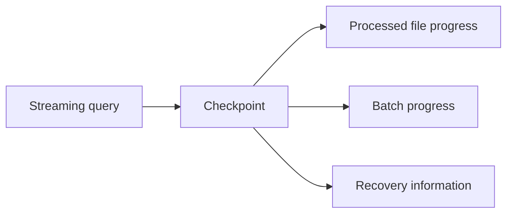

The demonstrations use different checkpoint folders because the scenarios use different schemas and query behaviour.

```text
checkpoints/customers/baseline/
checkpoints/customers/added_column_old_schema/
checkpoints/customers/reordered_columns_safe/
checkpoints/customers/datatype_change_new_schema/
```

A simple rule for this session:

> When demonstrating a different schema or contract, use a separate scenario checkpoint so the results remain isolated and repeatable.

In production, checkpoint reuse after a query change must be planned carefully. A major schema or query change may require a new pipeline version and a new checkpoint location.

---

# 19. Useful inspection commands

## Check query status

```python
show_query_status(scenario)
```

## Access the query object

```python
q = get_query(scenario)
```

## Check whether it is active

```python
q.isActive
```

## View current status

```python
q.status
```

## View the last completed progress update

```python
q.lastProgress
```

## View the failure, if any

```python
q.exception()
```

## Stop every query before exiting

```python
stop_all_customer_streams()
```

---

# 20. Interview-focused questions

## 1. What is schema evolution?

Schema evolution is a planned change to a dataset’s structure that is introduced while trying to preserve compatibility with existing files and consumers.

## 2. What is schema drift?

Schema drift is an unexpected difference between the structure the pipeline expects and the structure delivered by the source.

## 3. Is adding a column always safe?

No. An old explicit schema may not capture the new value. The field may be silently lost until the pipeline schema is updated.

## 4. Why is adding a nullable column at the end easier to support?

Older files can still be mapped to the existing fields, and the newly added trailing field can remain null during the transition.

## 5. Why is column reordering dangerous in CSV?

CSV values are positional. If the schema is applied by position, values can enter the wrong fields, particularly when the reordered columns share the same datatype.

## 6. What is silent data corruption?

The pipeline completes without an error but stores incorrect or misinterpreted values.

## 7. Why can a renamed column be a breaking change?

The ingestion schema, mappings, SQL queries, dashboards, and APIs may depend on the original name.

## 8. What can happen when an alphanumeric ID is read using `IntegerType`?

The value cannot be parsed as an integer and may become null under permissive parsing.

## 9. Why is a null business key especially dangerous?

It can prevent correct joins, updates, deduplication, reconciliation, and customer identification.

## 10. When should a new schema version be created?

Create one when the interpretation of the data changes in a meaningful way, especially for renamed columns, removed columns, reordered positional fields, datatype changes, or changed business meaning.

## 11. Should all schema drift be accepted automatically?

No. Automatically accepting every structural change can allow incorrect data into the platform. Changes should be classified, validated, tested, and approved.

## 12. How would you handle a source that sends both old and new file formats?

Support both formats for a controlled transition, keep the new fields nullable where appropriate, identify the schema version, monitor usage, and define a retirement date for the old format.

---

# 21. Final mental model

```mermaid
flowchart TD
    A[Customer file arrives] --> B[Compare with expected data contract]
    B --> C{What changed?}

    C -->|Nothing| D[Process normally]
    C -->|Optional column added| E[Upgrade schema and support null for old files]
    C -->|Column reordered| F[Reject unless explicitly remapped]
    C -->|Column renamed| G[Version or map through a controlled migration]
    C -->|Datatype changed| H[Assess business and downstream impact]

    E --> I[Write versioned raw data]
    F --> J[Investigate source drift]
    G --> I
    H --> I
```

The most important takeaway is:

> Schema evolution is not only a code change. It is a compatibility decision involving the source contract, parsing behaviour, raw data, checkpoints, downstream systems, testing, and monitoring.

---

# 22. Quick recap

```text
Matching file and schema
    → Correct ingestion

New column with old schema
    → New data may be lost

Old file with new nullable trailing column
    → New field can become null

Reordered CSV columns
    → Values may enter the wrong fields

Header validation
    → Makes structural mismatch visible

Renamed columns
    → Breaking contract change

Integer ID becomes alphanumeric
    → Old schema may produce null

New string-based schema version
    → Controlled support for the new format
```


---

# 23. Official Spark references

- [CSV data source options and `enforceSchema`](https://spark.apache.org/docs/latest/sql-data-sources-csv.html)
- [Structured Streaming programming guide](https://spark.apache.org/docs/latest/structured-streaming-programming-guide.html)
- [`StreamingQuery.processAllAvailable()`](https://spark.apache.org/docs/latest/api/python/reference/pyspark.ss/api/pyspark.sql.streaming.StreamingQuery.processAllAvailable.html)
- [`DataStreamWriter.foreachBatch()`](https://spark.apache.org/docs/latest/api/python/reference/pyspark.ss/api/pyspark.sql.streaming.DataStreamWriter.foreachBatch.html)

