# Customer Schema Evolution with PySpark Structured Streaming

## A practical guide using one customer file stream

A data pipeline is usually built with an expected structure in mind. We decide which columns should exist, what each column means, and which datatype should be used.

The difficulty begins when the source system changes.

A customer file that originally looked like this:

```text
customer_id, customer_name, city, email
```

may later arrive like this:

```text
customer_id, customer_name, city, email, phone_number
```

Or it may arrive with renamed, reordered, removed, or differently typed columns.

The streaming job must decide whether the new file can still be processed safely.

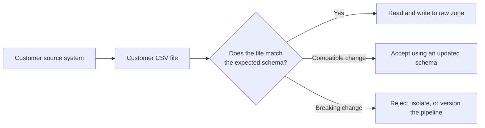

---

# 1. Why schema evolution matters

A pipeline can show a **successful status** and still produce incorrect data.

For example, suppose the pipeline expects:

```text
customer_id, customer_name, city, email
```

But the source sends:

```text
customer_id, customer_name, email, city
```

Because both `city` and `email` are strings, Spark may be able to read the row without a datatype error. The job can succeed while the values enter the wrong columns.

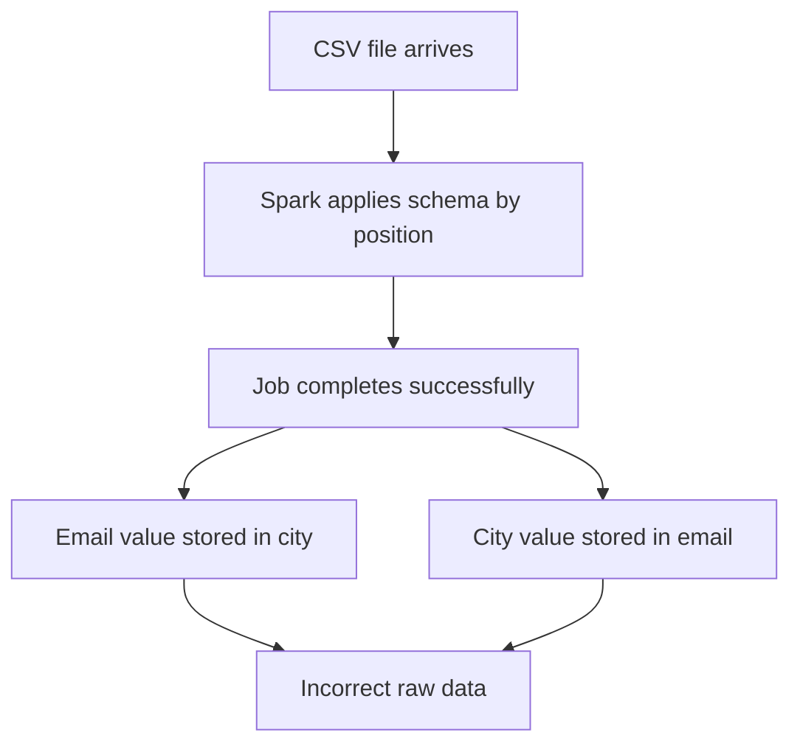

This is called **silent data corruption**.

A visible failure is often easier to fix than a successful pipeline that stores incorrect information.

---

# 2. Key terminology

## 2.1 Schema

A schema describes the expected structure of data.

It normally includes:

| Schema detail | Example |
|---|---|
| Column name | `customer_id` |
| Datatype | Integer |
| Column order | First column |
| Nullable or mandatory | Nullable |
| Business meaning | Unique customer identifier |

## 2.2 Schema evolution

A planned and controlled change to the data structure.

Example:

```text
Schema V1
customer_id, customer_name, city, email

Schema V2
customer_id, customer_name, city, email, phone_number
```

## 2.3 Schema drift

An unexpected difference between the structure the pipeline expects and the structure it receives.

Example:

```text
Expected:
customer_id, customer_name, city, email

Received:
customer_id, full_name, location, email_address
```

## 2.4 Compatible change

A change that can usually be supported without destroying the meaning of older data.

Example:

```text
Add an optional column at the end of the file.
```

## 2.5 Breaking change

A change that can cause failures, null business keys, incorrect mappings, or incompatibility with downstream systems.

Common examples:

- Renaming a column
- Reordering CSV columns
- Removing a required column
- Changing a business key from integer to string
- Changing the meaning of an existing column

## 2.6 Data contract

An agreement between the producer and the consumer of the data.

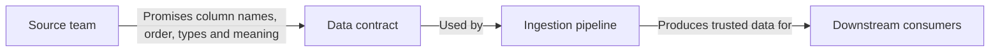

A data contract answers questions such as:

- Which columns must be present?
- Which columns are optional?
- Can columns be reordered?
- Can a datatype change without notice?
- How will a new schema version be announced?

---

# 3. Schemas used in the demonstration

## 3.1 Customer schema V1

```python
CUSTOMER_SCHEMA_V1 = StructType(
    [
        StructField("customer_id", IntegerType(), True),
        StructField("customer_name", StringType(), True),
        StructField("city", StringType(), True),
        StructField("email", StringType(), True),
    ]
)
```

Expected CSV header:

```text
customer_id,customer_name,city,email
```

## 3.2 Customer schema V2

Schema V2 adds `phone_number` at the end.

```python
CUSTOMER_SCHEMA_V2 = StructType(
    [
        StructField("customer_id", IntegerType(), True),
        StructField("customer_name", StringType(), True),
        StructField("city", StringType(), True),
        StructField("email", StringType(), True),
        StructField("phone_number", StringType(), True),
    ]
)
```

Expected CSV header:

```text
customer_id,customer_name,city,email,phone_number
```

## 3.3 Customer schema V3

Schema V3 changes `customer_id` from integer to string.

```python
CUSTOMER_SCHEMA_V3 = StructType(
    [
        StructField("customer_id", StringType(), True),
        StructField("customer_name", StringType(), True),
        StructField("city", StringType(), True),
        StructField("email", StringType(), True),
        StructField("phone_number", StringType(), True),
    ]
)
```

This version supports values such as:

```text
C110
C111
C112
```

---

# 4. Demonstration environment

The exercises use the following structure:

```text
customer_schema_evolution_pyspark_shell/
├── customer_schema_evolution_shell_helpers.py
├── sample_files/
│   ├── customers_01_baseline.csv
│   ├── customers_02_added_phone_old_schema.csv
│   ├── customers_03_old_file_new_schema.csv
│   ├── customers_04_reordered_columns.csv
│   ├── customers_05_renamed_columns.csv
│   └── customers_06_alphanumeric_id.csv
│
└── schema_evolution_runtime/
    ├── landing/customers/<scenario>/incoming/
    ├── raw_zone/customers/<scenario>/batches/
    └── checkpoints/customers/<scenario>/
```

Each scenario has a separate landing path, output path, and checkpoint path.

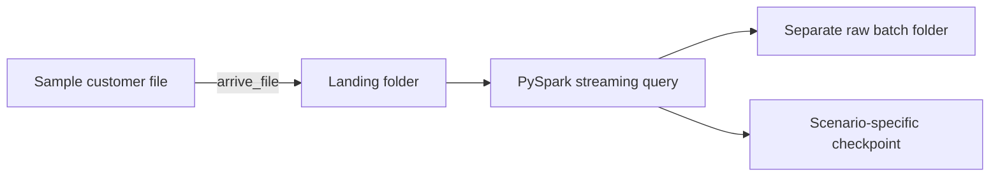

The separate locations make the output easier to compare and prevent one scenario from interfering with another.

---

# 5. Start the PySpark shell

Open PowerShell in the project directory:

```powershell
pyspark
```

Load the helper definitions:

```python
exec(
    open(
        "customer_schema_evolution_shell_helpers.py",
        encoding="utf-8",
    ).read()
)
```

Expected message:

```text
Customer schema-evolution helpers loaded.
Run list_scenarios() to see the available demonstrations.
```

List the available scenarios:

```python
list_scenarios()
```

---

# 6. Common flow used by every exercise

The same sequence is used throughout the session:

```python
scenario = "baseline"

prepare_scenario(scenario)
explain_scenario(scenario)
show_input_file(scenario)

q = start_customer_stream(scenario)
arrive_file(scenario)
process_available_data(scenario)

show_raw_output(scenario)
stop_customer_stream(scenario)
```

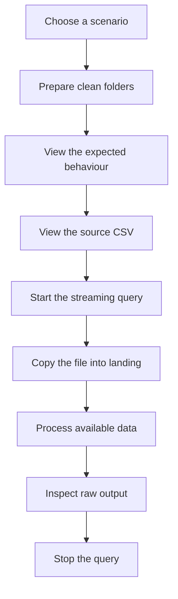

## What each command does

| Command | Purpose |
|---|---|
| `prepare_scenario()` | Creates clean landing, raw, and checkpoint folders |
| `explain_scenario()` | Displays the schema version and expected behaviour |
| `show_input_file()` | Prints the exact CSV content |
| `start_customer_stream()` | Starts the Structured Streaming query |
| `arrive_file()` | Copies the completed file into the monitored folder |
| `process_available_data()` | Processes all input currently waiting |
| `show_raw_output()` | Reads and displays the generated CSV data |
| `show_query_status()` | Shows status, progress, and exception details |
| `stop_customer_stream()` | Stops the selected query |

`process_available_data()` uses `processAllAvailable()` so the shell waits until Spark has processed everything currently available. This makes the demonstration predictable without waiting for several trigger intervals.

---

# 7. Exercise 1 — Baseline schema

## Scenario

The source file matches customer schema V1 exactly.

```csv
customer_id,customer_name,city,email
101,Amit Sharma,Pune,amit@example.com
102,Neha Singh,Mumbai,neha@example.com
```

## Flow

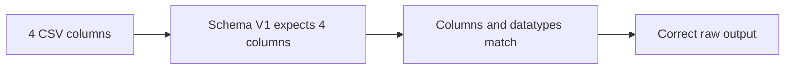

## Run

```python
scenario = "baseline"
prepare_scenario(scenario)
explain_scenario(scenario)
show_input_file(scenario)
q = start_customer_stream(scenario)
arrive_file(scenario)
process_available_data(scenario)
show_raw_output(scenario)
stop_customer_stream(scenario)
```

## Expected observation

```text
customer_id     = 101
customer_name   = Amit Sharma
city            = Pune
email           = amit@example.com
schema_version  = v1
```

## Why this baseline is important

Before testing schema changes, we need one known-good result. Every later scenario can be compared against this output.

---

# 8. Exercise 2 — New data arrives with a new column, but the pipeline still uses the old schema

## Problem

The incoming customer file follows **schema V2** and contains a new field called `phone_number`.

```csv
customer_id,customer_name,city,email,phone_number
103,Priya Shah,Pune,priya@example.com,9876543210
104,Rohan Das,Delhi,rohan@example.com,9812345678
```

The running Spark query still applies **schema V1**:

```text
customer_id, customer_name, city, email
```

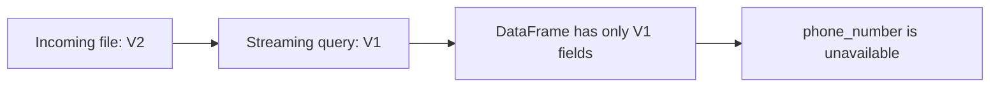

## What Spark does

Spark creates the DataFrame from the fields declared in the explicit schema. The source file may contain another value, but `phone_number` is not part of schema V1 and therefore is not available in the raw output.

The query may still succeed:

```text
Pipeline status: successful
phone_number: not captured
```

## Why this matters

This is **silent data loss**. A healthy-looking job does not guarantee that every source field was retained.

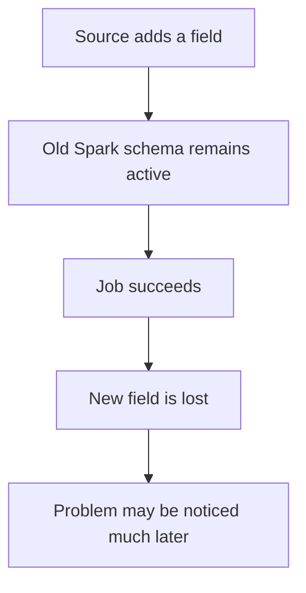

## Possible solutions

| Option | How it helps | Trade-off |
|---|---|---|
| Upgrade to schema V2 | Captures `phone_number` | Requires testing and controlled deployment |
| Validate the header before ingestion | Detects unapproved extra fields | Adds a validation step |
| Run V1 and V2 readers during cutover | Supports both source versions | More operational complexity |
| Preserve the original source file | Allows later reprocessing | Needs retention and replay planning |

## Recommended approach

For an approved source change:

```text
Confirm the new contract
        ↓
Add phone_number as nullable in schema V2
        ↓
Test both old and new files
        ↓
Use a versioned checkpoint and raw path
        ↓
Monitor whether phone_number is arriving
```

## Run

```python
scenario = "added_column_old_schema"
prepare_scenario(scenario)
explain_scenario(scenario)
show_input_file(scenario)
q = start_customer_stream(scenario)
arrive_file(scenario)
process_available_data(scenario)
show_raw_output(scenario)
stop_customer_stream(scenario)
```

## Expected observation

The output contains only the V1 business fields:

```text
customer_id
customer_name
city
email
```

`phone_number` is not visible.

## Interview connection

**Question:** A source added a CSV column, the Spark query succeeded, but the new field is missing. Why?

**Answer:** The query used an explicit older schema. Spark does not automatically extend that schema merely because another column appears in the file.

---

# 9. Exercise 3 — An old file arrives after the pipeline upgrades to schema V2

## Problem

The pipeline now expects schema V2:

```text
customer_id, customer_name, city, email, phone_number
```

An older producer still sends a V1 file:

```csv
customer_id,customer_name,city,email
105,Anita Rao,Bengaluru,anita@example.com
106,Manish Gupta,Indore,manish@example.com
```

## What Spark does

The existing fields are mapped and the missing trailing field becomes `null`.

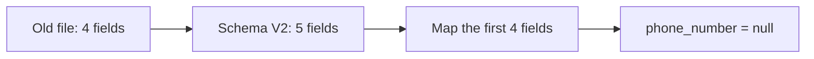

## Why this matters

This may be acceptable when `phone_number` is optional. It becomes a problem when the new field is mandatory for business processing.

```text
Optional field missing
    → Temporary compatibility

Required field missing
    → Incomplete record
```

## Possible solutions

| Option | Suitable when |
|---|---|
| Keep the new field nullable | Old producers need a transition period |
| Apply a default value | The default has a genuine business meaning |
| Route V1 and V2 files separately | Both formats must coexist for longer |
| Reject V1 files after a cutover date | All producers should already use V2 |
| Monitor null percentage | The migration progress must be measurable |

## Recommended approach

Use a time-bound compatibility window:

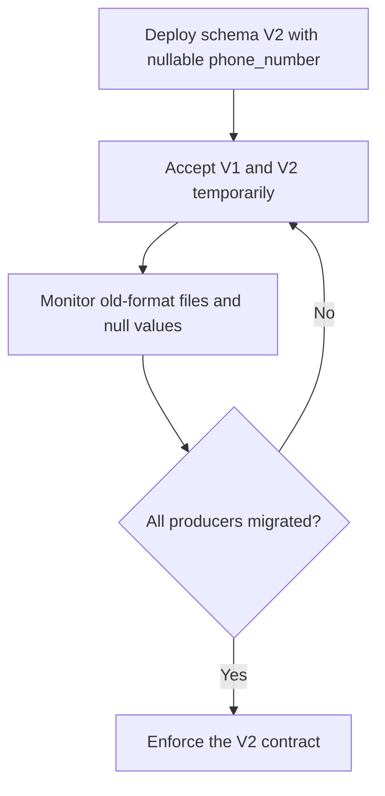

## Run

```python
scenario = "old_file_new_schema"
prepare_scenario(scenario)
explain_scenario(scenario)
show_input_file(scenario)
q = start_customer_stream(scenario)
arrive_file(scenario)
process_available_data(scenario)
show_raw_output(scenario)
stop_customer_stream(scenario)
```

## Expected observation

```text
customer_id    = 105
customer_name  = Anita Rao
phone_number   = null
schema_version = v2
```

## Interview connection

**Question:** How can a new field be introduced without immediately breaking old producers?

**Answer:** Add it as nullable, support both formats for a limited period, monitor missing values, and enforce the new contract after the cutover.

---

# 10. Exercise 4A — Reordered columns with positional mapping

## Problem

The pipeline expects:

```text
customer_id, customer_name, city, email, phone_number
```

The file sends:

```text
customer_id, customer_name, email, city, phone_number
```

```csv
customer_id,customer_name,email,city,phone_number
107,Vikas Kumar,vikas@example.com,Hyderabad,9898989898
```

## What Spark does

With positional mapping, the third value goes into the third schema field and the fourth value goes into the fourth schema field.

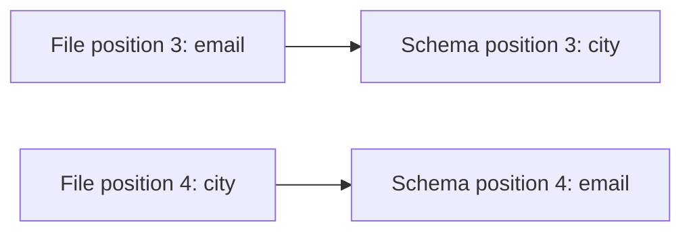

Because both values are strings, Spark may not raise a datatype error.

## Why this matters

The query can succeed while storing incorrect meaning:

```text
city  = vikas@example.com
email = Hyderabad
```

This is **silent data corruption**.

## Possible solutions

| Option | Result |
|---|---|
| Set `enforceSchema` to `false` | Header mismatch becomes visible |
| Validate headers before landing | Bad files are stopped earlier |
| Add an approved version-specific mapping | Known reordering can be handled explicitly |
| Use Parquet, Avro, or JSON | Column names travel with the data |

## Recommended approach

Unexpected column reordering should be rejected. Add an explicit mapping only when the new order is planned, documented, and versioned.

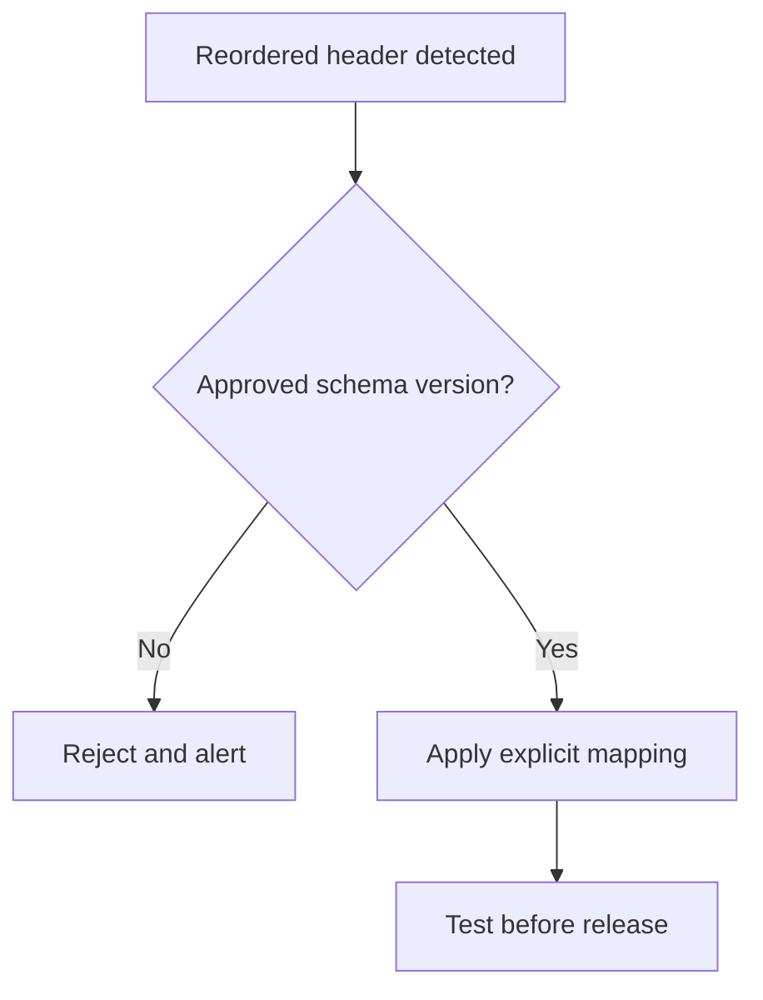

## Run

```python
scenario = "reordered_columns_unsafe"
prepare_scenario(scenario)
explain_scenario(scenario)
show_input_file(scenario)
q = start_customer_stream(scenario)
arrive_file(scenario)
process_available_data(scenario)
show_raw_output(scenario)
stop_customer_stream(scenario)
```

## Expected observation

The query may complete, but `city` and `email` contain each other's values.

## Interview connection

**Question:** Why can reordered CSV columns be more dangerous than a datatype failure?

**Answer:** When the swapped columns share the same datatype, the query can succeed and store semantically incorrect data without an obvious error.

---

# 11. Exercise 4B — Reordered columns with header validation

## Problem

The file uses a different column order than schema V2. This time the query enables header validation:

```python
.option("enforceSchema", "false")
```

## What Spark does

Spark compares the supplied schema with the CSV header. The mismatch causes the micro-batch to fail before incorrect output is written.

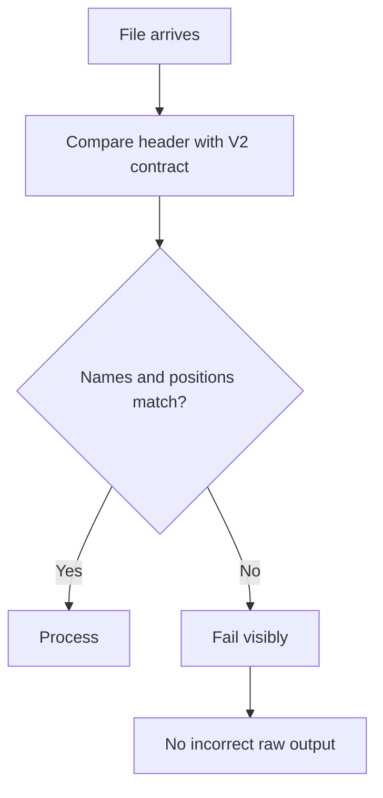

## Why this matters

The visible failure protects the raw zone. The immediate problem is a stopped file, but the larger problem—silent corruption—is prevented.

## Possible solutions

1. Correct and resend the file from the source.
2. Quarantine it and notify the source owner.
3. Introduce an explicit versioned mapping if the new order is approved.
4. Move to a self-describing format when frequent reordering is unavoidable.

## Recommended approach

Keep header validation enabled. Do not disable the safeguard simply to make the file pass.

```text
Visible failure + clean data
        is safer than
Successful job + incorrect data
```

## Run

```python
scenario = "reordered_columns_safe"
prepare_scenario(scenario)
explain_scenario(scenario)
show_input_file(scenario)
q = start_customer_stream(scenario)
arrive_file(scenario)
process_available_data(scenario)
```

Inspect the query:

```python
show_query_status(scenario)
stop_customer_stream(scenario)
```

## Expected observation

The micro-batch reports a header mismatch and no customer CSV batch is produced.

---

# 12. Exercise 5 — Renamed columns

## Problem

The source changes the field names:

```text
customer_name → full_name
email         → email_address
```

```csv
customer_id,full_name,city,email_address,phone_number
109,Meera Joshi,Jaipur,meera@example.com,9696969696
```

The running contract still expects `customer_name` and `email`.

## What Spark does

With header validation enabled, Spark rejects the file because the names do not match schema V2.

## Why this matters

A rename affects more than ingestion:

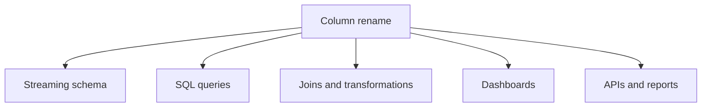

Even when the underlying value is unchanged, the contract is breaking.

## Possible solutions

| Option | When to use it |
|---|---|
| Ask the source to restore old names | Change was accidental or unapproved |
| Map new names to canonical old names | Controlled temporary migration |
| Run old and new contract versions | Consumers need time to migrate |
| Publish schema V3/new contract | Rename is permanent and approved |

Example controlled mapping:

```text
full_name     → customer_name
email_address → email
```

## Recommended approach

Treat renames as breaking changes. Use explicit mappings or a new version; never depend on column position to make renamed fields appear compatible.

## Run

```python
scenario = "renamed_columns"
prepare_scenario(scenario)
explain_scenario(scenario)
show_input_file(scenario)
q = start_customer_stream(scenario)
arrive_file(scenario)
process_available_data(scenario)
```

Inspect and stop:

```python
show_query_status(scenario)
stop_customer_stream(scenario)
```

## Expected observation

The file fails header validation.

## Interview connection

**Question:** Why is a rename breaking even when the value has not changed?

**Answer:** Every consumer that refers to the original name may fail or interpret a different contract. The rename must be coordinated and versioned.

---

# 13. Exercise 6A — Datatype change using the old schema

## Problem

The source starts sending an alphanumeric customer identifier:

```text
C110
```

Schema V2 still defines:

```python
StructField("customer_id", IntegerType(), True)
```

## What Spark does

Under permissive parsing, the value cannot be converted to an integer and may become `null` while the query continues.

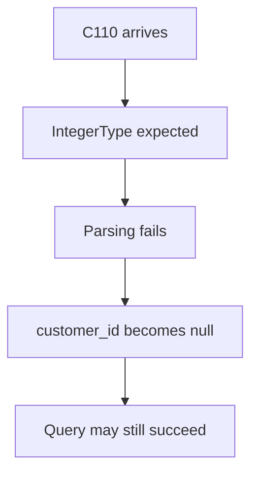

## Why this matters

The business key is lost. That can affect joins, updates, deduplication, history, and reconciliation.

## Possible solutions

1. Reject the record or file when a mandatory key cannot be parsed.
2. Read identifiers as strings and validate the accepted pattern separately.
3. Use a strict parsing or data-quality rule for business keys.
4. Create a new schema version and migrate downstream consumers.

## Recommended approach

Identifiers should generally be stored as strings when alphanumeric values are possible. Make the key mandatory, validate its format, and release schema V3 through a controlled migration.

## Run

```python
scenario = "datatype_change_old_schema"
prepare_scenario(scenario)
explain_scenario(scenario)
show_input_file(scenario)
q = start_customer_stream(scenario)
arrive_file(scenario)
process_available_data(scenario)
show_raw_output(scenario)
stop_customer_stream(scenario)
```

## Expected observation

```text
customer_id = null
```

## Interview connection

**Question:** Should a pipeline accept a row when its business key becomes null during parsing?

**Answer:** Normally no. The row or file should be rejected or isolated, and the contract change should be investigated.

---

# 14. Exercise 6B — Schema V3 accepts the new identifier

## Problem

Changing the Spark schema to `StringType` solves the parsing problem, but downstream systems may still expect an integer customer ID.

## What Spark does

Schema V3 preserves the value correctly:

```text
customer_id = C110
```

Numeric historical IDs such as `101` can also be represented as strings.

## Why this matters

Ingestion compatibility is only one part of schema evolution. Existing tables, joins, APIs, and reports may need migration.

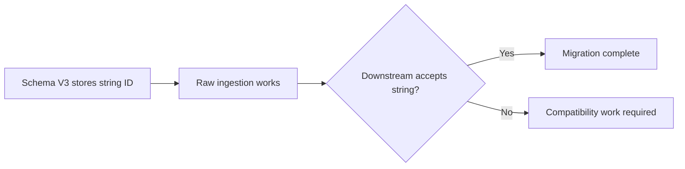

## Possible solutions

| Option | Purpose |
|---|---|
| Adopt string as the canonical ID type | Supports numeric and alphanumeric values |
| Provide a temporary compatibility view or column | Gives old consumers migration time |
| Migrate downstream schemas and joins | Removes long-term incompatibility |
| Test historic and new IDs together | Confirms backward compatibility |

## Recommended approach

Use string as the canonical customer identifier, version the change, test old numeric IDs and new alphanumeric IDs, and migrate downstream consumers before retiring the numeric contract.

## Run

```python
scenario = "datatype_change_new_schema"
prepare_scenario(scenario)
explain_scenario(scenario)
show_input_file(scenario)
q = start_customer_stream(scenario)
arrive_file(scenario)
process_available_data(scenario)
show_raw_output(scenario)
stop_customer_stream(scenario)
```

## Expected observation

```text
customer_id    = C110
schema_version = v3
```

## Interview connection

**Question:** Is changing `IntegerType` to `StringType` in Spark enough?

**Answer:** No. The source contract, existing data, downstream schemas, joins, APIs, reports, checkpoints, and deployment strategy must also be reviewed.

---

# 15. Compatible versus breaking changes

| Change | Typical classification | Main risk | Common response |
|---|---|---|---|
| Add nullable column at the end | Often compatible | Old files have null | Upgrade schema and monitor |
| Old file missing new trailing column | Often compatible | Null values | Allow during transition |
| Add column but keep old Spark schema | Unsafe | New data silently lost | Update and version schema |
| Reorder CSV columns | Breaking | Values enter wrong fields | Validate headers and reject |
| Rename column | Breaking | Contract mismatch | Map explicitly or version |
| Remove required column | Breaking | Missing business data | Reject or isolate |
| Change integer key to string | Breaking | Null or downstream failure | New schema version and impact analysis |
| Change field meaning without renaming | Highly dangerous | Semantically incorrect data | Treat as a contract change |

---

# 16. A practical production decision flow

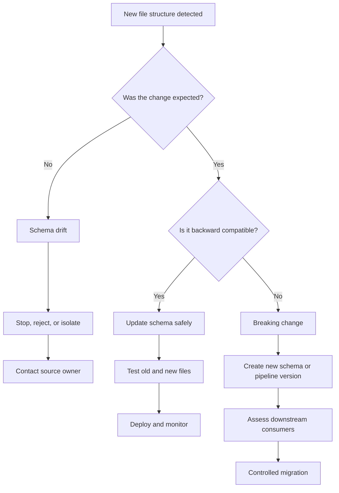

## Questions to ask before accepting a change

1. Was the change announced?
2. Is the new column optional or mandatory?
3. Can old files still arrive?
4. Has the column order changed?
5. Has a column been renamed or removed?
6. Has the datatype changed?
7. Is a business key affected?
8. Can downstream systems read the new structure?
9. Should the same checkpoint and output location still be used?
10. How will failures and nulls be monitored?

---

# 17. Why schema version metadata helps

The demonstration adds:

```python
.withColumn("schema_version", lit(config["schema_version"]))
```

Example output:

```text
customer_id     = C110
schema_version  = v3
scenario_name   = datatype_change_new_schema
```

Schema versioning provides traceability.

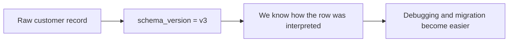

It helps answer:

- Which contract was used to parse this row?
- Did the row come from the old or new pipeline?
- When did the datatype change occur?
- Which consumers may need migration?

---

# 18. Why every scenario uses a separate checkpoint

Structured Streaming stores query progress in the checkpoint location.

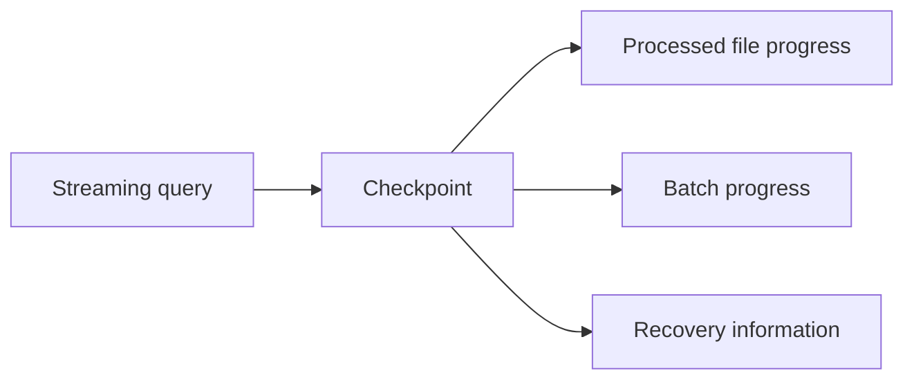

The demonstrations use different checkpoint folders because the scenarios use different schemas and query behaviour.

```text
checkpoints/customers/baseline/
checkpoints/customers/added_column_old_schema/
checkpoints/customers/reordered_columns_safe/
checkpoints/customers/datatype_change_new_schema/
```

A simple rule for this session:

> When demonstrating a different schema or contract, use a separate scenario checkpoint so the results remain isolated and repeatable.

In production, checkpoint reuse after a query change must be planned carefully. A major schema or query change may require a new pipeline version and a new checkpoint location.

---

# 19. Useful inspection commands

## Check query status

```python
show_query_status(scenario)
```

## Access the query object

```python
q = get_query(scenario)
```

## Check whether it is active

```python
q.isActive
```

## View current status

```python
q.status
```

## View the last completed progress update

```python
q.lastProgress
```

## View the failure, if any

```python
q.exception()
```

## Stop every query before exiting

```python
stop_all_customer_streams()
```

---

# 20. Interview-focused questions

## 1. What is schema evolution?

Schema evolution is a planned change to a dataset’s structure that is introduced while trying to preserve compatibility with existing files and consumers.

## 2. What is schema drift?

Schema drift is an unexpected difference between the structure the pipeline expects and the structure delivered by the source.

## 3. Is adding a column always safe?

No. An old explicit schema may not capture the new value. The field may be silently lost until the pipeline schema is updated.

## 4. Why is adding a nullable column at the end easier to support?

Older files can still be mapped to the existing fields, and the newly added trailing field can remain null during the transition.

## 5. Why is column reordering dangerous in CSV?

CSV values are positional. If the schema is applied by position, values can enter the wrong fields, particularly when the reordered columns share the same datatype.

## 6. What is silent data corruption?

The pipeline completes without an error but stores incorrect or misinterpreted values.

## 7. Why can a renamed column be a breaking change?

The ingestion schema, mappings, SQL queries, dashboards, and APIs may depend on the original name.

## 8. What can happen when an alphanumeric ID is read using `IntegerType`?

The value cannot be parsed as an integer and may become null under permissive parsing.

## 9. Why is a null business key especially dangerous?

It can prevent correct joins, updates, deduplication, reconciliation, and customer identification.

## 10. When should a new schema version be created?

Create one when the interpretation of the data changes in a meaningful way, especially for renamed columns, removed columns, reordered positional fields, datatype changes, or changed business meaning.

## 11. Should all schema drift be accepted automatically?

No. Automatically accepting every structural change can allow incorrect data into the platform. Changes should be classified, validated, tested, and approved.

## 12. How would you handle a source that sends both old and new file formats?

Support both formats for a controlled transition, keep the new fields nullable where appropriate, identify the schema version, monitor usage, and define a retirement date for the old format.

---

# 21. Final mental model

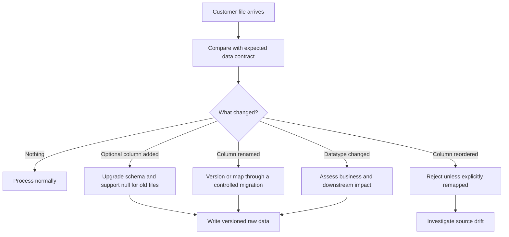

The most important takeaway is:

> Schema evolution is not only a code change. It is a compatibility decision involving the source contract, parsing behaviour, raw data, checkpoints, downstream systems, testing, and monitoring.

---

# 22. Quick recap

```text
Matching file and schema
    → Correct ingestion

New column with old schema
    → New data may be lost

Old file with new nullable trailing column
    → New field can become null

Reordered CSV columns
    → Values may enter the wrong fields

Header validation
    → Makes structural mismatch visible

Renamed columns
    → Breaking contract change

Integer ID becomes alphanumeric
    → Old schema may produce null

New string-based schema version
    → Controlled support for the new format
```


---

# 23. Official Spark references

- [CSV data source options and `enforceSchema`](https://spark.apache.org/docs/latest/sql-data-sources-csv.html)
- [Structured Streaming programming guide](https://spark.apache.org/docs/latest/structured-streaming-programming-guide.html)
- [`StreamingQuery.processAllAvailable()`](https://spark.apache.org/docs/latest/api/python/reference/pyspark.ss/api/pyspark.sql.streaming.StreamingQuery.processAllAvailable.html)
- [`DataStreamWriter.foreachBatch()`](https://spark.apache.org/docs/latest/api/python/reference/pyspark.ss/api/pyspark.sql.streaming.DataStreamWriter.foreachBatch.html)

