# Schema Evolution in File-Based Ingestion

## PySpark shell demonstration with customer CSV files

A file-ingestion pipeline is usually built against an expected schema. That works well until the source changes.

A new column may appear. An old-format file may arrive. Columns may be reordered or renamed. A numeric ID may become alphanumeric.

The important question is not only:

> What error does Spark show?

The more useful question is:

> How do we handle the change without losing or corrupting data?

This package demonstrates both sides:

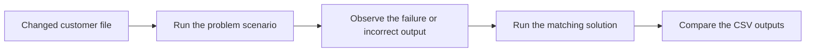

---

# 1. What schema evolution means

A schema describes the shape of the data.

```text
Column name
Data type
Column order
Whether a value can be missing
```

For example, customer schema V1 contains four fields:

```text
customer_id, customer_name, city, email
```

Schema evolution means that this structure changes over time.

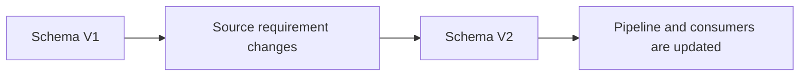

A planned and tested change is **schema evolution**.

An unexpected change that reaches the pipeline is often called **schema drift**.

| Term | Simple meaning |
|---|---|
| Schema | Expected columns and data types |
| Schema evolution | A planned schema change |
| Schema drift | An unexpected difference in an incoming file |
| Data contract | The agreed structure between the source and the pipeline |
| Compatible change | A change that old and new data can safely handle together |
| Breaking change | A change that can fail processing or produce incorrect data |

---

# 2. Schemas used in the demo

## Schema V1

```python
CUSTOMER_SCHEMA_V1 = StructType(
    [
        StructField("customer_id", IntegerType(), True),
        StructField("customer_name", StringType(), True),
        StructField("city", StringType(), True),
        StructField("email", StringType(), True),
    ]
)
```

## Schema V2

V2 adds `phone_number` at the end.

```python
CUSTOMER_SCHEMA_V2 = StructType(
    [
        StructField("customer_id", IntegerType(), True),
        StructField("customer_name", StringType(), True),
        StructField("city", StringType(), True),
        StructField("email", StringType(), True),
        StructField("phone_number", StringType(), True),
    ]
)
```

## Schema V3

V3 changes `customer_id` from integer to string.

```python
CUSTOMER_SCHEMA_V3 = StructType(
    [
        StructField("customer_id", StringType(), True),
        StructField("customer_name", StringType(), True),
        StructField("city", StringType(), True),
        StructField("email", StringType(), True),
        StructField("phone_number", StringType(), True),
    ]
)
```

This version can store both values:

```text
101
C110
```

---

# 3. Start the PySpark shell

Open PowerShell in the extracted project folder:

```powershell
pyspark
```

Load the helper file:

```python
exec(
    open(
        "customer_schema_evolution_shell_helpers.py",
        encoding="utf-8",
    ).read()
)
```

List the problem–solution pairs:

```python
list_demo_pairs()
```

Expected pairs:

```text
added_column
old_file_after_upgrade
reordered_columns
renamed_columns
datatype_change
```

To see the commands for one pair:

```python
show_pair_commands("added_column")
```

---

# 4. Common demonstration flow

Every scenario follows the same shell sequence.

```python
scenario = "baseline"

prepare_scenario(scenario)
explain_scenario(scenario)
show_input_file(scenario)

q = start_customer_stream(scenario)
arrive_file(scenario)
process_available_data_safely(scenario)

show_raw_output(scenario)
stop_customer_stream(scenario)
```

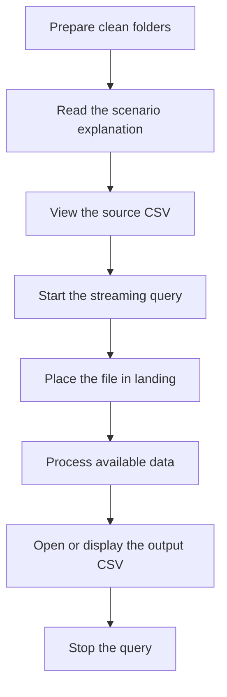

Each successful micro-batch creates a readable CSV file:

```text
schema_evolution_runtime/
└── raw_zone/customers/<scenario>/batches/
    └── batch_00000000000000000000/
        └── customers_batch_00000000000000000000.csv
```

---

# 5. Baseline — file and schema match

The source file contains the same four columns expected by schema V1.

```csv
customer_id,customer_name,city,email
101,Amit Sharma,Pune,amit@example.com
102,Neha Singh,Mumbai,neha@example.com
```

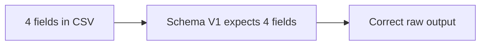

Run:

```python
scenario = "baseline"
prepare_scenario(scenario)
explain_scenario(scenario)
show_input_file(scenario)
q = start_customer_stream(scenario)
arrive_file(scenario)
process_available_data_safely(scenario)
show_raw_output(scenario)
stop_customer_stream(scenario)
```

This output becomes the reference for the remaining exercises.

---

# 6. Added column

## 6.1 Problem — the source has V2 data, but the query still uses V1

The source adds `phone_number`:

```csv
customer_id,customer_name,city,email,phone_number
103,Priya Shah,Pune,priya@example.com,9876543210
104,Rohan Das,Delhi,rohan@example.com,9812345678
```

The running query still applies schema V1:

```text
customer_id, customer_name, city, email
```

### What happens

Spark can process the file, but the query does not expose `phone_number`.

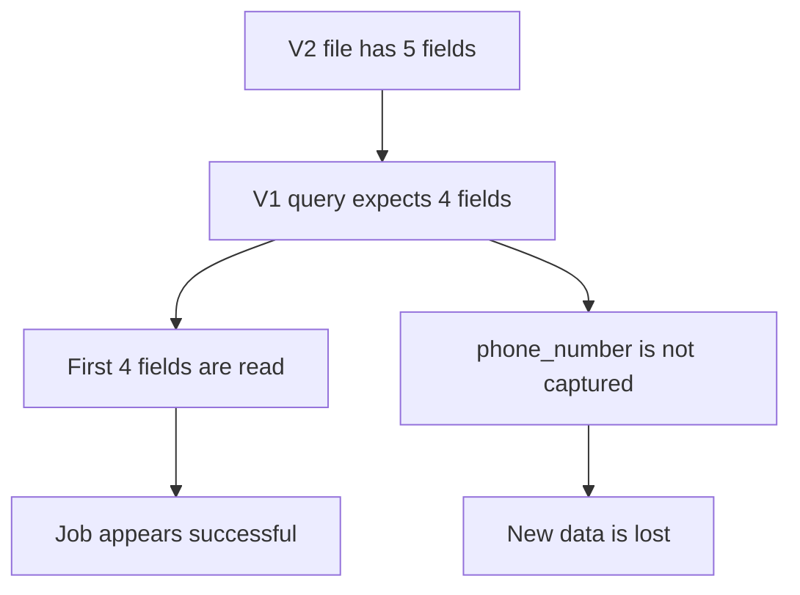

This is dangerous because a successful job does not always mean complete data.

### Run the problem

```python
scenario = "added_column_old_schema"
prepare_scenario(scenario)
explain_scenario(scenario)
show_input_file(scenario)
q = start_customer_stream(scenario)
arrive_file(scenario)
process_available_data_safely(scenario)
show_raw_output(scenario)
stop_customer_stream(scenario)
```

### What to notice

The output has no `phone_number` column.

## 6.2 Possible responses

| Option | When it makes sense |
|---|---|
| Ignore the field | Only when the field is not required and the source agrees |
| Reject the new format | When unannounced schema drift is not allowed |
| Update to schema V2 | When the new field is approved |
| Support V1 and V2 temporarily | When producers cannot upgrade at the same time |

## 6.3 Practical solution — update the query to schema V2

The solution scenario reads the same file with schema V2.

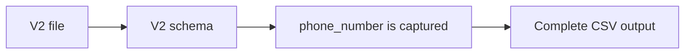

Run:

```python
scenario = "added_column_new_schema"
prepare_scenario(scenario)
explain_scenario(scenario)
show_input_file(scenario)
q = start_customer_stream(scenario)
arrive_file(scenario)
process_available_data_safely(scenario)
show_raw_output(scenario)
stop_customer_stream(scenario)
```

Compare both outputs:

```python
compare_pair_outputs("added_column")
```

### Interview takeaway

**Question:** Does Spark automatically add a new source column to an explicit schema?

**Answer:** No. The query must be updated to include the new field, or the field may not appear in the output.

---

# 7. Old file arrives after the schema upgrade

## 7.1 Problem — the query expects V2, but the file is still V1

The upgraded query expects five fields:

```text
customer_id, customer_name, city, email, phone_number
```

An older producer sends only four:

```csv
customer_id,customer_name,city,email
105,Anita Rao,Bengaluru,anita@example.com
106,Manish Gupta,Indore,manish@example.com
```

### What happens

The missing trailing field becomes `null`.

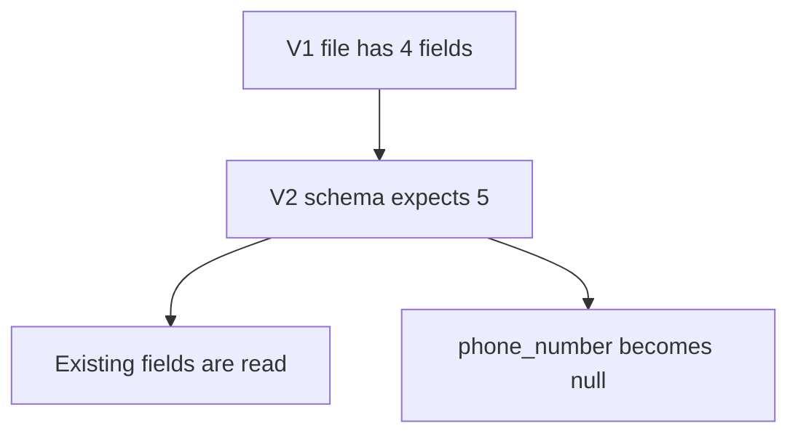

Null may be acceptable, but only when everyone understands what it means.

### Run the problem

```python
scenario = "old_file_new_schema"
prepare_scenario(scenario)
explain_scenario(scenario)
show_input_file(scenario)
q = start_customer_stream(scenario)
arrive_file(scenario)
process_available_data_safely(scenario)
show_raw_output(scenario)
stop_customer_stream(scenario)
```

## 7.2 Possible responses

| Option | Trade-off |
|---|---|
| Keep null | Preserves the fact that the source did not provide a value |
| Apply a default | Easier for some consumers, but the default must be clearly defined |
| Reject old files | Strict, but may interrupt ingestion during migration |
| Run a temporary compatibility path | Safer for a planned transition |

## 7.3 Practical solution — apply a temporary default

The solution keeps schema V2 and replaces a missing phone number with:

```text
NOT_PROVIDED
```

```python
.withColumn(
    "phone_number",
    coalesce(col("phone_number"), lit("NOT_PROVIDED")),
)
```

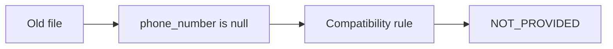

Run:

```python
scenario = "old_file_new_schema_handled"
prepare_scenario(scenario)
explain_scenario(scenario)
show_input_file(scenario)
q = start_customer_stream(scenario)
arrive_file(scenario)
process_available_data_safely(scenario)
show_raw_output(scenario)
stop_customer_stream(scenario)
```

Compare:

```python
compare_pair_outputs("old_file_after_upgrade")
```

### Important production point

A default should not hide a long-term source problem. Use it during an agreed migration window and monitor how often it appears.

---

# 8. Reordered CSV columns

## 8.1 Problem — values are read by the wrong position

The expected V2 order is:

```text
customer_id, customer_name, city, email, phone_number
```

The file sends:

```text
customer_id, customer_name, email, city, phone_number
```

The two middle fields are both strings. Spark can therefore read them without a datatype error.

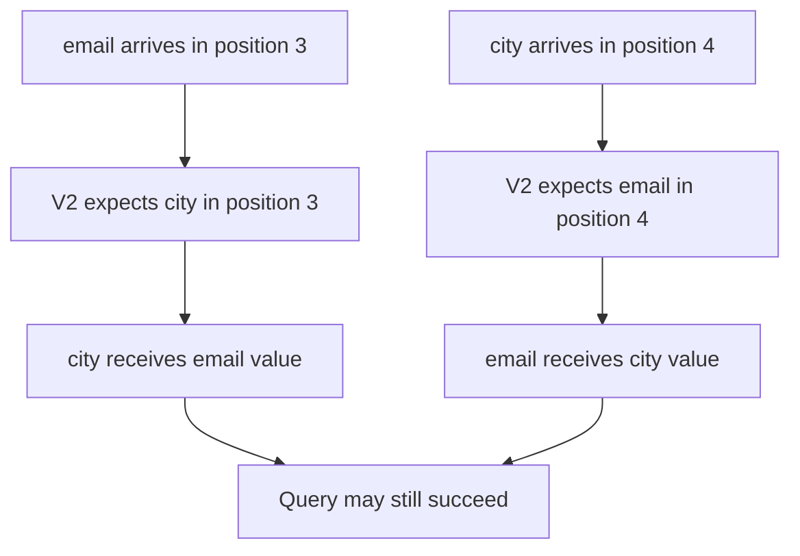

This is **silent data corruption**.

### Run the problem

```python
scenario = "reordered_columns_unsafe"
prepare_scenario(scenario)
explain_scenario(scenario)
show_input_file(scenario)
q = start_customer_stream(scenario)
arrive_file(scenario)
process_available_data_safely(scenario)
show_raw_output(scenario)
stop_customer_stream(scenario)
```

### What to notice

```text
city  = vikas@example.com
email = Hyderabad
```

## 8.2 Possible responses

1. Reject any header that does not match the contract.
2. Ask the source to restore the original order.
3. Define a versioned schema that matches the new source order.
4. Select fields into the canonical order before writing.

## 8.3 Practical solution — match the source, then reorder explicitly

The solution uses a schema that matches the incoming header:

```text
customer_id, customer_name, email, city, phone_number
```

It then selects the canonical order:

```python
df.select(
    "customer_id",
    "customer_name",
    "city",
    "email",
    "phone_number",
)
```

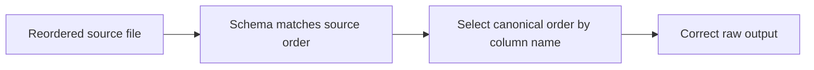

Run:

```python
scenario = "reordered_columns_mapped"
prepare_scenario(scenario)
explain_scenario(scenario)
show_input_file(scenario)
q = start_customer_stream(scenario)
arrive_file(scenario)
process_available_data_safely(scenario)
show_raw_output(scenario)
stop_customer_stream(scenario)
```

Compare:

```python
compare_pair_outputs("reordered_columns")
```

### Interview takeaway

A visible failure is usually safer than a successful job that writes values into the wrong columns.

---

# 9. Renamed columns

## 9.1 Problem — the file breaks the agreed names

The source changes:

```text
customer_name → full_name
email         → email_address
```

The file contains:

```csv
customer_id,full_name,city,email_address,phone_number
109,Meera Joshi,Jaipur,meera@example.com,9696969696
```

With header validation enabled, the V2 query rejects the file.

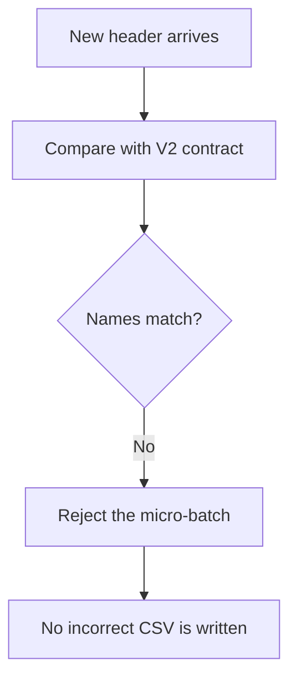

### Run the problem

```python
scenario = "renamed_columns_rejected"
prepare_scenario(scenario)
explain_scenario(scenario)
show_input_file(scenario)
q = start_customer_stream(scenario)
arrive_file(scenario)
process_available_data_safely(scenario)
```

The processing command is expected to report a header mismatch.

Inspect the query:

```python
show_query_status(scenario)
stop_customer_stream(scenario)
```

## 9.2 Possible responses

| Option | Use it when |
|---|---|
| Ask the source to restore old names | The change was accidental |
| Reject and quarantine | The new contract is not approved |
| Map the new names | A controlled migration is in progress |
| Release a new canonical contract | The rename is permanent |

## 9.3 Practical solution — map source names to canonical names

The solution first reads the source names:

```text
full_name, email_address
```

It then aliases them:

```python
df.select(
    col("customer_id"),
    col("full_name").alias("customer_name"),
    col("city"),
    col("email_address").alias("email"),
    col("phone_number"),
)
```

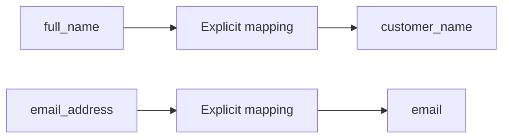

Run:

```python
scenario = "renamed_columns_mapped"
prepare_scenario(scenario)
explain_scenario(scenario)
show_input_file(scenario)
q = start_customer_stream(scenario)
arrive_file(scenario)
process_available_data_safely(scenario)
show_raw_output(scenario)
stop_customer_stream(scenario)
```

Compare:

```python
compare_pair_outputs("renamed_columns")
```

The problem side has no output because it was rejected. The solution side contains the canonical names.

---

# 10. Datatype change

## 10.1 Problem — an alphanumeric ID is read as an integer

Schema V2 expects:

```python
StructField("customer_id", IntegerType(), True)
```

The source sends:

```text
C110
```

Under permissive parsing, Spark may store the value as `null`.

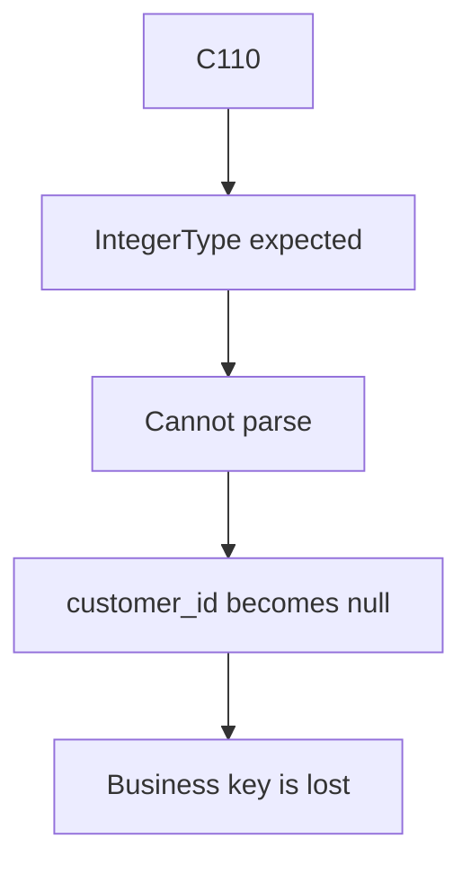

### Run the problem

```python
scenario = "datatype_change_old_schema"
prepare_scenario(scenario)
explain_scenario(scenario)
show_input_file(scenario)
q = start_customer_stream(scenario)
arrive_file(scenario)
process_available_data_safely(scenario)
show_raw_output(scenario)
stop_customer_stream(scenario)
```

## 10.2 Why this is serious

`customer_id` is a business key. If it becomes null, joins, deduplication, updates, and reconciliation can all be affected.

## 10.3 Possible responses

1. Reject rows with a missing business key.
2. Store identifiers as strings when letters may appear.
3. Validate the identifier pattern separately.
4. Migrate downstream schemas and joins before retiring the old type.

## 10.4 Practical solution — use StringType and validate the key

Schema V3 stores `customer_id` as a string.

The batch writer also checks that the field is not null or blank before writing.

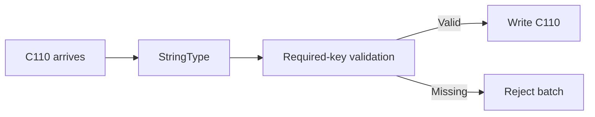

Run:

```python
scenario = "datatype_change_new_schema"
prepare_scenario(scenario)
explain_scenario(scenario)
show_input_file(scenario)
q = start_customer_stream(scenario)
arrive_file(scenario)
process_available_data_safely(scenario)
show_raw_output(scenario)
stop_customer_stream(scenario)
```

Compare:

```python
compare_pair_outputs("datatype_change")
```

### Interview takeaway

Identifiers are often safer as strings because they may contain letters, leading zeros, or formatting characters.

---

# 11. A simple decision flow

When a changed file arrives, do not immediately edit the schema and rerun the job.

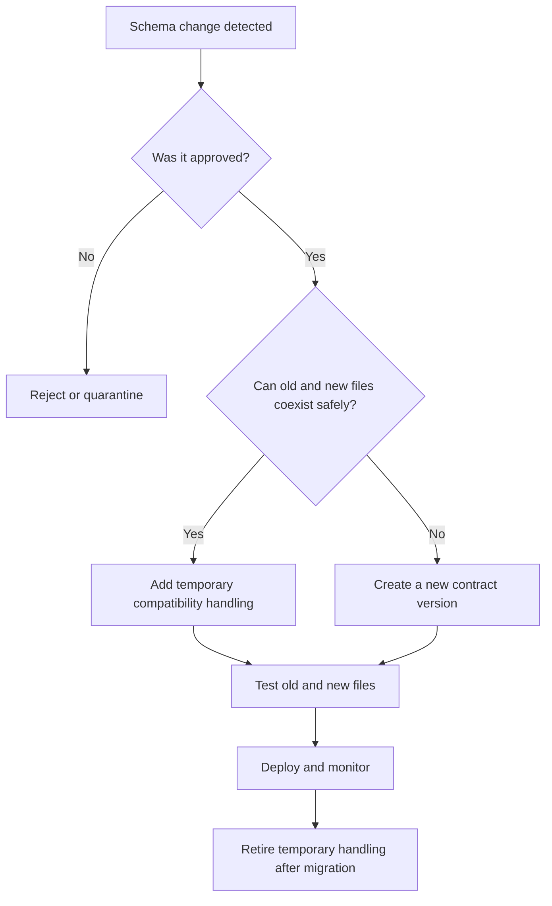

Questions to ask:

- Is the change planned?
- Will old files still arrive?
- Can the new value be null?
- Could the job succeed with incorrect data?
- Which downstream systems depend on the old schema?
- Do we need a new output and checkpoint version?
- How will we know when the migration is complete?

---

# 12. Compatible and breaking changes

| Change | Typical risk | Usual response |
|---|---|---|
| Add an optional trailing field | Old files may produce null | Upgrade schema and allow a transition window |
| Old file after upgrade | New field is missing | Keep null or apply an agreed temporary default |
| Reorder CSV columns | Values may enter the wrong fields | Validate or map the source order explicitly |
| Rename a column | Header and downstream references break | Alias explicitly or release a new contract |
| Change integer ID to string | Parsing may produce null | Use StringType and validate the key |
| Remove a required field | Important data disappears | Reject or create a new version |

---

# 13. Interview questions

## Does a successful Spark job guarantee correct data?

No. Reordered string columns can be accepted and written into the wrong fields.

## Why use an explicit schema?

It gives predictable data types and prevents repeated schema inference. It also makes the expected contract visible.

## Why can an added column be missed?

An explicit old schema does not automatically expand when the source adds a field.

## How can old and new files coexist?

Use nullable fields, agreed defaults, explicit mappings, or separate versioned paths during a controlled transition.

## Why is a column rename breaking?

Queries and downstream systems refer to the original name. The value may be unchanged, but the contract is different.

## What is silent data corruption?

The pipeline succeeds, but values are stored in the wrong columns or important fields are lost.

## Should a business key be allowed to become null during parsing?

Normally no. Reject or isolate the record, investigate the contract, and use an appropriate datatype.

## Why keep problem and solution outputs separate?

It makes the impact visible and prevents one experiment from mixing with another.

---

# 14. Final recap

```text
Problem observed
      ↓
Understand what Spark actually did
      ↓
Decide whether to reject, default, map, or version
      ↓
Run the practical solution
      ↓
Compare the output
      ↓
Test downstream impact
```

The main lesson is simple:

> Schema evolution is not only a schema-editing task. It is a controlled change to data, code, checkpoints, outputs, and downstream expectations.
