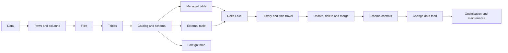
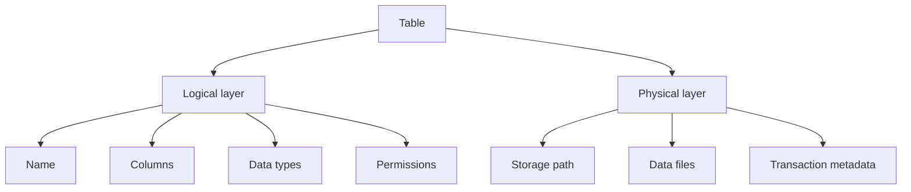
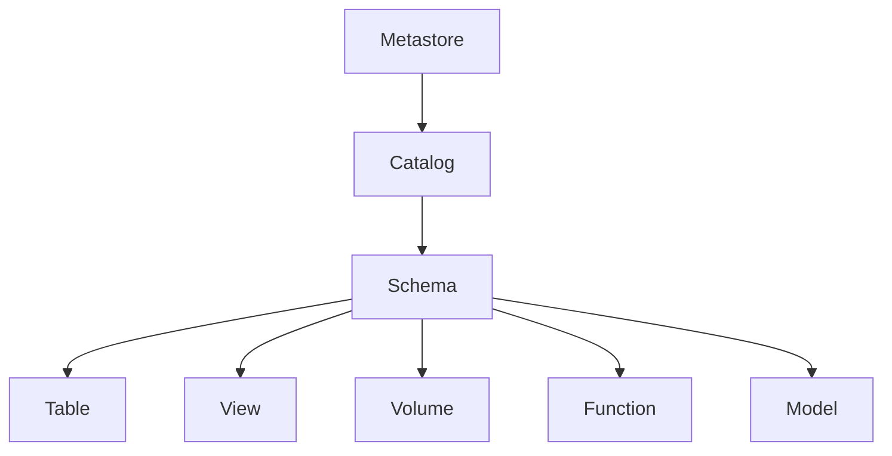
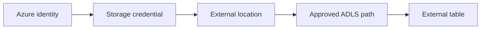
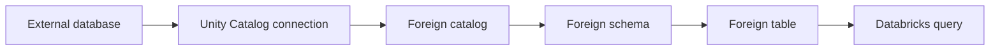
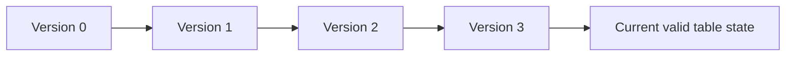
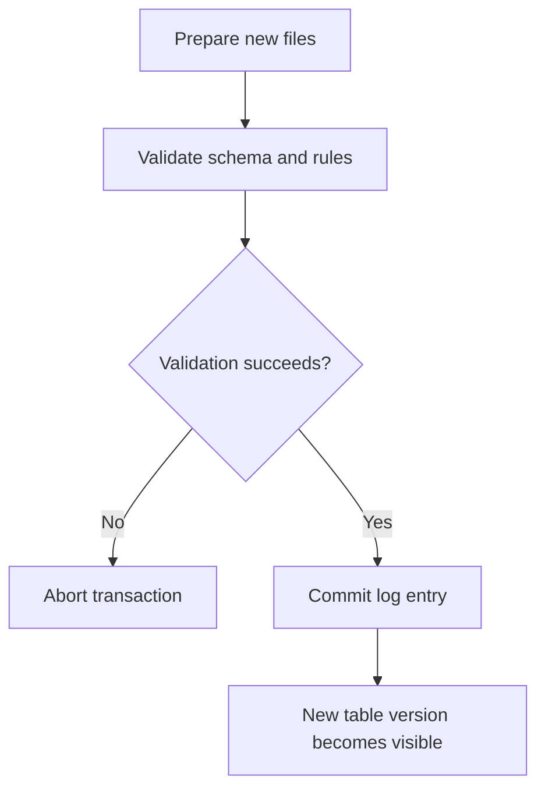
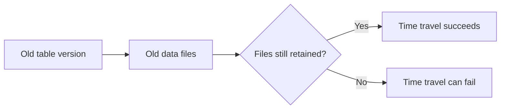
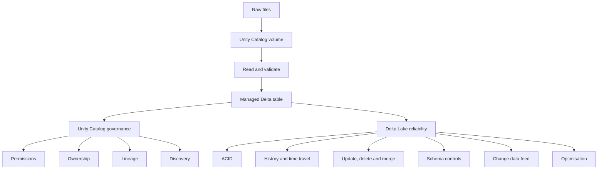

# Databricks Tables, Unity Catalog and Delta Lake

## Detailed Progressive Learning Notes with Guided Walkthroughs and Hands-on Practice

---

## 1. About These Notes

These notes begin with the most basic question—**what is data and how is it stored?**—and gradually move toward:

- Tables
- Managed and external tables
- Unity Catalog
- Standard and foreign catalogs
- Volumes and file uploads
- CSV, JSON and Parquet ingestion
- Delta Lake fundamentals
- ACID transactions
- Table history and time travel
- `UPDATE`, `DELETE` and `MERGE`
- Schema enforcement and schema evolution
- Constraints
- Change data feed
- File optimisation
- Cloning
- Streaming
- `VACUUM` and retention

Each major topic contains:

- Prerequisites
- Human-friendly explanation
- Analogy
- Syntax
- Sample data
- Guided walkthrough
- Expected result
- Advantages
- Disadvantages
- Constraints and limitations
- Common mistakes
- Hands-on exercise
- Solutions or helpful guidance

> **Terminology used in these notes**
>
> The official Databricks term is **managed table**. Some older material calls it an **internal table**.
>
> The official catalog terms are **standard catalog** and **foreign catalog**. “Internal catalog” and “external catalog” are informal expressions and can create confusion.
>
> The notes mention the familiar terms where useful, but consistently teach the official Unity Catalog terminology.

---

# 2. Progressive Learning Path

Begin with the foundations before moving to time travel or `MERGE`.

First, understand the journey from a physical file to a governed Delta table.



## 2.1 Recommended Sequence

| Stage | Topic | Why it comes here |
|---:|---|---|
| 1 | Data, rows and columns | Begins with familiar building blocks |
| 2 | Files and file formats | Explains where data physically exists |
| 3 | Tables | Adds a logical structure over data |
| 4 | Unity Catalog hierarchy | Explains how tables are named and governed |
| 5 | Managed tables | Simplest and recommended table type |
| 6 | External tables | Introduces externally controlled storage |
| 7 | Volumes and file uploads | Shows how raw files enter Databricks |
| 8 | Standard and foreign catalogs | Expands the governance model |
| 9 | Delta Lake basics | Explains reliable lakehouse tables |
| 10 | Delta DML and history | Demonstrates table changes and versions |
| 11 | Advanced Delta features | Builds production-oriented knowledge |
| 12 | Practice and mini project | Applies the complete flow step by step |

---

# 3. Prerequisites

## 3.1 Knowledge Prerequisites

You only need the following basic knowledge before starting:

- A row represents one record.
- A column represents one field or attribute.
- A file is stored in a folder.
- A simple `SELECT` statement retrieves data.
- A cloud storage service stores files remotely.

No previous Delta Lake knowledge is required.

## 3.2 Environment Prerequisites

Before starting, make sure the Databricks environment has:

- An Azure Databricks workspace
- Unity Catalog enabled
- A SQL warehouse or Unity Catalog-compatible cluster
- Permission to use a catalog and schema
- Permission to create tables
- Permission to create a volume, for the upload exercise
- An external location, for the external-table exercise
- Small CSV, JSON and Parquet files

## 3.3 Permissions Required for Managed Tables

To create a managed table, you normally need:

- `USE CATALOG` on the parent catalog
- `USE SCHEMA` on the parent schema
- `CREATE TABLE` on the parent schema

To query it, the user normally needs:

- `USE CATALOG`
- `USE SCHEMA`
- `SELECT` on the table

To modify it, the user normally needs:

- `MODIFY` on the table
- Access to the parent catalog and schema

## 3.4 Additional Requirements for External Tables

An external table additionally needs:

- A cloud storage path
- A Unity Catalog storage credential
- A Unity Catalog external location
- `CREATE TABLE` on the target schema
- `CREATE EXTERNAL TABLE` on the external location
- Appropriate access to the catalog and schema

Depending on the external access model and workspace configuration, additional privileges such as `EXTERNAL USE LOCATION` can be required.

## 3.5 Requirements for Volumes

To create a volume, the user normally needs:

- `USE CATALOG`
- `USE SCHEMA`
- `CREATE VOLUME`

To access files in a volume:

- Use Unity Catalog-compatible compute.
- Use the full `/Volumes/<catalog>/<schema>/<volume>/...` path.
- Use a supported Databricks Runtime. Volume support begins with Databricks Runtime 13.3 LTS.

## 3.6 Requirements for a Foreign Catalog

A foreign catalog requires:

- Unity Catalog
- A supported external data system
- Network connectivity from Databricks to that system
- Authentication details
- A Unity Catalog connection
- Permission to create or use the connection
- Permission to create or use the foreign catalog
- A compatible SQL warehouse or compute resource

You can still explore the foreign catalog concept even when a remote database is not available.

---

# 4. Environment Setup

The examples use:

```text
Catalog: delta_training
Schema:  demo
Volume:  source_files
```

Replace these names when required.

## 4.1 Create or Select a Catalog

```sql
CREATE CATALOG IF NOT EXISTS delta_training
COMMENT 'Catalog for table and Delta Lake guided practice';
```

When catalog creation is not permitted, use an existing catalog:

```sql
USE CATALOG main;
```

## 4.2 Create a Schema

```sql
CREATE SCHEMA IF NOT EXISTS delta_training.demo
COMMENT 'Schema for progressive table and Delta Lake exercises';
```

## 4.3 Select the Working Namespace

```sql
USE CATALOG delta_training;
USE SCHEMA demo;
```

## 4.4 Confirm the Current Namespace

```sql
SELECT
    current_catalog() AS current_catalog,
    current_schema() AS current_schema;
```

## 4.5 Create a Managed Volume

```sql
CREATE VOLUME IF NOT EXISTS delta_training.demo.source_files
COMMENT 'Landing area for sample CSV, JSON and Parquet files';
```

The volume path is:

```text
/Volumes/delta_training/demo/source_files/
```

---

# Part A — Foundations

# 5. What Is Data?

Data is a recorded fact.

Examples:

```text
Customer name: Aditi Sharma
City: Pune
Order amount: 1250.00
Order status: SHIPPED
```

One value by itself is useful, but businesses normally work with groups of related values.

## 5.1 A Record

A record combines values about one business event or entity.

```text
Order 1001
Customer 101
Amount 1250.00
Status SHIPPED
```

## 5.2 A Row

In a table, one record becomes one row.

| order_id | customer_id | amount | status |
|---:|---:|---:|---|
| 1001 | 101 | 1250.00 | SHIPPED |

## 5.3 A Column

A column stores the same type of information for multiple rows.

| Column | Meaning |
|---|---|
| `order_id` | Unique order number |
| `customer_id` | Customer who placed the order |
| `amount` | Monetary value of the order |
| `status` | Current order state |

## 5.4 Data Type

A data type tells the system what kind of value a column accepts.

| Data type | Example |
|---|---|
| `INT` | `101` |
| `BIGINT` | `9000000001` |
| `STRING` | `Pune` |
| `DATE` | `2026-07-25` |
| `TIMESTAMP` | `2026-07-25 10:30:00` |
| `DECIMAL(12,2)` | `1250.50` |
| `BOOLEAN` | `true` |

### Why Data Types Matter

Data types help the system:

- Validate data
- Store it efficiently
- Sort it correctly
- Perform calculations
- Reject invalid values
- Compare values reliably

### Common Mistake

This looks like a number, but it is text:

```text
"1250.00"
```

This is a numeric decimal value:

```text
1250.00
```

The difference becomes important during calculations and schema enforcement.

---

# 6. What Is a File?

A file is a physical object used to store data.

Examples:

```text
customers.csv
orders.json
products.parquet
```

## 6.1 File Analogy

A file is similar to a notebook kept in a cupboard.

The notebook contains information, but it does not automatically provide:

- User permissions
- Table history
- Row-level updates
- Transaction guarantees
- Central governance
- Reliable schema management

## 6.2 Common Data File Formats

| Format | Shape | Strength | Limitation |
|---|---|---|---|
| CSV | Rows separated by lines and commas | Simple and widely supported | Weak typing and escaping issues |
| JSON | Key-value records | Flexible and readable | Can be verbose and inconsistent |
| Parquet | Binary columnar format | Efficient for analytics | Not human-readable |
| Delta | Parquet plus a transaction log | Reliable lakehouse table operations | Requires Delta-compatible readers for full features |

## 6.3 File Versus Folder

A dataset can contain multiple files:

```text
orders/
├── part-00000.parquet
├── part-00001.parquet
└── part-00002.parquet
```

Spark frequently reads the entire folder as one dataset.

### Constraint

Do not assume that one table always equals one physical file.

A table can contain:

- One file
- Hundreds of files
- Thousands of files

---

# 7. What Is a Table?

A table is a named and structured data object that presents data using rows and columns.

Example:

| order_id | customer_id | order_date | amount | status |
|---:|---:|---|---:|---|
| 1001 | 101 | 2026-07-20 | 1250.00 | SHIPPED |
| 1002 | 102 | 2026-07-21 | 1800.00 | PLACED |

A table normally includes or references:

- Table name
- Column names
- Data types
- Storage format
- Data files
- Storage location
- Owner
- Permissions
- Properties
- Comments
- Statistics
- History, when supported by the table format

## 7.1 Physical and Logical View



## 7.2 File Versus Table

| Area | File | Table |
|---|---|---|
| Identified by | Path | Table name |
| Schema | May be absent or inferred | Registered |
| Query style | Read from path | Query by name |
| Permissions | Usually storage-level | Table-level governance possible |
| History | Normally absent | Available for Delta |
| Update/delete | Requires custom file handling | Supported for Delta |
| Discoverability | Search the storage location | Search Catalog Explorer |
| Ownership | Storage-based | Catalog object owner |

## 7.3 Basic Table Syntax

```sql
CREATE TABLE delta_training.demo.basic_customers
(
    customer_id   INT,
    customer_name STRING,
    city          STRING
);
```

In Databricks, a Unity Catalog managed table is created as Delta by default unless another supported format is specified.

## 7.4 Insert Sample Data

```sql
INSERT INTO delta_training.demo.basic_customers
VALUES
    (101, 'Aditi Sharma', 'Pune'),
    (102, 'Rahul Verma', 'Mumbai'),
    (103, 'Neha Iyer', 'Bengaluru');
```

## 7.5 Query the Table

```sql
SELECT *
FROM delta_training.demo.basic_customers
ORDER BY customer_id;
```

## 7.6 Advantages of Tables

- Easy to query
- Registered schema
- Searchable by name
- Governed access
- Reusable across notebooks and jobs
- Better data discovery
- Can support comments, ownership and lineage
- Delta tables support transactions and history

## 7.7 Constraints of Tables

- A table requires a valid schema.
- Users need privileges.
- The table type and format determine supported operations.
- A CSV external table does not gain Delta features merely because it is registered as a table.
- Poor table design can still create performance problems.
- Dropping a table can have different results depending on its table type.

## 7.8 Hands-on Exercise

Create a table named:

```text
delta_training.demo.practice_customers
```

Columns:

```text
customer_id INT
customer_name STRING
city STRING
```

Insert three rows and query the table.

<details>
<summary>Show solution</summary>

```sql
CREATE OR REPLACE TABLE delta_training.demo.practice_customers
(
    customer_id INT,
    customer_name STRING,
    city STRING
);

INSERT INTO delta_training.demo.practice_customers
VALUES
    (1, 'Arjun Rao', 'Hyderabad'),
    (2, 'Sneha Das', 'Kolkata'),
    (3, 'Vikram Patil', 'Pune');

SELECT *
FROM delta_training.demo.practice_customers
ORDER BY customer_id;
```

</details>

---

# Part B — Unity Catalog

# 8. Why Do We Need a Catalog?

Assume a company has:

- 10 departments
- 200 data engineers
- 500 tables
- Development and production environments
- Sensitive and public data
- Multiple Databricks workspaces

Using only file paths becomes difficult.

Questions arise:

- Which table is the correct one?
- Who owns it?
- Who can read it?
- Who modified it?
- Which report uses it?
- Is it development or production data?
- Where is the customer table located?
- Is this data confidential?

Unity Catalog helps answer and govern these questions.

---

# 9. What Is Unity Catalog?

Unity Catalog is Databricks' central governance system for data and AI assets.

It provides:

- Central access control
- Object ownership
- Auditing
- Data discovery
- Search
- Lineage
- Consistent naming
- Cross-workspace governance
- Storage credentials and external locations
- Governance for tables, volumes, functions and models

## 9.1 What Unity Catalog Does Not Replace

Unity Catalog does not replace:

- Delta Lake transactions
- Cloud storage
- Spark processing
- Database design
- Data quality logic
- Backup and disaster recovery
- Network security
- Cloud IAM for direct external storage access

## 9.2 Delta Lake and Unity Catalog Have Different Jobs

```text
Delta Lake
    → makes table data reliable

Unity Catalog
    → organises and governs access to data objects
```

---

# 10. Unity Catalog Hierarchy



## 10.1 Metastore

The metastore is the top-level Unity Catalog governance container.

It stores metadata about:

- Catalogs
- Schemas
- Tables
- Volumes
- Permissions
- Ownership
- Connections
- External locations
- Storage credentials

A user does not normally add the metastore name to a table query.

## 10.2 Catalog

A catalog is the first level in the three-part table name.

Example:

```text
delta_training
```

A company may create catalogs by:

- Environment: `dev`, `test`, `prod`
- Business domain: `sales`, `finance`, `hr`
- Organisational unit
- Data product
- Security boundary

## 10.3 Schema

A schema is a container inside a catalog.

Example:

```text
delta_training.demo
```

A schema can organise objects by:

- Source system
- Processing layer
- Team
- Project
- Data product

Examples:

```text
sales.bronze
sales.silver
sales.gold
```

## 10.4 Table

A table is a governed tabular object inside a schema.

Example:

```text
delta_training.demo.orders
```

## 10.5 Volume

A volume is a governed file-storage object inside a schema.

Example:

```text
delta_training.demo.source_files
```

Its file path is:

```text
/Volumes/delta_training/demo/source_files/
```

## 10.6 Three-Part Naming

```text
catalog.schema.table
```

Example:

```sql
SELECT *
FROM delta_training.demo.orders;
```

## 10.7 Human-Friendly Analogy

| Unity Catalog object | Analogy |
|---|---|
| Metastore | Entire office building |
| Catalog | One department |
| Schema | One room |
| Table | Labelled filing cabinet |
| Volume | Governed storage cupboard for files |

## 10.8 Advantages

- Names are predictable.
- Data is easier to discover.
- Access can be granted at multiple levels.
- Ownership is visible.
- Lineage can be captured.
- Teams can separate environments and domains.
- Policies can be inherited.

## 10.9 Constraints

- Users need `USE CATALOG` and `USE SCHEMA` to reach a table.
- Ownership of a table does not automatically bypass missing parent privileges.
- Poor catalog design can create confusion.
- Too many catalogs or schemas can make navigation difficult.
- Unity Catalog-compatible compute is required for Unity Catalog features.

## 10.10 Hands-on Exercise

Run:

```sql
SHOW CATALOGS;
SHOW SCHEMAS IN delta_training;
SHOW TABLES IN delta_training.demo;
```

Then identify:

1. Catalog name
2. Schema name
3. Table name
4. Fully qualified table name

---

# 11. Unity Catalog Permissions

## 11.1 Core Privileges

| Privilege | Purpose |
|---|---|
| `USE CATALOG` | Enter and use a catalog |
| `USE SCHEMA` | Enter and use a schema |
| `SELECT` | Read table data |
| `MODIFY` | Insert, update, delete and merge |
| `CREATE TABLE` | Create a table |
| `CREATE VOLUME` | Create a volume |
| `CREATE EXTERNAL TABLE` | Create an external table under an external location |
| `MANAGE` | Manage privileges without becoming owner |
| `BROWSE` | Discover metadata without full data access |

## 11.2 Example Grant

```sql
GRANT USE CATALOG
ON CATALOG delta_training
TO `data_engineers`;
```

```sql
GRANT USE SCHEMA, CREATE TABLE
ON SCHEMA delta_training.demo
TO `data_engineers`;
```

## 11.3 Constraint

Granting `SELECT` on a table alone may not be sufficient.

You also need access through the parent objects:

```text
USE CATALOG
    +
USE SCHEMA
    +
SELECT
```

## 11.4 Good Practice

Grant privileges to groups rather than individual users wherever possible.

Example groups:

```text
data_engineers
data_analysts
data_scientists
finance_readers
```

---

# Part C — Managed and External Tables

# 12. Managed Tables

## 12.1 Official Meaning

A managed table is a table for which Unity Catalog controls:

- Storage location
- Data lifecycle
- Metadata
- Governance
- Table maintenance capabilities

The older expression **internal table** may be used in interviews or older tutorials, but **managed table** is the official term.

## 12.2 Simple Explanation

When you create a managed table, you are telling Databricks:

> “Please create this table and decide where its data should be stored.”

You use the table name.

You do not normally choose or manage its physical directory.

## 12.3 Analogy

A managed table is similar to renting a locker from a managed facility.

The facility decides:

- Which locker is used
- How it is organised
- How it is maintained
- What happens when the locker is removed

You work with the locker number, not the building's internal storage map.

## 12.4 Prerequisites

- Unity Catalog-enabled workspace
- Unity Catalog-compatible compute
- Parent catalog and schema
- `USE CATALOG`
- `USE SCHEMA`
- `CREATE TABLE`

## 12.5 Create a Managed Table

```sql
DROP TABLE IF EXISTS delta_training.demo.managed_products;

CREATE TABLE delta_training.demo.managed_products
(
    product_id   INT,
    product_name STRING,
    category     STRING,
    price        DECIMAL(10, 2)
);
```

No `LOCATION` was provided.

That is the key sign in this example.

## 12.6 Insert Data

```sql
INSERT INTO delta_training.demo.managed_products
VALUES
    (501, 'Mechanical Keyboard', 'Accessories', 4500.00),
    (502, 'Wireless Mouse', 'Accessories', 1800.00),
    (503, '27 Inch Monitor', 'Display', 22000.00),
    (504, 'USB-C Dock', 'Accessories', 7200.00);
```

## 12.7 Query the Table

```sql
SELECT *
FROM delta_training.demo.managed_products
ORDER BY product_id;
```

## 12.8 Inspect the Metadata

```sql
DESCRIBE DETAIL delta_training.demo.managed_products;
```

Look for these details:

- `format`
- `location`
- `numFiles`
- `sizeInBytes`
- `properties`

Also run:

```sql
DESCRIBE EXTENDED delta_training.demo.managed_products;
```

## 12.9 Advantages of Managed Tables

- Recommended default table type
- No manual storage-path management
- Centralised lifecycle management
- Automatic maintenance capabilities
- Better support for platform optimisations
- Lower operational complexity
- Strong governance
- Easier permission model
- Managed Delta tables support DML and history
- Dropped tables can normally be recovered during the recovery period
- Better choice for frequently queried production data

## 12.10 Disadvantages or Trade-offs

- You do not directly select the exact table directory.
- Path-based access is not the supported normal access model.
- Existing files at a fixed location may need migration.
- External tools should use supported APIs rather than bypassing Unity Catalog.
- Dropping the table begins the managed deletion lifecycle.
- It is not the right object for arbitrary non-tabular files.

## 12.11 Constraints and Limitations

1. **Access by table name**

   Use:

   ```sql
   SELECT *
   FROM delta_training.demo.managed_products;
   ```

   Do not design jobs around the physical managed-table path.

2. **Supported managed formats**

   Unity Catalog managed tables use Delta Lake or managed Apache Iceberg.

3. **No manual `LOCATION` for the standard managed-table pattern**

   Adding a manually selected external path changes the design into an external table.

4. **Drop behaviour**

   Unity Catalog manages removal of data files after the recovery window.

5. **Privileges**

   Users still need catalog, schema and table permissions.

6. **Managed does not mean Databricks owns the data**

   The files remain in the organisation's cloud account. Unity Catalog determines their managed location and lifecycle.

7. **Do not use managed tables for random uploaded files**

   Use a volume for PDFs, images, libraries, raw landing files and other non-tabular objects.

## 12.12 Drop and Recover Walkthrough

Drop the table:

```sql
DROP TABLE delta_training.demo.managed_products;
```

Recover it during the supported recovery period:

```sql
UNDROP TABLE delta_training.demo.managed_products;
```

Query it again:

```sql
SELECT *
FROM delta_training.demo.managed_products;
```

### Key Idea

Dropping a managed table is not the same as dropping an external table.

Managed-table storage follows Unity Catalog's lifecycle and recovery rules.

## 12.13 Hands-on Exercise

Create a managed table named:

```text
delta_training.demo.managed_suppliers
```

Columns:

```text
supplier_id INT
supplier_name STRING
city STRING
active BOOLEAN
```

Tasks:

1. Insert three rows.
2. Run `DESCRIBE DETAIL`.
3. Identify the format and location.
4. Drop the table.
5. Recover it using `UNDROP TABLE`.
6. Query it again.

<details>
<summary>Show solution</summary>

```sql
CREATE OR REPLACE TABLE delta_training.demo.managed_suppliers
(
    supplier_id INT,
    supplier_name STRING,
    city STRING,
    active BOOLEAN
);

INSERT INTO delta_training.demo.managed_suppliers
VALUES
    (1, 'NorthStar Supplies', 'Pune', true),
    (2, 'Metro Wholesale', 'Mumbai', true),
    (3, 'Eastern Goods', 'Kolkata', false);

DESCRIBE DETAIL delta_training.demo.managed_suppliers;

DROP TABLE delta_training.demo.managed_suppliers;

UNDROP TABLE delta_training.demo.managed_suppliers;

SELECT *
FROM delta_training.demo.managed_suppliers;
```

</details>

---

# 13. External Tables

## 13.1 Official Meaning

An external table is registered in Unity Catalog, but the organisation selects and controls the underlying cloud storage path.

Unity Catalog governs the table inside Databricks.

The organisation controls:

- Physical location
- File lifecycle
- Direct external access
- Deletion of underlying files
- External storage policies

## 13.2 Simple Explanation

An external table says:

> “The data already lives at this approved cloud location. Register it as a table, but do not take ownership of its physical lifecycle.”

## 13.3 Analogy

An external table is similar to a book stored in another organisation's warehouse.

Unity Catalog creates a governed catalogue card for the book.

Removing the catalogue card does not destroy the book in the warehouse.

## 13.4 Storage Object Chain



## 13.5 Prerequisites

- ADLS Gen2 path
- Azure identity with storage access
- Storage credential
- External location
- Unity Catalog-compatible compute
- Parent catalog and schema
- `USE CATALOG`
- `USE SCHEMA`
- `CREATE TABLE`
- `CREATE EXTERNAL TABLE` on the external location
- Any additionally required external-use privilege

## 13.6 Preparation

The external location should point to a safe training container or folder.

Example external location:

```text
training_external_location
```

Example table path under it:

```text
abfss://training@companylake.dfs.core.windows.net/
training/external_products/
```

Do not place practice data in:

- A production folder
- The root of an external location
- A managed-table directory
- A volume directory
- A path already used by another table

## 13.7 Create an External Delta Table

Replace the placeholder path.

```sql
DROP TABLE IF EXISTS delta_training.demo.external_products;

CREATE TABLE delta_training.demo.external_products
(
    product_id   INT,
    product_name STRING,
    category     STRING,
    price        DECIMAL(10, 2)
)
USING DELTA
LOCATION
'abfss://<container>@<storage-account>.dfs.core.windows.net/training/external_products/';
```

## 13.8 Insert Data

```sql
INSERT INTO delta_training.demo.external_products
VALUES
    (601, 'Laptop Stand', 'Accessories', 2500.00),
    (602, 'Web Camera', 'Accessories', 4200.00),
    (603, 'Office Chair', 'Furniture', 14500.00);
```

## 13.9 Inspect the Table

```sql
DESCRIBE DETAIL delta_training.demo.external_products;
```

Confirm that the `location` is the path supplied in the `CREATE TABLE` command.

## 13.10 Drop the Table Registration

```sql
DROP TABLE delta_training.demo.external_products;
```

The Unity Catalog table entry is removed.

The files remain at the cloud path.

## 13.11 Re-register the Same Data

```sql
CREATE TABLE delta_training.demo.external_products
USING DELTA
LOCATION
'abfss://<container>@<storage-account>.dfs.core.windows.net/training/external_products/';
```

Query it:

```sql
SELECT *
FROM delta_training.demo.external_products;
```

The rows return because the physical Delta files were not deleted.

## 13.12 Advantages of External Tables

- Register existing data without copying it.
- Keep a fixed organisation-managed storage path.
- Allow controlled interoperability with external systems.
- Support several file formats.
- Useful during migration.
- Useful when storage lifecycle is managed outside Databricks.
- Dropping the table registration does not delete underlying files.
- External Delta tables still support many Delta Lake features.

## 13.13 Disadvantages and Trade-offs

- The organisation must manage file cleanup.
- The organisation must manage path design.
- Direct external access can bypass Unity Catalog permissions.
- Metadata can drift when other tools modify the data.
- Automatic managed-table optimisations may not apply.
- External tools can damage the dataset if they write incorrectly.
- Storage credentials and external locations increase setup complexity.
- It is easier to create overlapping or conflicting paths.
- Frequent production queries may perform better after migration to managed tables.

## 13.14 Constraints and Limitations

1. **An approved external location is required**

   The table path must be covered by a Unity Catalog external location or another supported authorised mechanism.

2. **Paths must not overlap**

   Do not overlap:

   - Two table directories
   - A table and a volume
   - Managed storage and external-table data
   - Parent and child external locations in unsafe ways

3. **Direct access can bypass Unity Catalog**

   When another tool reads the ADLS URI directly, Unity Catalog table permissions do not control that access.

   Cloud IAM must also be designed properly.

4. **Metadata drift**

   When an external tool changes metadata or files, Unity Catalog may not immediately reflect the change.

   A repair or refresh operation can be required:

   ```sql
   MSCK REPAIR TABLE delta_training.demo.external_products
   SYNC METADATA;
   ```

5. **Drop does not remove data**

   Storage cleanup must be performed separately.

6. **Table format determines features**

   An external Delta table supports Delta operations.

   An external CSV table does not support Delta time travel merely because it is registered in Unity Catalog.

7. **Do not write unrelated files inside a table directory**

   Keep logs and checkpoints outside the data-file area, or in specially designed subdirectories.

8. **Do not create tables at the root of an external location**

   Use a dedicated subfolder for every external object.

9. **File ownership remains external**

   Unity Catalog does not manage layout, deletion or optimisation for the table in the same way as a managed table.

## 13.15 External Non-Delta Table Example

A CSV external table can be registered:

```sql
CREATE TABLE delta_training.demo.external_customer_csv
(
    customer_id INT,
    customer_name STRING,
    city STRING
)
USING CSV
OPTIONS
(
    header = 'true'
)
LOCATION
'abfss://<container>@<storage-account>.dfs.core.windows.net/training/customer_csv/';
```

### Important Constraint

This table is external and uses CSV.

It does not gain:

- Delta transaction history
- Time travel
- Delta `MERGE`
- Delta change data feed
- Delta ACID table behaviour

## 13.16 Hands-on Exercise

Using a prepared external location:

1. Create an external Delta table.
2. Insert three rows.
3. Inspect its location.
4. Drop the table.
5. Re-register the same location.
6. Verify the rows still exist.
7. Explain why the data survived.

<details>
<summary>Show answer</summary>

The data survives because dropping an external table removes the Unity Catalog registration but does not delete files from the externally managed cloud path.

</details>

---

# 14. Managed Versus External Tables

| Area | Managed table | External table |
|---|---|---|
| Older name | Internal table | External table |
| Recommended default | Yes | Only for a clear requirement |
| Metadata governed by Unity Catalog | Yes | Yes |
| Storage selected by | Unity Catalog | Organisation |
| Data lifecycle controlled by | Unity Catalog | Organisation |
| Manual `LOCATION` | No | Yes |
| Drop removes metadata | Yes | Yes |
| Drop eventually removes data | Yes, after recovery lifecycle | No |
| `UNDROP TABLE` | Supported during recovery period | Not the normal recovery model |
| Direct path access | Not the supported design | Possible, with governance risks |
| Automatic maintenance | Strong support | More manual responsibility |
| Existing fixed-path data | Requires migration or registration strategy | Good fit |
| Delta features | Yes for Delta | Yes when external format is Delta |
| CSV/JSON table support | Not as managed table format | Yes |
| Operational complexity | Lower | Higher |

## 14.1 Decision Guide

Choose a **managed table** when:

- Databricks is the main processing platform.
- The data can be stored under Unity Catalog-managed storage.
- The table is frequently queried.
- Automatic optimisation is valuable.
- Simplicity is preferred.
- No external system requires direct file-path access.

Choose an **external table** when:

- Data already exists at a fixed cloud path.
- Another system manages the file lifecycle.
- Direct file access is genuinely required.
- Migration is being performed gradually.
- A non-Delta format must be registered.
- Organisational policy requires a specific physical location.

## 14.2 Interview Explanation

> A managed table lets Unity Catalog choose and manage the storage location and data lifecycle. An external table stores metadata in Unity Catalog but keeps the physical data at an organisation-managed cloud path. Dropping a managed table follows the managed deletion and recovery lifecycle, whereas dropping an external table removes only its registration and leaves its files in place.

---

# Part D — Volumes and File Uploads

# 15. What Is a Unity Catalog Volume?

A volume is a governed storage object for files.

Examples of files stored in volumes:

- CSV
- JSON
- Parquet
- Images
- PDF documents
- Audio
- Video
- Model files
- Python wheels
- JAR files
- Checkpoints
- Configuration files

## 15.1 Table Versus Volume

| Table | Volume |
|---|---|
| Represents tabular data | Represents files |
| Queried using table name | Accessed using file path |
| Has table schema | Does not impose one table schema |
| Supports SQL table operations | Used with file APIs |
| Good for governed datasets | Good for landing and staging files |

## 15.2 Managed Volume

Unity Catalog chooses the storage location and lifecycle.

```sql
CREATE VOLUME delta_training.demo.practice_files;
```

## 15.3 External Volume

The organisation supplies an existing external path.

```sql
CREATE EXTERNAL VOLUME delta_training.demo.partner_files
LOCATION
'abfss://<container>@<storage-account>.dfs.core.windows.net/partner_files/';
```

## 15.4 Volume Path

```text
/Volumes/<catalog>/<schema>/<volume>/<folders>/<file>
```

Example:

```text
/Volumes/delta_training/demo/source_files/customers/customers.csv
```

## 15.5 Advantages

- File-level access is governed through Unity Catalog.
- Useful as a landing area.
- Works with Auto Loader and `COPY INTO`.
- Supports arbitrary file formats.
- Makes uploaded files discoverable.
- Separates raw files from tables.
- Uses consistent paths across supported languages.

## 15.6 Disadvantages and Trade-offs

- A volume is not a table.
- You must still read the files and create a table when table behaviour is required.
- Path-based access is required.
- External direct access can bypass Unity Catalog.
- Some Spark and filesystem patterns are unsupported.
- Large numbers of tiny files still require good ingestion design.

## 15.7 Constraints and Limitations

- Files inside volumes cannot simply be treated as registered Unity Catalog tables.
- Use tables for tabular governed data.
- Use Unity Catalog-enabled compute.
- Use Databricks Runtime 13.3 LTS or above.
- RDD access to volumes is not supported.
- Use the complete path including the volume name.
- The catalog, schema and volume directories are managed and cannot be manipulated like ordinary folders.
- A volume path must not overlap a table path.
- `%sh mv` between volumes is not supported; use supported copy or filesystem operations.
- Direct external access to an external volume requires cloud-native security controls as well.

---

# 16. Upload Files to a Volume

## 16.1 UI Sequence

1. Open the Databricks workspace.
2. Select **New**.
3. Select **Add or upload data**.
4. Choose **Upload files to a volume**.
5. Select:

   ```text
   delta_training.demo.source_files
   ```

6. Create or use a subfolder.
7. Upload the sample file.
8. Open Catalog Explorer.
9. Browse to the volume.
10. Copy the `/Volumes/...` path.

## 16.2 Why Upload to a Volume First?

It clearly demonstrates this progression:

```text
Local file
    ↓
Governed landing area
    ↓
DataFrame
    ↓
Cleaned schema
    ↓
Delta table
```

This is closer to a production ingestion pattern than directly turning every small upload into a table.

---

# 17. Sample Data Files

## 17.1 `customers.csv`

```csv
customer_id,customer_name,city,email,signup_date
101,Aditi Sharma,Pune,aditi@example.com,2026-07-20
102,Rahul Verma,Mumbai,rahul@example.com,2026-07-21
103,Neha Iyer,Bengaluru,neha@example.com,2026-07-22
104,Arjun Rao,Hyderabad,arjun@example.com,2026-07-23
```

Upload to:

```text
/Volumes/delta_training/demo/source_files/customers/customers.csv
```

## 17.2 `orders.json`

Use line-delimited JSON:

```json
{"order_id":1001,"customer_id":101,"order_date":"2026-07-20","amount":1250.0,"status":"PLACED"}
{"order_id":1002,"customer_id":102,"order_date":"2026-07-21","amount":1800.0,"status":"SHIPPED"}
{"order_id":1003,"customer_id":101,"order_date":"2026-07-22","amount":750.0,"status":"PLACED"}
{"order_id":1004,"customer_id":104,"order_date":"2026-07-23","amount":2200.0,"status":"DELIVERED"}
```

Upload to:

```text
/Volumes/delta_training/demo/source_files/orders/orders.json
```

## 17.3 Product Data for Parquet

Parquet is binary, so create it using PySpark.

```python
from pyspark.sql.types import (
    StructType,
    StructField,
    IntegerType,
    StringType,
    DoubleType,
)

product_schema = StructType([
    StructField("product_id", IntegerType(), False),
    StructField("product_name", StringType(), False),
    StructField("category", StringType(), False),
    StructField("price", DoubleType(), False),
])

product_rows = [
    (501, "Mechanical Keyboard", "Accessories", 4500.0),
    (502, "Wireless Mouse", "Accessories", 1800.0),
    (503, "27 Inch Monitor", "Display", 22000.0),
    (504, "USB-C Dock", "Accessories", 7200.0),
]

products_df = spark.createDataFrame(
    product_rows,
    product_schema,
)

products_df.write.mode("overwrite").parquet(
    "/Volumes/delta_training/demo/source_files/products_parquet/"
)
```

---

# 18. Read Files Before Creating Tables

## 18.1 Read CSV with SQL

```sql
SELECT *
FROM read_files(
    '/Volumes/delta_training/demo/source_files/customers/customers.csv',
    format => 'csv',
    header => true,
    inferSchema => true
);
```

## 18.2 Read JSON with SQL

```sql
SELECT *
FROM read_files(
    '/Volumes/delta_training/demo/source_files/orders/orders.json',
    format => 'json'
);
```

## 18.3 Read Parquet with SQL

```sql
SELECT *
FROM read_files(
    '/Volumes/delta_training/demo/source_files/products_parquet/',
    format => 'parquet'
);
```

## 18.4 Constraints of Schema Inference

Schema inference is useful for quick exploration, but it can be risky in production.

Possible problems:

- A numeric column is inferred as text.
- A date is inferred as text.
- Null-heavy columns are inferred incorrectly.
- One malformed row changes inference.
- Separate files produce inconsistent schemas.
- Leading zeros are lost when identifiers are inferred as numbers.

## 18.5 Good Practice

For production ingestion:

- Define important schemas explicitly.
- Cast dates and decimals.
- Validate mandatory fields.
- Quarantine malformed rows.
- Record the source filename and ingestion timestamp.
- Do not rely blindly on `inferSchema`.

---

# 19. Convert CSV to a Managed Delta Table

## 19.1 SQL Approach

```sql
CREATE OR REPLACE TABLE delta_training.demo.customers_delta
AS
SELECT
    CAST(customer_id AS INT) AS customer_id,
    customer_name,
    city,
    email,
    CAST(signup_date AS DATE) AS signup_date,
    CURRENT_TIMESTAMP() AS ingested_at
FROM read_files(
    '/Volumes/delta_training/demo/source_files/customers/customers.csv',
    format => 'csv',
    header => true,
    inferSchema => true
);
```

## 19.2 Verify

```sql
SELECT *
FROM delta_training.demo.customers_delta
ORDER BY customer_id;
```

```sql
DESCRIBE DETAIL delta_training.demo.customers_delta;
```

## 19.3 PySpark Approach

```python
from pyspark.sql import functions as F
from pyspark.sql.types import (
    StructType,
    StructField,
    IntegerType,
    StringType,
)

customer_schema = StructType([
    StructField("customer_id", IntegerType(), False),
    StructField("customer_name", StringType(), False),
    StructField("city", StringType(), True),
    StructField("email", StringType(), True),
    StructField("signup_date", StringType(), True),
])

customer_path = (
    "/Volumes/delta_training/demo/source_files/"
    "customers/customers.csv"
)

customers_df = (
    spark.read
         .option("header", True)
         .schema(customer_schema)
         .csv(customer_path)
         .withColumn(
             "signup_date",
             F.to_date("signup_date"),
         )
         .withColumn(
             "ingested_at",
             F.current_timestamp(),
         )
)

display(customers_df)

(
    customers_df.write
                .format("delta")
                .mode("overwrite")
                .saveAsTable(
                    "delta_training.demo.customers_delta_pyspark"
                )
)
```

## 19.4 Expected Learning

The important distinction is:

```text
CSV file
    ≠
Delta table
```

The CSV file was read, validated and written into a new Delta table.

---

# 20. Convert JSON to a Managed Delta Table

```sql
CREATE OR REPLACE TABLE delta_training.demo.orders_from_json
AS
SELECT
    CAST(order_id AS BIGINT) AS order_id,
    CAST(customer_id AS BIGINT) AS customer_id,
    CAST(order_date AS DATE) AS order_date,
    CAST(amount AS DECIMAL(12, 2)) AS amount,
    status,
    CURRENT_TIMESTAMP() AS ingested_at
FROM read_files(
    '/Volumes/delta_training/demo/source_files/orders/orders.json',
    format => 'json'
);
```

Verify:

```sql
SELECT *
FROM delta_training.demo.orders_from_json
ORDER BY order_id;
```

## 20.1 JSON Constraints

- Nested JSON may create structs and arrays.
- Different records can have different keys.
- A malformed JSON line can fail or be captured as corrupt data.
- Very deep nesting can be difficult to query.
- JSON is verbose.
- Schema inference may vary across batches.

## 20.2 Production Guidance

- Define a schema.
- Flatten only when required.
- Preserve raw JSON when auditability matters.
- Capture corrupt records.
- Use Auto Loader for continuous cloud-file ingestion.

---

# 21. Convert Parquet to a Managed Delta Table

```sql
CREATE OR REPLACE TABLE delta_training.demo.products_from_parquet
AS
SELECT *
FROM read_files(
    '/Volumes/delta_training/demo/source_files/products_parquet/',
    format => 'parquet'
);
```

Verify:

```sql
DESCRIBE DETAIL delta_training.demo.products_from_parquet;
```

## 21.1 Important Explanation

Parquet and Delta are not opposites.

Delta normally stores data in Parquet files.

```text
Delta table
=
Parquet data files
+
Delta transaction log
+
Delta table rules
```

## 21.2 Parquet Constraints

A folder of ordinary Parquet files does not automatically provide:

- Version history
- Transactional `UPDATE`
- Transactional `DELETE`
- Reliable `MERGE`
- Change data feed
- Table-level schema enforcement across all writers
- Restore

---

# Part E — Catalog Types

# 22. Standard Catalog

A standard catalog is the normal Unity Catalog container.

It can contain:

- Managed tables
- External tables
- Views
- Volumes
- Functions
- Models
- Materialized views, where supported

Example:

```sql
CREATE CATALOG delta_training;
```

## 22.1 Important Clarification

A standard catalog can contain both managed and external tables.

```text
Standard catalog
├── Managed Delta table
├── External Delta table
├── External CSV table
├── Managed volume
└── External volume
```

Therefore:

```text
Standard catalog
≠
Catalog containing only managed tables
```

## 22.2 Advantages

- Full Unity Catalog organisation
- Fine-grained access control
- Supports managed and external assets
- Best integration with Databricks
- Central ownership and lineage
- Appropriate for production data products

## 22.3 Constraints

- Requires Unity Catalog.
- Requires namespace and privilege design.
- Does not by itself determine whether a table is managed or external.
- Catalog-level grants can be too broad when not designed carefully.

---

# 23. Foreign Catalog

A foreign catalog mirrors a database or catalog managed by another system.

Examples:

- Microsoft SQL Server
- PostgreSQL
- MySQL
- Snowflake
- Amazon Redshift
- Another supported metastore or catalog platform

## 23.1 Simple Explanation

A foreign catalog lets Databricks display and query external-system tables through Unity Catalog without first copying all of the data into a managed Delta table.

## 23.2 Flow



## 23.3 Analogy

A foreign catalog is a live window into another warehouse.

You can see and query what is stored there, but Databricks does not automatically own or optimise the warehouse.

## 23.4 Prerequisites

- Supported source system
- Network connectivity
- Credentials or supported identity
- Connection object
- Foreign catalog
- Unity Catalog privileges
- Source-side permissions
- Compatible data types
- Available remote compute capacity

## 23.5 Illustrative Creation Flow

The exact syntax and options vary by source.

```sql
CREATE CONNECTION training_sqlserver_connection
TYPE SQLSERVER
OPTIONS
(
    host '<server-host>',
    port '1433',
    user secret('<scope>', '<username-key>'),
    password secret('<scope>', '<password-key>')
);
```

```sql
CREATE FOREIGN CATALOG foreign_sales
USING CONNECTION training_sqlserver_connection
OPTIONS
(
    database 'SalesDB'
);
```

Query:

```sql
SELECT *
FROM foreign_sales.dbo.customers;
```

## 23.6 Advantages

- Minimal data movement
- Faster proof of concept
- Live access to external data
- Unity Catalog permissions for Databricks queries
- Query pushdown can reduce transferred data
- Useful during migration
- Useful for occasional reporting
- Allows central discovery and lineage

## 23.7 Disadvantages and Trade-offs

- Query speed depends on the remote system.
- Remote compute costs may apply.
- Network latency affects performance.
- Large data scans can be slow.
- Source connection limits can be reached.
- Remote schema changes can affect queries.
- Data-type mappings may not be exact.
- Production performance is usually weaker than managed tables.
- It does not automatically provide managed Delta-table optimisation.

## 23.8 Constraints and Limitations

1. **Normally read-only**

   Lakehouse Federation foreign tables are normally queried using `SELECT`.

   Standard `INSERT`, `UPDATE`, `DELETE` and `MERGE` are not generally available.

   A special exception exists for an internally federated legacy Hive metastore.

2. **Remote system remains the source of truth**

   Databricks does not control its data lifecycle.

3. **Remote workload impact**

   A poorly designed query can place load on the operational source.

4. **Data type mapping**

   Source data types are mapped into Spark data types.

5. **Transactions**

   Foreign tables do not provide the same Unity Catalog managed-table transactional guarantees.

6. **Performance**

   Frequently queried or production-critical data is usually better loaded into a managed table.

7. **Connectivity**

   Network or credential failure makes the foreign data unavailable.

8. **Source-specific limitations**

   Supported functions, predicates and pushdown behaviour vary.

## 23.9 Exploring the Concept Without a Remote Database

When no external source is available:

1. Show Catalog Explorer.
2. Explain the connection object.
3. Show sample foreign three-part naming.
4. Compare a query to a standard table query.
5. Identify where the data physically remains.
6. Explain that the query runs partly or fully against the remote source.
7. Explain why a managed Delta copy may be created for frequent analytics.

## 23.10 Standard Versus Foreign Catalog

| Area | Standard catalog | Foreign catalog |
|---|---|---|
| Informal term | Internal catalog | External catalog |
| Official term | Standard catalog | Foreign catalog |
| Data managed by | Unity Catalog objects and configured storage | External system |
| Managed tables | Yes | No |
| External tables | Yes | Not the same concept |
| Foreign tables | No | Yes |
| Typical write support | Read and write | Normally read-only |
| Performance control | High | Depends on remote source |
| Use case | Production lakehouse data | Federated external access |
| Data movement | Often loaded or registered | Not necessarily copied |

---

# 24. Do Not Confuse These Terms

| Term | Correct meaning |
|---|---|
| Managed table | Unity Catalog chooses location and manages lifecycle |
| External table | Unity Catalog metadata points to an organisation-managed cloud path |
| Foreign table | Data and metadata remain managed by an external data system |
| External location | Approved cloud path combined with a storage credential |
| Managed volume | Unity Catalog-managed file area |
| External volume | Governed existing cloud file path |
| Standard catalog | Normal Unity Catalog container |
| Foreign catalog | Mirrored external database or catalog |
| Delta table | Table using the Delta transaction protocol and data format |

---

# Part F — Delta Lake Foundations

# 25. What Problem Does Delta Lake Solve?

A data lake can store a large amount of inexpensive data.

However, plain files create challenges:

- Two jobs write at the same time.
- A job fails halfway.
- A wrong file is added.
- A schema suddenly changes.
- A row must be updated.
- A record must be deleted.
- A report must reproduce yesterday's data.
- An incremental pipeline needs only changed rows.
- Small files reduce performance.

Delta Lake adds reliable table behaviour to data stored in a lake.

---

# 26. What Is Delta Lake?

Delta Lake is an open table format and transactional storage layer used for lakehouse tables.

A simplified Delta table contains:

```text
orders_delta/
├── _delta_log/
│   ├── 00000000000000000000.json
│   ├── 00000000000000000001.json
│   └── checkpoints
├── part-00000-....parquet
├── part-00001-....parquet
└── part-00002-....parquet
```

## 26.1 Data Files

The Parquet files store actual columnar data.

## 26.2 Delta Transaction Log

The `_delta_log` records actions such as:

- File added
- File removed
- Schema changed
- Table property changed
- Update committed
- Delete committed
- Merge committed
- Operation metrics
- Table version

## 26.3 Current Table State

Delta reconstructs the current table state from the transaction log.



## 26.4 Advantages

- ACID transactions
- Reliable concurrent operations
- Row-level updates and deletes
- `MERGE`
- History and time travel
- Schema enforcement
- Controlled schema evolution
- Batch and streaming use
- Change data feed
- Constraints
- Optimisation features
- Open storage design
- Parquet-based analytics

## 26.5 Disadvantages and Trade-offs

- Transaction-log metadata must be maintained.
- Writers should use Delta-compatible operations.
- Retention and `VACUUM` require careful planning.
- Some features require a newer runtime or table protocol.
- External readers may not support every Databricks-specific feature.
- Poor partitioning or file layout can still hurt performance.
- Frequent schema changes can break consumers.
- Time travel increases storage usage while old files are retained.

## 26.6 Core Constraints

- Do not manually edit `_delta_log`.
- Do not manually delete files from a Delta table directory.
- Do not mix unrelated files into a Delta directory.
- Use supported Delta writers.
- Keep retention longer than the longest-running reader or stream.
- Do not treat time travel as a permanent backup.
- Test feature compatibility before enabling advanced table properties.

---

# 27. Delta Lake Versus Parquet

| Area | Plain Parquet dataset | Delta table |
|---|---|---|
| Columnar storage | Yes | Yes |
| Parquet files | Yes | Yes |
| Transaction log | No | Yes |
| ACID transactions | No | Yes |
| History | No | Yes |
| Time travel | No | Yes |
| `UPDATE` | Custom rewrite | Supported |
| `DELETE` | Custom rewrite | Supported |
| `MERGE` | Custom logic | Supported |
| Schema enforcement | Limited folder-level control | Supported |
| Change data feed | No | Supported |
| Restore | No | Supported |
| Streaming integration | Possible | Strong integration |

---

# 28. ACID Transactions

ACID describes reliable transaction behaviour.

| Letter | Meaning | Human explanation |
|---|---|---|
| A | Atomicity | The operation completes fully or not at all |
| C | Consistency | Rules remain valid after a commit |
| I | Isolation | Concurrent users see valid table states |
| D | Durability | Committed data remains recorded |

## 28.1 Analogy

A bank transfer should not deduct money from one account and fail before adding it to another.

Similarly, a table write should not leave half-written business data visible.

## 28.2 Delta Commit Flow



## 28.3 Constraint

Delta transactions protect operations made through the Delta protocol.

They do not protect the table from someone manually deleting files from cloud storage outside the supported transaction process.

---

# Part G — Progressive Delta Lake Walkthroughs

# 29. Create the Main Practice Table

All major walkthroughs use one table so its history remains easy to follow.

## 29.1 Reset the Table

```sql
DROP TABLE IF EXISTS delta_training.demo.orders_delta;

CREATE TABLE delta_training.demo.orders_delta
(
    order_id     BIGINT NOT NULL,
    customer_id  BIGINT NOT NULL,
    order_date   DATE,
    amount       DECIMAL(12, 2),
    status       STRING,
    updated_at   TIMESTAMP
)
TBLPROPERTIES
(
    delta.enableChangeDataFeed = true
);
```

## 29.2 Insert Initial Data

```sql
INSERT INTO delta_training.demo.orders_delta
VALUES
    (
        1001,
        101,
        DATE '2026-07-20',
        1250.00,
        'PLACED',
        TIMESTAMP '2026-07-20 10:00:00'
    ),
    (
        1002,
        102,
        DATE '2026-07-21',
        1800.00,
        'PLACED',
        TIMESTAMP '2026-07-21 11:00:00'
    ),
    (
        1003,
        103,
        DATE '2026-07-22',
        750.00,
        'PLACED',
        TIMESTAMP '2026-07-22 12:00:00'
    );
```

## 29.3 Query the Initial State

```sql
SELECT *
FROM delta_training.demo.orders_delta
ORDER BY order_id;
```

## 29.4 Record the First Version

```sql
DESCRIBE HISTORY delta_training.demo.orders_delta;
```

The exact version depends on how the table was created.

Do not blindly assume the initial data is always version `0`.

Always inspect history in a shared environment.

---

# 30. Feature: Table History

Every committed modifying operation creates a new table version.

## 30.1 Add a Row

```sql
INSERT INTO delta_training.demo.orders_delta
VALUES
(
    1004,
    104,
    DATE '2026-07-23',
    2200.00,
    'PLACED',
    CURRENT_TIMESTAMP()
);
```

## 30.2 Update a Row

```sql
UPDATE delta_training.demo.orders_delta
SET
    status = 'SHIPPED',
    amount = 1750.00,
    updated_at = CURRENT_TIMESTAMP()
WHERE order_id = 1002;
```

## 30.3 Delete a Row

```sql
DELETE FROM delta_training.demo.orders_delta
WHERE order_id = 1003;
```

## 30.4 View History

```sql
DESCRIBE HISTORY delta_training.demo.orders_delta;
```

Useful fields include:

- `version`
- `timestamp`
- `operation`
- `operationParameters`
- `operationMetrics`
- `userName`
- `notebook`
- `clusterId`

## 30.5 Advantages

- Audit table operations
- Identify who changed data
- Locate a safe version
- Debug pipelines
- Inspect operation metrics
- Support restore and time travel

## 30.6 Constraints

- Table history is not permanent by default.
- Log retention is separate from data-file retention.
- History alone does not guarantee that old data files still exist.
- Do not treat history as a backup archive.

## 30.7 Exercise

Run three different operations and identify their versions.

Check the following:

- Which version was an `INSERT`?
- Which version was an `UPDATE`?
- Which version was a `DELETE`?
- How many rows were affected?

---

# 31. Feature: Time Travel

Time travel reads an earlier table version without changing the current version.

## 31.1 Read by Version

Replace `<version-number>` with a value from history.

```sql
SELECT *
FROM delta_training.demo.orders_delta
VERSION AS OF <version-number>
ORDER BY order_id;
```

## 31.2 Read by Timestamp

Copy an exact timestamp from history.

```sql
SELECT *
FROM delta_training.demo.orders_delta
TIMESTAMP AS OF '<history-timestamp>'
ORDER BY order_id;
```

## 31.3 Compare Two Versions

```sql
SELECT
    'CURRENT' AS table_state,
    *
FROM delta_training.demo.orders_delta

UNION ALL

SELECT
    'OLD_VERSION' AS table_state,
    *
FROM delta_training.demo.orders_delta
VERSION AS OF <version-number>

ORDER BY order_id, table_state;
```

## 31.4 Advantages

- Investigate accidental changes
- Reproduce an old report
- Compare data states
- Debug a pipeline
- Audit business changes
- Reproduce a training dataset
- Inspect data before recovery

## 31.5 Disadvantages and Trade-offs

- Old files consume storage.
- Longer retention costs more.
- Querying old versions may be slower.
- The feature is not a complete backup strategy.
- Versions disappear when required logs or data files are removed.

## 31.6 Constraints

- Required data files must still exist.
- `VACUUM` can remove files required by old versions.
- Databricks recommends using only recent history unless both data and log retention are configured for a longer period.
- The normal safe data retention window is seven days unless changed.
- Table history logs and old data files use different retention controls.
- A timestamp must fall within an available table-history period.

## 31.7 Hands-on Exercise

1. Identify the version before order `1003` was deleted.
2. Query that version.
3. Confirm that order `1003` exists there.
4. Query the current table.
5. Confirm it no longer exists.

---

# 32. Feature: Restore

Time travel reads old data.

Restore makes an old state become the new current state.

## 32.1 Prerequisite

- Identify the correct version.
- Confirm required files are retained.
- Ensure no important concurrent write is running.
- Have permission to modify the table.

## 32.2 Restore Syntax

```sql
RESTORE TABLE delta_training.demo.orders_delta
TO VERSION AS OF <version-number>;
```

## 32.3 Verify

```sql
SELECT *
FROM delta_training.demo.orders_delta
ORDER BY order_id;
```

```sql
DESCRIBE HISTORY delta_training.demo.orders_delta;
```

## 32.4 Important Behaviour

Restore does not erase all later history.

It creates a new table version whose logical state matches the selected older version.

## 32.5 Advantages

- Fast recovery from a bad update
- Simple rollback
- Preserves audit history
- Avoids manually rebuilding the table

## 32.6 Constraints

- Required historical files must exist.
- Restore changes the current production state.
- Downstream systems may need reprocessing.
- A restored table may reintroduce old business records.
- Concurrent writers should be controlled.
- Retention settings limit recovery depth.

## 32.7 Safe Practice

Use a dedicated practice table.

Do not restore an important shared table while practising this feature.

---

# 33. Feature: `UPDATE`

```sql
UPDATE delta_training.demo.orders_delta
SET
    status = 'DELIVERED',
    updated_at = CURRENT_TIMESTAMP()
WHERE order_id = 1002;
```

Verify:

```sql
SELECT *
FROM delta_training.demo.orders_delta
WHERE order_id = 1002;
```

## 33.1 Advantages

- Change selected business records
- Avoid rewriting the full table manually
- Transactional operation
- Creates an auditable version
- Works with change data feed

## 33.2 Constraints

- The table must support Delta DML.
- A broad condition can update too many rows.
- Updates can rewrite or logically modify multiple data files.
- Frequent random updates can be expensive.
- Always test the `WHERE` condition using `SELECT` first.

## 33.3 Safe Pattern

```sql
SELECT *
FROM delta_training.demo.orders_delta
WHERE order_id = 1002;
```

After confirming the row:

```sql
UPDATE ...
WHERE order_id = 1002;
```

---

# 34. Feature: `DELETE`

Insert a cancelled order:

```sql
INSERT INTO delta_training.demo.orders_delta
VALUES
(
    1006,
    105,
    DATE '2026-07-24',
    500.00,
    'CANCELLED',
    CURRENT_TIMESTAMP()
);
```

Delete it:

```sql
DELETE FROM delta_training.demo.orders_delta
WHERE order_id = 1006;
```

Verify:

```sql
SELECT *
FROM delta_training.demo.orders_delta
WHERE order_id = 1006;
```

## 34.1 Advantages

- Transactional record removal
- Supports compliance and correction use cases
- Creates table history
- Can be consumed through change data feed

## 34.2 Constraints

- A missing `WHERE` clause can delete all rows.
- Deleted data files can remain physically present until cleanup.
- Time travel can still expose old records while retained.
- `VACUUM` and compliance retention need coordination.
- Large deletes may be expensive.
- Deletion vectors may mark rows logically before files are physically rewritten.

---

# 35. Feature: `MERGE`

`MERGE` combines update and insert logic.

This is often called an **upsert**.

## 35.1 Source Data

```sql
CREATE OR REPLACE TEMP VIEW incoming_order_changes AS
SELECT *
FROM VALUES
    (
        1001,
        101,
        DATE '2026-07-20',
        CAST(1300.00 AS DECIMAL(12, 2)),
        'SHIPPED',
        CURRENT_TIMESTAMP()
    ),
    (
        1005,
        103,
        DATE '2026-07-24',
        CAST(3200.00 AS DECIMAL(12, 2)),
        'PLACED',
        CURRENT_TIMESTAMP()
    )
AS source
(
    order_id,
    customer_id,
    order_date,
    amount,
    status,
    updated_at
);
```

## 35.2 Run the Merge

```sql
MERGE INTO delta_training.demo.orders_delta AS target
USING incoming_order_changes AS source
ON target.order_id = source.order_id

WHEN MATCHED THEN
    UPDATE SET
        target.customer_id = source.customer_id,
        target.order_date = source.order_date,
        target.amount = source.amount,
        target.status = source.status,
        target.updated_at = source.updated_at

WHEN NOT MATCHED THEN
    INSERT
    (
        order_id,
        customer_id,
        order_date,
        amount,
        status,
        updated_at
    )
    VALUES
    (
        source.order_id,
        source.customer_id,
        source.order_date,
        source.amount,
        source.status,
        source.updated_at
    );
```

## 35.3 Verify

```sql
SELECT *
FROM delta_training.demo.orders_delta
ORDER BY order_id;
```

Expected behaviour:

- `1001` is updated.
- `1005` is inserted.

## 35.4 Advantages

- One statement handles inserts and updates.
- Ideal for CDC and incremental loading.
- Transactional.
- Idempotent designs are possible.
- Supports conditional actions.
- Reduces custom rewrite logic.

## 35.5 Disadvantages and Trade-offs

- Complex merge conditions can be difficult to debug.
- Large merges can be expensive.
- Bad source duplicates can cause ambiguous matches.
- Poorly clustered target data can increase scanning.
- A merge is not automatically idempotent; the design must make it so.

## 35.6 Constraints

1. The matching key should represent the target business key.
2. Multiple source rows should not ambiguously match one target row.
3. Deduplicate incoming data before merging.
4. Test source data quality.
5. Make the merge condition selective.
6. Use timestamps or sequence values when the latest record must win.
7. A non-Delta CSV or JSON table cannot use Delta `MERGE`.

## 35.7 Deduplicate Before Merge

```sql
CREATE OR REPLACE TEMP VIEW deduplicated_changes AS
SELECT *
FROM
(
    SELECT
        *,
        ROW_NUMBER() OVER
        (
            PARTITION BY order_id
            ORDER BY updated_at DESC
        ) AS row_number
    FROM incoming_order_changes
)
WHERE row_number = 1;
```

---

# 36. Feature: Schema Enforcement

Schema enforcement rejects incompatible writes.

## 36.1 Create a Controlled Table

```sql
DROP TABLE IF EXISTS delta_training.demo.schema_demo;

CREATE TABLE delta_training.demo.schema_demo
(
    id     INT,
    name   STRING,
    amount DOUBLE
);

INSERT INTO delta_training.demo.schema_demo
VALUES
    (1, 'Valid Record', 100.0);
```

## 36.2 Attempt an Incompatible Write

Run this PySpark cell:

```python
from pyspark.sql.types import (
    StructType,
    StructField,
    IntegerType,
    StringType,
)

wrong_schema = StructType([
    StructField("id", IntegerType(), False),
    StructField("name", StringType(), False),
    StructField("amount", StringType(), False),
])

wrong_rows = [
    (2, "Wrong Schema Record", "not-a-number"),
]

wrong_df = spark.createDataFrame(
    wrong_rows,
    wrong_schema,
)

try:
    (
        wrong_df.write
                .format("delta")
                .mode("append")
                .saveAsTable(
                    "delta_training.demo.schema_demo"
                )
    )
except Exception as error:
    print("Expected failure: incompatible schema.")
    print(str(error)[:1000])
```

## 36.3 Verify Atomicity

```sql
SELECT *
FROM delta_training.demo.schema_demo;
```

The invalid row should not be present.

## 36.4 Advantages

- Prevents silent corruption
- Protects downstream users
- Supports predictable contracts
- Helps maintain valid types
- Works with transactional failure

## 36.5 Constraints

- It does not automatically validate every business rule.
- Compatible data can still be logically wrong.
- Column order and type behaviour must be understood.
- Writers using unsafe external methods can still damage externally managed data.
- Schema enforcement can break a pipeline when a legitimate source change is not planned.

---

# 37. Feature: Schema Evolution

Schema evolution intentionally changes a table schema.

## 37.1 Example: Add an Approved Column

```python
from pyspark.sql.types import (
    StructType,
    StructField,
    IntegerType,
    StringType,
    DoubleType,
)

evolved_schema = StructType([
    StructField("id", IntegerType(), False),
    StructField("name", StringType(), False),
    StructField("amount", DoubleType(), False),
    StructField("source_system", StringType(), True),
])

evolved_rows = [
    (2, "New Record", 250.0, "CRM"),
]

evolved_df = spark.createDataFrame(
    evolved_rows,
    evolved_schema,
)

(
    evolved_df.write
              .format("delta")
              .mode("append")
              .option("mergeSchema", "true")
              .saveAsTable(
                  "delta_training.demo.schema_demo"
              )
)
```

Inspect:

```sql
DESCRIBE TABLE delta_training.demo.schema_demo;
```

Query:

```sql
SELECT *
FROM delta_training.demo.schema_demo
ORDER BY id;
```

The old row receives `NULL` for `source_system`.

## 37.2 Advantages

- Supports legitimate source changes
- Avoids full-table recreation for an added column
- Useful in evolving ingestion pipelines
- Preserves older records

## 37.3 Disadvantages

- Downstream queries can break.
- Unexpected columns can pollute the model.
- New columns can increase governance work.
- Automatic evolution can hide source-system mistakes.
- Type changes require careful compatibility planning.

## 37.4 Constraints

- Enable evolution deliberately.
- Review schema changes.
- Record a schema version.
- Test downstream compatibility.
- Do not use schema evolution as a replacement for data contracts.
- Table property changes can conflict with concurrent writers.
- Some advanced column-mapping and change-feed combinations have additional limitations.

## 37.5 Preferred Production Pattern

```text
Detect schema change
    ↓
Compare with approved contract
    ↓
Approve or reject
    ↓
Apply controlled ALTER or mergeSchema
    ↓
Test downstream consumers
    ↓
Release
```

---

# 38. Feature: Check Constraints

A check constraint rejects rows that violate a condition.

## 38.1 Add a Positive Amount Constraint

First verify current data:

```sql
SELECT *
FROM delta_training.demo.orders_delta
WHERE amount < 0;
```

If no invalid rows exist:

```sql
ALTER TABLE delta_training.demo.orders_delta
ADD CONSTRAINT positive_order_amount
CHECK (amount >= 0);
```

## 38.2 Attempt an Invalid Insert

```sql
INSERT INTO delta_training.demo.orders_delta
VALUES
(
    1099,
    199,
    DATE '2026-07-25',
    -500.00,
    'PLACED',
    CURRENT_TIMESTAMP()
);
```

The operation should fail.

## 38.3 Verify

```sql
SELECT *
FROM delta_training.demo.orders_delta
WHERE order_id = 1099;
```

## 38.4 Advantages

- Enforces business rules
- Prevents invalid data
- Applies to every supported writer
- Makes rules visible in table metadata
- Works transactionally

## 38.5 Constraints

- Existing rows must satisfy the rule before it can be added.
- Complex cross-table rules cannot be represented as a simple check constraint.
- Constraints can reject an entire write.
- Primary and foreign key declarations may be informational rather than enforced.
- A constraint should be simple, stable and meaningful.

## 38.6 Useful Examples

```sql
CHECK (quantity > 0)
```

```sql
CHECK (amount >= 0)
```

```sql
CHECK (status IN ('PLACED', 'SHIPPED', 'DELIVERED', 'CANCELLED'))
```

---

# 39. Feature: Change Data Feed

Change data feed tracks row-level changes between versions.

It can return:

- Inserted rows
- Deleted rows
- Update pre-images
- Update post-images

## 39.1 Why It Is Useful

Without change data feed, a downstream job may need to read the full table.

With change data feed:

```text
Process only rows that changed
```

## 39.2 Legacy Change Data Feed

The practice table enabled it during creation:

```sql
TBLPROPERTIES
(
    delta.enableChangeDataFeed = true
)
```

For an existing table:

```sql
ALTER TABLE delta_training.demo.orders_delta
SET TBLPROPERTIES
(
    delta.enableChangeDataFeed = true
);
```

## 39.3 Capture Starting Version

```python
table_name = "delta_training.demo.orders_delta"

cdf_start_version = (
    spark.sql(f"DESCRIBE HISTORY {table_name}")
         .select("version")
         .orderBy("version", ascending=False)
         .first()["version"]
)

print(f"Starting version: {cdf_start_version}")
```

## 39.4 Make Changes

```sql
UPDATE delta_training.demo.orders_delta
SET
    status = 'DELIVERED',
    updated_at = CURRENT_TIMESTAMP()
WHERE order_id = 1001;
```

```sql
INSERT INTO delta_training.demo.orders_delta
VALUES
(
    1007,
    102,
    DATE '2026-07-25',
    900.00,
    'PLACED',
    CURRENT_TIMESTAMP()
);
```

```sql
DELETE FROM delta_training.demo.orders_delta
WHERE order_id = 1004;
```

## 39.5 Read Changes with PySpark

```python
cdf_df = (
    spark.read
         .format("delta")
         .option("readChangeFeed", "true")
         .option(
             "startingVersion",
             cdf_start_version + 1,
         )
         .table(
             "delta_training.demo.orders_delta"
         )
)

display(
    cdf_df.orderBy(
        "_commit_version",
        "order_id",
        "_change_type",
    )
)
```

## 39.6 Read Changes with SQL

```sql
SELECT *
FROM table_changes(
    'delta_training.demo.orders_delta',
    <starting-version>
)
ORDER BY
    _commit_version,
    order_id,
    _change_type;
```

## 39.7 Metadata Columns

| Column | Meaning |
|---|---|
| `_change_type` | Insert, delete, update before or update after |
| `_commit_version` | Version containing the change |
| `_commit_timestamp` | Commit time |

Common values:

```text
insert
delete
update_preimage
update_postimage
```

## 39.8 Advantages

- Efficient incremental ETL
- Audit trails
- Replication
- Downstream synchronisation
- Captures update before and after images
- Works in batch and streaming patterns

## 39.9 Disadvantages and Trade-offs

- Downstream logic must process each change type correctly.
- Retained change information consumes storage or metadata.
- Schema changes can complicate readers.
- A missing checkpoint can cause duplicate processing if the consumer is poorly designed.
- It is not a permanent audit archive unless copied to one.

## 39.10 Constraints

- Legacy CDF only captures changes after it is enabled.
- Turning it off creates an interval that legacy CDF cannot reconstruct.
- Change files follow retention policies.
- `VACUUM` can remove required files.
- The latest table schema is used when reading changes.
- Some column-mapping schema changes have limitations.
- Automatic change data feed requires newer runtime capabilities and is currently a preview feature.
- Automatic and legacy CDF should not be used together on the same table.
- Consumer logic must handle update pre-images and post-images correctly.

## 39.11 Production Pattern

```text
Read last processed version from control table
    ↓
Read CDF from next version
    ↓
Apply changes downstream
    ↓
Commit downstream transaction
    ↓
Update control table
```

---

# 40. Feature: Batch and Streaming

A Delta table can support batch queries and streaming pipelines.

## 40.1 Batch Read

```python
orders_batch_df = spark.table(
    "delta_training.demo.orders_delta"
)

display(orders_batch_df)
```

## 40.2 Direct Streaming Read

```python
orders_stream_df = (
    spark.readStream
         .table(
             "delta_training.demo.orders_delta"
         )
)
```

## 40.3 CDF Streaming Read

For tables with updates and deletes, change data feed is usually clearer:

```python
orders_change_stream_df = (
    spark.readStream
         .option("readChangeFeed", "true")
         .table(
             "delta_training.demo.orders_delta"
         )
)
```

## 40.4 Advantages

- Same reliable table for batch and streaming
- Exactly-once Delta sink patterns
- Easy bronze-to-silver pipeline design
- Incremental processing
- Transactional checkpoints and commits

## 40.5 Constraints

- A direct table stream is not the best way to represent updates and deletes.
- Use CDF when all change types matter.
- A stream must run often enough to remain within the source retention window.
- Falling behind retention can require a full refresh.
- Checkpoints must be stored separately from table data.
- Changing streaming schemas requires planning.
- Do not manually remove checkpoint data.

---

# 41. Feature: `OPTIMIZE`

Small files increase:

- File listing work
- Metadata processing
- Task scheduling overhead
- Query startup time

`OPTIMIZE` rewrites data into a better file layout.

## 41.1 Create a Small-File Example

```python
small_file_table = (
    "delta_training.demo.small_files_demo"
)

spark.sql(
    f"DROP TABLE IF EXISTS {small_file_table}"
)

for batch_id in range(10):
    batch_df = (
        spark.range(
            batch_id * 100,
            (batch_id + 1) * 100,
        )
        .withColumnRenamed(
            "id",
            "record_id",
        )
    )

    (
        batch_df.write
                .format("delta")
                .mode("append")
                .saveAsTable(small_file_table)
    )
```

## 41.2 Inspect Before

```sql
DESCRIBE DETAIL delta_training.demo.small_files_demo;
```

## 41.3 Optimise

```sql
OPTIMIZE delta_training.demo.small_files_demo;
```

## 41.4 Inspect After

```sql
DESCRIBE DETAIL delta_training.demo.small_files_demo;
```

## 41.5 Advantages

- Better file sizes
- Reduced file overhead
- Faster reads on suitable tables
- Better clustering maintenance
- Cleaner table layout

## 41.6 Constraints

- A tiny practice dataset may not show a dramatic difference.
- `OPTIMIZE` uses compute.
- Frequent unnecessary optimisation wastes resources.
- Managed tables can use predictive optimisation.
- External tables require more manual maintenance.
- It does not fix poor query logic.
- It should not change logical row results.

---

# 42. Predictive Optimisation

Predictive optimisation can automatically run maintenance operations for Unity Catalog managed tables.

These operations can include:

- `OPTIMIZE`
- `VACUUM`
- Statistics-related maintenance

## 42.1 Advantage

The platform learns from table usage and reduces manual maintenance.

## 42.2 Constraint

This benefit is associated with Unity Catalog managed tables.

External and foreign tables do not receive the same managed-table maintenance behaviour.

## 42.3 Key Idea

This is one reason managed tables are the recommended default for production analytics.

---

# 43. Data Skipping and Liquid Clustering

## 43.1 Data Skipping

The engine can use file-level statistics to avoid reading files that cannot contain matching rows.

Example:

```sql
SELECT *
FROM delta_training.demo.orders_delta
WHERE customer_id = 101;
```

## 43.2 Analogy

Without data skipping:

```text
Open every carton in the warehouse.
```

With data skipping:

```text
Read the carton labels and open only likely cartons.
```

## 43.3 Liquid Clustering

Liquid clustering allows table data to be organised around selected clustering columns without rigid static partition design.

Example:

```sql
CREATE OR REPLACE TABLE
    delta_training.demo.clustered_orders
CLUSTER BY (customer_id)
AS
SELECT *
FROM delta_training.demo.orders_delta;
```

Then:

```sql
OPTIMIZE delta_training.demo.clustered_orders;
```

## 43.4 Advantages

- Flexible data layout
- Better selective query performance
- Reduced need for static partition design
- Can adapt better as data grows

## 43.5 Constraints

- Requires a supported runtime.
- Select clustering columns based on real query patterns.
- Too many clustering columns reduce usefulness.
- Tiny data does not demonstrate meaningful improvement.
- Clustering does not replace filtering or good modelling.
- `OPTIMIZE` may be required to materialise clustering improvements.

---

# 44. Clone a Delta Table

## 44.1 Deep Clone

A deep clone copies data and metadata.

```sql
CREATE OR REPLACE TABLE
    delta_training.demo.orders_deep_clone
DEEP CLONE
    delta_training.demo.orders_delta;
```

## 44.2 Shallow Clone

A shallow clone creates independent table metadata without copying all data files.

```sql
CREATE OR REPLACE TABLE
    delta_training.demo.orders_shallow_clone
SHALLOW CLONE
    delta_training.demo.orders_delta;
```

## 44.3 Advantages

- Safe testing copy
- Development environments
- Reproducibility
- Faster experiment setup
- Backup-like operational workflows
- Independent access control

## 44.4 Deep Clone Trade-offs

- Copies data
- Uses more storage
- Takes longer
- More independent from source-file cleanup

## 44.5 Shallow Clone Trade-offs

- Fast
- Low initial storage
- Depends on source files
- Requires careful retention and vacuum planning
- Only supported for Delta tables in the Unity Catalog shallow-clone pattern

## 44.6 Constraint

A clone is not automatically a complete disaster recovery strategy.

Replication, account failure and regional recovery still require broader planning.

---

# 45. `VACUUM`

Delta keeps old files because older table versions may require them.

`VACUUM` removes unreferenced files older than a retention threshold.

## 45.1 Preview First

```sql
VACUUM delta_training.demo.orders_delta DRY RUN;
```

## 45.2 Use Default Retention

```sql
VACUUM delta_training.demo.orders_delta;
```

## 45.3 Explicit Seven-Day Retention

```sql
VACUUM delta_training.demo.orders_delta
RETAIN 168 HOURS;
```

## 45.4 Advantages

- Reduces storage cost
- Permanently removes obsolete files
- Helps compliance cleanup
- Maintains storage hygiene

## 45.5 Major Constraints

- Default data-file retention is seven days.
- Removing files breaks time travel to versions requiring them.
- Long-running readers may still require old files.
- Streaming consumers may require old versions.
- Shallow clones can depend on source files.
- Checkpoints must not be placed as ordinary table data.
- Log retention and data-file retention are separate.
- `VACUUM` is not a command to run casually after every update.
- Use `DRY RUN` to inspect candidates.

## 45.6 Dangerous Command

```sql
-- Do not run on a shared or important table.
VACUUM delta_training.demo.orders_delta
RETAIN 0 HOURS;
```

Do not use this merely to prove that time travel can fail.

## 45.7 Time Travel and Vacuum Relationship



---

# 46. Delta Feature Prerequisite and Constraint Matrix

| Feature | Minimum prerequisite | Main constraint |
|---|---|---|
| History | Delta table with committed versions | Logs are retained for a limited period |
| Time travel | Historical log and data files | `VACUUM` can remove required files |
| Restore | Available old version and modify permission | Changes current table state |
| `UPDATE` | Delta table and `MODIFY` | Broad predicates can be expensive |
| `DELETE` | Delta table and `MODIFY` | Deleted files may remain until cleanup |
| `MERGE` | Delta source/target logic | Duplicate source matches must be handled |
| Schema enforcement | Delta write through supported API | Does not validate all business meaning |
| Schema evolution | Approved schema change | Can break downstream consumers |
| Check constraint | Existing data satisfies rule | Invalid write fails fully |
| CDF | Supported table and CDF setup | Retention limits available changes |
| Streaming | Delta-compatible stream and checkpoint | Consumer must stay within retention |
| `OPTIMIZE` | Delta table and compute | Costs compute; tiny data shows little benefit |
| Liquid clustering | Supported runtime | Choose columns based on query patterns |
| Clone | Supported Delta table | Shallow clone depends on source files |
| `VACUUM` | Unreferenced old files | Can break old time travel and streams |

---

# 47. Delta Lake and Unity Catalog Comparison

| Capability | Delta Lake | Unity Catalog |
|---|---:|---:|
| ACID table transactions | Yes | No |
| Table versions | Yes | No |
| Time travel | Yes | No |
| `UPDATE`, `DELETE`, `MERGE` | Yes | No |
| Schema enforcement | Yes | No |
| Change data feed | Yes | No |
| Central object permissions | No | Yes |
| Catalog and schema hierarchy | No | Yes |
| Ownership | No | Yes |
| Central lineage | No | Yes |
| External locations | No | Yes |
| Storage credentials | No | Yes |
| Foreign catalogs | No | Yes |
| Volumes | No | Yes |

## 47.1 Combined View

```text
Unity Catalog
    secures and organises
        ↓
Delta table
    stores reliable and versioned data
```

---

# Part H — Progressive Hands-on Exercises

# 48. Exercise 1 — Identify File, Table and Volume

For each item, identify whether it is a file path, table name or volume name.

```text
delta_training.demo.orders_delta
```

```text
/Volumes/delta_training/demo/source_files/orders/orders.json
```

```text
delta_training.demo.source_files
```

<details>
<summary>Show answer</summary>

| Item | Type |
|---|---|
| `delta_training.demo.orders_delta` | Table |
| `/Volumes/.../orders.json` | File path inside a volume |
| `delta_training.demo.source_files` | Volume object |

</details>

---

# 49. Exercise 2 — Build a Managed Table

Create:

```text
delta_training.demo.practice_products
```

Columns:

```text
product_id INT
product_name STRING
category STRING
price DECIMAL(10,2)
```

Tasks:

1. Insert four products.
2. Query products above `3000`.
3. Run `DESCRIBE DETAIL`.
4. Identify the format.
5. Explain who controls the storage lifecycle.

<details>
<summary>Show solution</summary>

```sql
CREATE OR REPLACE TABLE delta_training.demo.practice_products
(
    product_id INT,
    product_name STRING,
    category STRING,
    price DECIMAL(10,2)
);

INSERT INTO delta_training.demo.practice_products
VALUES
    (1, 'Keyboard', 'Accessories', 4500.00),
    (2, 'Mouse', 'Accessories', 1800.00),
    (3, 'Monitor', 'Display', 22000.00),
    (4, 'Dock', 'Accessories', 7200.00);

SELECT *
FROM delta_training.demo.practice_products
WHERE price > 3000
ORDER BY price DESC;

DESCRIBE DETAIL delta_training.demo.practice_products;
```

Unity Catalog controls the managed table's storage location and data lifecycle.

</details>

---

# 50. Exercise 3 — Compare Managed and External Tables

Complete the table:

| Question | Managed | External |
|---|---|---|
| Who chooses the storage path? |  |  |
| Does drop remove only metadata? |  |  |
| Is direct path access the normal design? |  |  |
| Which is the recommended default? |  |  |

<details>
<summary>Show answer</summary>

| Question | Managed | External |
|---|---|---|
| Who chooses the storage path? | Unity Catalog | Organisation |
| Does drop remove only metadata? | No; managed lifecycle follows | Yes |
| Is direct path access the normal design? | No | It can be required |
| Which is the recommended default? | Yes | No |

</details>

---

# 51. Exercise 4 — Upload and Convert CSV

Tasks:

1. Upload `customers.csv` to the managed volume.
2. Read it using `read_files`.
3. Cast `signup_date` to `DATE`.
4. Add `ingested_at`.
5. Write it as:

```text
delta_training.demo.practice_customers_delta
```

6. Confirm the final format is Delta.

<details>
<summary>Show solution</summary>

```sql
CREATE OR REPLACE TABLE
    delta_training.demo.practice_customers_delta
AS
SELECT
    CAST(customer_id AS INT) AS customer_id,
    customer_name,
    city,
    email,
    CAST(signup_date AS DATE) AS signup_date,
    CURRENT_TIMESTAMP() AS ingested_at
FROM read_files(
    '/Volumes/delta_training/demo/source_files/customers/customers.csv',
    format => 'csv',
    header => true,
    inferSchema => true
);

DESCRIBE DETAIL
    delta_training.demo.practice_customers_delta;
```

</details>

---

# 52. Exercise 5 — Create Table Versions

Using `practice_products`:

1. Insert one row.
2. Update one price.
3. Delete one row.
4. Run `DESCRIBE HISTORY`.
5. Identify each operation.

<details>
<summary>Show solution</summary>

```sql
INSERT INTO delta_training.demo.practice_products
VALUES
    (5, 'Headset', 'Accessories', 3500.00);

UPDATE delta_training.demo.practice_products
SET price = 4700.00
WHERE product_id = 1;

DELETE FROM delta_training.demo.practice_products
WHERE product_id = 2;

DESCRIBE HISTORY
    delta_training.demo.practice_products;
```

</details>

---

# 53. Exercise 6 — Time Travel

1. Find the version before the delete.
2. Query that version.
3. Confirm the deleted row exists.
4. Query the current table.
5. Explain the difference.

<details>
<summary>Show guidance</summary>

Obtain the version number from `DESCRIBE HISTORY` instead of assuming a fixed version.

```sql
SELECT *
FROM delta_training.demo.practice_products
VERSION AS OF <version-before-delete>
ORDER BY product_id;
```

</details>

---

# 54. Exercise 7 — Merge Incoming Products

Create incoming rows:

- Product `1` with a new price
- Product `6` as a new product

Use `MERGE`.

<details>
<summary>Show solution</summary>

```sql
CREATE OR REPLACE TEMP VIEW incoming_products AS
SELECT *
FROM VALUES
    (1, 'Keyboard', 'Accessories', CAST(4900.00 AS DECIMAL(10,2))),
    (6, 'Laptop Stand', 'Accessories', CAST(2500.00 AS DECIMAL(10,2)))
AS source
(
    product_id,
    product_name,
    category,
    price
);

MERGE INTO
    delta_training.demo.practice_products AS target
USING
    incoming_products AS source
ON
    target.product_id = source.product_id

WHEN MATCHED THEN
    UPDATE SET
        target.product_name = source.product_name,
        target.category = source.category,
        target.price = source.price

WHEN NOT MATCHED THEN
    INSERT
    (
        product_id,
        product_name,
        category,
        price
    )
    VALUES
    (
        source.product_id,
        source.product_name,
        source.category,
        source.price
    );
```

</details>

---

# 55. Exercise 8 — Constraint

Add:

```text
price >= 0
```

Attempt to insert a product with price `-100`.

Explain why no partial invalid row is written.

<details>
<summary>Show solution</summary>

```sql
ALTER TABLE delta_training.demo.practice_products
ADD CONSTRAINT positive_product_price
CHECK (price >= 0);

INSERT INTO delta_training.demo.practice_products
VALUES
    (99, 'Invalid Product', 'Test', -100.00);
```

The insert fails because the constraint is checked before the transaction is committed.

</details>

---

# 56. Exercise 9 — Change Data Feed

1. Enable CDF on `practice_products`.
2. Record the current version.
3. Update one product.
4. Insert one product.
5. Delete one product.
6. Read the changes.

<details>
<summary>Show solution</summary>

```sql
ALTER TABLE delta_training.demo.practice_products
SET TBLPROPERTIES
(
    delta.enableChangeDataFeed = true
);
```

```sql
DESCRIBE HISTORY delta_training.demo.practice_products;
```

After recording the version:

```sql
UPDATE delta_training.demo.practice_products
SET price = 5000.00
WHERE product_id = 1;

INSERT INTO delta_training.demo.practice_products
VALUES
    (7, 'Web Camera', 'Accessories', 4200.00);

DELETE FROM delta_training.demo.practice_products
WHERE product_id = 4;
```

```sql
SELECT *
FROM table_changes(
    'delta_training.demo.practice_products',
    <next-version-after-enabling>
)
ORDER BY
    _commit_version,
    product_id,
    _change_type;
```

</details>

---

# 57. Mini Project — File to Governed Delta Table

## Scenario

A retail company receives daily order files.

The first file is JSON.

The analytics team wants:

- A governed Delta target
- Valid data types
- Positive order amounts
- Incremental upserts
- Table history
- Time travel
- Change tracking
- File optimisation

## Required Work

1. Upload an order JSON file to the volume.
2. Read the file.
3. Cast all columns.
4. Add:
   - `source_file`
   - `ingested_at`
5. Write a managed Delta table.
6. Add a positive amount constraint.
7. Prepare an incoming change batch.
8. Deduplicate incoming changes by `order_id`.
9. Run `MERGE`.
10. View history.
11. Query the version before the merge.
12. Enable change data feed.
13. Perform an update and insert.
14. Query the changes.
15. Run `OPTIMIZE`.
16. Run `VACUUM ... DRY RUN`.
17. Explain why managed storage was selected.
18. Explain how the design would change for an external table.

## Completion Statement

After completing the project, you should be able to explain:

> We first stored a raw file in a Unity Catalog volume. We read and validated the file, then wrote it as a managed Delta table. Unity Catalog governs the table and manages its storage lifecycle. Delta Lake provides transactions, schema controls, versions, time travel, DML, change tracking and maintenance features.

---

# Part I — Common Errors and Troubleshooting

# 58. Error: Insufficient Privileges

Possible causes:

- Missing `USE CATALOG`
- Missing `USE SCHEMA`
- Missing `CREATE TABLE`
- Missing `MODIFY`
- Missing `CREATE VOLUME`
- Missing external-location privilege

Check:

```sql
SHOW GRANTS
ON SCHEMA delta_training.demo;
```

---

# 59. Error: Path Is Not Covered by an External Location

Cause:

The external table path is outside the approved Unity Catalog external location.

Resolution:

- Use a covered subdirectory.
- Ask an administrator to create or update the external location.
- Do not bypass governance using embedded storage keys.

---

# 60. Error: Path Overlap

Cause:

The selected path overlaps:

- Another table
- A volume
- Managed storage
- Another external object

Resolution:

Create a dedicated non-overlapping subdirectory.

Example:

```text
/training/tables/external_products/
```

---

# 61. Error: Incompatible Schema

Cause:

Incoming columns or data types do not match the target table.

Resolution:

1. Compare schemas.
2. Cast incoming columns.
3. Add only approved new columns.
4. Use controlled schema evolution.
5. Do not automatically overwrite the target schema.

---

# 62. Error: Time Travel Version Not Found

Possible causes:

- Wrong version number
- Required files were vacuumed
- History aged out
- Table was recreated
- The version belongs to a different table lifecycle

Resolution:

- Run `DESCRIBE HISTORY`.
- Confirm retention.
- Check whether the table was replaced or dropped.
- Restore from a proper backup when history is unavailable.

---

# 63. Error: Multiple Source Rows Match the Same Target Row

Cause:

Incoming `MERGE` data contains duplicate business keys.

Resolution:

Deduplicate using:

- Latest update timestamp
- Sequence number
- Source priority
- Row number

---

# 64. Error: CDF Starting Version Is Unavailable

Possible causes:

- CDF was enabled later.
- The starting version is before CDF enablement.
- Retention removed change files.
- CDF was disabled for an interval.
- The table was recreated.

Resolution:

- Inspect history.
- Start from the first available CDF version.
- Perform a one-time full refresh when required.
- Store processed versions in a control table.

---

# 65. Error: Volume File Is Not Visible

Check:

- Full path includes catalog, schema and volume.
- Compute is Unity Catalog compatible.
- Runtime is 13.3 LTS or later.
- User has volume read/write privileges.
- File was uploaded into the expected subfolder.
- Case and spelling are correct.

---

# 66. Common Conceptual Mistakes

## Mistake 1

> “Managed means Databricks owns my data.”

Correction:

The organisation retains ownership. Unity Catalog manages where the data is stored inside the organisation's cloud account and controls its lifecycle.

## Mistake 2

> “External means ungoverned.”

Correction:

Unity Catalog governs the registered external table inside Databricks. Direct access to the underlying cloud path needs separate cloud security.

## Mistake 3

> “A foreign table is an external table.”

Correction:

An external table references files in cloud storage.

A foreign table represents data managed by an external database or catalog.

## Mistake 4

> “A file in a volume is already a table.”

Correction:

A volume governs files. Read the file and create a table when table behaviour is required.

## Mistake 5

> “Parquet and Delta are completely different storage formats.”

Correction:

Delta normally uses Parquet for data files and adds a transaction log.

## Mistake 6

> “Time travel is a backup.”

Correction:

Time travel is version access within retention. It is not a long-term backup.

## Mistake 7

> “Schema evolution should always be on.”

Correction:

Uncontrolled evolution can damage data contracts.

## Mistake 8

> “Dropping an external table deletes its files.”

Correction:

It removes metadata. The externally managed files remain.

## Mistake 9

> “Unity Catalog provides ACID transactions.”

Correction:

Delta Lake provides table transactions. Unity Catalog provides governance.

---

# Part J — Recap Questions

# 67. Questions

1. What is the difference between a file and a table?
2. What are the three parts of a Unity Catalog table name?
3. What is the official name for an internal table?
4. Who chooses the location of a managed table?
5. Who chooses the location of an external table?
6. What happens when a managed table is dropped?
7. What happens when an external table is dropped?
8. Can a standard catalog contain external tables?
9. What is a foreign catalog?
10. Are foreign tables normally read-write?
11. What is a volume?
12. Can a file in a volume automatically use table time travel?
13. How does Delta Lake relate to Parquet?
14. What does the Delta transaction log store?
15. What does ACID mean?
16. What is the difference between history and time travel?
17. What is the difference between time travel and restore?
18. Why is `MERGE` useful?
19. What is schema enforcement?
20. What is schema evolution?
21. Why should schema evolution be controlled?
22. What does change data feed return?
23. Why is `OPTIMIZE` useful?
24. Why can `VACUUM` break old time travel?
25. Which feature belongs to Unity Catalog: permissions or transactions?
26. Which feature belongs to Delta Lake: lineage or `MERGE`?

---

# 68. Answer Guide

1. A file is a physical object; a table is a named structured object with registered metadata.
2. Catalog, schema and table.
3. Managed table.
4. Unity Catalog.
5. The organisation or data owner.
6. It enters the managed recovery and deletion lifecycle.
7. Metadata is removed, but underlying files remain.
8. Yes.
9. A Unity Catalog catalog that mirrors an external database or catalog.
10. No. Lakehouse Federation foreign tables are normally read-only.
11. A governed file-storage object.
12. No. The file must be read and written as a Delta table.
13. Delta normally uses Parquet data files and adds a transaction log.
14. Versions, files added or removed, schema, properties and operation metadata.
15. Atomicity, consistency, isolation and durability.
16. History lists operations; time travel reads an older data state.
17. Time travel reads an old state; restore makes it current.
18. It updates matched rows and inserts unmatched rows.
19. Rejection of incompatible writes.
20. An intentional schema change.
21. It can break downstream systems or accept unwanted columns.
22. Row-level inserts, deletes and update before/after images.
23. It improves file layout and reduces small-file overhead.
24. It can delete data files required by old versions.
25. Permissions belong to Unity Catalog.
26. `MERGE` belongs to Delta Lake.

---

# 69. Final Concept Map



---

# 70. Final Summary

## Table

A table is a named, structured data object with rows, columns, schema and metadata.

## Managed Table

Unity Catalog chooses the storage location and manages the data lifecycle.

## External Table

Unity Catalog governs the table metadata, while the organisation controls the cloud storage path and file lifecycle.

## Standard Catalog

The normal Unity Catalog container for schemas, tables, volumes and other governed objects.

## Foreign Catalog

A Unity Catalog object that mirrors an external database or catalog for normally read-only federated queries.

## Volume

A governed file-storage object used for landing, staging and non-tabular files.

## Delta Lake

Delta Lake adds reliable table behaviour to Parquet data through a transaction log.

Its important capabilities include:

- ACID transactions
- Table versions
- History
- Time travel
- Restore
- `UPDATE`
- `DELETE`
- `MERGE`
- Schema enforcement
- Schema evolution
- Constraints
- Change data feed
- Batch and streaming support
- File optimisation
- Data skipping
- Liquid clustering
- Cloning
- Retention and `VACUUM`

## One-Sentence Summary

> Unity Catalog tells us **what the data object is, where it belongs and who can use it**, while Delta Lake makes the table **reliable, transactional, versioned and maintainable**.

---

# 71. Official References

The terminology, current recommendations and constraints in these notes were checked against the official Databricks and Microsoft Learn documentation available in July 2026.

- [Azure Databricks tables](https://learn.microsoft.com/en-us/azure/databricks/tables/)
- [Unity Catalog managed tables](https://learn.microsoft.com/en-us/azure/databricks/tables/managed)
- [Unity Catalog external tables](https://learn.microsoft.com/en-us/azure/databricks/tables/external)
- [Managed versus external assets](https://learn.microsoft.com/en-us/azure/databricks/data-governance/unity-catalog/managed-versus-external)
- [Unity Catalog volumes](https://learn.microsoft.com/en-us/azure/databricks/volumes/)
- [Lakehouse Federation](https://learn.microsoft.com/en-us/azure/databricks/query-federation/)
- [Foreign tables](https://learn.microsoft.com/en-us/azure/databricks/tables/foreign)
- [Delta Lake on Databricks](https://docs.databricks.com/aws/en/delta/)
- [Table history and time travel](https://docs.databricks.com/aws/en/tables/history)
- [Change data feed](https://docs.databricks.com/aws/en/tables/features/change-data-feed)
- [Vacuum](https://docs.databricks.com/aws/en/tables/operations/vacuum)
- [Predictive optimisation](https://docs.databricks.com/aws/en/optimizations/predictive-optimization)
