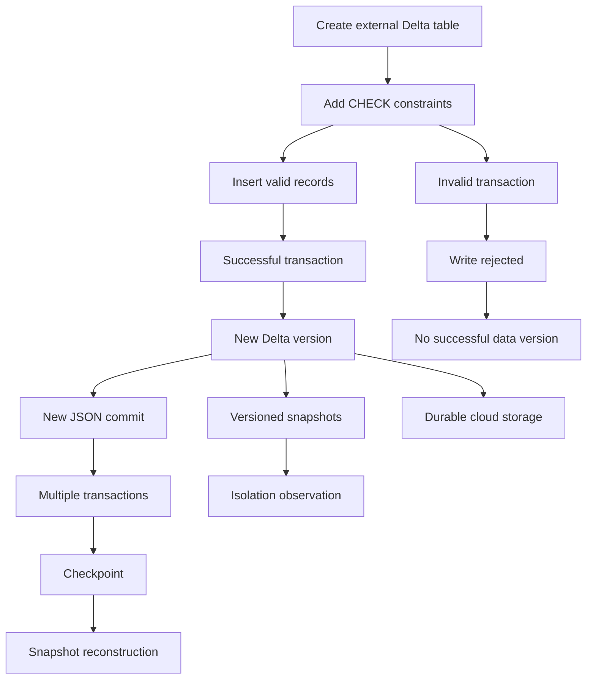
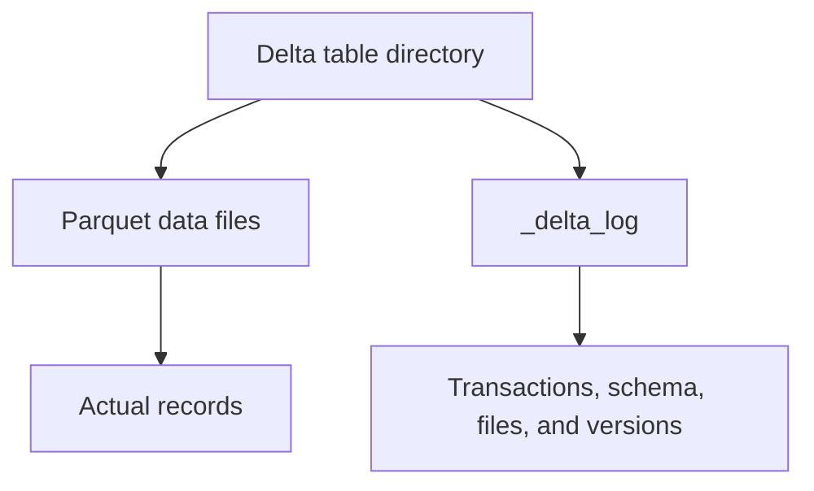
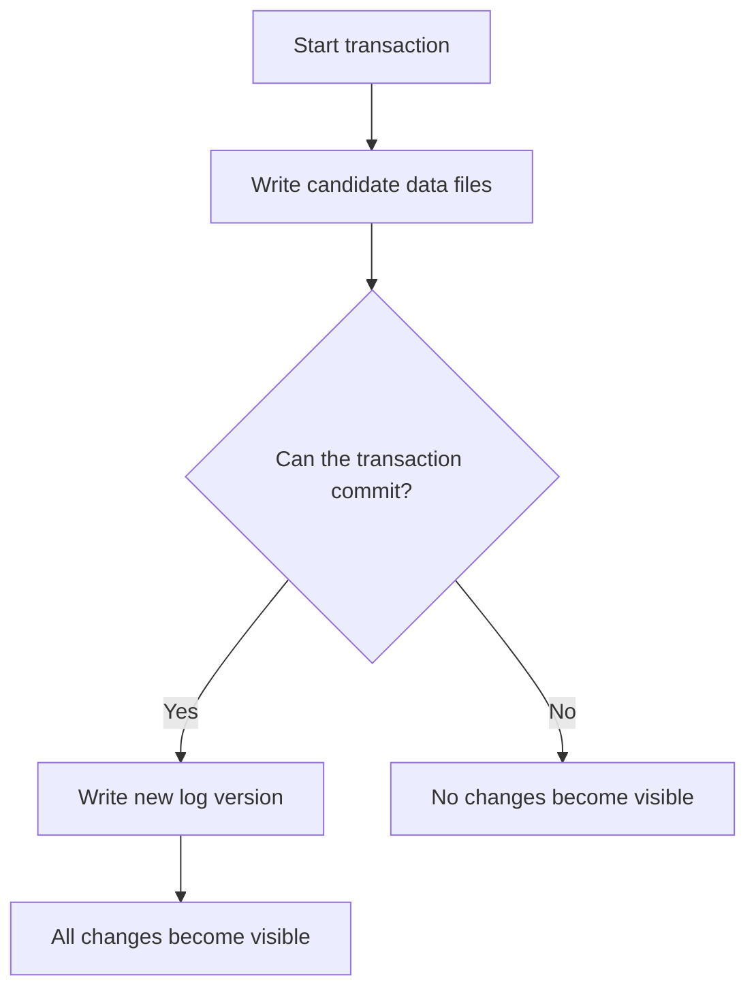
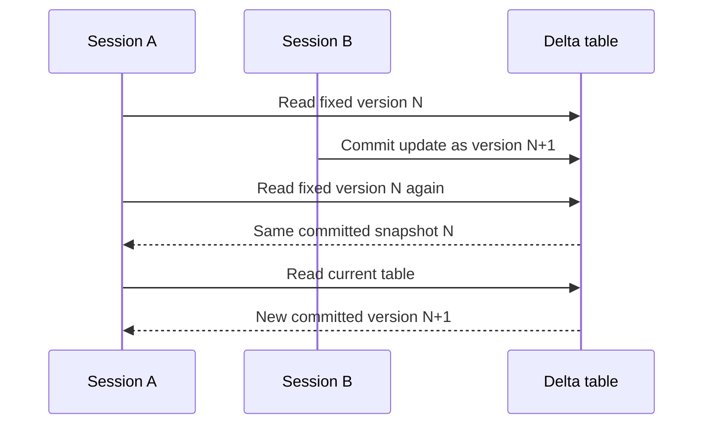
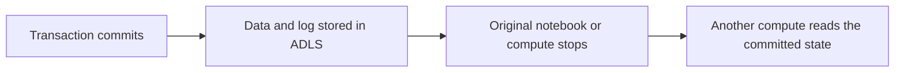
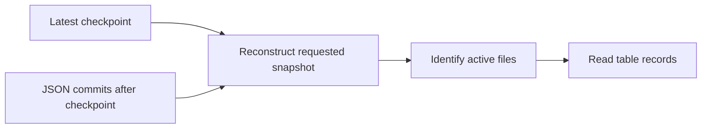

# Delta Lake ACID Transactions, Schema Enforcement, and Checkpoints

## Hands-on Session Guide

---

# 1. Session Objective

In this session, you will understand how Delta Lake makes data lake tables reliable.

You will:

- Create a fresh external Delta table
- Inspect Parquet files and the `_delta_log` directory
- Understand transactions and table versions
- Understand Atomicity, Consistency, Isolation, and Durability
- Add and test enforced `CHECK` constraints
- Observe schema enforcement during invalid writes
- Compare committed and failed operations in table history
- Create multiple Delta transactions
- Inspect numbered JSON commit files
- Look for Delta checkpoint files and `_last_checkpoint`
- Understand how Delta reconstructs the latest table snapshot
- Compare JSON commits, checkpoints, `OPTIMIZE`, and `VACUUM`

---

# 2. Complete Session Flow

```text
Create a fresh external Delta table
        ↓
Inspect Parquet files and _delta_log
        ↓
Add CHECK constraints
        ↓
Insert valid initial records
        ↓
Run an invalid multi-row INSERT
        ↓
Understand Atomicity
        ↓
Run invalid value and schema writes
        ↓
Understand Consistency and schema enforcement
        ↓
Create and compare table snapshots
        ↓
Understand Isolation
        ↓
Read a committed change from another session
        ↓
Understand Durability
        ↓
Perform multiple separate transactions
        ↓
Inspect JSON commit files
        ↓
Look for checkpoint files and _last_checkpoint
        ↓
Understand snapshot reconstruction
        ↓
Compare checkpoints, OPTIMIZE, and VACUUM
```

---

# 3. End-to-End Architecture



---

# 4. Suggested Time Plan

| Time | Activity |
|---:|---|
| 0–10 minutes | Create the table and inspect its physical structure |
| 10–22 minutes | Add constraints and insert valid data |
| 22–38 minutes | Demonstrate Atomicity and Consistency |
| 38–50 minutes | Demonstrate schema enforcement |
| 50–62 minutes | Demonstrate Isolation and Durability |
| 62–78 minutes | Generate separate Delta transactions |
| 78–87 minutes | Inspect checkpoints and snapshot reconstruction |
| 87–90 minutes | Compare checkpoint, `OPTIMIZE`, and `VACUUM` |

---

# 5. Objects Used

| Object | Name |
|---|---|
| Catalog | `training_catalog` |
| Schema | `delta_foundations_demo` |
| External Delta table | `orders_acid_checkpoint` |
| External path | `/delta_foundations/orders_acid_checkpoint` |

---

# 6. Table Columns

```text
order_id
customer_name
city
order_amount
order_status
updated_at
```

The table uses `order_id` as its business key in this POC.

---

# 7. Prerequisites

You need:

- Azure Databricks with Unity Catalog enabled
- A notebook that supports SQL and Python cells
- Serverless notebook compute or a Unity Catalog-compatible cluster
- An existing standard catalog
- An external location backed by ADLS Gen2
- A dedicated child directory for this POC
- Permission to create and modify tables
- Permission to read and write the external path

Typical Unity Catalog privileges include:

```text
USE CATALOG
USE SCHEMA
CREATE SCHEMA
CREATE TABLE
CREATE EXTERNAL TABLE
SELECT
MODIFY
READ FILES
WRITE FILES
```

The storage credential's managed identity must also have the required Azure Storage permissions.

---

# 8. Replace the Storage Values

The guide uses:

```text
abfss://<container>@<storage-account>.dfs.core.windows.net/delta_foundations/orders_acid_checkpoint
```

Replace:

```text
<container>
<storage-account>
```

Use a dedicated test directory. Do not use the root of an external location or a production table directory.

---

# Part A — Prepare a Clean Environment

# Task 1 — Select the Catalog

Run in a SQL cell:

```sql
USE CATALOG training_catalog;
```

Verify:

```sql
SELECT current_catalog() AS current_catalog;
```

Expected result:

```text
training_catalog
```

---

# Task 2 — Create and Select the Schema

```sql
CREATE SCHEMA IF NOT EXISTS
training_catalog.delta_foundations_demo
COMMENT 'Schema used for Delta ACID and checkpoint exercises';
```

```sql
USE SCHEMA delta_foundations_demo;
```

Verify:

```sql
SELECT
    current_catalog() AS current_catalog,
    current_schema() AS current_schema;
```

Expected result:

```text
training_catalog
delta_foundations_demo
```

---

# Task 3 — Remove an Earlier Table Registration

```sql
DROP TABLE IF EXISTS
training_catalog.delta_foundations_demo.orders_acid_checkpoint;
```

Because this is an external table, dropping the registration does not remove its physical files.

---

# Task 4 — Remove the Dedicated POC Directory

Run in a Python cell after replacing the path:

```python
table_path = (
    "abfss://<container>@<storage-account>."
    "dfs.core.windows.net/delta_foundations/"
    "orders_acid_checkpoint"
)

required_suffix = (
    "/delta_foundations/orders_acid_checkpoint"
)

if not table_path.endswith(required_suffix):
    raise ValueError(
        "The path does not match the dedicated POC directory."
    )

removed = dbutils.fs.rm(
    table_path,
    recurse=True,
)

print(
    f"Existing POC directory removed: {removed}"
)
```

This command is destructive. Run it only against the dedicated POC path.

---

# Part B — Create the Delta Table

# Task 5 — Create a Fresh External Delta Table

```sql
CREATE TABLE
training_catalog.delta_foundations_demo.orders_acid_checkpoint
(
    order_id       INT,
    customer_name  STRING,
    city           STRING,
    order_amount   DECIMAL(10,2),
    order_status   STRING,
    updated_at     TIMESTAMP
)
USING DELTA
LOCATION
'abfss://<container>@<storage-account>.dfs.core.windows.net/delta_foundations/orders_acid_checkpoint'
COMMENT 'External Delta table used for ACID, schema enforcement, and checkpoint exercises';
```

Because `LOCATION` is supplied, the table is external.

The storage format is still Delta.

---

# Task 6 — Inspect the Empty Table

```sql
DESCRIBE DETAIL
training_catalog.delta_foundations_demo.orders_acid_checkpoint;
```

Focus on:

```text
format
location
numFiles
sizeInBytes
minReaderVersion
minWriterVersion
tableFeatures
```

Inspect history:

```sql
DESCRIBE HISTORY
training_catalog.delta_foundations_demo.orders_acid_checkpoint;
```

A clean table normally starts at version `0`.

---

# Task 7 — Inspect the Physical Directory

Run in Python:

```python
root_entries = dbutils.fs.ls(
    table_path
)

display(
    root_entries
)
```

Look for:

```text
_delta_log
```

The empty table might not yet contain business-data Parquet files.

---

# Task 8 — Inspect `_delta_log`

```python
delta_log_path = (
    f"{table_path}/_delta_log"
)

log_entries = sorted(
    dbutils.fs.ls(delta_log_path),
    key=lambda entry: entry.name,
)

for entry in log_entries:
    print(
        entry.name,
        entry.size,
    )
```

You should see a numbered JSON commit such as:

```text
00000000000000000000.json
```

---

# 9. Parquet Files and the Transaction Log

A Delta table contains two important parts:

```text
Parquet data files
    → Store the actual table rows

_delta_log
    → Records table metadata, file actions, and versions
```



Delta does not treat every Parquet file in the directory as active data. It uses the transaction log to determine the files that belong to the requested table version.

---

# Part C — Add Schema and Business Rules

# 10. What Is Schema Enforcement?

Schema enforcement means Delta validates the incoming write against the target table structure.

During an insert or append, Delta checks that:

- Incoming columns exist in the target table
- Data types match or can be safely cast
- The write does not silently introduce an unknown structure

```text
Incoming write
        ↓
Compare with target schema
        ↓
Compatible?
   Yes          No
    ↓            ↓
Commit       Reject write
```

Schema enforcement protects the technical structure of the table.

---

# 11. What Is a CHECK Constraint?

A `CHECK` constraint is a rule that every written row must satisfy.

For this POC:

```text
order_amount must be greater than zero
```

and:

```text
order_status must be one of the approved values
```

A `CHECK` constraint is enforced for existing data when it is added and for future writes.

---

# Task 9 — Add a Positive Amount Constraint

```sql
ALTER TABLE
training_catalog.delta_foundations_demo.orders_acid_checkpoint
ADD CONSTRAINT positive_order_amount
CHECK
(
    order_amount > 0
);
```

---

# Task 10 — Add an Approved Status Constraint

```sql
ALTER TABLE
training_catalog.delta_foundations_demo.orders_acid_checkpoint
ADD CONSTRAINT valid_order_status
CHECK
(
    order_status IN
    (
        'PLACED',
        'SHIPPED',
        'DELIVERED',
        'CANCELLED',
        'RETURNED'
    )
);
```

Inspect the updated history:

```sql
DESCRIBE HISTORY
training_catalog.delta_foundations_demo.orders_acid_checkpoint;
```

Constraint additions are committed metadata changes and can create new table versions.

---

# Task 11 — Insert Valid Initial Records

```sql
INSERT INTO
training_catalog.delta_foundations_demo.orders_acid_checkpoint
VALUES
    (
        1001,
        'Aditi',
        'Pune',
        1250.00,
        'PLACED',
        TIMESTAMP '2026-08-01 09:00:00'
    ),
    (
        1002,
        'Rahul',
        'Mumbai',
        650.00,
        'PLACED',
        TIMESTAMP '2026-08-01 09:05:00'
    ),
    (
        1003,
        'Neha',
        'Bengaluru',
        2100.00,
        'SHIPPED',
        TIMESTAMP '2026-08-01 09:10:00'
    ),
    (
        1004,
        'Aman',
        'Pune',
        1800.00,
        'DELIVERED',
        TIMESTAMP '2026-08-01 09:15:00'
    ),
    (
        1005,
        'Priya',
        'Mumbai',
        3200.00,
        'CANCELLED',
        TIMESTAMP '2026-08-01 09:20:00'
    );
```

Verify:

```sql
SELECT *
FROM training_catalog.delta_foundations_demo.orders_acid_checkpoint
ORDER BY order_id;
```

```sql
SELECT COUNT(*) AS initial_count
FROM training_catalog.delta_foundations_demo.orders_acid_checkpoint;
```

Expected count:

```text
5
```

---

# Part D — Understand ACID

# 12. What Does ACID Mean?

ACID stands for:

```text
A → Atomicity
C → Consistency
I → Isolation
D → Durability
```

These properties make table operations reliable even when writes fail, multiple users work simultaneously, or compute stops.

---

# 13. Atomicity

## Meaning

Atomicity means:

> A transaction succeeds completely or fails completely.

There is no partial commit.

```text
All intended changes become visible
or
None of the changes become visible
```

Suppose one statement inserts two rows:

```text
Row 1 → Valid
Row 2 → Invalid
```

If both rows belong to the same transaction, Delta does not commit only the valid row. The complete statement fails.

---

# Task 12 — Demonstrate Atomicity

The first row is valid. The second row violates `positive_order_amount`.

```sql
INSERT INTO
training_catalog.delta_foundations_demo.orders_acid_checkpoint
VALUES
    (
        1101,
        'Valid Row',
        'Pune',
        500.00,
        'PLACED',
        current_timestamp()
    ),
    (
        1102,
        'Invalid Row',
        'Mumbai',
        -100.00,
        'PLACED',
        current_timestamp()
    );
```

This statement is expected to fail.

Check both IDs:

```sql
SELECT *
FROM training_catalog.delta_foundations_demo.orders_acid_checkpoint
WHERE order_id IN (1101, 1102);
```

Expected result:

```text
No rows
```

Check the total count:

```sql
SELECT COUNT(*) AS count_after_failed_insert
FROM training_catalog.delta_foundations_demo.orders_acid_checkpoint;
```

Expected count:

```text
5
```

Inspect history:

```sql
DESCRIBE HISTORY
training_catalog.delta_foundations_demo.orders_acid_checkpoint;
```

Expected observation:

```text
The failed INSERT does not create a successful data version.
```

---

# 14. How Delta Supports Atomicity

A simplified write flow is:

```text
Write new data files
        ↓
Prepare transaction actions
        ↓
Commit a new numbered log version
        ↓
Make all changes visible together
```

If the transaction-log commit does not succeed, the new files are not part of the table snapshot.



---

# 15. Consistency

## Meaning

Consistency means:

> A successful transaction moves the table from one valid state to another valid state.

The table must continue to follow its declared rules, such as:

- Column names
- Data types
- Enforced constraints
- Delta protocol requirements

Consistency does not mean Delta automatically knows every business rule. Rules must be defined through constraints or validation logic.

---

# Task 13 — Demonstrate Consistency with an Invalid Status

Check the current row:

```sql
SELECT *
FROM training_catalog.delta_foundations_demo.orders_acid_checkpoint
WHERE order_id = 1001;
```

Attempt an invalid update:

```sql
UPDATE
training_catalog.delta_foundations_demo.orders_acid_checkpoint
SET
    order_status = 'UNKNOWN',
    updated_at = current_timestamp()
WHERE order_id = 1001;
```

This command is expected to fail because `UNKNOWN` is not allowed.

Check the row again:

```sql
SELECT *
FROM training_catalog.delta_foundations_demo.orders_acid_checkpoint
WHERE order_id = 1001;
```

Expected observation:

```text
The earlier valid value remains unchanged.
```

Inspect history:

```sql
DESCRIBE HISTORY
training_catalog.delta_foundations_demo.orders_acid_checkpoint;
```

Expected observation:

```text
No successful version exists for the rejected update.
```

---

# 16. Atomicity and Consistency Together

The invalid multi-row insert demonstrates both concepts:

```text
Atomicity
    → Neither row is committed

Consistency
    → The invalid negative amount is not allowed into the table
```

---

# Part E — Schema Enforcement Exercises

# Task 14 — Attempt to Insert an Unknown Column

The target table does not contain `source_system`.

```sql
INSERT INTO
training_catalog.delta_foundations_demo.orders_acid_checkpoint
(
    order_id,
    customer_name,
    city,
    order_amount,
    order_status,
    updated_at,
    source_system
)
VALUES
(
    1201,
    'Unknown Column Test',
    'Pune',
    750.00,
    'PLACED',
    current_timestamp(),
    'APP'
);
```

This statement is expected to fail because `source_system` does not exist in the target schema.

Verify:

```sql
SELECT *
FROM training_catalog.delta_foundations_demo.orders_acid_checkpoint
WHERE order_id = 1201;
```

Expected result:

```text
No rows
```

---

# Task 15 — Attempt an Incompatible Data Type

Run in Python:

```python
from datetime import datetime

invalid_rows = [
    (
        "ORDER-1202",
        "Type Mismatch Test",
        "Mumbai",
        900.00,
        "PLACED",
        datetime.now(),
    )
]

invalid_df = spark.createDataFrame(
    invalid_rows,
    [
        "order_id",
        "customer_name",
        "city",
        "order_amount",
        "order_status",
        "updated_at",
    ],
)

(
    invalid_df.write
    .format("delta")
    .mode("append")
    .saveAsTable(
        "training_catalog."
        "delta_foundations_demo."
        "orders_acid_checkpoint"
    )
)
```

This write is expected to fail because the target expects `order_id INT`, while the source contains a non-numeric string.

Verify the row count:

```sql
SELECT COUNT(*) AS count_after_schema_tests
FROM training_catalog.delta_foundations_demo.orders_acid_checkpoint;
```

Expected count:

```text
5
```

---

# 17. Schema Enforcement Versus Schema Evolution

```text
Schema enforcement
    → Rejects unexpected or incompatible structures

Schema evolution
    → Intentionally changes the target schema
```

This session focuses on schema enforcement.

Schema evolution will be covered separately.

---

# 18. Isolation

## Meaning

Isolation means:

> Simultaneous operations do not expose partial or mixed table states.

Readers work with committed snapshots.

If another operation commits a new version, an existing historical version remains a stable snapshot.

Delta also performs conflict checks when simultaneous writers try to commit overlapping changes.

---

# Task 16 — Record the Current Version

```sql
DESCRIBE HISTORY
training_catalog.delta_foundations_demo.orders_acid_checkpoint;
```

Write down the latest version:

```text
version_before_isolation_update = ______
```

---

# Task 17 — Query a Fixed Snapshot

Replace the placeholder:

```sql
SELECT *
FROM training_catalog.delta_foundations_demo.orders_acid_checkpoint
VERSION AS OF <version_before_isolation_update>
WHERE order_id = 1002;
```

Expected value before the update:

```text
order_status = PLACED
order_amount = 650.00
```

---

# Task 18 — Commit a New Current Version

In another notebook tab or session, run:

```sql
UPDATE
training_catalog.delta_foundations_demo.orders_acid_checkpoint
SET
    order_amount = 700.00,
    order_status = 'SHIPPED',
    updated_at = current_timestamp()
WHERE order_id = 1002;
```

Query the current table:

```sql
SELECT *
FROM training_catalog.delta_foundations_demo.orders_acid_checkpoint
WHERE order_id = 1002;
```

Expected current values:

```text
order_status = SHIPPED
order_amount = 700.00
```

---

# Task 19 — Query the Fixed Snapshot Again

```sql
SELECT *
FROM training_catalog.delta_foundations_demo.orders_acid_checkpoint
VERSION AS OF <version_before_isolation_update>
WHERE order_id = 1002;
```

Expected older values:

```text
order_status = PLACED
order_amount = 650.00
```

This shows that the historical snapshot did not become a mixture of the old and new states.



---

# 19. Isolation and Concurrent Writers

The previous exercise demonstrates snapshot isolation conceptually.

For simultaneous writers, Delta uses commit-time checks. Conflicting writes can fail rather than silently overwrite each other or corrupt the table.

Exact conflict behaviour depends on:

- The operations being performed
- Whether the same files or rows are modified
- Isolation level
- Deletion vectors and row-level concurrency
- Databricks Runtime behaviour

---

# 20. Durability

## Meaning

Durability means:

> Once a transaction is successfully committed, its changes remain stored.

A committed change does not depend on the notebook or cluster remaining active.

Delta stores:

- Data files in cloud object storage
- Transaction-log commits in the table directory

---

# Task 20 — Demonstrate Durability

After the update to order `1002` commits:

1. Open another notebook or use another compatible compute.
2. Query the same table.
3. Confirm that the committed update is still present.

```sql
SELECT *
FROM training_catalog.delta_foundations_demo.orders_acid_checkpoint
WHERE order_id = 1002;
```

Inspect history:

```sql
DESCRIBE HISTORY
training_catalog.delta_foundations_demo.orders_acid_checkpoint;
```

Expected observation:

```text
The committed UPDATE remains available and recorded.
```



---

# 21. ACID Summary

| Property | Meaning | POC observation |
|---|---|---|
| Atomicity | Complete success or complete failure | Invalid two-row insert adds neither row |
| Consistency | Successful writes preserve declared rules | Constraints and schema reject invalid writes |
| Isolation | Readers observe committed snapshots | Old version remains stable after a new update |
| Durability | Committed changes remain stored | Another session reads the committed update |

---

# Part F — Generate Multiple Delta Transactions

# 22. Why Multiple Transactions Are Needed

Every successful table-changing transaction normally creates:

```text
One new table version
+
One numbered JSON commit
```

Several transactions make it easier to inspect:

- Version progression
- JSON commit files
- Automatic checkpoint creation

---

# Task 21 — Create Fifteen Separate Transactions

Run in Python:

```python
target_table = (
    "training_catalog."
    "delta_foundations_demo."
    "orders_acid_checkpoint"
)

cities = [
    "Pune",
    "Mumbai",
    "Bengaluru",
]

for transaction_number in range(1, 16):
    order_id = 2000 + transaction_number
    city = cities[
        (transaction_number - 1) % len(cities)
    ]
    amount = 500 + (transaction_number * 50)

    spark.sql(
        f"""
        INSERT INTO {target_table}
        VALUES
        (
            {order_id},
            'Checkpoint Customer {transaction_number}',
            '{city}',
            CAST({amount} AS DECIMAL(10,2)),
            'PLACED',
            current_timestamp()
        )
        """
    )

    print(
        f"Committed transaction {transaction_number}, "
        f"order_id {order_id}"
    )
```

Each `spark.sql()` call runs separately and is intended to create a separate Delta transaction.

---

# Task 22 — Verify the Final Count

```sql
SELECT COUNT(*) AS count_after_separate_transactions
FROM training_catalog.delta_foundations_demo.orders_acid_checkpoint;
```

Expected count:

```text
5 initial records
+
15 separately inserted records
=
20 records
```

The update to order `1002` changed values but did not change the count.

---

# Task 23 — Inspect Version History

```sql
DESCRIBE HISTORY
training_catalog.delta_foundations_demo.orders_acid_checkpoint;
```

Focus on:

```text
version
timestamp
operation
operationParameters
operationMetrics
```

The exact version numbers can differ because constraint additions and reruns also create commits.

---

# Part G — Delta Checkpoints

# 23. What Is a Delta Checkpoint?

A Delta checkpoint is a compact representation of the transaction-log state at a particular table version.

It summarizes information needed to reconstruct the table, including:

- Active data files
- Removed-file actions that still need tracking
- Schema
- Table properties
- Reader and writer protocol
- Partition metadata

A Delta checkpoint does not store the business rows in place of the table’s data files.

```text
Checkpoint
    → Describes table state

Parquet data files
    → Store actual records
```

A Delta checkpoint is also different from a Structured Streaming checkpoint.

---

# 24. Why Are Checkpoints Needed?

Suppose a table reaches version `10,000`.

Without a checkpoint, Delta might need to process a long sequence of JSON commits to understand the requested state.

```text
JSON 0
+
JSON 1
+
...
+
JSON 10,000
```

With a checkpoint at version `9,990`, Delta can start from the summarized state:

```text
Checkpoint 9,990
+
JSON 9,991 through 10,000
```

This reduces transaction-log replay during query planning.

---

# 25. When Does Checkpointing Occur?

Checkpoint creation is automatic.

It is not triggered by `VACUUM`.

A traditional reference point is around ten commits, but current Azure Databricks can dynamically choose checkpoint frequency based on workload and table state.

Therefore:

```text
Around ten commits
    → Useful reference point

Exactly ten commits
    → Not guaranteed
```

---

# Task 24 — List JSON and Checkpoint Files

Run in Python:

```python
log_entries_after_writes = sorted(
    dbutils.fs.ls(delta_log_path),
    key=lambda entry: entry.name,
)

json_entries = [
    entry
    for entry in log_entries_after_writes
    if entry.name.endswith(".json")
]

checkpoint_entries = [
    entry
    for entry in log_entries_after_writes
    if (
        "checkpoint" in entry.name
        or entry.name == "_last_checkpoint"
    )
]

print(
    f"JSON commit files found: {len(json_entries)}"
)

print(
    "Checkpoint-related entries found:",
    len(checkpoint_entries),
)

for entry in checkpoint_entries:
    print(entry.name)
```

Possible entries include:

```text
<number>.checkpoint.parquet
_last_checkpoint
```

Newer checkpoint formats can use additional sidecar files, so the physical layout can vary.

---

# Task 25 — Read `_last_checkpoint` When Available

```python
last_checkpoint_path = next(
    (
        entry.path
        for entry in log_entries_after_writes
        if entry.name == "_last_checkpoint"
    ),
    None,
)

if last_checkpoint_path:
    print(
        dbutils.fs.head(
            last_checkpoint_path,
            5000,
        )
    )
else:
    print(
        "No _last_checkpoint file was found. "
        "Checkpoint frequency is selected automatically."
    )
```

Do not manually modify `_last_checkpoint` or checkpoint files.

---

# 26. How Delta Reconstructs a Snapshot

Suppose:

```text
Latest checkpoint = version 10
Current version = version 17
```

Delta can reconstruct version `17` using:

```text
Checkpoint version 10
+
JSON commits 11 through 17
```



If no suitable checkpoint exists, Delta processes the required JSON commits.

---

# 27. Checkpoint and Old JSON Cleanup

Checkpoints and transaction-log retention are related to log maintenance.

Broadly:

```text
Transactions create JSON commits
        ↓
Delta automatically creates checkpoints
        ↓
Old JSON entries exceed log retention
        ↓
Eligible log entries can be cleaned asynchronously
```

This cleanup is not the same as `VACUUM`.

---

# Part H — Final Comparison

# 28. JSON Commit Versus Checkpoint

| Item | Purpose |
|---|---|
| Numbered JSON commit | Records the actions for one table version |
| Delta checkpoint | Summarizes accumulated transaction-log state |
| `_last_checkpoint` | Helps locate the most recent checkpoint |

---

# 29. Checkpoint Versus OPTIMIZE Versus VACUUM

| Feature | Main purpose | Mainly works with |
|---|---|---|
| Checkpoint | Speed up transaction-log state reconstruction | `_delta_log` metadata |
| `OPTIMIZE` | Compact active data files into a better layout | Active Parquet data files |
| `VACUUM` | Delete eligible unreferenced data files | Old physical data files |

```text
Checkpoint
    → Does not compact business data
    → Does not delete old data files

OPTIMIZE
    → Rewrites active data files
    → Does not immediately delete replaced files

VACUUM
    → Permanently deletes eligible unreferenced data files
    → Does not create checkpoints
```

---

# 30. Complete Mental Model

```text
Successful transaction
    → New Delta version
    → New numbered JSON commit
```

```text
Failed transaction
    → No successful data version
    → No partial table change
```

```text
Schema enforcement and constraints
    → Reject invalid table states
```

```text
Committed snapshots
    → Support isolation
```

```text
Cloud data files and transaction log
    → Provide durability
```

```text
Checkpoint
    → Summarizes accumulated transaction-log state
    → Speeds up snapshot reconstruction
```

---

# Part I — Observation Worksheet

# Task 26 — Record Your Results

| Observation | Value |
|---|---|
| Initial table version | |
| Version after constraints | |
| Initial row count | |
| Did the atomicity test insert any row? | |
| Did the invalid status update create a version? | |
| Did the unknown-column insert succeed? | |
| Version before the isolation update | |
| Current value of order `1002` | |
| Historical value of order `1002` | |
| Final row count | |
| Number of JSON commit files | |
| Was `_last_checkpoint` present? | |
| Latest checkpoint version | |

---

# Task 27 — Review Questions

1. What does Atomicity mean?
2. Why were neither of the two test rows inserted?
3. What does Consistency mean?
4. Does Delta automatically understand every business rule?
5. What is schema enforcement?
6. What does Isolation protect readers from seeing?
7. How did the fixed table version remain stable?
8. What does Durability mean?
9. What normally creates a new numbered JSON commit?
10. What does a checkpoint contain?
11. Does a checkpoint contain the actual order rows?
12. Is checkpoint creation automatic?
13. Does `VACUUM` create checkpoints?
14. What is the difference between a checkpoint and `OPTIMIZE`?
15. What is the difference between a checkpoint and `VACUUM`?

---

# Part J — Answers

# 31. What Does Atomicity Mean?

<details>
<summary>Show answer</summary>

A transaction succeeds completely or fails completely. Partial results are not committed.

</details>

---

# 32. Why Were Neither Test Rows Inserted?

<details>
<summary>Show answer</summary>

Both rows were part of one `INSERT` transaction. One row violated the positive amount constraint, so the complete transaction failed.

</details>

---

# 33. What Does Consistency Mean?

<details>
<summary>Show answer</summary>

A successful transaction moves the table from one valid state to another valid state while following declared schema and constraint rules.

</details>

---

# 34. Does Delta Know Every Business Rule Automatically?

<details>
<summary>Show answer</summary>

No. Business rules must be defined through constraints, validation logic, or pipeline checks.

</details>

---

# 35. What Is Schema Enforcement?

<details>
<summary>Show answer</summary>

It is the validation of incoming columns and data types against the target Delta table schema during a write.

</details>

---

# 36. What Does Isolation Protect Readers From?

<details>
<summary>Show answer</summary>

Readers do not see partial transactions or a mixed state containing some files from one version and some files from another version.

</details>

---

# 37. What Does Durability Mean?

<details>
<summary>Show answer</summary>

After a transaction commits, its data and log state remain stored independently of the notebook or compute that created it.

</details>

---

# 38. What Creates a Numbered JSON Commit?

<details>
<summary>Show answer</summary>

A successful Delta table transaction normally creates a new table version and a corresponding numbered JSON commit.

</details>

---

# 39. What Does a Checkpoint Contain?

<details>
<summary>Show answer</summary>

It summarizes transaction-log state, including active files, schema, table properties, protocol information, and required remove actions.

</details>

---

# 40. Does a Checkpoint Store Business Rows?

<details>
<summary>Show answer</summary>

No. The actual table records remain in the Delta table's Parquet data files.

</details>

---

# 41. Is Checkpoint Creation Automatic?

<details>
<summary>Show answer</summary>

Yes. Delta creates checkpoints automatically. Azure Databricks can dynamically choose the frequency.

</details>

---

# 42. Does VACUUM Create Checkpoints?

<details>
<summary>Show answer</summary>

No. `VACUUM` removes eligible unreferenced data files. Checkpointing is separate transaction-log maintenance.

</details>

---

# 43. Checkpoint Versus OPTIMIZE

<details>
<summary>Show answer</summary>

A checkpoint summarizes transaction-log state. `OPTIMIZE` rewrites active data files into a better physical layout.

</details>

---

# 44. Checkpoint Versus VACUUM

<details>
<summary>Show answer</summary>

A checkpoint helps reconstruct table state. `VACUUM` permanently deletes eligible old physical data files.

</details>

---

# Part K — Troubleshooting

# 45. Table Creation Fails

Check:

- Storage placeholders were replaced
- The external location covers the path
- The external location is writable
- The path is not already used by another table or volume
- The identity has `CREATE EXTERNAL TABLE`

---

# 46. Constraint Creation Fails

Check:

- The object is a Delta table
- The constraint name is not already used
- Existing data satisfies the constraint
- The current identity can modify the table

---

# 47. Invalid Tests Unexpectedly Succeed

Check:

- The constraints were added successfully
- Both atomicity rows were executed in one `INSERT` statement
- The unknown column was included in the target column list
- Schema evolution was not enabled for the DataFrame write

---

# 48. No Checkpoint Is Visible

This is not necessarily an error.

Possible reasons:

- Azure Databricks selected a different checkpoint frequency
- The table has not accumulated enough log activity
- A later commit might trigger a checkpoint
- The runtime uses a newer checkpoint layout
- The notebook was partially rerun

Continue by explaining the checkpoint concept even when the physical checkpoint does not appear during the POC.

---

# 49. Version Numbers Do Not Match

Run:

```sql
DESCRIBE HISTORY
training_catalog.delta_foundations_demo.orders_acid_checkpoint;
```

Use the actual versions.

Version numbers change when:

- Commands are rerun
- Additional constraints are added
- Extra writes are performed
- Metadata changes occur

---

# 50. Historical Query Fails

Check:

- The version exists
- The placeholder was replaced with a number
- Required transaction-log and data files still exist
- The correct three-part table name is used

---

# Part L — Cleanup

# Task 28 — Drop the Table Registration

```sql
DROP TABLE IF EXISTS
training_catalog.delta_foundations_demo.orders_acid_checkpoint;
```

The external files remain after the table is dropped.

---

# Task 29 — Delete the Dedicated Directory

```python
table_path = (
    "abfss://<container>@<storage-account>."
    "dfs.core.windows.net/delta_foundations/"
    "orders_acid_checkpoint"
)

required_suffix = (
    "/delta_foundations/orders_acid_checkpoint"
)

if not table_path.endswith(required_suffix):
    raise ValueError(
        "The path does not match the dedicated POC directory."
    )

removed = dbutils.fs.rm(
    table_path,
    recurse=True,
)

print(
    f"POC directory removed: {removed}"
)
```

---

# Task 30 — Drop the Schema

Run only when the schema does not contain required objects:

```sql
DROP SCHEMA IF EXISTS
training_catalog.delta_foundations_demo
CASCADE;
```

---

# Part M — Validation Status

# 51. Validation Performed

The code in this guide was reviewed against current Azure Databricks documentation.

The following checks were completed:

- Python blocks compile successfully
- SQL blocks have balanced quotes and parentheses
- Sample row counts were simulated
- Failed atomicity and consistency tests were verified logically
- The schema-enforcement test structures were reviewed
- Historical and current isolation states were simulated
- Markdown fences are balanced
- Mermaid diagrams are balanced
- Expandable answer sections are balanced

---

# 52. Workspace-Dependent Behaviour

The commands were not executed inside your Azure Databricks workspace.

Results can differ when:

- The catalog or schema name differs
- Storage placeholders are not replaced
- Required Unity Catalog privileges are missing
- The external location does not cover the path
- ADLS permissions are missing
- Old files remain from an earlier run
- Actual table versions differ
- Checkpoint frequency differs
- A newer checkpoint format is used
- Runtime concurrency features affect conflict behaviour

Run the complete guide once in a dedicated development schema using the same compute planned for delivery.

---

# 53. Official References

- [What are ACID guarantees on Azure Databricks?](https://learn.microsoft.com/en-us/azure/databricks/lakehouse/acid)
- [Schema enforcement](https://learn.microsoft.com/en-us/azure/databricks/tables/schema-enforcement)
- [ADD CONSTRAINT](https://learn.microsoft.com/en-us/azure/databricks/sql/language-manual/sql-ref-syntax-ddl-alter-table-add-constraint)
- [Isolation levels and write conflicts](https://learn.microsoft.com/en-us/azure/databricks/optimizations/isolation/)
- [DESCRIBE HISTORY](https://learn.microsoft.com/en-us/azure/databricks/sql/language-manual/delta-describe-history)
- [Checkpoint V2](https://learn.microsoft.com/en-us/azure/databricks/delta/checkpoint-v2)
- [What is Delta Lake in Azure Databricks?](https://learn.microsoft.com/en-us/azure/databricks/delta/)
