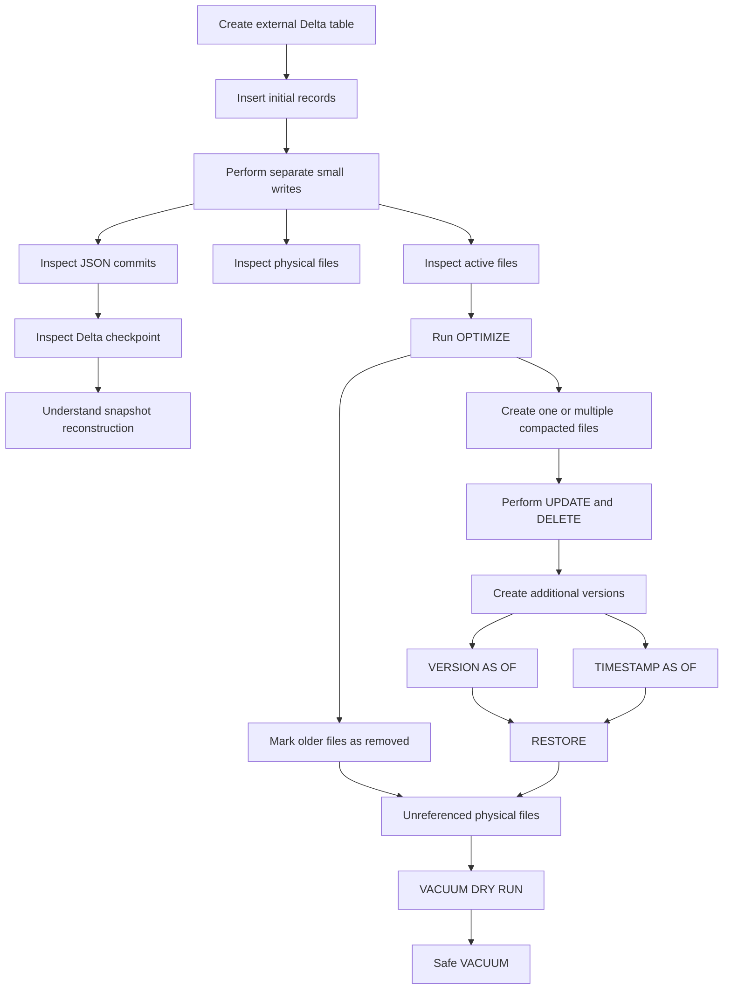
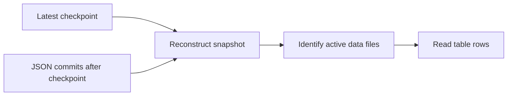
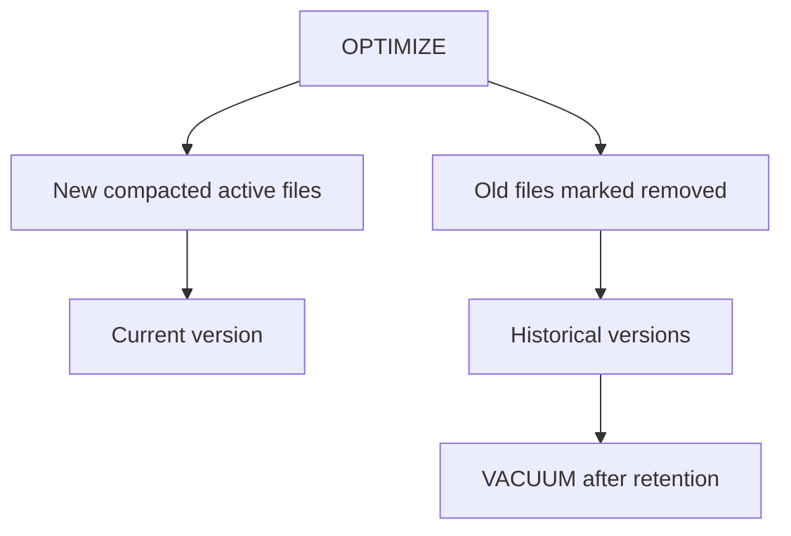

# Delta Lake Maintenance: Checkpoints, OPTIMIZE, Time Travel, RESTORE, and VACUUM

## Hands-on Session Guide

---

# 1. Session Objective

In this session, you will create a fresh external Delta table and examine how Delta Lake maintains data files and transaction history.

You will:

- Create a new external Delta table.
- Insert initial records.
- Perform multiple separate small writes.
- Compare active files with physical files.
- Inspect `_delta_log` JSON commits.
- Look for Delta checkpoint files.
- Understand how Delta reconstructs a table snapshot.
- Compact small files using `OPTIMIZE`.
- Understand why `OPTIMIZE` can create one or multiple output files.
- Perform `UPDATE` and `DELETE`.
- Query previous table versions.
- Query an earlier state by timestamp.
- Restore an older version.
- Compare data-file retention with transaction-log retention.
- Preview file deletion using `VACUUM DRY RUN`.
- Run `VACUUM` using the default safe retention.
- Understand how `VACUUM` affects historical versions.

---

# 2. Complete Flow

```text
Create a fresh external Delta table
        ↓
Insert the initial records
        ↓
Perform several separate small writes
        ↓
Inspect active files and physical files
        ↓
Inspect _delta_log JSON commits
        ↓
Introduce Delta checkpoints
        ↓
Explain how Delta reconstructs the latest snapshot
        ↓
Run OPTIMIZE
        ↓
Observe one or multiple compacted output files
        ↓
Compare active files before and after OPTIMIZE
        ↓
Explain why old physical files remain
        ↓
Perform UPDATE and DELETE
        ↓
Inspect new table versions
        ↓
Query previous versions and timestamps
        ↓
RESTORE an earlier version
        ↓
Explain data-file retention versus log retention
        ↓
Run VACUUM DRY RUN
        ↓
Run safe VACUUM
        ↓
Explain the effect on historical versions
```



---

# 3. Suggested Time Plan

| Time | Activity |
|---:|---|
| 0–8 minutes | Prepare the catalog, schema, and storage path |
| 8–18 minutes | Create the table and initial data |
| 18–30 minutes | Generate separate small transactions |
| 30–40 minutes | Inspect active files, physical files, and JSON commits |
| 40–48 minutes | Understand checkpoints and snapshot reconstruction |
| 48–60 minutes | Run and validate `OPTIMIZE` |
| 60–68 minutes | Perform `UPDATE` and `DELETE` |
| 68–78 minutes | Complete time-travel exercises |
| 78–84 minutes | Restore an earlier version |
| 84–90 minutes | Run `VACUUM DRY RUN`, safe `VACUUM`, and recap |

---

# 4. Objects Used

| Object | Name |
|---|---|
| Catalog | `training_catalog` |
| Schema | `delta_maintenance_demo` |
| External Delta table | `customer_orders` |
| External directory | `/delta_maintenance/customer_orders` |

The table contains:

```text
order_id
customer_name
city
product_category
order_amount
order_status
order_date
updated_at
```

The table is unpartitioned so that the file behaviour remains easy to observe.

---

# 5. Prerequisites

You need:

- Azure Databricks with Unity Catalog enabled.
- A notebook supporting SQL and Python cells.
- Serverless notebook compute or a Unity Catalog-compatible cluster.
- An external location backed by ADLS Gen2.
- Permission to create schemas and external tables.
- Read, write, and delete access to the dedicated directory.

Typical privileges include:

```text
USE CATALOG
USE SCHEMA
CREATE SCHEMA
CREATE TABLE
CREATE EXTERNAL TABLE
SELECT
MODIFY
READ FILES
WRITE FILES
```

Replace these placeholders:

```text
<container>
<storage-account>
```

Use a directory created only for this POC.

---

# Part A — Prepare a Clean Environment

# Task 1 — Select the Catalog

```sql
USE CATALOG training_catalog;
```

```sql
SELECT current_catalog() AS current_catalog;
```

---

# Task 2 — Create and Select the Schema

```sql
CREATE SCHEMA IF NOT EXISTS
training_catalog.delta_maintenance_demo
COMMENT 'Schema used for Delta maintenance exercises';
```

```sql
USE SCHEMA delta_maintenance_demo;
```

```sql
SELECT
    current_catalog() AS current_catalog,
    current_schema() AS current_schema;
```

---

# Task 3 — Remove an Earlier Table Registration

```sql
DROP TABLE IF EXISTS
training_catalog.delta_maintenance_demo.customer_orders;
```

Because the table is external, dropping the table does not remove its files.

---

# Task 4 — Remove the Dedicated Directory

Run after replacing the path:

```python
table_path = (
    "abfss://<container>@<storage-account>."
    "dfs.core.windows.net/delta_maintenance/"
    "customer_orders"
)

required_suffix = "/delta_maintenance/customer_orders"

if not table_path.endswith(required_suffix):
    raise ValueError(
        "The path does not match the dedicated POC directory."
    )

removed = dbutils.fs.rm(
    table_path,
    recurse=True,
)

print(f"Existing POC directory removed: {removed}")
```

This is destructive. Run it only against the dedicated POC directory.

---

# Part B — Create the Fresh Delta Table

# Task 5 — Create the External Table

```sql
CREATE TABLE
training_catalog.delta_maintenance_demo.customer_orders
(
    order_id          INT,
    customer_name     STRING,
    city              STRING,
    product_category  STRING,
    order_amount      DECIMAL(10,2),
    order_status      STRING,
    order_date        DATE,
    updated_at        TIMESTAMP
)
USING DELTA
LOCATION
'abfss://<container>@<storage-account>.dfs.core.windows.net/delta_maintenance/customer_orders'
COMMENT 'External Delta table used for checkpoint and maintenance exercises';
```

Because `LOCATION` is supplied, this is an external Delta table.

---

# Task 6 — Insert the Initial Eight Records

```sql
INSERT INTO
training_catalog.delta_maintenance_demo.customer_orders
VALUES
    (1001, 'Aditi', 'Pune', 'Electronics', 1250.00, 'PLACED',
     DATE '2026-07-20', TIMESTAMP '2026-07-20 09:00:00'),
    (1002, 'Rahul', 'Mumbai', 'Books', 650.00, 'PLACED',
     DATE '2026-07-20', TIMESTAMP '2026-07-20 09:05:00'),
    (1003, 'Neha', 'Bengaluru', 'Home', 2100.00, 'SHIPPED',
     DATE '2026-07-21', TIMESTAMP '2026-07-21 10:00:00'),
    (1004, 'Aman', 'Pune', 'Fitness', 1800.00, 'PLACED',
     DATE '2026-07-21', TIMESTAMP '2026-07-21 10:05:00'),
    (1005, 'Priya', 'Mumbai', 'Electronics', 3200.00, 'DELIVERED',
     DATE '2026-07-22', TIMESTAMP '2026-07-22 11:00:00'),
    (1006, 'Vikram', 'Bengaluru', 'Books', 950.00, 'CANCELLED',
     DATE '2026-07-22', TIMESTAMP '2026-07-22 11:05:00'),
    (1007, 'Meera', 'Pune', 'Home', 1450.00, 'PLACED',
     DATE '2026-07-23', TIMESTAMP '2026-07-23 12:00:00'),
    (1008, 'Karan', 'Mumbai', 'Fitness', 1100.00, 'PLACED',
     DATE '2026-07-23', TIMESTAMP '2026-07-23 12:05:00');
```

```sql
SELECT *
FROM training_catalog.delta_maintenance_demo.customer_orders
ORDER BY order_id;
```

```sql
SELECT COUNT(*) AS initial_count
FROM training_catalog.delta_maintenance_demo.customer_orders;
```

Expected count:

```text
8
```

---

# Task 7 — Inspect Initial History

```sql
DESCRIBE HISTORY
training_catalog.delta_maintenance_demo.customer_orders;
```

A clean run normally starts with:

```text
Version 0 → Table creation
Version 1 → Initial insert
```

Use the actual history output as the source of truth.

---

# Part C — Generate Separate Small Transactions

# 6. Why Separate Writes Are Used

Each separate successful write normally creates:

```text
One transaction
    ↓
One new Delta version
    ↓
One numbered JSON commit
```

Several small writes also make the small-file problem easier to observe.

---

# Task 8 — Run Twelve Separate Writes

```python
target_table = (
    "training_catalog."
    "delta_maintenance_demo."
    "customer_orders"
)

cities = [
    "Pune",
    "Mumbai",
    "Bengaluru",
]

categories = [
    "Books",
    "Home",
    "Fitness",
    "Electronics",
]

for batch_number in range(1, 13):
    order_id = 2000 + batch_number
    city = cities[
        (batch_number - 1) % len(cities)
    ]
    category = categories[
        (batch_number - 1) % len(categories)
    ]
    amount = 500 + (batch_number * 100)

    spark.sql(
        f"""
        INSERT INTO {target_table}
        VALUES
        (
            {order_id},
            'Checkpoint Customer {batch_number}',
            '{city}',
            '{category}',
            CAST({amount} AS DECIMAL(10,2)),
            'PLACED',
            current_date(),
            current_timestamp()
        )
        """
    )

    print(
        f"Committed batch {batch_number}, "
        f"order_id {order_id}"
    )
```

Each loop iteration calls `spark.sql` separately and is intended to create a separate transaction.

---

# Task 9 — Verify the Count and History

```sql
SELECT COUNT(*) AS rows_after_small_writes
FROM training_catalog.delta_maintenance_demo.customer_orders;
```

Expected:

```text
8 + 12 = 20 rows
```

```sql
DESCRIBE HISTORY
training_catalog.delta_maintenance_demo.customer_orders;
```

A clean run will normally reach approximately version `13`, although actual versions can differ.

---

# Part D — Inspect Active and Physical Files

# Task 10 — Inspect Active Files

```sql
DESCRIBE DETAIL
training_catalog.delta_maintenance_demo.customer_orders;
```

Record:

| Metric | Before `OPTIMIZE` |
|---|---:|
| `numFiles` | |
| `sizeInBytes` | |

`numFiles` represents files active in the current snapshot.

---

# Task 11 — Count Physical Parquet Files

```python
root_entries_before = dbutils.fs.ls(
    table_path
)

physical_parquet_before = [
    entry
    for entry in root_entries_before
    if entry.name.endswith(".parquet")
]

print(
    "Physical Parquet files before OPTIMIZE:",
    len(physical_parquet_before),
)

display(root_entries_before)
```

Understand the difference:

```text
DESCRIBE DETAIL numFiles
    → Active files in the current snapshot

dbutils.fs.ls(table_path)
    → Physical files currently present in storage
```

---

# Part E — Inspect `_delta_log`

# Task 12 — List Log Files

```python
delta_log_path = f"{table_path}/_delta_log"

log_entries = sorted(
    dbutils.fs.ls(delta_log_path),
    key=lambda entry: entry.name,
)

for entry in log_entries:
    print(
        entry.name,
        entry.size,
    )
```

Look for numbered files such as:

```text
00000000000000000000.json
00000000000000000001.json
00000000000000000002.json
```

---

# Task 13 — Separate JSON and Checkpoint Entries

```python
json_entries = [
    entry
    for entry in log_entries
    if entry.name.endswith(".json")
]

checkpoint_entries = [
    entry
    for entry in log_entries
    if (
        "checkpoint" in entry.name
        or entry.name == "_last_checkpoint"
    )
]

print(
    f"JSON commit files found: "
    f"{len(json_entries)}"
)

print(
    f"Checkpoint-related entries found: "
    f"{len(checkpoint_entries)}"
)

for entry in checkpoint_entries:
    print(entry.name)
```

Checkpoint frequency is automatically selected. A checkpoint may appear, but it is not guaranteed at an exact version.

---

# Task 14 — Read `_last_checkpoint` When Present

```python
last_checkpoint_path = next(
    (
        entry.path
        for entry in log_entries
        if entry.name == "_last_checkpoint"
    ),
    None,
)

if last_checkpoint_path:
    print(
        dbutils.fs.head(
            last_checkpoint_path,
            5000,
        )
    )
else:
    print(
        "No _last_checkpoint file was found. "
        "Checkpoint frequency is selected automatically."
    )
```

Do not edit `_last_checkpoint`.

---

# Part F — Understand Delta Checkpoints

# 7. What Is a Delta Checkpoint?

A Delta checkpoint is a compact representation of the transaction-log state at a particular table version.

It can summarize:

- Active data files
- Removed-file actions that must still be tracked
- Table schema
- Table properties
- Protocol information
- Partition metadata

It does not contain the table’s business rows instead of the data files.

```text
Checkpoint
    → Describes transaction-log state

Parquet data files
    → Store the actual rows
```

---

# 8. Why Checkpoints Are Needed

Without checkpoints, a reader could need to replay every JSON commit from version `0`.

With a checkpoint:

```text
Checkpoint at version 10
+
JSON versions 11, 12, and 13
=
Version 13 snapshot
```



Checkpointing is automatic and is not performed by `VACUUM`.

Around ten commits is a traditional reference point, but Azure Databricks can dynamically choose another frequency.

---

# Part G — Run OPTIMIZE

# 9. What OPTIMIZE Does

Basic `OPTIMIZE` performs bin-packing for a compatible Delta table.

It does not guarantee one output file.

```text
Many small active files
    ↓
Group data into suitable size bins
    ↓
Create one or multiple compacted output files
```

Output count depends on:

- Total data size
- Target file size
- Existing file sizes
- Data distribution
- Partition boundaries
- Runtime behaviour

---

# Task 15 — Record the State Before OPTIMIZE

```sql
DESCRIBE DETAIL
training_catalog.delta_maintenance_demo.customer_orders;
```

```sql
SELECT COUNT(*) AS count_before_optimize
FROM training_catalog.delta_maintenance_demo.customer_orders;
```

Expected count:

```text
20
```

---

# Task 16 — Run OPTIMIZE

```sql
OPTIMIZE
training_catalog.delta_maintenance_demo.customer_orders;
```

Review the returned metrics, including file counts when available.

---

# Task 17 — Validate the Result

```sql
SELECT COUNT(*) AS count_after_optimize
FROM training_catalog.delta_maintenance_demo.customer_orders;
```

Expected:

```text
20
```

```sql
DESCRIBE DETAIL
training_catalog.delta_maintenance_demo.customer_orders;
```

Complete:

| Metric | Before | After |
|---|---:|---:|
| `numFiles` | | |
| `sizeInBytes` | | |
| Row count | 20 | 20 |

---

# Task 18 — Count Physical Files Again

```python
root_entries_after_optimize = dbutils.fs.ls(
    table_path
)

physical_parquet_after_optimize = [
    entry
    for entry in root_entries_after_optimize
    if entry.name.endswith(".parquet")
]

print(
    "Physical Parquet files after OPTIMIZE:",
    len(physical_parquet_after_optimize),
)

display(root_entries_after_optimize)
```

The physical file count might remain high even when active file count decreases.

---

# 10. Why Old Files Remain

`OPTIMIZE`:

1. Reads smaller active files.
2. Writes one or multiple compacted files.
3. Adds the new files to a new version.
4. Marks old files as removed.

It does not immediately delete the old files because earlier versions can still need them.



---

# Task 19 — Inspect the OPTIMIZE Version

```sql
DESCRIBE HISTORY
training_catalog.delta_maintenance_demo.customer_orders;
```

Look for:

```text
operation = OPTIMIZE
```

---

# Part H — Create UPDATE and DELETE Versions

# Task 20 — Record the Version Before UPDATE

```sql
DESCRIBE HISTORY
training_catalog.delta_maintenance_demo.customer_orders;
```

Write:

```text
version_before_update = ______
```

---

# Task 21 — Update Order 1001

```sql
UPDATE
training_catalog.delta_maintenance_demo.customer_orders
SET
    order_amount = 1350.00,
    order_status = 'SHIPPED',
    updated_at = current_timestamp()
WHERE order_id = 1001;
```

```sql
SELECT *
FROM training_catalog.delta_maintenance_demo.customer_orders
WHERE order_id = 1001;
```

---

# Task 22 — Record the Version Before DELETE

```sql
DESCRIBE HISTORY
training_catalog.delta_maintenance_demo.customer_orders;
```

Write:

```text
version_before_delete = ______
```

---

# Task 23 — Delete Order 1003

```sql
DELETE FROM
training_catalog.delta_maintenance_demo.customer_orders
WHERE order_id = 1003;
```

```sql
SELECT COUNT(*) AS count_after_delete
FROM training_catalog.delta_maintenance_demo.customer_orders;
```

Expected:

```text
19
```

```sql
DESCRIBE HISTORY
training_catalog.delta_maintenance_demo.customer_orders;
```

---

# Part I — Time Travel

Time travel requires both:

```text
Historical transaction-log information
+
Historical data files used by the requested version
```

---

# Task 24 — Query Before the UPDATE

Replace the placeholder:

```sql
SELECT *
FROM training_catalog.delta_maintenance_demo.customer_orders
VERSION AS OF <version_before_update>
WHERE order_id = 1001;
```

Expected older values:

```text
order_amount = 1250.00
order_status = PLACED
```

---

# Task 25 — Query the Deleted Record

```sql
SELECT *
FROM training_catalog.delta_maintenance_demo.customer_orders
VERSION AS OF <version_before_delete>
WHERE order_id = 1003;
```

Expected:

```text
One row
```

---

# Task 26 — Query by Timestamp

```sql
DESCRIBE HISTORY
training_catalog.delta_maintenance_demo.customer_orders;
```

Copy the timestamp of the version before delete and run:

```sql
SELECT *
FROM training_catalog.delta_maintenance_demo.customer_orders
TIMESTAMP AS OF '<timestamp_from_history>'
WHERE order_id = 1003;
```

Use the actual timestamp from history.

---

# Task 27 — Compare Counts

```sql
SELECT
    'before_delete' AS table_state,
    COUNT(*) AS row_count
FROM training_catalog.delta_maintenance_demo.customer_orders
VERSION AS OF <version_before_delete>

UNION ALL

SELECT
    'current',
    COUNT(*)
FROM training_catalog.delta_maintenance_demo.customer_orders;
```

Expected:

| State | Count |
|---|---:|
| Before delete | 20 |
| Current | 19 |

---

# Part J — RESTORE

`VERSION AS OF` only reads an older state.

`RESTORE` creates a new current version matching an earlier state.

---

# Task 28 — Restore the Version Before DELETE

```sql
RESTORE TABLE
training_catalog.delta_maintenance_demo.customer_orders
TO VERSION AS OF <version_before_delete>;
```

---

# Task 29 — Validate RESTORE

```sql
SELECT *
FROM training_catalog.delta_maintenance_demo.customer_orders
WHERE order_id = 1003;
```

```sql
SELECT COUNT(*) AS count_after_restore
FROM training_catalog.delta_maintenance_demo.customer_orders;
```

Expected:

```text
20
```

```sql
DESCRIBE HISTORY
training_catalog.delta_maintenance_demo.customer_orders;
```

Look for:

```text
operation = RESTORE
```

---

# Part K — Data Retention and Log Retention

Delta maintains two separate lifecycles.

| Item | Main control | Normal default |
|---|---|---:|
| Removed Parquet files | `delta.deletedFileRetentionDuration` | 7 days |
| Transaction-log history | `delta.logRetentionDuration` | 30 days |

---

# 11. Data-File Lifecycle

When a file is replaced:

```text
Old file
    → Marked removed in the log
    → Kept physically for historical versions
    → Eligible for VACUUM after retention
```

The retention age is based on when the file was logically removed.

---

# 12. Transaction-Log Lifecycle

JSON commits and checkpoints are stored in `_delta_log`.

Old log entries are cleaned separately according to log retention and checkpoint maintenance.

`VACUUM` does not delete `_delta_log` JSON commits.

---

# Task 30 — Inspect Table Properties

```sql
SHOW TBLPROPERTIES
training_catalog.delta_maintenance_demo.customer_orders;
```

Look for:

```text
delta.deletedFileRetentionDuration
delta.logRetentionDuration
```

Defaults might not appear when they have not been explicitly assigned as table properties.

---

# 13. Example: Current Version 21, Historical Version 3

Assume:

```text
Version 3 uses file_A.parquet
Version 4 replaces file_A.parquet
Current version is 21
```

After version 4:

```text
file_A.parquet
    → Not active in the current snapshot
    → Still physically present
    → Still required by version 3
```

After it remains removed longer than the data-file retention:

```text
VACUUM can delete file_A.parquet
```

The version 3 JSON history may still exist, but querying version 3 can fail because the required data file is gone.

Old JSON commits are cleaned through a separate log-retention and checkpoint process.

---

# Part L — VACUUM

# Task 31 — Preview Eligible Files

```sql
VACUUM
training_catalog.delta_maintenance_demo.customer_orders
DRY RUN;
```

Because all files were created recently, the expected result is normally:

```text
No files are old enough to delete
```

---

# Task 32 — Run Safe VACUUM

```sql
VACUUM
training_catalog.delta_maintenance_demo.customer_orders;
```

Do not reduce retention or disable the retention safety check during this POC.

---

# Task 33 — Validate the Current Table

```sql
SELECT COUNT(*) AS count_after_vacuum
FROM training_catalog.delta_maintenance_demo.customer_orders;
```

Expected:

```text
20
```

---

# Task 34 — Recheck Recent Time Travel

```sql
SELECT *
FROM training_catalog.delta_maintenance_demo.customer_orders
VERSION AS OF <version_before_delete>
WHERE order_id = 1003;
```

Because safe `VACUUM` uses the default retention and the files are recent, this version should normally remain readable.

---

# 14. Effect on Historical Versions

```text
Historical version needs old file
    ↓
Old file is still within retention
    ↓
Time travel works
```

```text
Historical version needs old file
    ↓
Old file exceeds retention
    ↓
VACUUM deletes it
    ↓
Time-travel query can fail
```

The transaction history can temporarily show a version even when a required data file has been deleted.

---

# Part M — Final Comparison

| Feature | Purpose |
|---|---|
| JSON commit | Records actions for one Delta transaction |
| Delta checkpoint | Summarizes log state at a particular version |
| `OPTIMIZE` | Rewrites active files into a better layout |
| `VERSION AS OF` | Reads an older version |
| `TIMESTAMP AS OF` | Reads an older state by time |
| `RESTORE` | Makes an older state the new current version |
| `VACUUM` | Deletes eligible old physical data files |
| Log cleanup | Cleans eligible old log entries separately |

---

# 15. Final Mental Model

```text
Small writes
    → Multiple Parquet files
    → Multiple JSON commits
```

```text
Checkpoint
    → Compact transaction-log snapshot
    → Faster snapshot reconstruction
```

```text
OPTIMIZE
    → One or multiple compacted active files
    → Old files remain temporarily
```

```text
Time travel
    → Historical log state
    + historical data files
```

```text
RESTORE
    → New current version from an older state
```

```text
VACUUM
    → Permanent deletion of eligible unreferenced data files
```

---

# Part N — Observation Worksheet

| Observation | Value |
|---|---|
| Initial count | |
| Count after 12 writes | |
| Number of JSON commits | |
| Was `_last_checkpoint` present? | |
| Latest checkpoint version | |
| Active files before `OPTIMIZE` | |
| Physical files before `OPTIMIZE` | |
| Active files after `OPTIMIZE` | |
| Physical files after `OPTIMIZE` | |
| Version before `UPDATE` | |
| Version before `DELETE` | |
| Count after `DELETE` | |
| Count after `RESTORE` | |
| Files reported by `VACUUM DRY RUN` | |

---

# Part O — Review Questions

1. Why does a successful transaction normally create a JSON commit?
2. Why might a checkpoint not appear exactly at version 10?
3. Does a Delta checkpoint store the table’s actual rows?
4. Why can `OPTIMIZE` create more than one output file?
5. Why might physical file count remain high after `OPTIMIZE`?
6. What two components are required for time travel?
7. What is the difference between time travel and `RESTORE`?
8. Does `VACUUM` delete old JSON commits?
9. When does an old data file become eligible for `VACUUM`?
10. Why can history show a version that cannot be queried?

---

# Part P — Answers

<details>
<summary>1. Why does a transaction create a JSON commit?</summary>

A successful transaction creates a new Delta table version. The numbered JSON commit records the actions that produced that version.

</details>

<details>
<summary>2. Why is version 10 not guaranteed?</summary>

Around ten commits is a traditional reference point. Azure Databricks can dynamically choose checkpoint frequency based on table state, log activity, and workload.

</details>

<details>
<summary>3. Does a checkpoint store the table rows?</summary>

No. It summarizes transaction-log state. The actual rows remain in the table's Parquet data files.

</details>

<details>
<summary>4. Why can OPTIMIZE create multiple files?</summary>

It groups data into suitable size bins. When the compacted data does not fit into one target-sized file, it creates multiple files.

</details>

<details>
<summary>5. Why do old physical files remain?</summary>

They are marked removed but retained so earlier versions can still reference them.

</details>

<details>
<summary>6. What does time travel require?</summary>

It requires historical transaction-log information and the historical data files needed by the requested version.

</details>

<details>
<summary>7. VERSION AS OF versus RESTORE</summary>

`VERSION AS OF` reads an older snapshot. `RESTORE` creates a new current version matching an older snapshot.

</details>

<details>
<summary>8. Does VACUUM delete JSON commits?</summary>

No. `VACUUM` removes eligible unreferenced data files. Old log entries are cleaned separately.

</details>

<details>
<summary>9. When is a data file eligible?</summary>

After it is no longer referenced by the current table state and has remained logically removed longer than the deleted-file retention period.

</details>

<details>
<summary>10. Why can a visible version fail?</summary>

Its log history might remain, while one or more required historical data files have already been removed by `VACUUM`.

</details>

---

# Part Q — Troubleshooting

## No checkpoint is visible

This is not an error. Checkpoint frequency is automatic and can differ. Continue with the conceptual explanation.

## `OPTIMIZE` does not reduce active files

The table may already have suitable files, automatic optimizations may have helped, or the data set may be too small. Confirm that the row count remains unchanged and inspect the returned metrics.

## Time-travel version is incorrect

Run:

```sql
DESCRIBE HISTORY
training_catalog.delta_maintenance_demo.customer_orders;
```

Use the actual version.

## `RESTORE` fails

Check that the version exists and that its required data files have not been removed.

## `VACUUM DRY RUN` returns no files

This is expected for a new table because the default deleted-file retention is seven days.

---

# Part R — Cleanup

# Task 35 — Drop the Table

```sql
DROP TABLE IF EXISTS
training_catalog.delta_maintenance_demo.customer_orders;
```

---

# Task 36 — Delete the Dedicated Directory

```python
table_path = (
    "abfss://<container>@<storage-account>."
    "dfs.core.windows.net/delta_maintenance/"
    "customer_orders"
)

required_suffix = "/delta_maintenance/customer_orders"

if not table_path.endswith(required_suffix):
    raise ValueError(
        "The path does not match the dedicated POC directory."
    )

removed = dbutils.fs.rm(
    table_path,
    recurse=True,
)

print(f"POC directory removed: {removed}")
```

---

# Task 37 — Drop the Schema

Run only when the schema contains no required objects:

```sql
DROP SCHEMA IF EXISTS
training_catalog.delta_maintenance_demo
CASCADE;
```

---

# 16. Validation Status

The code blocks in this guide were statically checked for:

- Python syntax
- Balanced SQL strings and parentheses
- Expected sample row counts
- `UPDATE`, `DELETE`, time-travel, and `RESTORE` states
- Balanced Markdown fences
- Balanced Mermaid blocks

The commands were not executed in your Azure Databricks workspace. Exact file counts, checkpoint versions, table versions, permissions, and runtime-dependent behaviour must be verified in a dedicated development environment.

---

# 17. Official References

- [Optimize data file layout](https://learn.microsoft.com/en-us/azure/databricks/delta/optimize)
- [Best practices for Delta Lake](https://learn.microsoft.com/en-us/azure/databricks/delta/best-practices)
- [Work with table history and time travel](https://learn.microsoft.com/en-us/azure/databricks/delta/history)
- [RESTORE](https://learn.microsoft.com/en-us/azure/databricks/sql/language-manual/delta-restore)
- [VACUUM](https://learn.microsoft.com/en-us/azure/databricks/sql/language-manual/delta-vacuum)
- [Remove unused data files with VACUUM](https://learn.microsoft.com/en-us/azure/databricks/tables/operations/vacuum)
- [Delta table properties](https://learn.microsoft.com/en-us/azure/databricks/delta/table-properties)
