# Delta Lake Transaction Log, ACID, Time Travel, and MERGE

## 1.5-Hour Hands-on Guide

---

# 1. What You Will Build

In this POC, you will create one external Delta table and use it to understand:

- Parquet data files
- The `_delta_log` directory
- Delta table versions
- `DESCRIBE DETAIL`
- `DESCRIBE HISTORY`
- Basic time travel
- ACID transactions
- `INSERT`
- `UPDATE`
- `DELETE`
- Incremental upserts using `MERGE`
- Safe rerun behaviour

The table represents a cleaned silver-layer order table:

```text
training_catalog.session_demo.delta_orders_demo
```

---

# 2. Complete Workflow

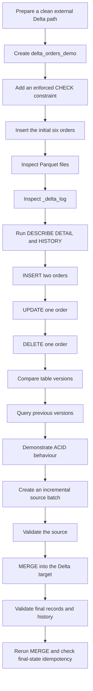

---

# 3. Main Learning Path

```text
Parquet files
    +
_delta_log
    =
Delta table
```

```text
Successful data change
    ↓
New transaction-log commit
    ↓
New table version
```

```text
Incremental source batch
    ↓
MERGE decision
    ↓
Update, insert, or delete
```

---

# 4. Time Plan

| Time | Activity |
|---:|---|
| 0–8 minutes | Connect with the previous session and prepare the clean path |
| 8–18 minutes | Create the Delta table, constraint, and initial data |
| 18–30 minutes | Inspect Parquet files and `_delta_log` |
| 30–38 minutes | Use `DESCRIBE DETAIL` and `DESCRIBE HISTORY` |
| 38–50 minutes | Perform `INSERT`, `UPDATE`, and `DELETE` |
| 50–58 minutes | Query previous versions with time travel |
| 58–72 minutes | Demonstrate atomicity, consistency, isolation, and durability |
| 72–80 minutes | Create and validate the incremental source batch |
| 80–88 minutes | Run `MERGE` and validate results |
| 88–90 minutes | Rerun the merge and recap |

---

# 5. Objects Used

| Object | Name |
|---|---|
| Catalog | `training_catalog` |
| Schema | `session_demo` |
| Delta target table | `delta_orders_demo` |
| Incremental temporary view | `incremental_orders` |
| External table path | `/delta_session/delta_orders_demo` |

---

# 6. Table Structure

The target table contains:

```text
order_id
customer_name
city
order_amount
order_status
updated_at
```

The business key is:

```text
order_id
```

The POC does not create a primary key because primary keys in Unity Catalog are informational and are not used here for data enforcement.

The `MERGE` condition uses `order_id` as the matching key.

---

# 7. Prerequisites

You need:

- An Azure Databricks workspace with Unity Catalog enabled
- A notebook attached to serverless notebook compute or a Unity Catalog-compatible cluster
- SQL and Python cell support
- Databricks Runtime 13.3 LTS or above
- An existing standard catalog
- An existing schema, or permission to create one
- An external location backed by ADLS Gen2
- A dedicated child directory for this POC
- Permission to create and modify tables
- Permission to create an external table
- Permission to read and write the external path

Typical Unity Catalog privileges include:

```text
USE CATALOG
USE SCHEMA
CREATE TABLE
CREATE EXTERNAL TABLE
READ FILES
WRITE FILES
SELECT
MODIFY
```

The storage credential's managed identity must also have sufficient Azure Storage access.

---

# 8. Values You Must Replace

The guide uses:

```text
training_catalog
session_demo
```

The external table path is shown as:

```text
abfss://<container>@<storage-account>.dfs.core.windows.net/delta_session/delta_orders_demo
```

Replace:

```text
<container>
<storage-account>
```

Example format:

```text
abfss://training@companylake.dfs.core.windows.net/delta_session/delta_orders_demo
```

Use a directory created only for this POC.

Do not point the cleanup command at a shared or production location.

---

# Part A — Prepare a Clean Environment

# 9. Select the Namespace

Run in a SQL cell:

```sql
USE CATALOG training_catalog;
```

Create the schema when required:

```sql
CREATE SCHEMA IF NOT EXISTS training_catalog.session_demo
COMMENT 'Schema used for Delta Lake transaction demonstrations';
```

Select it:

```sql
USE SCHEMA session_demo;
```

Confirm the active namespace:

```sql
SELECT
    current_catalog() AS current_catalog,
    current_schema() AS current_schema;
```

Expected result:

```text
training_catalog
session_demo
```

---

# 10. Drop an Earlier Table Registration

Run:

```sql
DROP TABLE IF EXISTS
training_catalog.session_demo.delta_orders_demo;
```

This removes an earlier table registration.

Because the table is external, dropping it does not remove the ADLS files.

---

# 11. Remove the Dedicated POC Directory

Run in a Python cell after replacing the path:

```python
delta_path = (
    "abfss://<container>@<storage-account>."
    "dfs.core.windows.net/delta_session/"
    "delta_orders_demo"
)

required_suffix = (
    "/delta_session/delta_orders_demo"
)

if not delta_path.endswith(required_suffix):
    raise ValueError(
        "The path does not match the dedicated POC directory."
    )

removed = dbutils.fs.rm(
    delta_path,
    recurse=True,
)

print(
    f"Existing POC path removed: {removed}"
)
```

This command is intentionally destructive.

Run it only against:

```text
/delta_session/delta_orders_demo
```

and not against the external-location root.

---

# 12. Why a Clean Start Is Important

The expected table-version numbers assume a clean directory.

```text
Old _delta_log files
    ↓
Old versions remain
    ↓
Expected version numbers no longer match
```

When the history contains additional versions, use the actual version values returned by:

```sql
DESCRIBE HISTORY
training_catalog.session_demo.delta_orders_demo;
```

---

# Part B — Create the Delta Table

# 13. Create the External Delta Table

```sql
CREATE TABLE
training_catalog.session_demo.delta_orders_demo
(
    order_id          INT,
    customer_name     STRING,
    city              STRING,
    order_amount      DECIMAL(10,2),
    order_status      STRING,
    updated_at        TIMESTAMP
)
USING DELTA
LOCATION
'abfss://<container>@<storage-account>.dfs.core.windows.net/delta_session/delta_orders_demo'
COMMENT 'External Delta table used for transaction log, ACID, time travel, and MERGE demonstrations';
```

Because `LOCATION` is provided, this is an external Delta table.

The external format is still Delta:

```text
Table ownership type: External
Storage format: Delta
```

---

# 14. Add an Enforced Check Constraint

The following constraint allows only positive order amounts and known statuses:

```sql
ALTER TABLE
training_catalog.session_demo.delta_orders_demo
ADD CONSTRAINT valid_order_values
CHECK
(
    order_amount > 0
    AND order_status IN
    (
        'PLACED',
        'SHIPPED',
        'DELIVERED',
        'CANCELLED',
        'RETURNED'
    )
);
```

A Delta `CHECK` constraint is enforced.

A write fails when the condition does not evaluate to `true`.

---

# 15. Insert the Initial Six Orders

```sql
INSERT INTO
training_catalog.session_demo.delta_orders_demo
VALUES
    (
        1001,
        'Aditi',
        'Pune',
        1250.00,
        'PLACED',
        TIMESTAMP '2026-07-30 09:00:00'
    ),
    (
        1002,
        'Rahul',
        'Mumbai',
        650.00,
        'PLACED',
        TIMESTAMP '2026-07-30 09:05:00'
    ),
    (
        1003,
        'Neha',
        'Bengaluru',
        2100.00,
        'SHIPPED',
        TIMESTAMP '2026-07-30 09:10:00'
    ),
    (
        1004,
        'Aman',
        'Pune',
        1800.00,
        'PLACED',
        TIMESTAMP '2026-07-30 09:15:00'
    ),
    (
        1005,
        'Priya',
        'Mumbai',
        3200.00,
        'DELIVERED',
        TIMESTAMP '2026-07-30 09:20:00'
    ),
    (
        1006,
        'Vikram',
        'Bengaluru',
        950.00,
        'CANCELLED',
        TIMESTAMP '2026-07-30 09:25:00'
    );
```

Verify the rows:

```sql
SELECT *
FROM training_catalog.session_demo.delta_orders_demo
ORDER BY order_id;
```

Verify the count:

```sql
SELECT COUNT(*) AS initial_row_count
FROM training_catalog.session_demo.delta_orders_demo;
```

Expected result:

```text
6
```

---

# 16. Expected Version Map So Far

With a clean path, the expected history is:

| Version | Operation |
|---:|---|
| 0 | Table creation |
| 1 | Constraint metadata change |
| 2 | Initial six-row insert |

The exact operation name shown in history for metadata changes can vary.

The important point is that each successful commit creates a new version.

---

# Part C — Understand the Physical Delta Structure

# 17. Delta Table Directory

A Delta table contains:

```text
delta_orders_demo/
├── part-....snappy.parquet
├── part-....snappy.parquet
└── _delta_log/
    ├── 00000000000000000000.json
    ├── 00000000000000000001.json
    └── 00000000000000000002.json
```

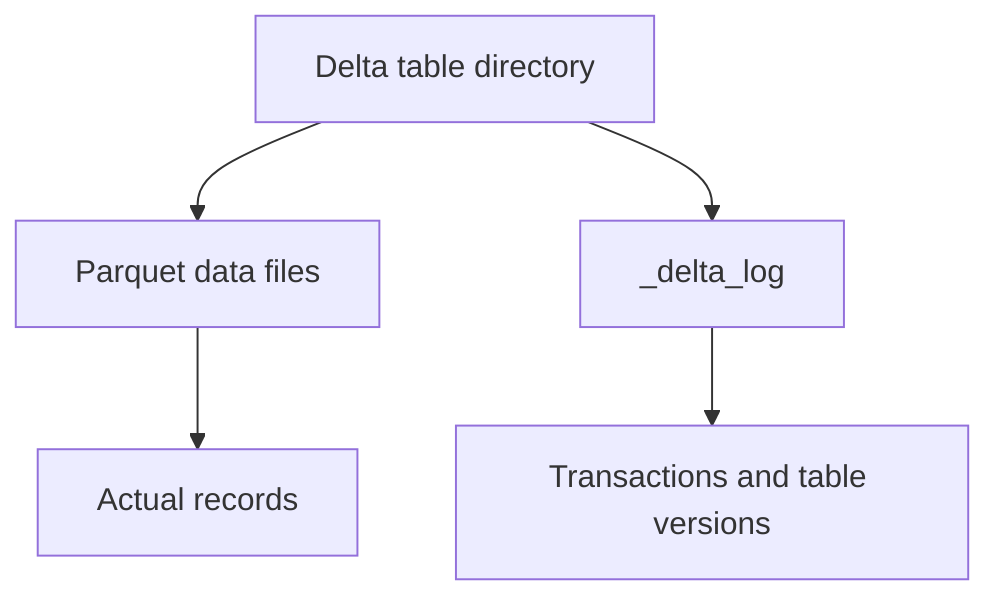

The file names and number of Parquet files can vary.

Do not depend on an exact number of files.

---

# 18. List the Root Directory

Run in Python:

```python
display(
    dbutils.fs.ls(delta_path)
)
```

Look for:

```text
_delta_log
part-....parquet
```

The data files store the records.

The `_delta_log` folder stores transaction actions and metadata.

---

# 19. List the Transaction Log

```python
delta_log_path = (
    f"{delta_path}/_delta_log"
)

log_entries = sorted(
    dbutils.fs.ls(delta_log_path),
    key=lambda entry: entry.name,
)

for entry in log_entries:
    print(
        entry.name,
        entry.size,
    )
```

Expected numbered files include:

```text
00000000000000000000.json
00000000000000000001.json
00000000000000000002.json
```

A small POC might not create a checkpoint file.

Checkpoint creation depends on the number of commits and table settings.

---

# 20. Read the JSON Transaction Actions

Use this only to understand the log structure.

Applications should use Delta APIs and table commands instead of directly depending on log JSON structure.

```python
from pyspark.sql import functions as F

json_log_files = [
    entry.path
    for entry in log_entries
    if entry.name.endswith(".json")
]

log_actions_df = spark.read.json(
    json_log_files
)

display(
    log_actions_df.select(
        F.col(
            "commitInfo.operation"
        ).alias("operation"),
        F.col(
            "commitInfo.timestamp"
        ).alias("commit_timestamp"),
        F.col(
            "add.path"
        ).alias("added_file"),
        F.col(
            "remove.path"
        ).alias("removed_file"),
        F.col(
            "metaData.id"
        ).alias("table_id"),
        F.col(
            "protocol.minReaderVersion"
        ).alias("min_reader_version"),
        F.col(
            "protocol.minWriterVersion"
        ).alias("min_writer_version"),
    )
)
```

You will see different action types on different rows.

Typical actions include:

| Action | Meaning |
|---|---|
| `commitInfo` | Describes the committed operation |
| `protocol` | Describes reader and writer requirements |
| `metaData` | Stores schema and table configuration |
| `add` | Makes a data file active |
| `remove` | Removes a data file from the active snapshot |

---

# 21. Inspect the Latest JSON Commit

```python
latest_json_log = sorted(
    json_log_files
)[-1]

print(
    dbutils.fs.head(
        latest_json_log,
        12000,
    )
)
```

The contents are newline-delimited JSON actions.

Do not edit these files.

---

# 22. How Delta Builds the Current Table

Delta does not read every Parquet file found in the directory.

It uses the transaction log to determine:

```text
Which files are active?
Which files were removed?
What schema is current?
What is the latest committed version?
```

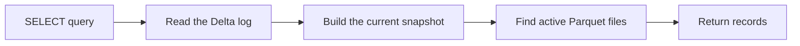

A physical file can remain in storage after it is logically removed.

It is not part of the current table unless the active Delta snapshot references it.

---

# Part D — Inspect Table Metadata and History

# 23. Run `DESCRIBE DETAIL`

```sql
DESCRIBE DETAIL
training_catalog.session_demo.delta_orders_demo;
```

Focus on:

```text
format
location
createdAt
lastModified
numFiles
sizeInBytes
properties
minReaderVersion
minWriterVersion
tableFeatures
```

The available columns can vary by runtime and enabled table features.

---

# 24. Run `DESCRIBE HISTORY`

```sql
DESCRIBE HISTORY
training_catalog.session_demo.delta_orders_demo;
```

Focus on:

```text
version
timestamp
userName
operation
operationParameters
operationMetrics
```

History is returned in reverse chronological order.

The newest version normally appears first.

---

# 25. Difference Between DETAIL and HISTORY

| Command | Main purpose |
|---|---|
| `DESCRIBE DETAIL` | Shows the current table metadata and storage details |
| `DESCRIBE HISTORY` | Shows committed writes and table versions |

```text
DETAIL
    → What is the table now?

HISTORY
    → How did the table reach this state?
```

---

# Part E — Create More Delta Versions

# 26. Insert Two New Orders

```sql
INSERT INTO
training_catalog.session_demo.delta_orders_demo
VALUES
    (
        1007,
        'Meera',
        'Pune',
        1450.00,
        'PLACED',
        TIMESTAMP '2026-07-30 10:00:00'
    ),
    (
        1008,
        'Karan',
        'Mumbai',
        1100.00,
        'PLACED',
        TIMESTAMP '2026-07-30 10:05:00'
    );
```

Verify:

```sql
SELECT *
FROM training_catalog.session_demo.delta_orders_demo
ORDER BY order_id;
```

Expected count:

```sql
SELECT COUNT(*) AS row_count_after_insert
FROM training_catalog.session_demo.delta_orders_demo;
```

Expected result:

```text
8
```

Inspect history:

```sql
DESCRIBE HISTORY
training_catalog.session_demo.delta_orders_demo;
```

Expected clean-run version:

```text
Version 3
```

---

# 27. Update Order 1002

```sql
UPDATE
training_catalog.session_demo.delta_orders_demo
SET
    order_amount = 700.00,
    order_status = 'SHIPPED',
    updated_at = TIMESTAMP '2026-07-30 10:10:00'
WHERE order_id = 1002;
```

Verify:

```sql
SELECT *
FROM training_catalog.session_demo.delta_orders_demo
WHERE order_id = 1002;
```

Expected values:

```text
order_amount = 700.00
order_status = SHIPPED
```

Inspect history again:

```sql
DESCRIBE HISTORY
training_catalog.session_demo.delta_orders_demo;
```

Expected clean-run version:

```text
Version 4
```

---

# 28. Delete the Cancelled Order

```sql
DELETE FROM
training_catalog.session_demo.delta_orders_demo
WHERE order_id = 1006;
```

Verify:

```sql
SELECT *
FROM training_catalog.session_demo.delta_orders_demo
ORDER BY order_id;
```

Expected count:

```sql
SELECT COUNT(*) AS row_count_after_delete
FROM training_catalog.session_demo.delta_orders_demo;
```

Expected result:

```text
7
```

Inspect history:

```sql
DESCRIBE HISTORY
training_catalog.session_demo.delta_orders_demo;
```

Expected clean-run version:

```text
Version 5
```

---

# 29. Version Timeline

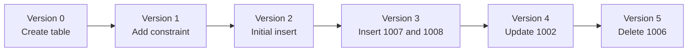

The version numbers above assume the clean-run steps were followed exactly.

Always confirm the actual versions using table history.

---

# 30. What Happens to Parquet Files During Changes

Delta operations usually create new data files and update the transaction log.

Without considering runtime optimizations, an update can be understood as:

```text
Read affected data file
    ↓
Write a replacement data file
    ↓
Log old file as removed
    ↓
Log new file as added
```

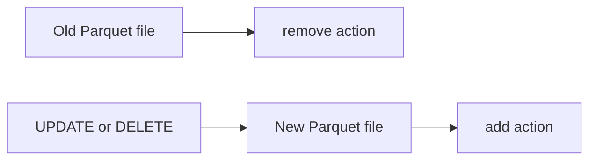

With deletion vectors enabled, Databricks can record row changes without immediately rewriting complete Parquet files.

The logical result is still a new committed table version.

---

# Part F — Introduce Time Travel

# 31. Why Time Travel Works

The transaction log records which files were active at each version.

That allows Delta to reconstruct an earlier snapshot.

```text
Version number
    ↓
Transaction-log state
    ↓
Active files for that version
    ↓
Earlier table snapshot
```

---

# 32. Query the Table Before the Update

Under the clean-run version map, version `3` is after the additional insert but before the update of order `1002`.

```sql
SELECT *
FROM training_catalog.session_demo.delta_orders_demo
VERSION AS OF 3
WHERE order_id = 1002;
```

Expected result:

```text
order_amount = 650.00
order_status = PLACED
```

Compare it with the current table:

```sql
SELECT *
FROM training_catalog.session_demo.delta_orders_demo
WHERE order_id = 1002;
```

Expected current result:

```text
order_amount = 700.00
order_status = SHIPPED
```

---

# 33. Query the Table Before the Delete

Under the clean-run version map, version `4` is after the update but before order `1006` was deleted.

```sql
SELECT *
FROM training_catalog.session_demo.delta_orders_demo
VERSION AS OF 4
WHERE order_id = 1006;
```

Expected result:

```text
One CANCELLED order
```

Compare it with the current table:

```sql
SELECT *
FROM training_catalog.session_demo.delta_orders_demo
WHERE order_id = 1006;
```

Expected current result:

```text
No rows
```

---

# 34. Use Actual Version Numbers When History Differs

First run:

```sql
DESCRIBE HISTORY
training_catalog.session_demo.delta_orders_demo;
```

Then replace the number:

```sql
SELECT *
FROM training_catalog.session_demo.delta_orders_demo
VERSION AS OF <version_number>;
```

`<version_number>` is a placeholder.

Replace it with a valid value from the history output.

---

# 35. Time Travel Scope in This Session

This session covers only:

- Finding versions with `DESCRIBE HISTORY`
- Querying an earlier version
- Comparing an earlier snapshot with the current table

The following topics can be covered later:

- `TIMESTAMP AS OF`
- `RESTORE TABLE`
- Retention settings
- The effect of `VACUUM`
- Long-term history requirements
- Recovery planning

---

# Part G — ACID Hands-on Demonstrations

# 36. ACID Overview

| Property | Meaning |
|---|---|
| Atomicity | A transaction commits completely or does not commit |
| Consistency | A successful transaction moves the table to another valid state |
| Isolation | Readers and writers work with committed table snapshots |
| Durability | A committed change remains stored after compute stops |

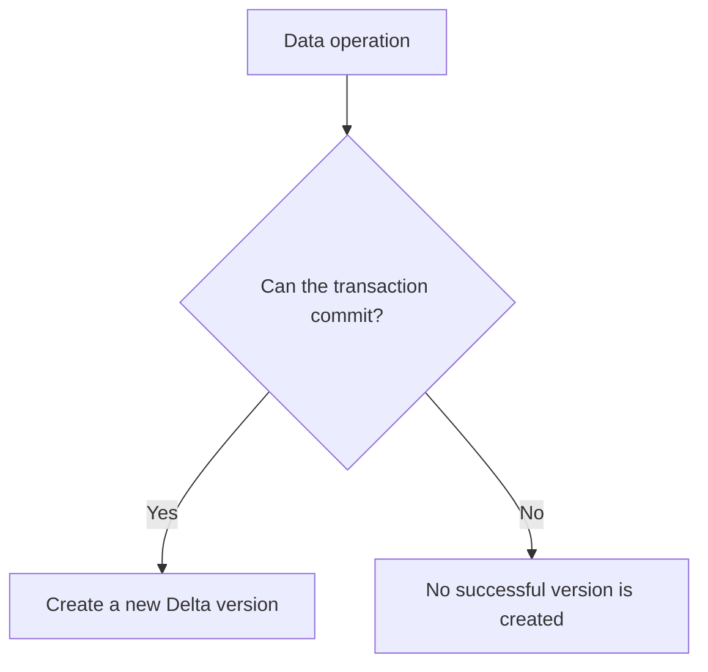

---

# 37. Atomicity Demonstration

Before the test, check the current history:

```sql
DESCRIBE HISTORY
training_catalog.session_demo.delta_orders_demo;
```

Now attempt one multi-row insert.

The first row is valid.

The second row has a negative amount and violates the constraint.

```sql
INSERT INTO
training_catalog.session_demo.delta_orders_demo
VALUES
    (
        1101,
        'Valid Row',
        'Pune',
        500.00,
        'PLACED',
        TIMESTAMP '2026-07-30 11:00:00'
    ),
    (
        1102,
        'Invalid Row',
        'Mumbai',
        -100.00,
        'PLACED',
        TIMESTAMP '2026-07-30 11:01:00'
    );
```

This command is expected to fail.

Now check both order IDs:

```sql
SELECT *
FROM training_catalog.session_demo.delta_orders_demo
WHERE order_id IN (1101, 1102);
```

Expected result:

```text
No rows
```

The valid row was not partially committed.

Check history again:

```sql
DESCRIBE HISTORY
training_catalog.session_demo.delta_orders_demo;
```

Expected result:

```text
No new successful version for the failed insert
```

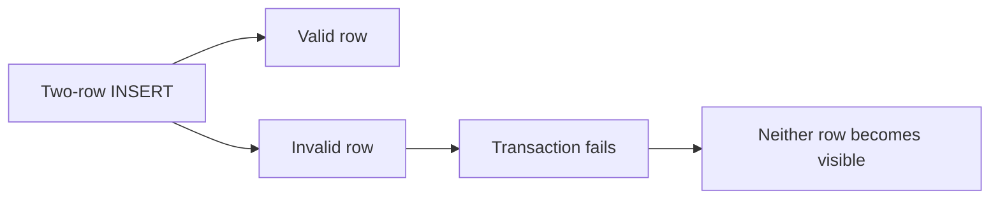

This demonstrates:

```text
All rows from the statement
or
No rows from the statement
```

---

# 38. Consistency Demonstration

Order `1001` currently has a valid status.

Check it:

```sql
SELECT *
FROM training_catalog.session_demo.delta_orders_demo
WHERE order_id = 1001;
```

Attempt an invalid status:

```sql
UPDATE
training_catalog.session_demo.delta_orders_demo
SET
    order_status = 'UNKNOWN',
    updated_at = TIMESTAMP '2026-07-30 11:10:00'
WHERE order_id = 1001;
```

This command is expected to fail because `UNKNOWN` is not allowed by the check constraint.

Check the row again:

```sql
SELECT *
FROM training_catalog.session_demo.delta_orders_demo
WHERE order_id = 1001;
```

Expected result:

```text
The earlier valid row is unchanged.
```

Check history:

```sql
DESCRIBE HISTORY
training_catalog.session_demo.delta_orders_demo;
```

Expected result:

```text
No successful version for the rejected update
```

Delta maintained a valid table state.

Business correctness still requires explicitly defined rules.

Delta does not automatically know every business requirement.

---

# 39. Isolation Observation

Use two notebook sessions or two browser profiles.

## Session A

Query order `1005` from version `5`:

```sql
SELECT *
FROM training_catalog.session_demo.delta_orders_demo
VERSION AS OF 5
WHERE order_id = 1005;
```

Expected result:

```text
order_status = DELIVERED
order_amount = 3200.00
```

Keep this result visible.

## Session B

Commit a new update:

```sql
UPDATE
training_catalog.session_demo.delta_orders_demo
SET
    order_amount = 3100.00,
    order_status = 'RETURNED',
    updated_at = TIMESTAMP '2026-07-30 11:30:00'
WHERE order_id = 1005;
```

Check the current row:

```sql
SELECT *
FROM training_catalog.session_demo.delta_orders_demo
WHERE order_id = 1005;
```

Expected current result:

```text
order_status = RETURNED
order_amount = 3100.00
```

## Session A

Run the version `5` query again:

```sql
SELECT *
FROM training_catalog.session_demo.delta_orders_demo
VERSION AS OF 5
WHERE order_id = 1005;
```

The earlier snapshot still shows:

```text
DELIVERED
3200.00
```

The current query shows the newly committed state:

```sql
SELECT *
FROM training_catalog.session_demo.delta_orders_demo
WHERE order_id = 1005;
```

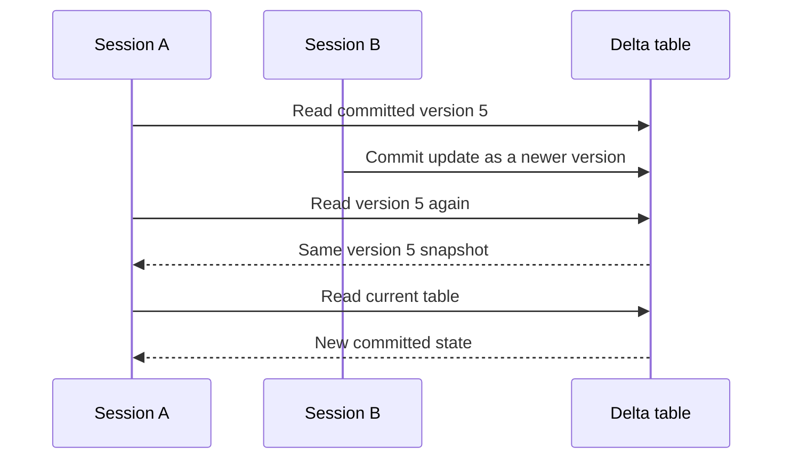

This is a controlled snapshot observation.

A detailed concurrent-write conflict test can behave differently depending on runtime features, deletion vectors, row-level concurrency, and the records being modified.

---

# 40. Durability Demonstration

After Session B commits the update:

1. Open another notebook or attach another compatible compute.
2. Run the current-table query.
3. Confirm that order `1005` remains `RETURNED`.
4. Run table history and confirm that the update remains recorded.

```sql
SELECT *
FROM training_catalog.session_demo.delta_orders_demo
WHERE order_id = 1005;
```

```sql
DESCRIBE HISTORY
training_catalog.session_demo.delta_orders_demo;
```

The committed state is stored in ADLS through the Delta data files and transaction log.

It does not depend on the notebook or cluster remaining open.

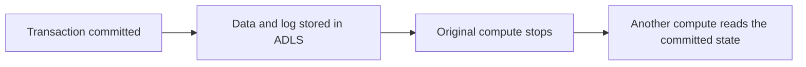

---

# 41. ACID Mapped to the Delta Log

| Property | Delta behaviour |
|---|---|
| Atomicity | The log commit makes the complete transaction visible together |
| Consistency | Schema, constraints, and transaction checks protect valid states |
| Isolation | Readers use committed snapshots and writes are checked at commit |
| Durability | Data files and log commits remain in cloud storage |

---

# Part H — Build the Incremental Source Batch

# 42. Incremental Changes

The batch contains:

| Order ID | Change | Expected target action |
|---:|---|---|
| 1001 | New amount and status | Update |
| 1003 | New city and status | Update |
| 1004 | Delete instruction | Delete |
| 1009 | New order | Insert |
| 1010 | New order | Insert |

The control column is:

```text
change_type
```

Allowed values in this POC:

```text
UPSERT
DELETE
```

---

# 43. Create the Temporary Source View

Run the remaining temporary-view and merge commands in the same notebook session.

```sql
CREATE OR REPLACE TEMP VIEW incremental_orders
AS
SELECT *
FROM VALUES
    (
        1001,
        'Aditi',
        'Pune',
        CAST(1300.00 AS DECIMAL(10,2)),
        'SHIPPED',
        TIMESTAMP '2026-07-30 12:00:00',
        'UPSERT'
    ),
    (
        1003,
        'Neha',
        'Hyderabad',
        CAST(2200.00 AS DECIMAL(10,2)),
        'DELIVERED',
        TIMESTAMP '2026-07-30 12:05:00',
        'UPSERT'
    ),
    (
        1004,
        'Aman',
        'Pune',
        CAST(1800.00 AS DECIMAL(10,2)),
        'PLACED',
        TIMESTAMP '2026-07-30 12:06:00',
        'DELETE'
    ),
    (
        1009,
        'Sana',
        'Pune',
        CAST(1850.00 AS DECIMAL(10,2)),
        'PLACED',
        TIMESTAMP '2026-07-30 12:10:00',
        'UPSERT'
    ),
    (
        1010,
        'Mohit',
        'Mumbai',
        CAST(2900.00 AS DECIMAL(10,2)),
        'PLACED',
        TIMESTAMP '2026-07-30 12:15:00',
        'UPSERT'
    )
AS source
(
    order_id,
    customer_name,
    city,
    order_amount,
    order_status,
    updated_at,
    change_type
);
```

Query it:

```sql
SELECT *
FROM incremental_orders
ORDER BY order_id;
```

---

# 44. Validate One Source Row Per Key

A `MERGE` should not receive multiple update records for the same target key.

Run:

```sql
SELECT
    order_id,
    COUNT(*) AS records_per_order
FROM incremental_orders
GROUP BY order_id
HAVING COUNT(*) > 1;
```

Expected result:

```text
No rows
```

Check control values:

```sql
SELECT DISTINCT change_type
FROM incremental_orders
ORDER BY change_type;
```

Expected values:

```text
DELETE
UPSERT
```

---

# 45. MERGE Decision Flow

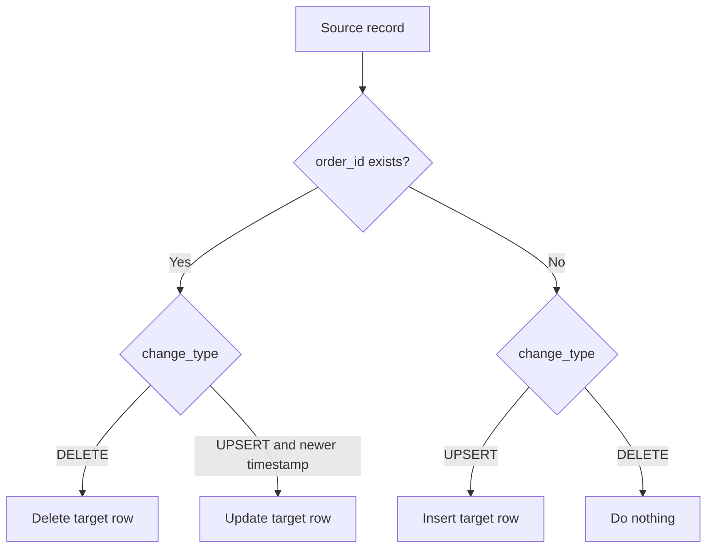

---

# Part I — Run the Incremental MERGE

# 46. MERGE into the Target

```sql
MERGE INTO
training_catalog.session_demo.delta_orders_demo AS target

USING incremental_orders AS source

ON target.order_id = source.order_id

WHEN MATCHED
    AND source.change_type = 'DELETE'
THEN DELETE

WHEN MATCHED
    AND source.change_type = 'UPSERT'
    AND source.updated_at > target.updated_at
THEN UPDATE SET
    target.customer_name = source.customer_name,
    target.city = source.city,
    target.order_amount = source.order_amount,
    target.order_status = source.order_status,
    target.updated_at = source.updated_at

WHEN NOT MATCHED
    AND source.change_type = 'UPSERT'
THEN INSERT
(
    order_id,
    customer_name,
    city,
    order_amount,
    order_status,
    updated_at
)
VALUES
(
    source.order_id,
    source.customer_name,
    source.city,
    source.order_amount,
    source.order_status,
    source.updated_at
);
```

This single transaction can:

- Delete matched records
- Update matched records
- Insert new records

The target must be a Delta table.

---

# 47. Expected Row Count

Before the merge:

```text
7 rows
```

The isolation update changed values but did not change the count.

The merge performs:

```text
Delete order 1004: -1
Insert order 1009: +1
Insert order 1010: +1
Update order 1001: no count change
Update order 1003: no count change
```

Expected final count:

```text
8
```

---

# 48. Validate the Final Count

```sql
SELECT COUNT(*) AS final_row_count
FROM training_catalog.session_demo.delta_orders_demo;
```

Expected result:

```text
8
```

---

# 49. Validate Updated Records

```sql
SELECT *
FROM training_catalog.session_demo.delta_orders_demo
WHERE order_id IN (1001, 1003)
ORDER BY order_id;
```

Expected:

```text
1001 → SHIPPED, 1300.00
1003 → Hyderabad, DELIVERED, 2200.00
```

---

# 50. Validate Inserted Records

```sql
SELECT *
FROM training_catalog.session_demo.delta_orders_demo
WHERE order_id IN (1009, 1010)
ORDER BY order_id;
```

Expected:

```text
Two rows
```

---

# 51. Validate the Deleted Record

```sql
SELECT *
FROM training_catalog.session_demo.delta_orders_demo
WHERE order_id = 1004;
```

Expected result:

```text
No rows
```

---

# 52. Inspect the MERGE History

```sql
DESCRIBE HISTORY
training_catalog.session_demo.delta_orders_demo;
```

The latest successful operation should be a merge operation.

Look at:

```text
operation
operationParameters
operationMetrics
```

The exact metric keys can vary by runtime.

---

# 53. Inspect the Transaction Log Again

Run the Python log-listing cell again:

```python
log_entries_after_merge = sorted(
    dbutils.fs.ls(delta_log_path),
    key=lambda entry: entry.name,
)

for entry in log_entries_after_merge:
    print(
        entry.name,
        entry.size,
    )
```

A new numbered JSON commit should appear for the successful merge.

---

# Part J — Rerun and Discuss Idempotency

# 54. Rerun the Same MERGE

Run the `MERGE` statement again without changing `incremental_orders`.

Then query:

```sql
SELECT *
FROM training_catalog.session_demo.delta_orders_demo
ORDER BY order_id;
```

Expected final state:

```text
The same eight business records
```

Why?

- Orders `1009` and `1010` now match target rows.
- Their timestamps are equal to the target timestamps.
- The update condition requires a strictly newer source timestamp.
- Order `1004` is already absent.
- The delete instruction does not insert a missing row.

The final data state is idempotent for this exact batch.

A runtime can still record execution details for a rerun even when no business rows change.

Do not assume that idempotency always means no new history entry.

---

# 55. Why the Timestamp Condition Matters

Without:

```sql
source.updated_at > target.updated_at
```

the same records could be updated again during every rerun.

With the condition:

```text
Older source
    → ignored

Same timestamp
    → ignored

Newer source
    → applied
```

This is a simplified incremental rule.

A production pipeline must define how equal timestamps, late records, and conflicting source systems are handled.

---

# Part K — Final Architecture

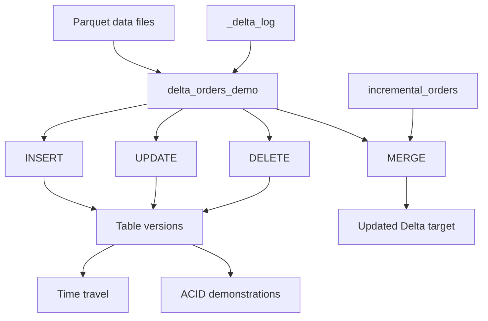

---

# 56. Key Takeaways

```text
Parquet files
    → Store table records
```

```text
_delta_log
    → Tracks metadata, active files, removed files, operations, and versions
```

```text
Successful transaction
    → Creates a new table version
```

```text
Failed transaction
    → Does not create a successful table version
```

```text
VERSION AS OF
    → Reads an earlier committed snapshot
```

```text
INSERT, UPDATE, DELETE
    → Individual Delta transactions
```

```text
MERGE
    → Applies updates, inserts, and deletes in one transaction
```

---

# Part L — Quick Recap

# 57. What is stored in Parquet files?

<details>
<summary>Show answer</summary>

The actual table rows are stored in Parquet data files.

</details>

---

# 58. What is the main role of `_delta_log`?

<details>
<summary>Show answer</summary>

It records table metadata, file actions, committed operations, and table versions.

</details>

---

# 59. Why did order 1101 not get inserted?

<details>
<summary>Show answer</summary>

It was part of the same transaction as an invalid row.

The statement failed atomically, so neither row was committed.

</details>

---

# 60. How was the older value of order 1002 viewed?

<details>
<summary>Show answer</summary>

The table was queried using:

```sql
VERSION AS OF 3
```

The actual version should always be confirmed using `DESCRIBE HISTORY`.

</details>

---

# 61. What does the MERGE source require?

<details>
<summary>Show answer</summary>

It should contain one clear change record per business key for the records being updated.

Duplicate matching source records can make the operation ambiguous.

</details>

---

# Part M — Troubleshooting

# 62. Table Creation Fails

Check:

- The placeholders were replaced.
- The path is covered by an external location.
- The external location is available in the workspace.
- The external location is not read-only.
- The path does not overlap another table or volume.
- The running identity has `CREATE EXTERNAL TABLE`.

---

# 63. Direct Path Listing Fails

Check:

- The identity has `READ FILES`.
- The storage credential can access ADLS.
- The path is correct.
- The notebook compute supports Unity Catalog access.

---

# 64. Path Cleanup Fails

Check:

- The identity has `WRITE FILES`.
- The managed identity has delete permission in ADLS.
- The path is not read-only.
- The table registration was dropped first.
- The path suffix matches the dedicated POC directory.

---

# 65. Constraint Creation Fails

Check:

- The table is Delta.
- The constraint name is not already in use on the table.
- Existing rows satisfy the condition.
- The current identity owns the table or has the required table-management permission.
- The table uses a compatible default collation.

---

# 66. Expected Version Numbers Do Not Match

Run:

```sql
DESCRIBE HISTORY
training_catalog.session_demo.delta_orders_demo;
```

Use the actual versions.

Extra versions can come from:

- An earlier run
- An additional metadata change
- An additional insert, update, or delete
- A repeated merge
- Runtime-managed table-feature changes

---

# 67. Time Travel Query Fails

Check:

- The version exists.
- Required log files are still retained.
- Required data files have not been removed.
- The correct three-part table name is used.
- The value after `VERSION AS OF` is numeric.

---

# 68. The Failed Atomicity Test Inserted a Row

This should not happen when both rows are executed in one `INSERT` statement and the constraint is active.

Check:

```sql
SHOW TBLPROPERTIES
training_catalog.session_demo.delta_orders_demo;
```

Also confirm that the failing row was part of the same statement rather than a separate cell.

---

# 69. MERGE Fails with Multiple Matches

Run:

```sql
SELECT
    order_id,
    COUNT(*) AS records_per_order
FROM incremental_orders
GROUP BY order_id
HAVING COUNT(*) > 1;
```

Deduplicate or resolve the source before the merge.

---

# 70. Temporary View Is Missing

`incremental_orders` is session-scoped.

Create it again in the same notebook session used for the merge.

---

# Part N — Cleanup

# 71. Drop the Temporary View

```sql
DROP VIEW IF EXISTS incremental_orders;
```

---

# 72. Drop the External Delta Table

```sql
DROP TABLE IF EXISTS
training_catalog.session_demo.delta_orders_demo;
```

This removes the table registration.

The external files remain.

---

# 73. Delete the Dedicated External Directory

Run the protected Python cleanup command again:

```python
delta_path = (
    "abfss://<container>@<storage-account>."
    "dfs.core.windows.net/delta_session/"
    "delta_orders_demo"
)

required_suffix = (
    "/delta_session/delta_orders_demo"
)

if not delta_path.endswith(required_suffix):
    raise ValueError(
        "The path does not match the dedicated POC directory."
    )

removed = dbutils.fs.rm(
    delta_path,
    recurse=True,
)

print(
    f"POC path removed: {removed}"
)
```

---

# Part O — Command Validation Status

# 74. Validation Performed

The commands in this guide were reviewed against Azure Databricks documentation current in July 2026.

The following local checks were completed:

- All Python code blocks compile.
- SQL blocks have balanced quotes and parentheses.
- The sample records were simulated in memory.
- Expected counts were verified.
- Expected time-travel states were verified.
- The invalid atomicity batch was confirmed to leave the simulated state unchanged.
- The invalid consistency update was confirmed to leave the simulated state unchanged.
- The merge produced the expected final eight records.
- Reapplying the same merge produced the same final business state.
- Mermaid and Markdown fences are balanced.
- Restricted document labels were not used.

---

# 75. Workspace-Dependent Behaviour

The commands were not executed in your Azure Databricks workspace.

They can still fail when:

- The catalog or schema name differs.
- Placeholders are not replaced.
- The external location does not cover the path.
- The external location is read-only.
- Required Unity Catalog privileges are missing.
- The ADLS managed identity lacks permissions.
- The path overlaps another governed object.
- The notebook uses unsupported compute.
- An earlier run left table files or metadata.
- Table versions differ from the clean-run sequence.
- Runtime features change the exact physical-file behaviour.
- The temporary view is queried from another session.

There is no single universal dry-run command for the entire sequence.

The safest final test is to run it in a dedicated development schema and dedicated ADLS child directory.

---

# 76. Official References

- [What is Delta Lake in Azure Databricks?](https://learn.microsoft.com/en-us/azure/databricks/delta/)
- [What are ACID guarantees on Azure Databricks?](https://learn.microsoft.com/en-us/azure/databricks/lakehouse/acid)
- [Create and manage Delta Lake tables](https://learn.microsoft.com/en-us/azure/databricks/delta/tutorial)
- [CREATE TABLE USING](https://learn.microsoft.com/en-us/azure/databricks/sql/language-manual/sql-ref-syntax-ddl-create-table-using)
- [ADD CONSTRAINT](https://learn.microsoft.com/en-us/azure/databricks/sql/language-manual/sql-ref-syntax-ddl-alter-table-add-constraint)
- [INSERT INTO](https://learn.microsoft.com/en-us/azure/databricks/sql/language-manual/sql-ref-syntax-dml-insert-into)
- [UPDATE](https://learn.microsoft.com/en-us/azure/databricks/sql/language-manual/delta-update)
- [DELETE FROM](https://learn.microsoft.com/en-us/azure/databricks/sql/language-manual/delta-delete-from)
- [DESCRIBE DETAIL](https://learn.microsoft.com/en-us/azure/databricks/tables/operations/table-details)
- [DESCRIBE HISTORY](https://learn.microsoft.com/en-us/azure/databricks/sql/language-manual/delta-describe-history)
- [Query a Delta table using VERSION AS OF](https://learn.microsoft.com/en-us/azure/databricks/sql/language-manual/sql-ref-syntax-qry-select-table-reference)
- [MERGE INTO](https://learn.microsoft.com/en-us/azure/databricks/sql/language-manual/delta-merge-into)
- [Upsert into a Delta table using MERGE](https://learn.microsoft.com/en-us/azure/databricks/delta/merge)
- [Transactions and concurrency](https://learn.microsoft.com/en-us/azure/databricks/transactions/)
