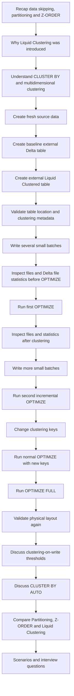

# Delta Lake Liquid Clustering

## Session Overview

Liquid Clustering is a Delta Lake data-layout technique that organizes records using one or more clustering keys without creating fixed partition folders.

This session connects Liquid Clustering with the topics already covered:

```text
Data skipping
    ↓
Partitioning
    ↓
Z-ORDER
    ↓
Liquid Clustering
```

The main goal is to understand:

- Why Liquid Clustering was introduced.
- How `CLUSTER BY` differs from partitioning, bucketing, and Z-ORDER.
- How clustering keys are selected.
- What clustering-on-write means.
- Why small writes may still need `OPTIMIZE`.
- How normal `OPTIMIZE` works incrementally.
- How `OPTIMIZE FULL` differs from normal `OPTIMIZE`.
- What happens when clustering keys change.
- How to validate the physical table location, active files, clustering metadata, and file-level statistics.
- What `CLUSTER BY AUTO` adds for Unity Catalog managed tables.

---

# Learning Outcomes

By the end of this session, you should be able to:

- Explain Liquid Clustering in your own words.
- Explain the meaning of multidimensional clustering.
- Create an external Delta table using `CLUSTER BY`.
- Select clustering keys based on query patterns.
- Explain why high-cardinality columns can work well as clustering keys.
- Explain clustering-on-write and its size thresholds.
- Run incremental `OPTIMIZE`.
- Change clustering keys.
- Explain the difference between `OPTIMIZE` and `OPTIMIZE FULL`.
- Inspect the table's physical ADLS location.
- Inspect active Parquet files.
- Inspect file-level min/max statistics from `_delta_log`.
- Explain the difference between manual Liquid Clustering and `CLUSTER BY AUTO`.
- Compare partitioning, Z-ORDER, bucketing, and Liquid Clustering.

---

# Session Flow



---

# 1. Environment Used in This Session

Storage:

```text
ADLS container: data
Storage account: demodb117
```

Session root:

```text
abfss://data@demodb117.dfs.core.windows.net/delta_liquid_clustering_session/
```

Catalog:

```text
delta_liquid_clustering_lab
```

Schema:

```text
sales_demo
```

Tables:

```text
delta_liquid_clustering_lab.sales_demo.sales_source
delta_liquid_clustering_lab.sales_demo.sales_baseline
delta_liquid_clustering_lab.sales_demo.sales_liquid_clustered
```

All table names and paths are written directly in the commands so that every operation is visible while running the demonstration.

---

# 2. Compute and Runtime Check

Before beginning, check the current Databricks version.

```sql
SELECT current_version();
```

Liquid Clustering is generally available for Delta tables on Databricks Runtime 15.4 LTS and above.

`OPTIMIZE FULL` requires Databricks Runtime 16.4 LTS or above.

> If `OPTIMIZE FULL` is not supported by the compute being used, skip that command and continue with the conceptual explanation.

---

# 3. Important Serverless Compute Note

The session does not depend on unrestricted-cluster Spark configurations.

For example, do not make the demonstration dependent on:

```text
spark.databricks.delta.optimize.maxFileSize
```

Some Spark-level configurations are restricted or unavailable on serverless compute.

The focus of this session is:

```text
CLUSTER BY
OPTIMIZE
OPTIMIZE FULL
DESCRIBE DETAIL
SHOW TBLPROPERTIES
_delta_log statistics
physical ADLS files
```

These are enough to understand Liquid Clustering.

There is no need to force a particular output file size for this demonstration.

---

# 4. Create the Session Namespace and Clean Old Objects

Create the catalog and schema first.

```sql
CREATE CATALOG IF NOT EXISTS delta_liquid_clustering_lab;

CREATE SCHEMA IF NOT EXISTS delta_liquid_clustering_lab.sales_demo;
```

Now drop any old copies of the session tables.

```sql
DROP TABLE IF EXISTS delta_liquid_clustering_lab.sales_demo.sales_liquid_clustered;
DROP TABLE IF EXISTS delta_liquid_clustering_lab.sales_demo.sales_baseline;
DROP TABLE IF EXISTS delta_liquid_clustering_lab.sales_demo.sales_source;
DROP TABLE IF EXISTS delta_liquid_clustering_lab.sales_demo.sales_auto_demo;
```

Because the first three tables are external tables, dropping them does not delete their ADLS files.

Delete only the dedicated session directories.

```python
dbutils.fs.rm(
    "abfss://data@demodb117.dfs.core.windows.net/delta_liquid_clustering_session/sales_liquid_clustered",
    True
)

dbutils.fs.rm(
    "abfss://data@demodb117.dfs.core.windows.net/delta_liquid_clustering_session/sales_baseline",
    True
)

dbutils.fs.rm(
    "abfss://data@demodb117.dfs.core.windows.net/delta_liquid_clustering_session/sales_source",
    True
)
```

---

# 5. Recap: Why Does Data Layout Matter?

Delta Lake uses file-level statistics to avoid reading files that cannot contain matching records.

For example:

```text
File A:
customer_id min = 10000
customer_id max = 11999

File B:
customer_id min = 12000
customer_id max = 13999

File C:
customer_id min = 14000
customer_id max = 15999
```

For:

```text
WHERE customer_id = 10542
```

Delta can safely skip Files B and C.

The better the physical locality of values, the more useful file-level min/max statistics can become.

---

# 6. Recap: Partitioning

Partitioning creates fixed value-based physical boundaries.

Example:

```text
order_year=2025/
order_year=2026/
```

Advantages:

- Partition pruning can skip complete partitions.
- Works well for some very large tables with stable filter patterns.

Limitations:

- High-cardinality partition columns can create too many partitions.
- Layout is rigid.
- Changing the partitioning strategy can require significant migration or rewriting.

---

# 7. Recap: Z-ORDER

Z-ORDER improves locality for selected columns.

```text
OPTIMIZE <table>
ZORDER BY (customer_id);
```

The Z-ORDER columns are specified as part of the optimization operation.

Z-ORDER can improve data skipping, but the table does not permanently store a flexible clustering strategy that can evolve in the same way as Liquid Clustering.

---

# 8. Why Liquid Clustering?

Liquid Clustering moves the layout decision into the table definition.

```text
CLUSTER BY (customer_id, region)
```

The table now knows:

```text
These columns define the clustering strategy.
```

Then:

```text
OPTIMIZE <table>;
```

uses the clustering metadata automatically.

The command does not need:

```text
ZORDER BY (...)
```

every time.

---

# 9. Liquid Clustering Is Not Hive Bucketing

Traditional bucketing follows a fixed hash-bucket design.

Conceptually:

```text
hash(customer_id) % number_of_buckets
```

If eight buckets are configured:

```text
Bucket 0
Bucket 1
...
Bucket 7
```

The bucket count is fixed.

Liquid Clustering does not require a fixed bucket count.

```text
Hive bucketing
    → Fixed hash buckets

Liquid Clustering
    → Flexible file layout
    → No fixed bucket count
    → Clustering strategy can change
```

---

# 10. What Does Multidimensional Clustering Mean?

A clustering column can be considered a dimension.

One key:

```text
CLUSTER BY (customer_id)
```

One clustering dimension:

```text
customer_id
```

Two keys:

```text
CLUSTER BY (customer_id, region)
```

Two clustering dimensions:

```text
customer_id
region
```

Three keys:

```text
CLUSTER BY (customer_id, region, country_code)
```

Three clustering dimensions.

Liquid Clustering considers the combination of these values when improving physical locality.

Example records:

| customer_id | region | country_code |
|---:|---|---|
| 10542 | NORTH | IN |
| 10542 | SOUTH | UK |
| 10542 | EAST | SG |
| 20891 | NORTH | US |
| 20891 | WEST | DE |

Multidimensional clustering does not mean nested folders.

It means:

```text
Organize data while considering
multiple clustering columns together.
```

---

# 11. Restrictions to Remember

A Liquid Clustered Delta table cannot simultaneously use traditional table partitioning.

```text
PARTITIONED BY
      OR
CLUSTER BY
```

A Liquid Clustered table also cannot use Z-ORDER.

```text
Liquid Clustering
      OR
Z-ORDER
```

Do not attempt:

```sql
OPTIMIZE delta_liquid_clustering_lab.sales_demo.sales_liquid_clustered
ZORDER BY (customer_id);
```

That command is expected to fail because the table already uses Liquid Clustering.

---

# 12. Create the Source Dataset

The source contains 600,000 records.

It contains:

```text
20,000 customers
10 ingestion batches
4 regions
5 countries
6 product categories
4 order statuses
```

Every ingestion batch contains 60,000 records.

The same customer appears in different batches and can appear with different region/country combinations.

This makes the clustering changes visible.

```sql
CREATE TABLE delta_liquid_clustering_lab.sales_demo.sales_source
USING DELTA
LOCATION 'abfss://data@demodb117.dfs.core.windows.net/delta_liquid_clustering_session/sales_source'
AS
SELECT
    1000000 + id AS order_id,

    CAST(
        10000 + pmod(id, 20000)
        AS INT
    ) AS customer_id,

    date_add(
        DATE '2025-01-01',
        CAST(pmod(id, 365) AS INT)
    ) AS order_date,

    CASE
        pmod(
            CAST(floor(id / 60000) AS BIGINT)
            +
            CAST(floor(pmod(id, 20000) / 5000) AS BIGINT),
            4
        )
        WHEN 0 THEN 'NORTH'
        WHEN 1 THEN 'SOUTH'
        WHEN 2 THEN 'EAST'
        ELSE 'WEST'
    END AS region,

    CASE
        pmod(
            2 * CAST(floor(id / 60000) AS BIGINT)
            +
            CAST(floor(pmod(id, 20000) / 4000) AS BIGINT),
            5
        )
        WHEN 0 THEN 'IN'
        WHEN 1 THEN 'US'
        WHEN 2 THEN 'UK'
        WHEN 3 THEN 'DE'
        ELSE 'SG'
    END AS country_code,

    CASE pmod(id, 6)
        WHEN 0 THEN 'ELECTRONICS'
        WHEN 1 THEN 'BOOKS'
        WHEN 2 THEN 'FASHION'
        WHEN 3 THEN 'HOME'
        WHEN 4 THEN 'SPORTS'
        ELSE 'GROCERY'
    END AS product_category,

    CASE pmod(id, 4)
        WHEN 0 THEN 'PLACED'
        WHEN 1 THEN 'SHIPPED'
        WHEN 2 THEN 'DELIVERED'
        ELSE 'CANCELLED'
    END AS order_status,

    CAST(
        500 + pmod(id * 37, 25000) / 10.0
        AS DECIMAL(12,2)
    ) AS order_amount,

    CAST(
        floor(id / 60000) + 1
        AS INT
    ) AS ingestion_batch

FROM range(0, 600000);
```

---

# 13. Validate the Source Data

Check the total records.

```sql
SELECT COUNT(*) AS total_records
FROM delta_liquid_clustering_lab.sales_demo.sales_source;
```

Expected:

```text
600000
```

Check the batches.

```sql
SELECT
    ingestion_batch,
    COUNT(*) AS records
FROM delta_liquid_clustering_lab.sales_demo.sales_source
GROUP BY ingestion_batch
ORDER BY ingestion_batch;
```

Expected:

```text
10 batches
60000 records per batch
```

Check the number of customers.

```sql
SELECT
    COUNT(DISTINCT customer_id) AS unique_customers
FROM delta_liquid_clustering_lab.sales_demo.sales_source;
```

Expected:

```text
20000
```

Inspect one customer that will be reused throughout the session.

```sql
SELECT
    customer_id,
    ingestion_batch,
    region,
    country_code,
    order_date,
    order_amount
FROM delta_liquid_clustering_lab.sales_demo.sales_source
WHERE customer_id = 10542
ORDER BY ingestion_batch, order_id;
```

Expected:

```text
30 records in the complete source
```

The same customer appears across multiple batches.

---

# 14. Validate the Source Table Location

Use table metadata.

```sql
DESCRIBE DETAIL
delta_liquid_clustering_lab.sales_demo.sales_source;
```

Confirm that the `location` is:

```text
abfss://data@demodb117.dfs.core.windows.net/delta_liquid_clustering_session/sales_source
```

You can also inspect the physical files.

```sql
SELECT
    path,
    length
FROM read_files(
    'abfss://data@demodb117.dfs.core.windows.net/delta_liquid_clustering_session/sales_source',
    format => 'binaryFile'
)
WHERE path LIKE '%.parquet'
  AND path NOT LIKE '%/_delta_log/%'
ORDER BY path;
```

This validation pattern will be repeated for the clustered table.

---

# 15. Create an Unclustered Baseline Table

```sql
CREATE TABLE delta_liquid_clustering_lab.sales_demo.sales_baseline
(
    order_id BIGINT,
    customer_id INT,
    order_date DATE,
    region STRING,
    country_code STRING,
    product_category STRING,
    order_status STRING,
    order_amount DECIMAL(12,2),
    ingestion_batch INT
)
USING DELTA
LOCATION 'abfss://data@demodb117.dfs.core.windows.net/delta_liquid_clustering_session/sales_baseline';
```

This table has:

```text
No partitioning
No Z-ORDER
No Liquid Clustering
```

---

# 16. Create the Liquid Clustered External Table

Use two clustering keys:

```text
customer_id
region
```

```sql
CREATE TABLE delta_liquid_clustering_lab.sales_demo.sales_liquid_clustered
(
    order_id BIGINT,
    customer_id INT,
    order_date DATE,
    region STRING,
    country_code STRING,
    product_category STRING,
    order_status STRING,
    order_amount DECIMAL(12,2),
    ingestion_batch INT
)
USING DELTA
CLUSTER BY (customer_id, region)
LOCATION 'abfss://data@demodb117.dfs.core.windows.net/delta_liquid_clustering_session/sales_liquid_clustered';
```

Why these keys?

A possible workload is:

```text
WHERE customer_id = 10542
```

and:

```text
WHERE customer_id = 10542
  AND region = 'NORTH'
```

These columns are frequently used as filters.

---

# 17. Validate the Liquid Clustered Table Definition

Check table details.

```sql
DESCRIBE DETAIL
delta_liquid_clustering_lab.sales_demo.sales_liquid_clustered;
```

Confirm the location:

```text
abfss://data@demodb117.dfs.core.windows.net/delta_liquid_clustering_session/sales_liquid_clustered
```

Check the table properties.

```sql
SHOW TBLPROPERTIES
delta_liquid_clustering_lab.sales_demo.sales_liquid_clustered;
```

Look for the clustering information, including the current clustering columns.

The expected clustering strategy is:

```text
customer_id
region
```

---

# 18. Why We Are Using Small Writes

The external table has two clustering keys.

For non-managed Delta tables, the clustering-on-write threshold for two clustering columns is approximately:

```text
1 GB per transaction
```

The batches in this demonstration are intentionally much smaller.

Therefore:

```text
Small batch
    ↓
Valid Delta write
    ↓
Clustering-on-write may not trigger
    ↓
Data can become a candidate
for a later OPTIMIZE
```

This is useful because it lets us see what `OPTIMIZE` changes.

---

# 19. Load the First Eight Batches into the Baseline Table

Each batch contains 60,000 rows.

```sql
INSERT INTO delta_liquid_clustering_lab.sales_demo.sales_baseline
SELECT * FROM delta_liquid_clustering_lab.sales_demo.sales_source
WHERE ingestion_batch = 1;
```

```sql
INSERT INTO delta_liquid_clustering_lab.sales_demo.sales_baseline
SELECT * FROM delta_liquid_clustering_lab.sales_demo.sales_source
WHERE ingestion_batch = 2;
```

```sql
INSERT INTO delta_liquid_clustering_lab.sales_demo.sales_baseline
SELECT * FROM delta_liquid_clustering_lab.sales_demo.sales_source
WHERE ingestion_batch = 3;
```

```sql
INSERT INTO delta_liquid_clustering_lab.sales_demo.sales_baseline
SELECT * FROM delta_liquid_clustering_lab.sales_demo.sales_source
WHERE ingestion_batch = 4;
```

```sql
INSERT INTO delta_liquid_clustering_lab.sales_demo.sales_baseline
SELECT * FROM delta_liquid_clustering_lab.sales_demo.sales_source
WHERE ingestion_batch = 5;
```

```sql
INSERT INTO delta_liquid_clustering_lab.sales_demo.sales_baseline
SELECT * FROM delta_liquid_clustering_lab.sales_demo.sales_source
WHERE ingestion_batch = 6;
```

```sql
INSERT INTO delta_liquid_clustering_lab.sales_demo.sales_baseline
SELECT * FROM delta_liquid_clustering_lab.sales_demo.sales_source
WHERE ingestion_batch = 7;
```

```sql
INSERT INTO delta_liquid_clustering_lab.sales_demo.sales_baseline
SELECT * FROM delta_liquid_clustering_lab.sales_demo.sales_source
WHERE ingestion_batch = 8;
```

---

# 20. Load the Same Eight Batches into the Liquid Clustered Table

```sql
INSERT INTO delta_liquid_clustering_lab.sales_demo.sales_liquid_clustered
SELECT * FROM delta_liquid_clustering_lab.sales_demo.sales_source
WHERE ingestion_batch = 1;
```

```sql
INSERT INTO delta_liquid_clustering_lab.sales_demo.sales_liquid_clustered
SELECT * FROM delta_liquid_clustering_lab.sales_demo.sales_source
WHERE ingestion_batch = 2;
```

```sql
INSERT INTO delta_liquid_clustering_lab.sales_demo.sales_liquid_clustered
SELECT * FROM delta_liquid_clustering_lab.sales_demo.sales_source
WHERE ingestion_batch = 3;
```

```sql
INSERT INTO delta_liquid_clustering_lab.sales_demo.sales_liquid_clustered
SELECT * FROM delta_liquid_clustering_lab.sales_demo.sales_source
WHERE ingestion_batch = 4;
```

```sql
INSERT INTO delta_liquid_clustering_lab.sales_demo.sales_liquid_clustered
SELECT * FROM delta_liquid_clustering_lab.sales_demo.sales_source
WHERE ingestion_batch = 5;
```

```sql
INSERT INTO delta_liquid_clustering_lab.sales_demo.sales_liquid_clustered
SELECT * FROM delta_liquid_clustering_lab.sales_demo.sales_source
WHERE ingestion_batch = 6;
```

```sql
INSERT INTO delta_liquid_clustering_lab.sales_demo.sales_liquid_clustered
SELECT * FROM delta_liquid_clustering_lab.sales_demo.sales_source
WHERE ingestion_batch = 7;
```

```sql
INSERT INTO delta_liquid_clustering_lab.sales_demo.sales_liquid_clustered
SELECT * FROM delta_liquid_clustering_lab.sales_demo.sales_source
WHERE ingestion_batch = 8;
```

---

# 21. Validate the Initial Row Counts

```sql
SELECT COUNT(*) AS baseline_rows
FROM delta_liquid_clustering_lab.sales_demo.sales_baseline;
```

Expected:

```text
480000
```

```sql
SELECT COUNT(*) AS clustered_rows
FROM delta_liquid_clustering_lab.sales_demo.sales_liquid_clustered;
```

Expected:

```text
480000
```

For customer `10542`:

```sql
SELECT COUNT(*) AS customer_10542_rows
FROM delta_liquid_clustering_lab.sales_demo.sales_liquid_clustered
WHERE customer_id = 10542;
```

Expected:

```text
24
```

---

# 22. Monitor the Physical Table Location Before OPTIMIZE

Check the active-table metadata.

```sql
DESCRIBE DETAIL
delta_liquid_clustering_lab.sales_demo.sales_liquid_clustered;
```

Record:

```text
location
numFiles
sizeInBytes
```

Now list the physical Parquet files in ADLS.

```sql
SELECT
    path,
    length
FROM read_files(
    'abfss://data@demodb117.dfs.core.windows.net/delta_liquid_clustering_session/sales_liquid_clustered',
    format => 'binaryFile'
)
WHERE path LIKE '%.parquet'
  AND path NOT LIKE '%/_delta_log/%'
ORDER BY path;
```

Count the physical data files.

```sql
SELECT
    COUNT(*) AS physical_parquet_files,
    SUM(length) AS physical_bytes
FROM read_files(
    'abfss://data@demodb117.dfs.core.windows.net/delta_liquid_clustering_session/sales_liquid_clustered',
    format => 'binaryFile'
)
WHERE path LIKE '%.parquet'
  AND path NOT LIKE '%/_delta_log/%';
```

At this stage, the active file count and physical file count should be close because no `OPTIMIZE` rewrite has happened yet.

---

# 23. Inspect Active File Value Ranges Before OPTIMIZE

The `_metadata` column gives the physical file path for each active row.

```sql
SELECT
    _metadata.file_path AS file_path,
    COUNT(*) AS rows_in_file,
    MIN(customer_id) AS min_customer_id,
    MAX(customer_id) AS max_customer_id,
    MIN(region) AS min_region,
    MAX(region) AS max_region,
    MIN(country_code) AS min_country_code,
    MAX(country_code) AS max_country_code
FROM delta_liquid_clustering_lab.sales_demo.sales_liquid_clustered
GROUP BY _metadata.file_path
ORDER BY file_path;
```

Before clustering, many files may have broad or overlapping value ranges.

The exact file count will depend on the compute used.

---

# 24. Inspect Delta File-Level Statistics Before OPTIMIZE

Read the JSON commits under `_delta_log`.

```python
from pyspark.sql.functions import col, get_json_object, regexp_extract

display(
    spark.read
    .json(
        "abfss://data@demodb117.dfs.core.windows.net/"
        "delta_liquid_clustering_session/sales_liquid_clustered/_delta_log/*.json"
    )
    .where(col("add.path").isNotNull())
    .select(
        regexp_extract(
            col("_metadata.file_name"),
            r"(\d{20})\.json",
            1
        ).cast("long").alias("commit_version"),

        col("add.path").alias("data_file"),

        get_json_object(
            col("add.stats"),
            "$.numRecords"
        ).alias("num_records"),

        get_json_object(
            col("add.stats"),
            "$.minValues.customer_id"
        ).alias("min_customer_id"),

        get_json_object(
            col("add.stats"),
            "$.maxValues.customer_id"
        ).alias("max_customer_id"),

        get_json_object(
            col("add.stats"),
            "$.minValues.region"
        ).alias("min_region"),

        get_json_object(
            col("add.stats"),
            "$.maxValues.region"
        ).alias("max_region"),

        get_json_object(
            col("add.stats"),
            "$.minValues.country_code"
        ).alias("min_country_code"),

        get_json_object(
            col("add.stats"),
            "$.maxValues.country_code"
        ).alias("max_country_code")
    )
    .orderBy(col("commit_version").desc())
)
```

Look for broad and overlapping ranges.

Do not modify `_delta_log`.

---

# 25. Run a Baseline Query

Use the same filter against both tables.

```sql
SELECT *
FROM delta_liquid_clustering_lab.sales_demo.sales_baseline
WHERE customer_id = 10542
ORDER BY ingestion_batch, order_id;
```

```sql
SELECT *
FROM delta_liquid_clustering_lab.sales_demo.sales_liquid_clustered
WHERE customer_id = 10542
ORDER BY ingestion_batch, order_id;
```

Before the first `OPTIMIZE`, the Liquid Clustered table might not yet show a major scan advantage because the small writes did not necessarily trigger clustering-on-write.

This is expected.

---

# 26. Run the First Liquid Clustering OPTIMIZE

```sql
OPTIMIZE
delta_liquid_clustering_lab.sales_demo.sales_liquid_clustered;
```

Notice the difference from Z-ORDER.

Z-ORDER:

```text
OPTIMIZE <table>
ZORDER BY (customer_id);
```

Liquid Clustering:

```text
OPTIMIZE <table>;
```

The Liquid Clustering keys are already stored in the table metadata.

---

# 27. Validate the Table After the First OPTIMIZE

Check history.

```sql
DESCRIBE HISTORY
delta_liquid_clustering_lab.sales_demo.sales_liquid_clustered
LIMIT 10;
```

Check the active table state.

```sql
DESCRIBE DETAIL
delta_liquid_clustering_lab.sales_demo.sales_liquid_clustered;
```

Record:

```text
numFiles
sizeInBytes
location
```

Check clustering properties again.

```sql
SHOW TBLPROPERTIES
delta_liquid_clustering_lab.sales_demo.sales_liquid_clustered;
```

The clustering keys should still be:

```text
customer_id
region
```

---

# 28. Compare Active File Ranges After the First OPTIMIZE

```sql
SELECT
    _metadata.file_path AS file_path,
    COUNT(*) AS rows_in_file,
    MIN(customer_id) AS min_customer_id,
    MAX(customer_id) AS max_customer_id,
    MIN(region) AS min_region,
    MAX(region) AS max_region,
    MIN(country_code) AS min_country_code,
    MAX(country_code) AS max_country_code
FROM delta_liquid_clustering_lab.sales_demo.sales_liquid_clustered
GROUP BY _metadata.file_path
ORDER BY file_path;
```

Compare with the earlier output.

The goal is not to expect perfectly sorted files.

Look for:

```text
More localized customer_id ranges
More useful combinations of customer_id + region
Less overlap between some files
```

---

# 29. Inspect New `_delta_log` Statistics After OPTIMIZE

Run the same inspection again.

```python
from pyspark.sql.functions import col, get_json_object, regexp_extract

display(
    spark.read
    .json(
        "abfss://data@demodb117.dfs.core.windows.net/"
        "delta_liquid_clustering_session/sales_liquid_clustered/_delta_log/*.json"
    )
    .where(col("add.path").isNotNull())
    .select(
        regexp_extract(
            col("_metadata.file_name"),
            r"(\d{20})\.json",
            1
        ).cast("long").alias("commit_version"),

        col("add.path").alias("data_file"),

        get_json_object(
            col("add.stats"),
            "$.numRecords"
        ).alias("num_records"),

        get_json_object(
            col("add.stats"),
            "$.minValues.customer_id"
        ).alias("min_customer_id"),

        get_json_object(
            col("add.stats"),
            "$.maxValues.customer_id"
        ).alias("max_customer_id"),

        get_json_object(
            col("add.stats"),
            "$.minValues.region"
        ).alias("min_region"),

        get_json_object(
            col("add.stats"),
            "$.maxValues.region"
        ).alias("max_region"),

        get_json_object(
            col("add.stats"),
            "$.minValues.country_code"
        ).alias("min_country_code"),

        get_json_object(
            col("add.stats"),
            "$.maxValues.country_code"
        ).alias("max_country_code")
    )
    .orderBy(col("commit_version").desc())
)
```

The newest `add` records belong to files created by the optimization.

Compare them with earlier commits.

---

# 30. Important Physical-File Observation

After `OPTIMIZE`, the old files are no longer active, but they can still physically exist in ADLS.

Therefore:

```text
DESCRIBE DETAIL numFiles
```

represents active files.

But:

```text
Physical Parquet files at the location
```

can include both:

```text
Active new files
+
Old unreferenced files
```

until `VACUUM` eventually removes eligible old files.

Do not run `VACUUM` during this comparison because the old files are useful evidence of the rewrite.

---

# 31. Compare Query Scanning After Clustering

Run:

```sql
SELECT *
FROM delta_liquid_clustering_lab.sales_demo.sales_baseline
WHERE customer_id = 10542
ORDER BY ingestion_batch, order_id;
```

Then:

```sql
SELECT *
FROM delta_liquid_clustering_lab.sales_demo.sales_liquid_clustered
WHERE customer_id = 10542
ORDER BY ingestion_batch, order_id;
```

Use the query profile to compare:

- Files read
- Files skipped
- Bytes read
- Scan time

Do not judge the result only by elapsed execution time.

Caching and compute state can affect runtime.

---

# 32. Write Two More Small Batches

After the first `OPTIMIZE`, write batches 9 and 10.

Baseline:

```sql
INSERT INTO delta_liquid_clustering_lab.sales_demo.sales_baseline
SELECT * FROM delta_liquid_clustering_lab.sales_demo.sales_source
WHERE ingestion_batch = 9;
```

```sql
INSERT INTO delta_liquid_clustering_lab.sales_demo.sales_baseline
SELECT * FROM delta_liquid_clustering_lab.sales_demo.sales_source
WHERE ingestion_batch = 10;
```

Liquid Clustered table:

```sql
INSERT INTO delta_liquid_clustering_lab.sales_demo.sales_liquid_clustered
SELECT * FROM delta_liquid_clustering_lab.sales_demo.sales_source
WHERE ingestion_batch = 9;
```

```sql
INSERT INTO delta_liquid_clustering_lab.sales_demo.sales_liquid_clustered
SELECT * FROM delta_liquid_clustering_lab.sales_demo.sales_source
WHERE ingestion_batch = 10;
```

---

# 33. Validate the New Row Counts

```sql
SELECT COUNT(*) AS baseline_rows
FROM delta_liquid_clustering_lab.sales_demo.sales_baseline;
```

Expected:

```text
600000
```

```sql
SELECT COUNT(*) AS clustered_rows
FROM delta_liquid_clustering_lab.sales_demo.sales_liquid_clustered;
```

Expected:

```text
600000
```

Customer `10542` should now have:

```sql
SELECT COUNT(*) AS customer_10542_rows
FROM delta_liquid_clustering_lab.sales_demo.sales_liquid_clustered
WHERE customer_id = 10542;
```

Expected:

```text
30
```

---

# 34. What Happened to the New Batches?

The clustering metadata already existed when batches 9 and 10 were written.

However, because each write is small:

```text
Write size
    <
Clustering-on-write threshold
```

the new files might not have been clustered during the write.

Conceptually:

```text
Old optimized data
    → Already clustered

New small writes
    → Valid Delta files
    → May need clustering
```

---

# 35. Run the Second Normal OPTIMIZE

```sql
OPTIMIZE
delta_liquid_clustering_lab.sales_demo.sales_liquid_clustered;
```

Liquid Clustering optimization is incremental.

The important mental model is:

```text
Normal OPTIMIZE
    → Does not blindly rewrite the complete table
    → Selects data that needs optimization
```

Already well-clustered files can remain untouched.

New or poorly clustered data can be reorganized.

---

# 36. Validate Incremental Behavior

Check history.

```sql
DESCRIBE HISTORY
delta_liquid_clustering_lab.sales_demo.sales_liquid_clustered
LIMIT 10;
```

Inspect active file ranges again.

```sql
SELECT
    _metadata.file_path AS file_path,
    COUNT(*) AS rows_in_file,
    MIN(customer_id) AS min_customer_id,
    MAX(customer_id) AS max_customer_id,
    MIN(region) AS min_region,
    MAX(region) AS max_region
FROM delta_liquid_clustering_lab.sales_demo.sales_liquid_clustered
GROUP BY _metadata.file_path
ORDER BY file_path;
```

Inspect the current active file count.

```sql
DESCRIBE DETAIL
delta_liquid_clustering_lab.sales_demo.sales_liquid_clustered;
```

The exact number of files rewritten is an internal optimization decision.

Do not teach:

```text
Only files written after the previous OPTIMIZE
will always be selected.
```

Instead:

```text
OPTIMIZE is incremental and selects
the data that needs optimization.
```

---

# 37. What Makes Data a Potential OPTIMIZE Candidate?

Do not reduce the rule to:

```text
Small file = candidate
Large file = not a candidate
```

For a Liquid Clustered table, Databricks can consider:

- File sizing
- Existing clustering state
- New incoming data
- Data that needs to be integrated into clustered ranges
- Data changes caused by writes and modifications
- Current clustering keys

The exact internal candidate-selection formula is not exposed as a user-configurable rule.

---

# 38. Clustering-on-Write

Some write operations can cluster data while it is being written.

Supported operations include:

```text
INSERT INTO
CTAS
RTAS
COPY INTO from Parquet
spark.write.mode("append")
```

Clustering-on-write does not trigger for every tiny write.

It uses transaction-size thresholds.

---

# 39. Clustering-on-Write Thresholds

Current thresholds:

| Clustering keys | UC managed table | Other Delta table, including external |
|---:|---:|---:|
| 1 | 64 MB | 256 MB |
| 2 | 256 MB | 1 GB |
| 3 | 512 MB | 2 GB |
| 4 | 1 GB | 4 GB |

Our external table uses:

```text
customer_id
region
```

That is:

```text
2 clustering keys
```

Therefore the clustering-on-write threshold is approximately:

```text
1 GB per transaction
```

Our demonstration writes are intentionally much smaller.

---

# 40. Can We Configure the Clustering-on-Write Threshold?

There is no documented table property that lets us redefine these threshold values.

We choose:

```text
Clustering keys
```

Databricks controls:

```text
Transaction-size threshold
```

So:

```text
5–10 row write
    ↓
Clustering-on-write does not trigger
    ↓
Later OPTIMIZE can cluster the data
```

---

# 41. What If Large Writes Are Already Well Clustered?

Suppose a write is large enough to trigger clustering-on-write and the output files are already well sized and well clustered.

Then:

```text
OPTIMIZE <table>;
```

might have little work to perform.

This is expected.

```text
Well-sized
+
Well-clustered
=
Little incremental OPTIMIZE work
```

The purpose of `OPTIMIZE` is not to rewrite files unnecessarily.

---

# 42. Change the Clustering Keys

The original clustering strategy is:

```text
customer_id
region
```

Assume the workload changes.

New queries frequently use:

```text
WHERE region = 'WEST'
  AND country_code = 'IN'
```

Change the clustering strategy.

```sql
ALTER TABLE
delta_liquid_clustering_lab.sales_demo.sales_liquid_clustered
CLUSTER BY (region, country_code);
```

---

# 43. Validate the New Clustering Metadata

```sql
SHOW TBLPROPERTIES
delta_liquid_clustering_lab.sales_demo.sales_liquid_clustered;
```

The current clustering keys should now be:

```text
region
country_code
```

Check the table location again.

```sql
DESCRIBE DETAIL
delta_liquid_clustering_lab.sales_demo.sales_liquid_clustered;
```

Changing clustering metadata does not move the table.

The location remains:

```text
abfss://data@demodb117.dfs.core.windows.net/delta_liquid_clustering_session/sales_liquid_clustered
```

---

# 44. Does Changing Clustering Keys Immediately Rewrite Existing Files?

No.

```text
ALTER TABLE ... CLUSTER BY (...)
```

changes the clustering strategy stored in table metadata.

It does not immediately rewrite all historical data files.

Old data can still physically reflect:

```text
customer_id + region
```

while the current metadata says:

```text
region + country_code
```

---

# 45. Run Normal OPTIMIZE After Changing Keys

```sql
OPTIMIZE
delta_liquid_clustering_lab.sales_demo.sales_liquid_clustered;
```

Normal `OPTIMIZE` uses the current clustering strategy.

It can rewrite data that it considers necessary.

If the new keys are very different from the previous keys, this operation can be significant.

However, do not assume:

```text
Normal OPTIMIZE
=
Guaranteed complete-table reclustering
```

It remains an incremental operation.

---

# 46. Validate the Layout After Normal OPTIMIZE

```sql
SELECT
    _metadata.file_path AS file_path,
    COUNT(*) AS rows_in_file,
    MIN(region) AS min_region,
    MAX(region) AS max_region,
    MIN(country_code) AS min_country_code,
    MAX(country_code) AS max_country_code,
    MIN(customer_id) AS min_customer_id,
    MAX(customer_id) AS max_customer_id
FROM delta_liquid_clustering_lab.sales_demo.sales_liquid_clustered
GROUP BY _metadata.file_path
ORDER BY file_path;
```

Also inspect:

```sql
DESCRIBE HISTORY
delta_liquid_clustering_lab.sales_demo.sales_liquid_clustered
LIMIT 10;
```

and:

```sql
DESCRIBE DETAIL
delta_liquid_clustering_lab.sales_demo.sales_liquid_clustered;
```

---

# 47. `OPTIMIZE FULL`

When you want the complete table layout to reflect the current clustering keys, use:

```sql
OPTIMIZE
delta_liquid_clustering_lab.sales_demo.sales_liquid_clustered
FULL;
```

`OPTIMIZE FULL` requires Databricks Runtime 16.4 LTS or above.

It forces all table data files to be reconsidered and rewritten according to the current Liquid Clustering strategy.

Current keys:

```text
region
country_code
```

Conceptually:

```text
Old data clustered by old keys
+
Newer data
        ↓
OPTIMIZE FULL
        ↓
Complete table rewritten
according to current keys
```

---

# 48. Normal OPTIMIZE vs OPTIMIZE FULL

| Normal `OPTIMIZE` | `OPTIMIZE FULL` |
|---|---|
| Incremental | Whole-table rewrite |
| Rewrites data as needed | Rewrites all data files |
| Suitable for routine maintenance | Useful after enabling/changing clustering keys when full reclustering is required |
| Usually less expensive | Potentially expensive on large tables |

Teaching statement:

```text
OPTIMIZE
    → Candidate-based / incremental

OPTIMIZE FULL
    → Force complete reclustering
      using the current keys
```

---

# 49. Validate the Table After `OPTIMIZE FULL`

Check metadata.

```sql
DESCRIBE DETAIL
delta_liquid_clustering_lab.sales_demo.sales_liquid_clustered;
```

Check clustering keys.

```sql
SHOW TBLPROPERTIES
delta_liquid_clustering_lab.sales_demo.sales_liquid_clustered;
```

Check active file ranges.

```sql
SELECT
    _metadata.file_path AS file_path,
    COUNT(*) AS rows_in_file,
    MIN(region) AS min_region,
    MAX(region) AS max_region,
    MIN(country_code) AS min_country_code,
    MAX(country_code) AS max_country_code,
    MIN(customer_id) AS min_customer_id,
    MAX(customer_id) AS max_customer_id
FROM delta_liquid_clustering_lab.sales_demo.sales_liquid_clustered
GROUP BY _metadata.file_path
ORDER BY file_path;
```

Inspect `_delta_log` statistics again.

```python
from pyspark.sql.functions import col, get_json_object, regexp_extract

display(
    spark.read
    .json(
        "abfss://data@demodb117.dfs.core.windows.net/"
        "delta_liquid_clustering_session/sales_liquid_clustered/_delta_log/*.json"
    )
    .where(col("add.path").isNotNull())
    .select(
        regexp_extract(
            col("_metadata.file_name"),
            r"(\d{20})\.json",
            1
        ).cast("long").alias("commit_version"),

        col("add.path").alias("data_file"),

        get_json_object(
            col("add.stats"),
            "$.numRecords"
        ).alias("num_records"),

        get_json_object(
            col("add.stats"),
            "$.minValues.region"
        ).alias("min_region"),

        get_json_object(
            col("add.stats"),
            "$.maxValues.region"
        ).alias("max_region"),

        get_json_object(
            col("add.stats"),
            "$.minValues.country_code"
        ).alias("min_country_code"),

        get_json_object(
            col("add.stats"),
            "$.maxValues.country_code"
        ).alias("max_country_code"),

        get_json_object(
            col("add.stats"),
            "$.minValues.customer_id"
        ).alias("min_customer_id"),

        get_json_object(
            col("add.stats"),
            "$.maxValues.customer_id"
        ).alias("max_customer_id")
    )
    .orderBy(col("commit_version").desc())
)
```

Look at the newest files and compare the `region` and `country_code` ranges.

---

# 50. Monitor the Physical ADLS Location After Multiple Rewrites

List all physical Parquet files.

```sql
SELECT
    path,
    length
FROM read_files(
    'abfss://data@demodb117.dfs.core.windows.net/delta_liquid_clustering_session/sales_liquid_clustered',
    format => 'binaryFile'
)
WHERE path LIKE '%.parquet'
  AND path NOT LIKE '%/_delta_log/%'
ORDER BY path;
```

Compare the count with:

```sql
DESCRIBE DETAIL
delta_liquid_clustering_lab.sales_demo.sales_liquid_clustered;
```

You may see:

```text
Physical Parquet file count
>
Active numFiles
```

This happens because old files created by previous layouts can remain physically present until they become eligible for `VACUUM`.

---

# 51. Remove Clustering Keys

You can stop clustering by running:

```sql
ALTER TABLE
delta_liquid_clustering_lab.sales_demo.sales_liquid_clustered
CLUSTER BY NONE;
```

This changes the future clustering strategy.

It does not immediately undo the physical layout that already exists.

Conceptually:

```text
CLUSTER BY NONE
    → Stop future Liquid Clustering maintenance

Existing files
    → Remain physically as they are
      until future rewrites change them
```

For the main demonstration, run this only after all clustering comparisons are complete.

---

# 52. Choosing Clustering Keys

The most important question is:

```text
Which columns are frequently and selectively
used in query filters?
```

Examples:

```text
WHERE customer_id = 10542
```

```text
WHERE region = 'WEST'
  AND country_code = 'IN'
```

Potential keys:

```text
customer_id
region
country_code
order_date
device_id
account_id
```

depending on the real query workload.

---

# 53. Is High Cardinality a Problem?

High cardinality is not automatically a problem for Liquid Clustering.

For traditional partitioning:

```text
customer_id with millions of values
    → Usually a poor partition column
```

For Liquid Clustering:

```text
customer_id with millions of values
    → Can be useful
      if queries frequently filter by customer_id
```

Therefore:

```text
Partitioning
    → Cardinality is a major design concern

Liquid Clustering
    → Query access pattern is the primary concern
```

---

# 54. How Many Clustering Keys?

Liquid Clustering supports up to four clustering keys.

Do not automatically choose four.

Example:

```text
Most queries:
WHERE customer_id = ?

Possible choice:
CLUSTER BY (customer_id)
```

If queries frequently use:

```text
customer_id
+
order_date
```

then:

```text
CLUSTER BY (customer_id, order_date)
```

can be reasonable.

As more dimensions are added, preserving strong locality for every individual dimension becomes harder.

Use only keys that provide real query value.

---

# 55. Why Do Clustering Columns Need Statistics?

Liquid Clustering improves query performance through data skipping.

Data skipping requires file-level statistics.

Therefore clustering columns must have statistics collected.

For this session table, the clustering columns are within the first few schema columns, so statistics are available automatically.

If a required clustering column does not have statistics, Liquid Clustering can raise an error indicating that the clustering column is missing from the statistics schema.

---

# 56. Manual Liquid Clustering vs Z-ORDER

On a small external-table demonstration, these can look similar because both aim to improve file locality.

The important difference is the management model.

```text
Z-ORDER
    → OPTIMIZE ... ZORDER BY (...)
    → Optimization columns supplied with operation

Liquid Clustering
    → CLUSTER BY (...) stored in table metadata
    → Normal OPTIMIZE follows table clustering strategy
    → Keys can change
    → Maintenance is incremental
```

---

# 57. Automatic Liquid Clustering

For Unity Catalog managed tables:

```text
CLUSTER BY AUTO
```

lets Databricks choose clustering keys automatically.

The platform can:

- Analyze historical query workload.
- Select useful clustering keys.
- Change keys when query patterns change.
- Consider whether the expected query savings justify clustering cost.
- Choose no keys when clustering is not beneficial.

Automatic Liquid Clustering requires predictive optimization for automatic key selection and clustering operations.

---

# 58. Why `CLUSTER BY AUTO` Is More Powerful

Manual:

```text
Engineer studies workload
    ↓
Engineer chooses keys
    ↓
Engineer changes keys later
    ↓
Engineer schedules maintenance
```

Automatic:

```text
Databricks analyzes workload
    ↓
Selects useful keys
    ↓
Can adapt keys
    ↓
Predictive optimization performs
maintenance when appropriate
```

This is one of the major benefits of Liquid Clustering on Unity Catalog managed tables.

---

# 59. Optional Managed-Table Example

This section is optional because a small table with little query history might not immediately receive useful automatically selected keys.

```sql
CREATE OR REPLACE TABLE delta_liquid_clustering_lab.sales_demo.sales_auto_demo
(
    order_id BIGINT,
    customer_id INT,
    order_date DATE,
    region STRING,
    country_code STRING,
    order_amount DECIMAL(12,2)
)
CLUSTER BY AUTO;
```

Check:

```sql
SHOW TBLPROPERTIES
delta_liquid_clustering_lab.sales_demo.sales_auto_demo;
```

Automatic clustering can choose no keys when:

- The table is too small.
- Query history is insufficient.
- Natural data layout is already effective.
- Clustering cost would exceed expected benefit.

Therefore, do not depend on this small table to visibly demonstrate automatic key selection during a live session.

---

# 60. Partitioning vs Z-ORDER vs Liquid Clustering

| Feature | Partitioning | Z-ORDER | Liquid Clustering |
|---|---|---|---|
| Layout boundaries | Fixed | No fixed partition folders | Flexible |
| Main syntax | `PARTITIONED BY` | `OPTIMIZE ... ZORDER BY` | `CLUSTER BY` |
| High-cardinality columns | Usually problematic | Can work well | Can work well |
| Keys stored as flexible clustering strategy | No | No | Yes |
| Can change strategy easily | Difficult | Run future Z-ORDER with different columns | Yes |
| Incremental maintenance | Limited by partition design | Z-ORDER is incremental | Yes |
| Automatic workload-based key selection | No | No | `CLUSTER BY AUTO` |
| Recommended for new Delta tables | Usually not default | Usually not default | Yes |

---

# 61. Where Bucketing Fits

```text
Partitioning
    → Fixed value-based groups

Bucketing
    → Fixed number of hash-based buckets

Z-ORDER
    → Explicit multidimensional locality optimization

Liquid Clustering
    → Persistent, flexible and incremental
      multidimensional clustering strategy

CLUSTER BY AUTO
    → Workload-aware automatic key selection
      and maintenance
```

Liquid Clustering should not be described as Hive bucketing.

---

# 62. Important Blind Spots

## Blind Spot 1 — Small writes might not cluster on write

Five or ten records can be written successfully to a clustered table, but that does not mean those files are automatically well clustered.

A later `OPTIMIZE` can handle them.

---

## Blind Spot 2 — Normal OPTIMIZE does not mean full-table rewrite

Normal `OPTIMIZE` is incremental.

It does not blindly rewrite every active file.

---

## Blind Spot 3 — Changing keys does not rewrite old files immediately

```sql
ALTER TABLE ... CLUSTER BY (...)
```

changes metadata first.

Reorganization happens through later optimization.

---

## Blind Spot 4 — Normal OPTIMIZE can still do significant work after a key change

If the new clustering keys are very different from the old keys, a normal optimization might rewrite a large amount of data.

But this does not make it equivalent to `OPTIMIZE FULL`.

Use `FULL` when complete reclustering is required.

---

## Blind Spot 5 — File size is not the only consideration

A file can be well sized but poorly clustered.

Liquid `OPTIMIZE` also considers clustering quality.

---

## Blind Spot 6 — `CLUSTER BY AUTO` may choose no keys

That can be the correct decision for a small or rarely queried table.

---

## Blind Spot 7 — Serverless compute can restrict Spark configuration properties

Do not design the session around Spark-level file-size properties.

Use table metadata, physical files, query profiles, and `_delta_log` statistics for validation.

---

## Blind Spot 8 — Exact file counts are not deterministic

Different compute sizes, runtime versions, optimized writes, and execution plans can produce different file counts.

Focus on:

```text
Value ranges
Files read
Files skipped
Bytes scanned
Clustering metadata
Active files
Physical location
```

rather than promising a fixed number of output files.

---

## Blind Spot 9 — Physical files and active files are different

After `OPTIMIZE`, old files can still physically exist.

Only the active files belong to the current Delta snapshot.

---

## Blind Spot 10 — Do not use `input_file_name()` with Unity Catalog

Use:

```text
_metadata.file_path
_metadata.file_name
```

for file-level inspection.

---

## Blind Spot 11 — Direct path inspection needs file privileges

Table queries and direct file-path inspection are different access paths.

Commands using:

```text
read_files('abfss://...')
spark.read.json('abfss://...')
dbutils.fs.ls(...)
```

need the required file-level access on the Unity Catalog external location.

If table queries work but `read_files` or direct `_delta_log` reads fail with a permission error, check the external-location privileges rather than changing the Liquid Clustering commands.

---

# 63. Query Scenarios

## Scenario A — Customer lookup

```sql
SELECT *
FROM delta_liquid_clustering_lab.sales_demo.sales_liquid_clustered
WHERE customer_id = 10542;
```

Possible key:

```text
customer_id
```

---

## Scenario B — Customer history by date

```sql
SELECT *
FROM delta_liquid_clustering_lab.sales_demo.sales_liquid_clustered
WHERE customer_id = 10542
  AND order_date BETWEEN DATE '2025-04-01'
                     AND DATE '2025-09-30';
```

Possible keys:

```text
customer_id
order_date
```

---

## Scenario C — Regional country reporting

```sql
SELECT
    region,
    country_code,
    SUM(order_amount)
FROM delta_liquid_clustering_lab.sales_demo.sales_liquid_clustered
WHERE region = 'WEST'
  AND country_code = 'IN'
GROUP BY region, country_code;
```

Possible keys:

```text
region
country_code
```

---

## Scenario D — Frequently changing query patterns

Today's filters:

```text
customer_id
```

Six months later:

```text
region
country_code
```

Liquid Clustering is useful because the clustering strategy can evolve.

For a managed table, `CLUSTER BY AUTO` can potentially adapt this automatically.

---

# 64. Interview Questions

1. What problem does Liquid Clustering solve?
2. How is it different from table partitioning?
3. How is it different from Z-ORDER?
4. Is Liquid Clustering hash bucketing?
5. What does multidimensional clustering mean?
6. Can a Liquid Clustered table also be partitioned?
7. Can it also use Z-ORDER?
8. How are clustering keys selected?
9. Is high cardinality a problem for Liquid Clustering?
10. How many clustering keys can be used?
11. Why do clustering keys need file statistics?
12. What is clustering-on-write?
13. What determines whether clustering-on-write triggers?
14. Can the threshold be manually configured?
15. What happens to a small write that does not trigger clustering-on-write?
16. Does normal `OPTIMIZE` rewrite every file?
17. What is the difference between `OPTIMIZE` and `OPTIMIZE FULL`?
18. What happens when clustering keys are changed?
19. Why can normal `OPTIMIZE` still perform a large rewrite after a key change?
20. Why is `OPTIMIZE FULL` useful after changing keys?
21. What does `CLUSTER BY NONE` do?
22. What does `CLUSTER BY AUTO` add?
23. Why might automatic clustering select no keys?
24. What role does predictive optimization play?
25. Why might Liquid Clustering show little difference from Z-ORDER in a small external-table demo?
26. Why should physical file count not be confused with active file count?
27. How would you verify that clustering changed file-level min/max ranges?
28. What metrics should be compared instead of relying only on execution time?

---

# 65. Final Mental Model

```text
Data skipping
    → Uses file-level statistics

Partitioning
    → Fixed value-based boundaries
    → Partition pruning

Z-ORDER
    → Explicit file-locality optimization
    → OPTIMIZE ... ZORDER BY

Liquid Clustering
    → CLUSTER BY stored in table metadata
    → Flexible clustering keys
    → Incremental OPTIMIZE
    → Better data skipping

OPTIMIZE FULL
    → Force complete-table reclustering
      according to current keys

CLUSTER BY AUTO
    → Databricks studies workload
    → Selects/adapts clustering keys
    → Predictive optimization maintains layout
```

---

# 66. Session Validation Checklist

Before moving to the next section, confirm the following.

### Source

- [ ] `sales_source` contains 600,000 rows.
- [ ] There are 10 ingestion batches.
- [ ] Every batch contains 60,000 rows.
- [ ] `customer_id = 10542` appears 30 times in the complete source.

### Before first OPTIMIZE

- [ ] Baseline table contains 480,000 rows.
- [ ] Liquid Clustered table contains 480,000 rows.
- [ ] Liquid table location points to the expected ADLS directory.
- [ ] `SHOW TBLPROPERTIES` shows `customer_id` and `region` as clustering keys.
- [ ] Physical Parquet files are visible in the ADLS location.
- [ ] `_delta_log` contains file-level statistics.

### After first OPTIMIZE

- [ ] `DESCRIBE HISTORY` contains an `OPTIMIZE` operation.
- [ ] Active file ranges can be compared with the pre-OPTIMIZE ranges.
- [ ] New `add.stats` records are visible in `_delta_log`.
- [ ] Old physical files may still remain in ADLS.

### After additional writes

- [ ] Both tables contain 600,000 rows.
- [ ] Customer `10542` has 30 rows.
- [ ] New small writes appear after the first clustering operation.
- [ ] The second normal `OPTIMIZE` demonstrates incremental maintenance.

### After changing keys

- [ ] Current keys are `region` and `country_code`.
- [ ] Table location has not changed.
- [ ] Normal `OPTIMIZE` uses the current strategy but is still incremental.
- [ ] `OPTIMIZE FULL`, when supported, rewrites the whole table using the current keys.
- [ ] File statistics can be inspected again after the full reclustering.

---

# 67. Cleanup

Drop the external tables.

```sql
DROP TABLE IF EXISTS delta_liquid_clustering_lab.sales_demo.sales_liquid_clustered;
DROP TABLE IF EXISTS delta_liquid_clustering_lab.sales_demo.sales_baseline;
DROP TABLE IF EXISTS delta_liquid_clustering_lab.sales_demo.sales_source;
DROP TABLE IF EXISTS delta_liquid_clustering_lab.sales_demo.sales_auto_demo;
```

External table data remains in ADLS after the tables are dropped.

If the exercise data is no longer required, remove only the dedicated session paths:

```python
dbutils.fs.rm(
    "abfss://data@demodb117.dfs.core.windows.net/delta_liquid_clustering_session/sales_liquid_clustered",
    True
)

dbutils.fs.rm(
    "abfss://data@demodb117.dfs.core.windows.net/delta_liquid_clustering_session/sales_baseline",
    True
)

dbutils.fs.rm(
    "abfss://data@demodb117.dfs.core.windows.net/delta_liquid_clustering_session/sales_source",
    True
)
```

---

# 68. Final Summary

Liquid Clustering should be understood as a modern Delta data-layout strategy rather than as a new form of partitioning or Hive bucketing.

The most important ideas are:

```text
Choose keys from query patterns
        ↓
Keys are stored in table metadata
        ↓
Large supported writes can cluster on write
        ↓
Small or changed data can need OPTIMIZE
        ↓
Normal OPTIMIZE is incremental
        ↓
Keys can change
        ↓
OPTIMIZE FULL can force complete reclustering
        ↓
File-level statistics enable data skipping
        ↓
CLUSTER BY AUTO can automate key selection
for eligible Unity Catalog managed tables
```
