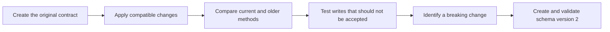
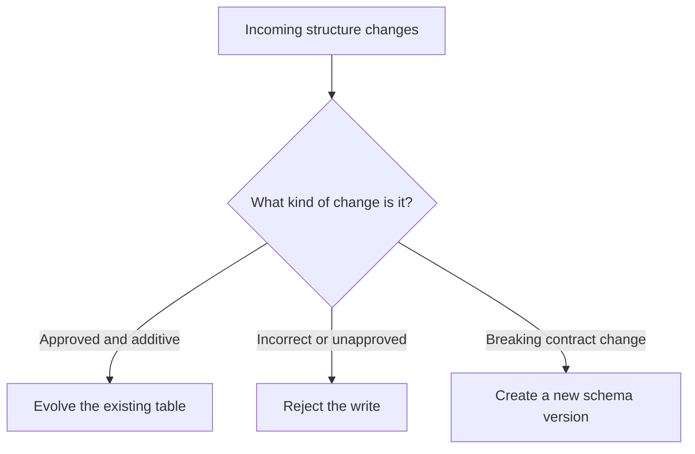
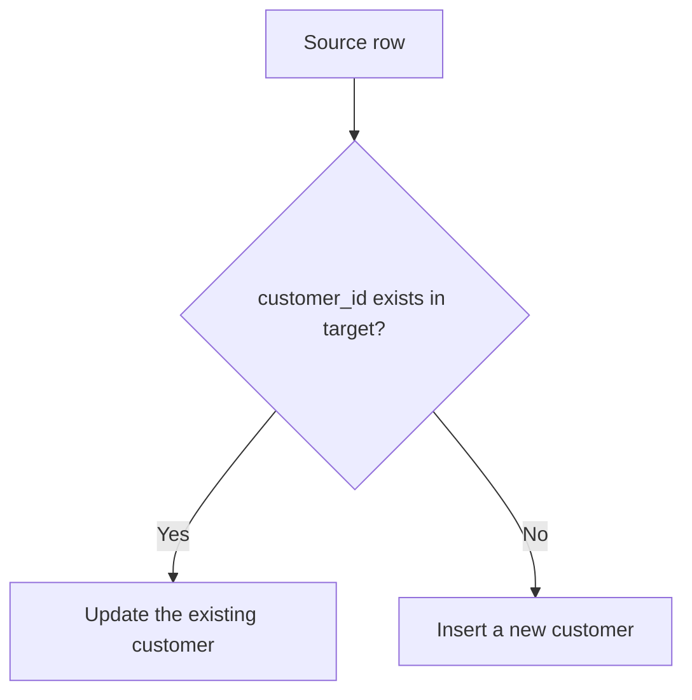
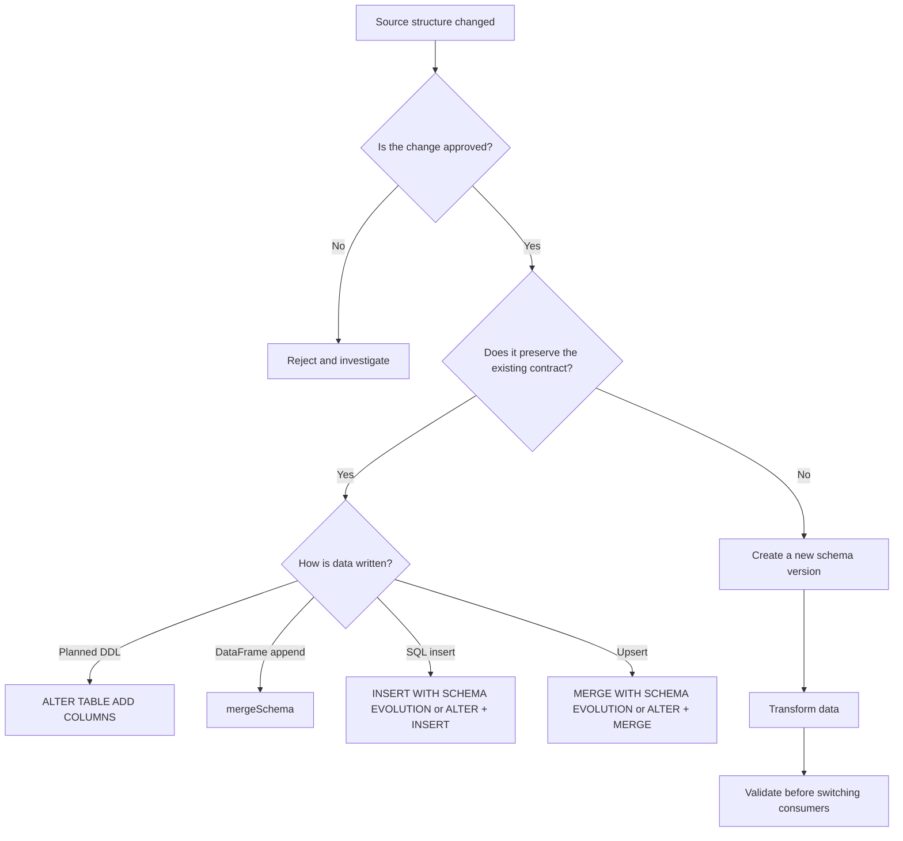

# Delta Schema Evolution and Versioned Schema Migration

## Compatible Changes, Failed Writes, and a Controlled Move from `customers_v1` to `customers_v2`

---

This session follows one customer table as its source data changes over time.



> **Working style:** Run each task in sequence. After every schema-changing operation, inspect both the schema and the affected records.

---

# Part 1 — Prepare the Managed Delta Tables

## 1. Why Managed Tables Are Used

All exercises in this session can be completed with Unity Catalog managed Delta tables.

A managed table does not require a `LOCATION` clause. Unity Catalog manages its storage location and data lifecycle.

This keeps the session focused on schema behavior instead of storage-path configuration.

---

## Task 1 — Select the Catalog and Create the Schema

Run in a SQL cell:

```sql
USE CATALOG training_catalog;
```

```sql
CREATE SCHEMA IF NOT EXISTS schema_evolution_demo;
```

```sql
USE SCHEMA schema_evolution_demo;
```

Verify the current namespace:

```sql
SELECT
    current_catalog() AS current_catalog,
    current_schema() AS current_schema;
```

Expected values:

| current_catalog | current_schema |
|---|---|
| `training_catalog` | `schema_evolution_demo` |

---

## Task 2 — Define the Table Names

Run in a Python cell:

```python
catalog_name = "training_catalog"
schema_name = "schema_evolution_demo"

v1_table = f"{catalog_name}.{schema_name}.customers_v1"
v2_table = f"{catalog_name}.{schema_name}.customers_v2"
legacy_merge_table = (
    f"{catalog_name}.{schema_name}.customers_merge_legacy_demo"
)
no_evolution_merge_table = (
    f"{catalog_name}.{schema_name}.customers_merge_no_evolution_demo"
)
rename_demo_table = (
    f"{catalog_name}.{schema_name}.customers_rename_risk_demo"
)
insert_current_table = (
    f"{catalog_name}.{schema_name}.customers_insert_current_demo"
)
insert_legacy_table = (
    f"{catalog_name}.{schema_name}.customers_insert_legacy_demo"
)
registry_table = (
    f"{catalog_name}.{schema_name}.customer_schema_registry"
)

print("Main table:", v1_table)
```

---

## Task 3 — Remove Objects from an Earlier Run

Managed-table cleanup only requires `DROP TABLE`.

```python
tables_to_drop = [
    v1_table,
    v2_table,
    legacy_merge_table,
    no_evolution_merge_table,
    rename_demo_table,
    insert_current_table,
    insert_legacy_table,
    registry_table,
]

for table_name in tables_to_drop:
    spark.sql(f"DROP TABLE IF EXISTS {table_name}")
    print(f"Dropped when present: {table_name}")
```

> Dropping a managed table also allows Unity Catalog to manage the cleanup of its underlying data. No manual filesystem deletion is used in this guide.

---

# Part 2 — Create the Original Schema Contract

## Task 4 — Create `customers_v1`

```sql
CREATE TABLE training_catalog.schema_evolution_demo.customers_v1
(
    customer_id   INT,
    customer_name STRING,
    city          STRING,
    email         STRING,
    is_active     BOOLEAN,
    updated_at    TIMESTAMP
)
USING DELTA;
```

The initial table has six columns:

```text
customer_id
customer_name
city
email
is_active
updated_at
```

---

## Task 5 — Insert the Original Five Records

```sql
INSERT INTO training_catalog.schema_evolution_demo.customers_v1
(
    customer_id,
    customer_name,
    city,
    email,
    is_active,
    updated_at
)
VALUES
    (
        101,
        'Aditi Sharma',
        'Pune',
        'aditi.sharma@example.com',
        true,
        TIMESTAMP '2026-08-03 09:00:00'
    ),
    (
        102,
        'Rahul Verma',
        'Mumbai',
        'rahul.verma@example.com',
        true,
        TIMESTAMP '2026-08-03 09:05:00'
    ),
    (
        103,
        'Neha Kulkarni',
        'Nagpur',
        'neha.kulkarni@example.com',
        true,
        TIMESTAMP '2026-08-03 09:10:00'
    ),
    (
        104,
        'Imran Shaikh',
        'Hyderabad',
        'imran.shaikh@example.com',
        false,
        TIMESTAMP '2026-08-03 09:15:00'
    ),
    (
        105,
        'Priya Nair',
        'Bengaluru',
        'priya.nair@example.com',
        true,
        TIMESTAMP '2026-08-03 09:20:00'
    );
```

---

## Task 6 — Inspect the Starting Point

```sql
SELECT *
FROM training_catalog.schema_evolution_demo.customers_v1
ORDER BY customer_id;
```

Expected records:

| customer_id | customer_name | city | email | is_active |
|---:|---|---|---|---|
| 101 | Aditi Sharma | Pune | aditi.sharma@example.com | true |
| 102 | Rahul Verma | Mumbai | rahul.verma@example.com | true |
| 103 | Neha Kulkarni | Nagpur | neha.kulkarni@example.com | true |
| 104 | Imran Shaikh | Hyderabad | imran.shaikh@example.com | false |
| 105 | Priya Nair | Bengaluru | priya.nair@example.com | true |

Inspect the schema:

```sql
DESCRIBE TABLE training_catalog.schema_evolution_demo.customers_v1;
```

Inspect the first Delta transactions:

```sql
DESCRIBE HISTORY training_catalog.schema_evolution_demo.customers_v1;
```

---

## 2.1 What Is a Schema Contract?

A table schema defines the structure that writers and readers expect.

For `customers_v1`, the original contract is:

```text
customer_id must be an integer.
customer_name is stored in one column.
city and email are text values.
is_active is a Boolean value.
updated_at is a timestamp.
```

A schema change should first be classified before it is accepted.



---

# Part 3 — Successful Compatible Changes

Compatible changes are introduced first so that each evolution method is understood before failed writes are tested.

---

# Section A — Planned Evolution with `ALTER TABLE`

## 3.1 When to Use This Method

Use an explicit `ALTER TABLE` when the new columns are known, reviewed, and approved before the data arrives.

The business now wants to store:

```text
phone_number
customer_segment
```

These are optional additions. Existing queries that use the original columns can continue to work.

---

## Task 7 — Add the Planned Columns

```sql
ALTER TABLE training_catalog.schema_evolution_demo.customers_v1
ADD COLUMNS
(
    phone_number     STRING,
    customer_segment STRING
);
```

Inspect the updated schema:

```sql
DESCRIBE TABLE training_catalog.schema_evolution_demo.customers_v1;
```

The new columns appear at the end of the schema.

---

## Task 8 — Insert Records Using the New Columns

```sql
INSERT INTO training_catalog.schema_evolution_demo.customers_v1
(
    customer_id,
    customer_name,
    city,
    email,
    is_active,
    updated_at,
    phone_number,
    customer_segment
)
VALUES
    (
        106,
        'Meera Joshi',
        'Pune',
        'meera.joshi@example.com',
        true,
        TIMESTAMP '2026-08-03 10:00:00',
        '+91-9000000106',
        'Silver'
    ),
    (
        107,
        'Arjun Rao',
        'Hyderabad',
        'arjun.rao@example.com',
        true,
        TIMESTAMP '2026-08-03 10:05:00',
        '+91-9000000107',
        'Gold'
    );
```

---

## Task 9 — Compare Old and New Records

```sql
SELECT
    customer_id,
    customer_name,
    phone_number,
    customer_segment
FROM training_catalog.schema_evolution_demo.customers_v1
WHERE customer_id IN (101, 106, 107)
ORDER BY customer_id;
```

Expected comparison:

| customer_id | customer_name | phone_number | customer_segment |
|---:|---|---|---|
| 101 | Aditi Sharma | `NULL` | `NULL` |
| 106 | Meera Joshi | +91-9000000106 | Silver |
| 107 | Arjun Rao | +91-9000000107 | Gold |

> **Observation:** Adding a column changes the table schema. It does not invent values for records that were written before the column existed.

---

# Section B — Automatic Append Evolution with `mergeSchema`

## 3.2 What Does `mergeSchema` Mean?

`mergeSchema` is a DataFrame write option.

It asks Delta Lake to combine approved source-only columns with the target table schema during that write.

```text
mergeSchema
    → combines compatible schemas during append or overwrite writes

SQL MERGE
    → matches source and target rows for update and insert operations
```

The names are similar, but they solve different problems.

---

## Task 10 — Create a Batch with a New Column

The next source batch introduces:

```text
preferred_channel
```

Records 108 and 109 make the change visible.

```python
from datetime import datetime
from pyspark.sql.types import (
    BooleanType,
    IntegerType,
    StringType,
    StructField,
    StructType,
    TimestampType,
)

append_schema = StructType(
    [
        StructField("customer_id", IntegerType(), False),
        StructField("customer_name", StringType(), True),
        StructField("city", StringType(), True),
        StructField("email", StringType(), True),
        StructField("is_active", BooleanType(), True),
        StructField("updated_at", TimestampType(), True),
        StructField("phone_number", StringType(), True),
        StructField("customer_segment", StringType(), True),
        StructField("preferred_channel", StringType(), True),
    ]
)

append_rows = [
    (
        108,
        "Sneha Patil",
        "Nashik",
        "sneha.patil@example.com",
        True,
        datetime(2026, 8, 3, 10, 30, 0),
        "+91-9000000108",
        "Silver",
        "Email",
    ),
    (
        109,
        "Vikram Singh",
        "Jaipur",
        "vikram.singh@example.com",
        True,
        datetime(2026, 8, 3, 10, 35, 0),
        "+91-9000000109",
        "Bronze",
        "SMS",
    ),
]

preferred_channel_df = spark.createDataFrame(
    append_rows,
    append_schema,
)

preferred_channel_df.show(truncate=False)
```

---

## Task 11 — Append with `mergeSchema`

```python
(
    preferred_channel_df.write
    .format("delta")
    .mode("append")
    .option("mergeSchema", "true")
    .saveAsTable(v1_table)
)
```

Inspect the evolved schema:

```sql
DESCRIBE TABLE training_catalog.schema_evolution_demo.customers_v1;
```

Inspect the affected records:

```sql
SELECT
    customer_id,
    customer_name,
    customer_segment,
    preferred_channel
FROM training_catalog.schema_evolution_demo.customers_v1
WHERE customer_id IN (106, 108, 109)
ORDER BY customer_id;
```

Expected comparison:

| customer_id | customer_name | customer_segment | preferred_channel |
|---:|---|---|---|
| 106 | Meera Joshi | Silver | `NULL` |
| 108 | Sneha Patil | Silver | Email |
| 109 | Vikram Singh | Bronze | SMS |

> **Observation:** The `mergeSchema` option was enabled only for this DataFrame write. It did not change a session-wide setting.

---

# Section C — Introduce SQL `MERGE` Before Evolving with It

## 3.3 What Does SQL `MERGE` Do?

SQL `MERGE` compares source rows with target rows using a matching condition.



The first `MERGE` uses only columns that already exist in the target. No schema evolution is needed.

---

## Task 12 — Create an Upsert Source with the Existing Schema

Customer 102 changes visibly:

```text
city: Mumbai → Navi Mumbai
email: rahul.verma@example.com → rahul.v@example.com
segment: NULL → Gold
preferred channel: NULL → WhatsApp
```

Customer 110 is new.

```sql
CREATE OR REPLACE TEMP VIEW customer_upsert_existing AS
SELECT *
FROM VALUES
    (
        102,
        'Rahul Verma',
        'Navi Mumbai',
        'rahul.v@example.com',
        true,
        TIMESTAMP '2026-08-03 11:30:00',
        '+91-9000000102',
        'Gold',
        'WhatsApp'
    ),
    (
        110,
        'Kavya Menon',
        'Chennai',
        'kavya.menon@example.com',
        true,
        TIMESTAMP '2026-08-03 11:35:00',
        '+91-9000000110',
        'Silver',
        'Email'
    )
AS source
(
    customer_id,
    customer_name,
    city,
    email,
    is_active,
    updated_at,
    phone_number,
    customer_segment,
    preferred_channel
);
```

---

## Task 13 — Run a Regular `MERGE`

```sql
MERGE INTO training_catalog.schema_evolution_demo.customers_v1 AS target
USING customer_upsert_existing AS source
ON target.customer_id = source.customer_id

WHEN MATCHED THEN
    UPDATE SET
        target.customer_name = source.customer_name,
        target.city = source.city,
        target.email = source.email,
        target.is_active = source.is_active,
        target.updated_at = source.updated_at,
        target.phone_number = source.phone_number,
        target.customer_segment = source.customer_segment,
        target.preferred_channel = source.preferred_channel

WHEN NOT MATCHED THEN
    INSERT
    (
        customer_id,
        customer_name,
        city,
        email,
        is_active,
        updated_at,
        phone_number,
        customer_segment,
        preferred_channel
    )
    VALUES
    (
        source.customer_id,
        source.customer_name,
        source.city,
        source.email,
        source.is_active,
        source.updated_at,
        source.phone_number,
        source.customer_segment,
        source.preferred_channel
    );
```

---

## Task 14 — Verify the Upsert

```sql
SELECT
    customer_id,
    customer_name,
    city,
    email,
    customer_segment,
    preferred_channel
FROM training_catalog.schema_evolution_demo.customers_v1
WHERE customer_id IN (102, 110)
ORDER BY customer_id;
```

Expected result:

| customer_id | customer_name | city | email | segment | channel |
|---:|---|---|---|---|---|
| 102 | Rahul Verma | Navi Mumbai | rahul.v@example.com | Gold | WhatsApp |
| 110 | Kavya Menon | Chennai | kavya.menon@example.com | Silver | Email |

> SQL `MERGE` has now been introduced as an upsert operation. The next section adds schema evolution to the same operation.

---

# Section D — Evolve the Schema During a `MERGE`

## 3.4 New Source Column: `loyalty_points`

The next source contains all existing columns and one approved new column:

```text
loyalty_points INT
```

Visible changes:

| customer_id | Operation | loyalty_points |
|---:|---|---:|
| 102 | Update existing customer | 750 |
| 110 | Update existing customer | 300 |
| 111 | Insert new customer | 120 |

---

## Task 15 — Create the Merge Source

```sql
CREATE OR REPLACE TEMP VIEW customer_upsert_with_points AS
SELECT *
FROM VALUES
    (
        102,
        'Rahul Verma',
        'Navi Mumbai',
        'rahul.v@example.com',
        true,
        TIMESTAMP '2026-08-03 12:15:00',
        '+91-9000000102',
        'Gold',
        'WhatsApp',
        750
    ),
    (
        110,
        'Kavya Menon',
        'Chennai',
        'kavya.menon@example.com',
        true,
        TIMESTAMP '2026-08-03 12:20:00',
        '+91-9000000110',
        'Silver',
        'Email',
        300
    ),
    (
        111,
        'Rohan Joshi',
        'Kolhapur',
        'rohan.joshi@example.com',
        true,
        TIMESTAMP '2026-08-03 12:25:00',
        '+91-9000000111',
        'Bronze',
        'SMS',
        120
    )
AS source
(
    customer_id,
    customer_name,
    city,
    email,
    is_active,
    updated_at,
    phone_number,
    customer_segment,
    preferred_channel,
    loyalty_points
);
```

---

## Task 16 — Preserve a Copy for the Older-Runtime Method

```sql
CREATE OR REPLACE TABLE
training_catalog.schema_evolution_demo.customers_merge_legacy_demo
USING DELTA
AS
SELECT *
FROM training_catalog.schema_evolution_demo.customers_v1;
```

Both tables now start from the same data and schema.

---

## Task 17A — Current Method: `MERGE WITH SCHEMA EVOLUTION`

> **Runtime note:** This SQL syntax is available in Databricks Runtime 15.4 LTS and above.

```sql
MERGE WITH SCHEMA EVOLUTION INTO
training_catalog.schema_evolution_demo.customers_v1 AS target
USING customer_upsert_with_points AS source
ON target.customer_id = source.customer_id

WHEN MATCHED THEN
    UPDATE SET *

WHEN NOT MATCHED THEN
    INSERT *;
```

This single transaction:

1. Adds `loyalty_points` to the target schema.
2. Updates customers 102 and 110.
3. Inserts customer 111.
4. Sets `loyalty_points` to `NULL` for older records not included in the source.

---

## Task 17B — Older-Runtime Method: Add the Column, Then Run a Regular `MERGE`

This approach works without the newer `MERGE WITH SCHEMA EVOLUTION` SQL clause.

### Step 1 — Change the Target Schema Explicitly

```sql
ALTER TABLE
training_catalog.schema_evolution_demo.customers_merge_legacy_demo
ADD COLUMNS
(
    loyalty_points INT
);
```

### Step 2 — Run a Regular `MERGE`

```sql
MERGE INTO
training_catalog.schema_evolution_demo.customers_merge_legacy_demo AS target
USING customer_upsert_with_points AS source
ON target.customer_id = source.customer_id

WHEN MATCHED THEN
    UPDATE SET
        target.customer_name = source.customer_name,
        target.city = source.city,
        target.email = source.email,
        target.is_active = source.is_active,
        target.updated_at = source.updated_at,
        target.phone_number = source.phone_number,
        target.customer_segment = source.customer_segment,
        target.preferred_channel = source.preferred_channel,
        target.loyalty_points = source.loyalty_points

WHEN NOT MATCHED THEN
    INSERT
    (
        customer_id,
        customer_name,
        city,
        email,
        is_active,
        updated_at,
        phone_number,
        customer_segment,
        preferred_channel,
        loyalty_points
    )
    VALUES
    (
        source.customer_id,
        source.customer_name,
        source.city,
        source.email,
        source.is_active,
        source.updated_at,
        source.phone_number,
        source.customer_segment,
        source.preferred_channel,
        source.loyalty_points
    );
```

### Compare the Two Results

```sql
SELECT
    'CURRENT_METHOD' AS method,
    customer_id,
    city,
    loyalty_points
FROM training_catalog.schema_evolution_demo.customers_v1
WHERE customer_id IN (102, 110, 111)

UNION ALL

SELECT
    'OLDER_METHOD' AS method,
    customer_id,
    city,
    loyalty_points
FROM training_catalog.schema_evolution_demo.customers_merge_legacy_demo
WHERE customer_id IN (102, 110, 111)

ORDER BY customer_id, method;
```

Both methods should produce the same business result.

| Method | Schema step | Data step |
|---|---|---|
| Current | Schema and data evolve in one `MERGE` | `MERGE WITH SCHEMA EVOLUTION` |
| Older-compatible | Add the column first | Regular `MERGE` |

> **Legacy automatic setting:** Older code may use `spark.databricks.delta.schema.autoMerge.enabled = true` before a regular `MERGE`. It is session-wide and can affect unrelated writes, so the explicit `ALTER TABLE` followed by regular `MERGE` is clearer for controlled pipelines.

Legacy configuration example:

```sql
SET spark.databricks.delta.schema.autoMerge.enabled = true;

-- Run a regular MERGE statement here.

SET spark.databricks.delta.schema.autoMerge.enabled = false;
```

---

# Section E — Optional SQL Insert Evolution

This section shows how the same idea applies to a SQL `INSERT` that contains a new column.

It uses separate demo tables so the main `customers_v1` result remains unchanged.

---

## Task 18 — Create Two Matching Demo Tables

```sql
CREATE OR REPLACE TABLE
training_catalog.schema_evolution_demo.customers_insert_current_demo
USING DELTA
AS
SELECT *
FROM training_catalog.schema_evolution_demo.customers_v1;
```

```sql
CREATE OR REPLACE TABLE
training_catalog.schema_evolution_demo.customers_insert_legacy_demo
USING DELTA
AS
SELECT *
FROM training_catalog.schema_evolution_demo.customers_v1;
```

---

## Task 19 — Create an Insert Source with `risk_band`

```sql
CREATE OR REPLACE TEMP VIEW customer_insert_with_risk AS
SELECT
    120 AS customer_id,
    'Tanvi Deshmukh' AS customer_name,
    'Aurangabad' AS city,
    'tanvi.deshmukh@example.com' AS email,
    true AS is_active,
    TIMESTAMP '2026-08-03 13:00:00' AS updated_at,
    '+91-9000000120' AS phone_number,
    'Silver' AS customer_segment,
    'Email' AS preferred_channel,
    90 AS loyalty_points,
    'LOW' AS risk_band;
```

---

## Task 20A — Current SQL Method

> **Runtime note:** `INSERT WITH SCHEMA EVOLUTION` is available in Databricks Runtime 18.1 and above.

```sql
INSERT WITH SCHEMA EVOLUTION INTO
training_catalog.schema_evolution_demo.customers_insert_current_demo
BY NAME
SELECT *
FROM customer_insert_with_risk;
```

This adds `risk_band` and inserts customer 120 in one operation.

---

## Task 20B — Older-Runtime SQL Method

### Step 1 — Add the Column Explicitly

```sql
ALTER TABLE
training_catalog.schema_evolution_demo.customers_insert_legacy_demo
ADD COLUMNS
(
    risk_band STRING
);
```

### Step 2 — Run a Regular Insert

```sql
INSERT INTO training_catalog.schema_evolution_demo.customers_insert_legacy_demo
(
    customer_id,
    customer_name,
    city,
    email,
    is_active,
    updated_at,
    phone_number,
    customer_segment,
    preferred_channel,
    loyalty_points,
    risk_band
)
SELECT
    customer_id,
    customer_name,
    city,
    email,
    is_active,
    updated_at,
    phone_number,
    customer_segment,
    preferred_channel,
    loyalty_points,
    risk_band
FROM customer_insert_with_risk;
```

Compare the two demo tables:

```sql
SELECT
    'CURRENT_METHOD' AS method,
    customer_id,
    customer_name,
    risk_band
FROM training_catalog.schema_evolution_demo.customers_insert_current_demo
WHERE customer_id = 120

UNION ALL

SELECT
    'OLDER_METHOD' AS method,
    customer_id,
    customer_name,
    risk_band
FROM training_catalog.schema_evolution_demo.customers_insert_legacy_demo
WHERE customer_id = 120;
```

> A DataFrame append with `.option("mergeSchema", "true")` is another operation-level alternative when the source is already a DataFrame.

---

# Part 4 — Validate the Successful Evolution

## Task 21 — Inspect the Final `customers_v1` Schema

```sql
DESCRIBE TABLE training_catalog.schema_evolution_demo.customers_v1;
```

Expected business columns:

```text
customer_id
customer_name
city
email
is_active
updated_at
phone_number
customer_segment
preferred_channel
loyalty_points
```

---

## Task 22 — Check the Final Row Count

```sql
SELECT COUNT(*) AS customer_count
FROM training_catalog.schema_evolution_demo.customers_v1;
```

Expected count:

```text
11
```

Count sequence:

```text
5 original records
+ 2 records after ALTER TABLE
+ 2 records after mergeSchema append
+ 1 new record from regular MERGE
+ 1 new record from MERGE WITH SCHEMA EVOLUTION
= 11 records
```

---

## Task 23 — Trace the Important Records

```sql
SELECT
    customer_id,
    customer_name,
    city,
    email,
    phone_number,
    customer_segment,
    preferred_channel,
    loyalty_points
FROM training_catalog.schema_evolution_demo.customers_v1
WHERE customer_id IN (101, 102, 106, 108, 110, 111)
ORDER BY customer_id;
```

| ID | What changed |
|---:|---|
| 101 | Original row; all later columns remain `NULL` |
| 102 | Updated by regular `MERGE`; loyalty points added by schema-evolving `MERGE` |
| 106 | Inserted after planned `ALTER TABLE`; later columns remain `NULL` |
| 108 | Inserted when `preferred_channel` was added with `mergeSchema` |
| 110 | Inserted by regular `MERGE`; loyalty points added later |
| 111 | Inserted together with the new `loyalty_points` column |

---

## Task 24 — Measure NULL Values Introduced by Additive Evolution

```sql
SELECT
    COUNT(*) AS total_records,
    SUM(CASE WHEN phone_number IS NULL THEN 1 ELSE 0 END)
        AS missing_phone_number,
    SUM(CASE WHEN preferred_channel IS NULL THEN 1 ELSE 0 END)
        AS missing_preferred_channel,
    SUM(CASE WHEN loyalty_points IS NULL THEN 1 ELSE 0 END)
        AS missing_loyalty_points
FROM training_catalog.schema_evolution_demo.customers_v1;
```

Expected values:

| Metric | Expected |
|---|---:|
| total_records | 11 |
| missing_phone_number | 4 |
| missing_preferred_channel | 6 |
| missing_loyalty_points | 8 |

> **Meaning:** Compatible evolution protects existing records, but it can introduce meaningful `NULL` patterns that downstream users must understand.

---

## Task 25 — Inspect the Delta History

```sql
DESCRIBE HISTORY training_catalog.schema_evolution_demo.customers_v1;
```

Look for separate committed operations for:

- Table creation
- Initial insert
- Planned schema change
- Insert after planned change
- DataFrame append with schema evolution
- Regular `MERGE`
- Schema-evolving `MERGE`

---

# Part 5 — Writes That Fail or Produce an Unwanted Result

The successful methods are now familiar. The next exercises show what happens when the required schema-change method is missing or when the requested change is not compatible.

---

# Section F — Extra Column Without `mergeSchema`

## Task 26 — Create a Batch with `marketing_consent`

```python
extra_column_schema = StructType(
    [
        StructField("customer_id", IntegerType(), False),
        StructField("customer_name", StringType(), True),
        StructField("city", StringType(), True),
        StructField("email", StringType(), True),
        StructField("is_active", BooleanType(), True),
        StructField("updated_at", TimestampType(), True),
        StructField("phone_number", StringType(), True),
        StructField("customer_segment", StringType(), True),
        StructField("preferred_channel", StringType(), True),
        StructField("loyalty_points", IntegerType(), True),
        StructField("marketing_consent", BooleanType(), True),
    ]
)

extra_column_rows = [
    (
        112,
        "Sana Khan",
        "Pune",
        "sana.khan@example.com",
        True,
        datetime(2026, 8, 3, 14, 0, 0),
        "+91-9000000112",
        "Bronze",
        "Email",
        80,
        True,
    )
]

extra_column_df = spark.createDataFrame(
    extra_column_rows,
    extra_column_schema,
)
```

---

## Task 27 — Append Without Enabling Evolution

```python
count_before = spark.table(v1_table).count()

try:
    (
        extra_column_df.write
        .format("delta")
        .mode("append")
        .saveAsTable(v1_table)
    )
    print("Unexpected result: the write succeeded.")
except Exception as error:
    print("Expected failure: marketing_consent is not in the target schema.")
    print(type(error).__name__)

count_after = spark.table(v1_table).count()
print("Count before:", count_before)
print("Count after :", count_after)
```

Expected result:

```text
Count before: 11
Count after : 11
```

The same source could be accepted by using one of these approved approaches:

```text
ALTER TABLE ADD COLUMNS
DataFrame write with mergeSchema
INSERT WITH SCHEMA EVOLUTION on a supported runtime
```

---

# Section G — Regular `MERGE` Does Not Automatically Add Source-Only Columns

A regular `MERGE` with `UPDATE SET *` and `INSERT *` can use matching target columns while leaving an extra source column out of the target schema.

This is important because the operation might succeed while the expected schema change does not happen.

---

## Task 28 — Create a Separate Merge Demo Table

```sql
CREATE OR REPLACE TABLE
training_catalog.schema_evolution_demo.customers_merge_no_evolution_demo
USING DELTA
AS
SELECT *
FROM training_catalog.schema_evolution_demo.customers_v1;
```

---

## Task 29 — Create a Source with `vip_flag`

```sql
CREATE OR REPLACE TEMP VIEW customer_merge_with_vip AS
SELECT
    customer_id,
    customer_name,
    city,
    email,
    is_active,
    updated_at,
    phone_number,
    customer_segment,
    preferred_channel,
    loyalty_points,
    true AS vip_flag
FROM training_catalog.schema_evolution_demo.customers_v1
WHERE customer_id = 102

UNION ALL

SELECT
    113,
    'Dev Malhotra',
    'Delhi',
    'dev.malhotra@example.com',
    true,
    TIMESTAMP '2026-08-03 14:20:00',
    '+91-9000000113',
    'Gold',
    'WhatsApp',
    500,
    true;
```

---

## Task 30 — Run a Regular `MERGE` Without Schema Evolution

```sql
MERGE INTO
training_catalog.schema_evolution_demo.customers_merge_no_evolution_demo AS target
USING customer_merge_with_vip AS source
ON target.customer_id = source.customer_id

WHEN MATCHED THEN
    UPDATE SET *

WHEN NOT MATCHED THEN
    INSERT *;
```

Inspect the schema:

```sql
DESCRIBE TABLE
training_catalog.schema_evolution_demo.customers_merge_no_evolution_demo;
```

Check the inserted row:

```sql
SELECT *
FROM training_catalog.schema_evolution_demo.customers_merge_no_evolution_demo
WHERE customer_id = 113;
```

Expected observation:

```text
Customer 113 can be inserted.
The vip_flag source column is not added to the target schema.
```

> **Important:** A successful data operation does not always mean the expected schema evolution occurred.

---

# Section H — Incompatible Existing-Column Type

## Task 31 — Create a Batch with a String Business Key

The target expects:

```text
customer_id INT
```

The source sends:

```text
customer_id = CUST-114
```

```python
incompatible_schema = StructType(
    [
        StructField("customer_id", StringType(), False),
        StructField("customer_name", StringType(), True),
        StructField("city", StringType(), True),
        StructField("email", StringType(), True),
        StructField("is_active", BooleanType(), True),
        StructField("updated_at", TimestampType(), True),
        StructField("phone_number", StringType(), True),
        StructField("customer_segment", StringType(), True),
        StructField("preferred_channel", StringType(), True),
        StructField("loyalty_points", IntegerType(), True),
    ]
)

incompatible_rows = [
    (
        "CUST-114",
        "Anaya Roy",
        "Kolkata",
        "anaya.roy@example.com",
        True,
        datetime(2026, 8, 3, 14, 40, 0),
        "+91-9000000114",
        "Silver",
        "Email",
        150,
    )
]

incompatible_df = spark.createDataFrame(
    incompatible_rows,
    incompatible_schema,
)
```

---

## Task 32 — Try the Write Even with `mergeSchema`

```python
count_before = spark.table(v1_table).count()

try:
    (
        incompatible_df.write
        .format("delta")
        .mode("append")
        .option("mergeSchema", "true")
        .saveAsTable(v1_table)
    )
    print("Unexpected result: the write succeeded.")
except Exception as error:
    print("Expected failure: customer_id cannot change from INT to formatted STRING.")
    print(type(error).__name__)

count_after = spark.table(v1_table).count()
print("Count before:", count_before)
print("Count after :", count_after)
```

Expected result:

```text
Count before: 11
Count after : 11
```

```text
mergeSchema
    → can add compatible source-only columns

mergeSchema
    → does not approve every change to an existing column
```

---

# Section I — A Rename-Like Change Can Be Technically Accepted but Semantically Wrong

Delta Lake cannot infer that `full_name` is intended to replace `customer_name`.

---

## Task 33 — Create a Small Rename-Risk Table

```sql
CREATE TABLE training_catalog.schema_evolution_demo.customers_rename_risk_demo
(
    customer_id   INT,
    customer_name STRING
)
USING DELTA;
```

```sql
INSERT INTO training_catalog.schema_evolution_demo.customers_rename_risk_demo
VALUES
    (301, 'Nitin Kumar');
```

---

## Task 34 — Append `full_name` with `mergeSchema`

```python
rename_like_df = spark.createDataFrame(
    [(302, "Pooja Mehta")],
    "customer_id INT, full_name STRING",
)

(
    rename_like_df.write
    .format("delta")
    .mode("append")
    .option("mergeSchema", "true")
    .saveAsTable(rename_demo_table)
)
```

Inspect the result:

```sql
SELECT *
FROM training_catalog.schema_evolution_demo.customers_rename_risk_demo
ORDER BY customer_id;
```

Expected result:

| customer_id | customer_name | full_name |
|---:|---|---|
| 301 | Nitin Kumar | `NULL` |
| 302 | `NULL` | Pooja Mehta |

The write succeeds technically, but the business contract is unclear.

```text
full_name was added as a new column.
customer_name was not renamed.
```

A rename must be handled explicitly after checking downstream impact.

---

# Part 6 — Classify the Changes

## 6.1 Compatible Additive Changes

These changes usually allow the existing table to continue serving current consumers:

| Change | Example | Typical method |
|---|---|---|
| Add an approved optional column | `phone_number` | `ALTER TABLE ADD COLUMNS` |
| Add a column during DataFrame append | `preferred_channel` | `mergeSchema` |
| Add a column during upsert | `loyalty_points` | Schema-evolving `MERGE` |
| Add a column during SQL insert | `risk_band` | Schema-evolving `INSERT` or explicit `ALTER` |

---

## 6.2 Incorrect, Unapproved, or Risky Changes

| Change | Why it needs attention |
|---|---|
| Extra column arrives without evolution enabled | The write contract does not allow it |
| Existing `INT` key arrives as formatted text | Existing type and key format are incompatible |
| `full_name` arrives instead of `customer_name` | Delta cannot infer rename intent |
| Regular `MERGE` contains an extra source column | The data write can succeed without adding the column |

---

## 6.3 Breaking Changes

A breaking change alters the structure or meaning expected by existing consumers.

The next requirement changes several parts of the contract:

```text
customer_id INT
    → customer_id STRING formatted as CUST-000101

customer_name STRING
    → first_name STRING and last_name STRING

is_active BOOLEAN
    → record_status STRING

country_code
    → newly required in the new contract
```

This change is large enough to require deliberate transformation, but still clear enough to inspect record by record.

---

# Part 7 — Create Business Schema Version 2

## 7.1 Delta Version and Business Schema Version Are Different

| Version type | Example | How it is created |
|---|---|---|
| Delta table version | 0, 1, 2, 3 | Every successful Delta transaction |
| Business schema version | `customers_v1`, `customers_v2` | A design and migration decision |

A new Delta transaction does not automatically mean that the business contract has moved from v1 to v2.

---

## Task 35 — Create `customers_v2`

```sql
CREATE TABLE training_catalog.schema_evolution_demo.customers_v2
(
    customer_id       STRING,
    first_name        STRING,
    last_name         STRING,
    city              STRING,
    email             STRING,
    phone_number      STRING,
    customer_segment  STRING,
    preferred_channel STRING,
    loyalty_points    INT,
    record_status     STRING,
    country_code      STRING,
    migrated_at       TIMESTAMP
)
USING DELTA;
```

Add a constraint for the new status values:

```sql
ALTER TABLE training_catalog.schema_evolution_demo.customers_v2
ADD CONSTRAINT valid_record_status
CHECK (record_status IN ('ACTIVE', 'INACTIVE'));
```

---

## Task 36 — Transform and Migrate the Records

```sql
INSERT INTO training_catalog.schema_evolution_demo.customers_v2
(
    customer_id,
    first_name,
    last_name,
    city,
    email,
    phone_number,
    customer_segment,
    preferred_channel,
    loyalty_points,
    record_status,
    country_code,
    migrated_at
)
SELECT
    CONCAT(
        'CUST-',
        LPAD(CAST(customer_id AS STRING), 6, '0')
    ) AS customer_id,
    SUBSTRING_INDEX(TRIM(customer_name), ' ', 1) AS first_name,
    SUBSTRING_INDEX(TRIM(customer_name), ' ', -1) AS last_name,
    city,
    email,
    phone_number,
    customer_segment,
    preferred_channel,
    loyalty_points,
    CASE
        WHEN is_active = true THEN 'ACTIVE'
        ELSE 'INACTIVE'
    END AS record_status,
    'IN' AS country_code,
    current_timestamp() AS migrated_at
FROM training_catalog.schema_evolution_demo.customers_v1;
```

Transformation examples:

| v1 value | v2 value |
|---|---|
| `101` | `CUST-000101` |
| `Aditi Sharma` | `Aditi` + `Sharma` |
| `true` | `ACTIVE` |
| `false` | `INACTIVE` |
| No country column | `IN` |

> **Name-processing note:** The sample records use two-part names. Real name data can contain middle names, single names, initials, and compound surnames. A production migration needs an agreed mapping rule rather than assuming every name has two parts.

---

# Part 8 — Validate the New Schema Version

## Task 37 — Compare Record Counts

```sql
SELECT
    (SELECT COUNT(*)
     FROM training_catalog.schema_evolution_demo.customers_v1)
        AS v1_count,
    (SELECT COUNT(*)
     FROM training_catalog.schema_evolution_demo.customers_v2)
        AS v2_count;
```

Expected:

| v1_count | v2_count |
|---:|---:|
| 11 | 11 |

---

## Task 38 — Inspect the Transformed Records

```sql
SELECT
    customer_id,
    first_name,
    last_name,
    city,
    record_status,
    country_code,
    loyalty_points
FROM training_catalog.schema_evolution_demo.customers_v2
ORDER BY customer_id;
```

Focus on these records:

```sql
SELECT *
FROM training_catalog.schema_evolution_demo.customers_v2
WHERE customer_id IN
(
    'CUST-000102',
    'CUST-000104',
    'CUST-000111'
)
ORDER BY customer_id;
```

Expected highlights:

| customer_id | name | expected status or change |
|---|---|---|
| CUST-000102 | Rahul Verma | Navi Mumbai, Gold, 750 points, ACTIVE |
| CUST-000104 | Imran Shaikh | INACTIVE |
| CUST-000111 | Rohan Joshi | New v1 customer carried into v2 |

---

## Task 39 — Validate the Customer-Key Format

```sql
SELECT
    COUNT(*) AS invalid_customer_ids
FROM training_catalog.schema_evolution_demo.customers_v2
WHERE customer_id IS NULL
   OR customer_id NOT RLIKE '^CUST-[0-9]{6}$';
```

Expected:

```text
0
```

---

## Task 40 — Check for Duplicate Keys

```sql
SELECT
    customer_id,
    COUNT(*) AS occurrences
FROM training_catalog.schema_evolution_demo.customers_v2
GROUP BY customer_id
HAVING COUNT(*) > 1;
```

Expected:

```text
No rows
```

---

## Task 41 — Validate Required Derived Values

```sql
SELECT
    SUM(CASE WHEN first_name IS NULL OR TRIM(first_name) = ''
             THEN 1 ELSE 0 END) AS missing_first_name,
    SUM(CASE WHEN last_name IS NULL OR TRIM(last_name) = ''
             THEN 1 ELSE 0 END) AS missing_last_name,
    SUM(CASE WHEN country_code IS NULL
             THEN 1 ELSE 0 END) AS missing_country_code,
    SUM(CASE WHEN record_status NOT IN ('ACTIVE', 'INACTIVE')
             THEN 1 ELSE 0 END) AS invalid_status
FROM training_catalog.schema_evolution_demo.customers_v2;
```

Expected values:

| Validation | Expected |
|---|---:|
| missing_first_name | 0 |
| missing_last_name | 0 |
| missing_country_code | 0 |
| invalid_status | 0 |

---

## Task 42 — Compare v1 and v2 Side by Side

```sql
SELECT
    v1.customer_id AS v1_customer_id,
    v2.customer_id AS v2_customer_id,
    v1.customer_name,
    CONCAT(v2.first_name, ' ', v2.last_name) AS rebuilt_name,
    v1.is_active,
    v2.record_status,
    v1.city AS v1_city,
    v2.city AS v2_city
FROM training_catalog.schema_evolution_demo.customers_v1 AS v1
JOIN training_catalog.schema_evolution_demo.customers_v2 AS v2
    ON v2.customer_id = CONCAT(
        'CUST-',
        LPAD(CAST(v1.customer_id AS STRING), 6, '0')
    )
ORDER BY v1.customer_id;
```

This confirms that the new contract was created through a controlled transformation rather than an uncontrolled in-place change.

---

# Part 9 — Optional Schema-Version Registry

A small registry can record which business schema version is currently active.

## Task 43 — Create the Registry

```sql
CREATE TABLE training_catalog.schema_evolution_demo.customer_schema_registry
(
    entity_name    STRING,
    schema_version STRING,
    table_name     STRING,
    status         STRING,
    activated_at   TIMESTAMP
)
USING DELTA;
```

---

## Task 44 — Register v1 and v2

```sql
INSERT INTO training_catalog.schema_evolution_demo.customer_schema_registry
VALUES
    (
        'customer',
        'v1',
        'training_catalog.schema_evolution_demo.customers_v1',
        'PREVIOUS',
        TIMESTAMP '2026-08-03 09:00:00'
    ),
    (
        'customer',
        'v2',
        'training_catalog.schema_evolution_demo.customers_v2',
        'CURRENT',
        current_timestamp()
    );
```

```sql
SELECT *
FROM training_catalog.schema_evolution_demo.customer_schema_registry
ORDER BY schema_version;
```

> The registry records a project decision. Delta Lake does not automatically label a business schema as v1 or v2.

---

# Part 10 — Decision Guide



## 10.1 Method Comparison

| Method | Best fit | Runtime consideration |
|---|---|---|
| `ALTER TABLE ADD COLUMNS` | Planned and reviewed additions | Broadly compatible |
| DataFrame `mergeSchema` | Approved new columns during DataFrame write | Operation-level and widely used |
| Regular SQL `MERGE` | Upsert using an existing matching schema | Does not automatically add source-only columns |
| `MERGE WITH SCHEMA EVOLUTION` | Upsert and compatible evolution together | DBR 15.4 LTS+ |
| Explicit `ALTER` + regular `MERGE` | Older-compatible controlled upsert evolution | Two-step approach |
| `INSERT WITH SCHEMA EVOLUTION` | SQL insert and compatible evolution together | DBR 18.1+ |
| Explicit `ALTER` + regular `INSERT` | Older-compatible SQL insert evolution | Two-step approach |
| New versioned table | Breaking structural or semantic change | Requires migration and validation |

---

# Part 11 — Important Boundaries

## 11.1 Schema Evolution Does Not Understand Business Intent

Delta Lake can detect column names and data types. It cannot decide that:

- `full_name` means the same thing as `customer_name`
- a key-format change is safe for downstream systems
- a new field should be mandatory
- an old field can be removed without impact

Technical compatibility and business compatibility are separate decisions.

---

## 11.2 Existing Rows Receive `NULL`

Additive evolution normally leaves older records with `NULL` in the new columns.

This can affect:

- reports
- joins
- filters
- data-quality rules
- downstream applications

A new column should be accompanied by a plan for old records when `NULL` is not acceptable.

---

## 11.3 Avoid a Session-Wide Evolution Setting for Normal Pipelines

This legacy configuration exists:

```sql
SET spark.databricks.delta.schema.autoMerge.enabled = true;
```

It can affect several writes in the same session. Operation-level methods make the intended schema-changing write easier to identify.

Prefer:

```text
mergeSchema on a specific DataFrame write
MERGE WITH SCHEMA EVOLUTION on a specific MERGE
INSERT WITH SCHEMA EVOLUTION on a specific INSERT
```

---

## 11.4 Renaming and Dropping Columns Need Separate Review

Renaming or dropping a column is not the same as adding an optional column.

Possible approaches can involve:

- explicit column mapping
- table rewrites
- downstream-query updates
- stream restarts
- compatibility checks
- physical-data cleanup after a drop

These topics should be handled as a separate advanced exercise.

---

## 11.5 Type Widening Is a Separate Feature

Some numeric type changes can be supported through type widening on suitable runtimes and table configurations.

The change in this guide is different:

```text
101 INT
    → CUST-000101 STRING
```

This is a new key format and a changed business contract, not merely a wider numeric type.

---

## 11.6 `schemaLocation` and `checkpointLocation` Are Not Needed Here

This guide uses batch writes to managed Delta tables.

The following options belong to a later Auto Loader and Structured Streaming flow:

| Setting | Purpose |
|---|---|
| Auto Loader `schemaLocation` | Stores inferred source-schema information and evolution metadata |
| Streaming `checkpointLocation` | Stores stream progress and recovery state |
| Delta log checkpoint | Summarizes Delta transaction-log state |

They solve different problems and should not be mixed with the batch table-evolution methods used here.

---

# Part 12 — Review Questions

## Q1. Why did records 101–105 receive `NULL` in `phone_number`?

<details>
<summary>Show answer</summary>

They were written before `phone_number` existed. Adding a column changes the schema but does not create historical values automatically.

</details>

---

## Q2. What is the difference between `mergeSchema` and SQL `MERGE`?

<details>
<summary>Show answer</summary>

`mergeSchema` combines compatible schemas during a DataFrame write. SQL `MERGE` matches source and target rows to update existing records and insert new records.

</details>

---

## Q3. Why was a regular `MERGE` demonstrated before `MERGE WITH SCHEMA EVOLUTION`?

<details>
<summary>Show answer</summary>

It separates two ideas. First, `MERGE` is understood as an upsert operation. Then schema evolution is added to the same operation.

</details>

---

## Q4. What is the older-compatible alternative to `MERGE WITH SCHEMA EVOLUTION`?

<details>
<summary>Show answer</summary>

Add the approved columns explicitly with `ALTER TABLE`, and then run a regular `MERGE` using those columns.

</details>

---

## Q5. Why did the append containing `marketing_consent` fail?

<details>
<summary>Show answer</summary>

The target did not contain the column and the write did not enable any schema-evolution method.

</details>

---

## Q6. Why did `mergeSchema` not accept `CUST-114` as `customer_id`?

<details>
<summary>Show answer</summary>

The existing target column is an integer business key. The source sent a formatted string key. This is an incompatible change to an existing column, not an additive column.

</details>

---

## Q7. Why was `full_name` added instead of renaming `customer_name`?

<details>
<summary>Show answer</summary>

Delta Lake compares column names. It cannot infer that a new name represents the same business field. The source-only column was therefore added as another column.

</details>

---

## Q8. Why was `customers_v2` created as a separate table?

<details>
<summary>Show answer</summary>

The new contract changes the key format, splits the name, replaces a Boolean status, and adds a required country code. A separate version preserves the original contract while the transformation is validated.

</details>

---

## Q9. Is matching the v1 and v2 row count enough?

<details>
<summary>Show answer</summary>

No. Key format, uniqueness, name transformation, required values, statuses, and selected record-level comparisons must also be checked.

</details>

---

# Part 13 — Troubleshooting

## Issue 1 — `MERGE WITH SCHEMA EVOLUTION` Is Not Recognized

Possible reason:

```text
The compute runtime is earlier than Databricks Runtime 15.4 LTS.
```

Use the older-compatible path:

```text
ALTER TABLE ADD COLUMNS
        ↓
regular MERGE
```

---

## Issue 2 — `INSERT WITH SCHEMA EVOLUTION` Is Not Recognized

Possible reason:

```text
The compute runtime is earlier than Databricks Runtime 18.1.
```

Use either:

```text
ALTER TABLE ADD COLUMNS + regular INSERT
```

or a DataFrame append with:

```python
df.write.option("mergeSchema", "true")
```

---

## Issue 3 — The Extra-Column Append Unexpectedly Succeeds

Check whether one of these is still active:

```text
mergeSchema on the write
spark.databricks.delta.schema.autoMerge.enabled = true
```

Inspect the configuration:

```python
print(
    spark.conf.get(
        "spark.databricks.delta.schema.autoMerge.enabled",
        "not-set",
    )
)
```

Reset it when necessary:

```python
spark.conf.set(
    "spark.databricks.delta.schema.autoMerge.enabled",
    "false",
)
```

---

## Issue 4 — A `MERGE` Fails Because Multiple Source Rows Match One Target Row

Check the source:

```sql
SELECT
    customer_id,
    COUNT(*) AS source_count
FROM customer_upsert_with_points
GROUP BY customer_id
HAVING COUNT(*) > 1;
```

Deduplicate or select the latest source record before running the `MERGE`.

---

## Issue 5 — Managed Table Creation Fails

Confirm the required Unity Catalog privileges:

```text
USE CATALOG
USE SCHEMA
CREATE TABLE
```

No external location, storage credential, `READ FILES`, or `WRITE FILES` permission is required for these managed-table exercises.

---

# Part 14 — Cleanup

Run after completing the exercises:

```python
for table_name in tables_to_drop:
    spark.sql(f"DROP TABLE IF EXISTS {table_name}")
    print(f"Dropped: {table_name}")
```

Temporary views disappear with the session. They can also be removed explicitly:

```sql
DROP VIEW IF EXISTS customer_upsert_existing;
DROP VIEW IF EXISTS customer_upsert_with_points;
DROP VIEW IF EXISTS customer_insert_with_risk;
DROP VIEW IF EXISTS customer_merge_with_vip;
```

---

# Final Recap

```text
Start with a clear schema contract.
        ↓
Apply approved additive changes with a controlled method.
        ↓
Understand each write method before testing failures.
        ↓
Do not treat every successful write as a correct schema change.
        ↓
Reject incompatible or unapproved changes.
        ↓
Create a new schema version when the business contract changes.
        ↓
Validate data before moving consumers to the new version.
```

