# Unity Catalog Paths, Object Lifecycle, and Files-to-Gold POC

## 1.5-Hour Hands-on Guide

---

# 1. What You Will Build

In this POC, you will work with CSV, JSON, and Delta data.

You will:

- Inspect how Unity Catalog selects storage for managed objects
- Upload CSV and JSON files into a managed volume
- Create managed Delta tables from CSV and JSON files
- Create a managed Delta source table using `INSERT INTO`
- Create external CSV, JSON, and Delta tables
- Compare managed and external storage paths
- Test Unity Catalog path-overlap protection
- Drop and recover a managed table
- Drop and re-register an external table
- Query six source tables
- Combine all source data
- Create an aggregated managed Delta table that represents a gold layer

---

# 2. Complete Workflow

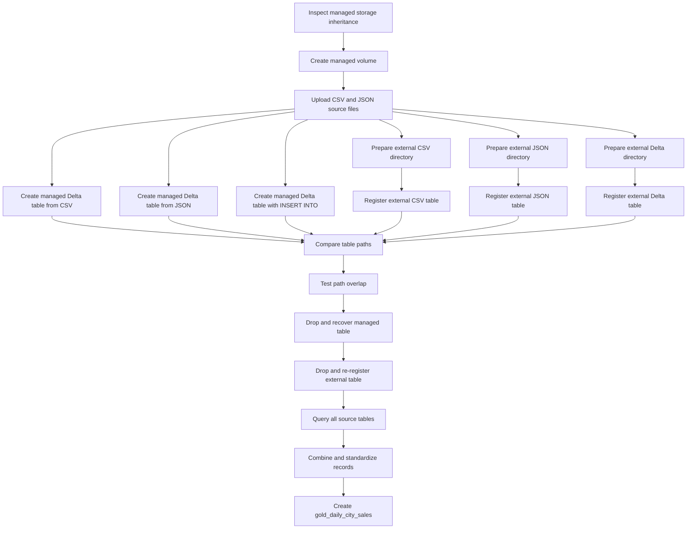

---

# 3. Main Learning Path

```text
Files
    ↓
Source tables
    ↓
Standardized query
    ↓
Combined records
    ↓
Business aggregation
    ↓
Managed Delta gold table
```

---

# 4. Time Plan

| Time | Activity |
|---:|---|
| 0–8 minutes | Review the POC flow and verify prerequisites |
| 8–18 minutes | Inspect managed-storage inheritance |
| 18–28 minutes | Create the volume and upload source files |
| 28–42 minutes | Create three managed Delta source tables |
| 42–57 minutes | Prepare and register three external source tables |
| 57–65 minutes | Compare physical paths |
| 65–72 minutes | Demonstrate path-overlap protection |
| 72–80 minutes | Drop and recover a managed table |
| 80–85 minutes | Drop and re-register an external table |
| 85–90 minutes | Combine source data and create the gold table |

---

# 5. Objects Used in This POC

Replace the catalog name when your workspace uses a different catalog.

| Object | Name |
|---|---|
| Catalog | `training_catalog` |
| Schema | `session_demo` |
| Managed volume | `source_files` |
| Managed table created from CSV | `managed_csv_orders` |
| Managed table created from JSON | `managed_json_orders` |
| Managed table populated with SQL | `managed_delta_orders` |
| External CSV table | `external_csv_orders` |
| External JSON table | `external_json_orders` |
| External Delta table | `external_delta_orders` |
| Combined temporary view | `all_order_sources` |
| Gold table | `gold_daily_city_sales` |

---

# 6. Source Table Design

All source tables use the same columns:

```text
order_id
customer_name
city
product_category
order_amount
order_date
```

Using the same structure makes the final `UNION ALL` easy to understand.

---

# 7. Prerequisites

You need:

- An Azure Databricks workspace with Unity Catalog enabled
- A Unity Catalog-compatible compute resource
- Databricks Runtime 13.3 LTS or above
- An existing standard catalog
- A catalog that has access to managed storage
- An existing external location backed by ADLS Gen2
- Permission to create a schema
- Permission to create managed tables and volumes
- Permission to create external tables
- Permission to read and write files under the external location

Typical privileges include:

```text
USE CATALOG
USE SCHEMA
CREATE TABLE
CREATE VOLUME
READ VOLUME
WRITE VOLUME
CREATE EXTERNAL TABLE
READ FILES
WRITE FILES
```

The exact permissions depend on the ownership and grants already configured in the workspace.

---

# 8. Values You Must Replace

The examples use:

```text
training_catalog
session_demo
```

The external ADLS root is shown as:

```text
abfss://<container>@<storage-account>.dfs.core.windows.net/uc_session_demo
```

Replace:

```text
<container>
<storage-account>
```

Example format:

```text
abfss://training@companylake.dfs.core.windows.net/uc_session_demo
```

Do not use the root of an external location for a table.

Use separate child directories:

```text
/uc_session_demo/external_csv_orders/
/uc_session_demo/external_json_orders/
/uc_session_demo/external_delta_orders/
```

---

# Part A — Set Up the Namespace

# 9. Select the Catalog

Run in a SQL cell:

```sql
USE CATALOG training_catalog;
```

Check the current catalog:

```sql
SELECT current_catalog();
```

Expected result:

```text
training_catalog
```

---

# 10. Create the Schema

```sql
CREATE SCHEMA IF NOT EXISTS training_catalog.session_demo
COMMENT 'Schema used for paths, lifecycle, and files-to-gold POC';
```

Select it:

```sql
USE SCHEMA session_demo;
```

Check the namespace:

```sql
SELECT
    current_catalog() AS current_catalog,
    current_schema() AS current_schema;
```

Expected result:

```text
training_catalog
session_demo
```

---

# Part B — Inspect Managed-Storage Inheritance

# 11. Why Managed-Storage Inheritance Matters

A managed table or managed volume does not require you to provide a physical path.

Unity Catalog selects the location.

It checks for managed storage in this order:

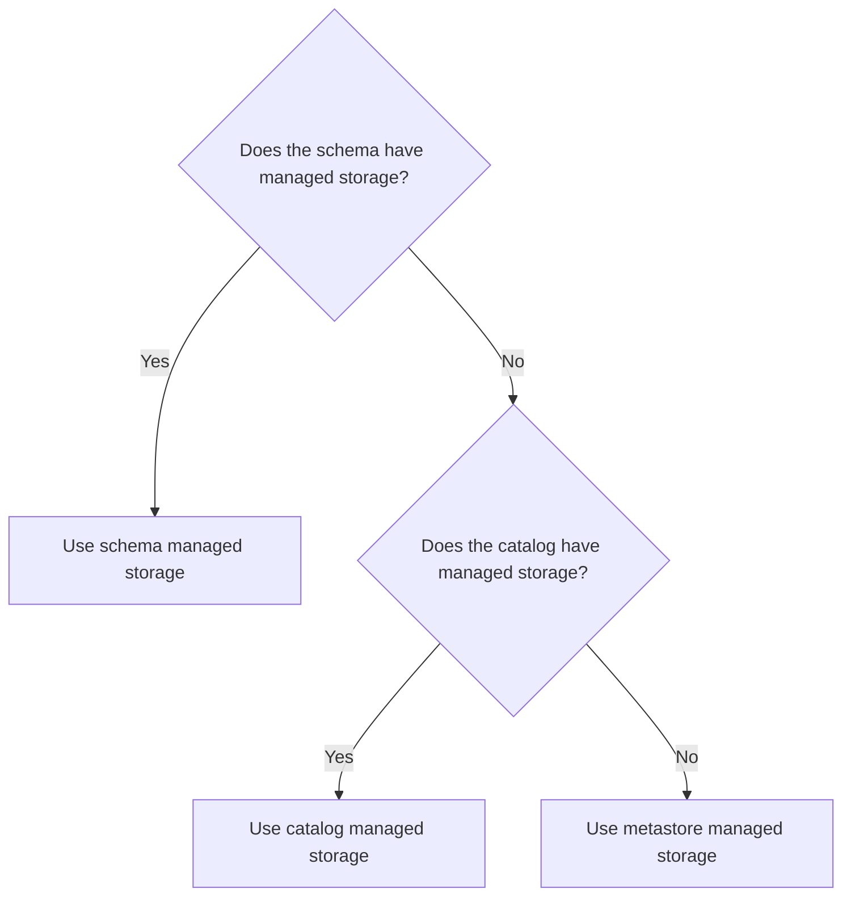

The closest configured location is used.

```text
Schema location
    takes priority over
Catalog location
    takes priority over
Metastore location
```

---

# 12. Inspect the Catalog

```sql
DESCRIBE CATALOG EXTENDED training_catalog;
```

Look for storage-related information.

Depending on the workspace configuration, the output can show information such as:

```text
Catalog type
Storage root
Storage location
Owner
Comment
```

---

# 13. Inspect the Schema

```sql
DESCRIBE SCHEMA EXTENDED training_catalog.session_demo;
```

Ask these questions while reviewing the output:

```text
Does the schema have its own managed location?

If it does not, does the catalog have one?

If neither has one, is metastore managed storage available?
```

---

# 14. Expected Storage Decision

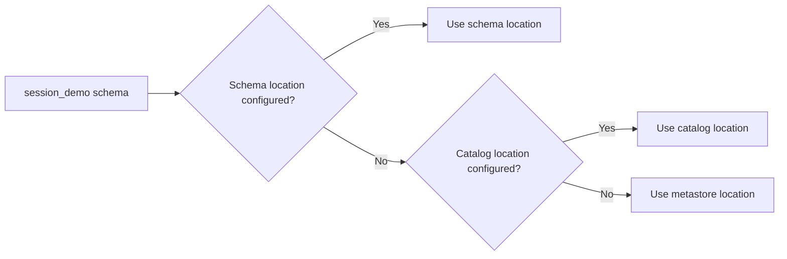

You do not manually create the internal managed table directories.

Unity Catalog creates unique internal paths for managed tables and managed volumes.

---

# Part C — Create the Managed Volume

# 15. Create the Volume

```sql
CREATE VOLUME IF NOT EXISTS
    training_catalog.session_demo.source_files
COMMENT 'Source files used in the files-to-gold POC';
```

Inspect it:

```sql
DESCRIBE VOLUME
    training_catalog.session_demo.source_files;
```

The volume path is:

```text
/Volumes/training_catalog/session_demo/source_files/
```

---

# 16. Create Four Source Directories

The volume will contain four source areas:

```text
/Volumes/training_catalog/session_demo/source_files/managed_csv/
/Volumes/training_catalog/session_demo/source_files/managed_json/
/Volumes/training_catalog/session_demo/source_files/external_csv/
/Volumes/training_catalog/session_demo/source_files/external_json/
```

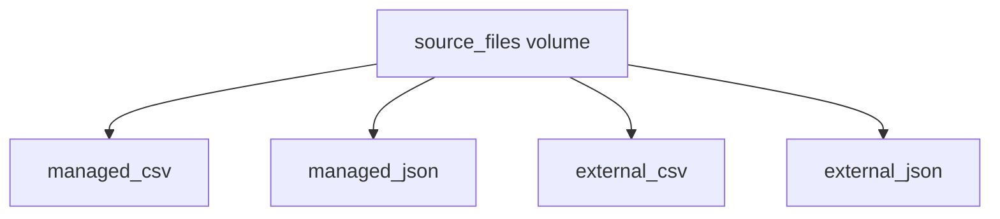

The first two files will create managed Delta tables.

The second two files will be copied into separate ADLS directories and registered as external tables.

---

# Part D — Prepare the Source Files

# 17. Create `managed_orders.csv`

Create a local file named:

```text
managed_orders.csv
```

Add this content:

```csv
order_id,customer_name,city,product_category,order_amount,order_date
101,Aditi,Pune,Electronics,1250.00,2026-07-20
102,Rahul,Mumbai,Books,650.00,2026-07-20
103,Neha,Bengaluru,Home,2100.00,2026-07-21
104,Aman,Pune,Fitness,1800.00,2026-07-21
```

Upload it to:

```text
/Volumes/training_catalog/session_demo/source_files/managed_csv/
```

---

# 18. Create `managed_orders.json`

Create a local file named:

```text
managed_orders.json
```

Use newline-delimited JSON:

```json
{"order_id":201,"customer_name":"Priya","city":"Pune","product_category":"Books","order_amount":900.00,"order_date":"2026-07-22"}
{"order_id":202,"customer_name":"Vikram","city":"Mumbai","product_category":"Electronics","order_amount":3200.00,"order_date":"2026-07-22"}
{"order_id":203,"customer_name":"Meera","city":"Bengaluru","product_category":"Home","order_amount":1450.00,"order_date":"2026-07-23"}
{"order_id":204,"customer_name":"Karan","city":"Pune","product_category":"Fitness","order_amount":1100.00,"order_date":"2026-07-23"}
```

Upload it to:

```text
/Volumes/training_catalog/session_demo/source_files/managed_json/
```

---

# 19. Create `external_orders.csv`

Create a local file named:

```text
external_orders.csv
```

Add:

```csv
order_id,customer_name,city,product_category,order_amount,order_date
401,Riya,Mumbai,Electronics,2700.00,2026-07-24
402,Kabir,Pune,Home,1600.00,2026-07-24
403,Isha,Bengaluru,Books,750.00,2026-07-25
404,Arjun,Mumbai,Fitness,2300.00,2026-07-25
```

Upload it to:

```text
/Volumes/training_catalog/session_demo/source_files/external_csv/
```

---

# 20. Create `external_orders.json`

Create a local file named:

```text
external_orders.json
```

Add:

```json
{"order_id":501,"customer_name":"Sana","city":"Pune","product_category":"Electronics","order_amount":1850.00,"order_date":"2026-07-26"}
{"order_id":502,"customer_name":"Mohit","city":"Mumbai","product_category":"Home","order_amount":2900.00,"order_date":"2026-07-26"}
{"order_id":503,"customer_name":"Anaya","city":"Bengaluru","product_category":"Fitness","order_amount":1250.00,"order_date":"2026-07-27"}
{"order_id":504,"customer_name":"Dev","city":"Pune","product_category":"Books","order_amount":800.00,"order_date":"2026-07-27"}
```

Upload it to:

```text
/Volumes/training_catalog/session_demo/source_files/external_json/
```

---

# 21. Upload Through Catalog Explorer

Open:

```text
Catalog Explorer
→ training_catalog
→ session_demo
→ source_files
```

Create the required directories and upload each file into its matching directory.

Use this layout:

```text
source_files
├── managed_csv
│   └── managed_orders.csv
├── managed_json
│   └── managed_orders.json
├── external_csv
│   └── external_orders.csv
└── external_json
    └── external_orders.json
```

---

# 22. Verify the Uploads

Run in a Python cell:

```python
base_volume_path = (
    "/Volumes/training_catalog/"
    "session_demo/source_files"
)

for folder in [
    "managed_csv",
    "managed_json",
    "external_csv",
    "external_json",
]:
    print(f"\nFiles in {folder}:")
    display(
        dbutils.fs.ls(
            f"{base_volume_path}/{folder}/"
        )
    )
```

Expected files:

```text
managed_csv/managed_orders.csv
managed_json/managed_orders.json
external_csv/external_orders.csv
external_json/external_orders.json
```

---

# Part E — Create Managed Delta Source Tables

# 23. Important Format Distinction

The CSV and JSON files are source formats.

The managed tables created from them will be Delta tables.

```text
CSV file
    ↓
Managed Delta table
```

```text
JSON file
    ↓
Managed Delta table
```

Unity Catalog managed tables are not managed CSV or managed JSON tables.

Managed tables use Delta Lake or supported managed Iceberg.

---

# 24. Create a Managed Delta Table from CSV

Use `read_files` with an explicit schema:

```sql
CREATE OR REPLACE TABLE
    training_catalog.session_demo.managed_csv_orders
USING DELTA
COMMENT 'Managed Delta table created from a CSV source file'
AS
SELECT
    order_id,
    customer_name,
    city,
    product_category,
    order_amount,
    order_date
FROM read_files(
    '/Volumes/training_catalog/session_demo/source_files/managed_csv/',
    format => 'csv',
    header => true,
    schema => '
        order_id INT,
        customer_name STRING,
        city STRING,
        product_category STRING,
        order_amount DECIMAL(10,2),
        order_date DATE
    '
);
```

No `LOCATION` is provided.

Therefore:

```text
managed_csv_orders
    =
Managed Delta table
```

---

# 25. Verify the CSV-Origin Managed Table

```sql
SELECT *
FROM training_catalog.session_demo.managed_csv_orders
ORDER BY order_id;
```

Expected count:

```sql
SELECT COUNT(*) AS row_count
FROM training_catalog.session_demo.managed_csv_orders;
```

Expected result:

```text
4
```

Inspect the table:

```sql
DESCRIBE DETAIL
training_catalog.session_demo.managed_csv_orders;
```

Focus on:

```text
format
location
numFiles
sizeInBytes
```

Expected format:

```text
delta
```

---

# 26. Create a Managed Delta Table from JSON

```sql
CREATE OR REPLACE TABLE
    training_catalog.session_demo.managed_json_orders
USING DELTA
COMMENT 'Managed Delta table created from a JSON source file'
AS
SELECT
    order_id,
    customer_name,
    city,
    product_category,
    order_amount,
    order_date
FROM read_files(
    '/Volumes/training_catalog/session_demo/source_files/managed_json/',
    format => 'json',
    schema => '
        order_id INT,
        customer_name STRING,
        city STRING,
        product_category STRING,
        order_amount DECIMAL(10,2),
        order_date DATE
    '
);
```

---

# 27. Verify the JSON-Origin Managed Table

```sql
SELECT *
FROM training_catalog.session_demo.managed_json_orders
ORDER BY order_id;
```

Expected count:

```sql
SELECT COUNT(*) AS row_count
FROM training_catalog.session_demo.managed_json_orders;
```

Expected result:

```text
4
```

Inspect it:

```sql
DESCRIBE DETAIL
training_catalog.session_demo.managed_json_orders;
```

Expected format:

```text
delta
```

---

# 28. Create the Managed Delta Source Table

Create an empty managed Delta table:

```sql
CREATE OR REPLACE TABLE
    training_catalog.session_demo.managed_delta_orders
(
    order_id          INT,
    customer_name     STRING,
    city              STRING,
    product_category  STRING,
    order_amount      DECIMAL(10,2),
    order_date        DATE
)
USING DELTA
COMMENT 'Managed Delta source table populated using INSERT INTO';
```

No `LOCATION` is supplied.

Unity Catalog selects the managed location.

---

# 29. Insert Eight Rows

```sql
INSERT INTO training_catalog.session_demo.managed_delta_orders
VALUES
    (301, 'Anil',   'Mumbai',    'Books',       700.00,  DATE '2026-07-20'),
    (302, 'Pooja',  'Pune',      'Electronics', 2600.00, DATE '2026-07-20'),
    (303, 'Rohan',  'Bengaluru', 'Fitness',     1500.00, DATE '2026-07-21'),
    (304, 'Kavya',  'Mumbai',    'Home',        1950.00, DATE '2026-07-21'),
    (305, 'Nitin',  'Pune',      'Books',       550.00,  DATE '2026-07-22'),
    (306, 'Simran', 'Bengaluru', 'Electronics', 3100.00, DATE '2026-07-22'),
    (307, 'Varun',  'Mumbai',    'Fitness',     2250.00, DATE '2026-07-23'),
    (308, 'Diya',   'Pune',      'Home',        1750.00, DATE '2026-07-23');
```

---

# 30. Verify the Managed Delta Source Table

```sql
SELECT *
FROM training_catalog.session_demo.managed_delta_orders
ORDER BY order_id;
```

Expected count:

```sql
SELECT COUNT(*) AS row_count
FROM training_catalog.session_demo.managed_delta_orders;
```

Expected result:

```text
8
```

Inspect its path:

```sql
DESCRIBE DETAIL
training_catalog.session_demo.managed_delta_orders;
```

---

# 31. Managed Source Architecture

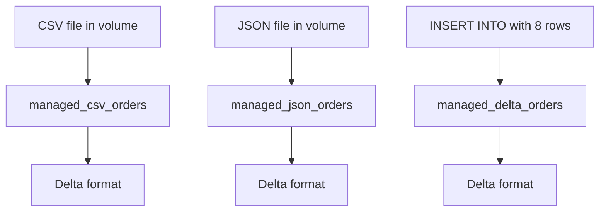

All three tables are managed Delta tables.

Their sources are different, but their final table format is Delta.

---

# Part F — Prepare External Table Data

# 32. Why the Volume Cannot Be the External Table Location

Files in a Unity Catalog volume cannot be registered in place as Unity Catalog tables.

Volumes are intended for path-based file access.

Therefore, this is the correct flow:

```text
Files in managed volume
        ↓
Read with DataFrame
        ↓
Write into approved ADLS subdirectory
        ↓
Register external table
```

Do not create an external table using:

```text
/Volumes/training_catalog/session_demo/source_files/...
```

as the table location.

---

# 33. Define the External Paths

Run in a Python cell.

Replace the placeholders first:

```python
external_root = (
    "abfss://<container>@<storage-account>."
    "dfs.core.windows.net/uc_session_demo"
)

external_csv_path = (
    f"{external_root}/external_csv_orders"
)

external_json_path = (
    f"{external_root}/external_json_orders"
)

external_delta_path = (
    f"{external_root}/external_delta_orders"
)

print(external_csv_path)
print(external_json_path)
print(external_delta_path)
```

Each table receives its own directory.

---

# 34. Define the Shared Schema

```python
from pyspark.sql.types import (
    StructType,
    StructField,
    IntegerType,
    StringType,
    DecimalType,
    DateType,
)

order_schema = StructType([
    StructField("order_id", IntegerType(), False),
    StructField("customer_name", StringType(), True),
    StructField("city", StringType(), True),
    StructField("product_category", StringType(), True),
    StructField("order_amount", DecimalType(10, 2), True),
    StructField("order_date", DateType(), True),
])
```

---

# 35. Read the External CSV Staging File

```python
external_csv_df = (
    spark.read
    .schema(order_schema)
    .option("header", True)
    .csv(
        "/Volumes/training_catalog/session_demo/"
        "source_files/external_csv/"
    )
)

display(external_csv_df)
```

---

# 36. Write CSV Data to ADLS

```python
(
    external_csv_df.write
    .mode("overwrite")
    .option("header", True)
    .csv(external_csv_path)
)

print(
    f"CSV data written to: {external_csv_path}"
)
```

Spark writes a directory containing one or more CSV part files.

---

# 37. Read the External JSON Staging File

```python
external_json_df = (
    spark.read
    .schema(order_schema)
    .json(
        "/Volumes/training_catalog/session_demo/"
        "source_files/external_json/"
    )
)

display(external_json_df)
```

---

# 38. Write JSON Data to ADLS

```python
(
    external_json_df.write
    .mode("overwrite")
    .json(external_json_path)
)

print(
    f"JSON data written to: {external_json_path}"
)
```

---

# 39. Prepare External Delta Data

```python
from decimal import Decimal
from datetime import date

external_delta_rows = [
    (
        601,
        "Tara",
        "Mumbai",
        "Books",
        Decimal("950.00"),
        date(2026, 7, 28),
    ),
    (
        602,
        "Yash",
        "Pune",
        "Home",
        Decimal("2050.00"),
        date(2026, 7, 28),
    ),
    (
        603,
        "Maya",
        "Bengaluru",
        "Electronics",
        Decimal("3400.00"),
        date(2026, 7, 29),
    ),
    (
        604,
        "Om",
        "Mumbai",
        "Fitness",
        Decimal("1700.00"),
        date(2026, 7, 29),
    ),
]

external_delta_df = spark.createDataFrame(
    external_delta_rows,
    schema=order_schema,
)

display(external_delta_df)
```

---

# 40. Write Delta Data to ADLS

```python
(
    external_delta_df.write
    .format("delta")
    .mode("overwrite")
    .save(external_delta_path)
)

print(
    f"Delta data written to: {external_delta_path}"
)
```

---

# 41. Verify the Three External Directories

```python
for name, path in {
    "CSV": external_csv_path,
    "JSON": external_json_path,
    "DELTA": external_delta_path,
}.items():
    print(f"\n{name} directory: {path}")
    display(dbutils.fs.ls(path))
```

Expected:

```text
CSV directory
    → CSV part file and metadata files

JSON directory
    → JSON part file and metadata files

Delta directory
    → Parquet data files and _delta_log
```

---

# Part G — Register External Tables

# 42. Create the External CSV Table

Replace the location with your actual path:

```sql
CREATE TABLE
    training_catalog.session_demo.external_csv_orders
(
    order_id          INT,
    customer_name     STRING,
    city              STRING,
    product_category  STRING,
    order_amount      DECIMAL(10,2),
    order_date        DATE
)
USING CSV
OPTIONS (
    header = 'true'
)
LOCATION
'abfss://<container>@<storage-account>.dfs.core.windows.net/uc_session_demo/external_csv_orders'
COMMENT 'External table backed by CSV files';
```

The schema is provided because CSV files do not store a reliable table schema.

---

# 43. Verify the External CSV Table

```sql
SELECT *
FROM training_catalog.session_demo.external_csv_orders
ORDER BY order_id;
```

Expected count:

```sql
SELECT COUNT(*) AS row_count
FROM training_catalog.session_demo.external_csv_orders;
```

Expected result:

```text
4
```

---

# 44. Create the External JSON Table

```sql
CREATE TABLE
    training_catalog.session_demo.external_json_orders
(
    order_id          INT,
    customer_name     STRING,
    city              STRING,
    product_category  STRING,
    order_amount      DECIMAL(10,2),
    order_date        DATE
)
USING JSON
LOCATION
'abfss://<container>@<storage-account>.dfs.core.windows.net/uc_session_demo/external_json_orders'
COMMENT 'External table backed by JSON files';
```

---

# 45. Verify the External JSON Table

```sql
SELECT *
FROM training_catalog.session_demo.external_json_orders
ORDER BY order_id;
```

Expected count:

```sql
SELECT COUNT(*) AS row_count
FROM training_catalog.session_demo.external_json_orders;
```

Expected result:

```text
4
```

---

# 46. Create the External Delta Table

The Delta directory already contains a Delta transaction log.

Register it:

```sql
CREATE TABLE
    training_catalog.session_demo.external_delta_orders
USING DELTA
LOCATION
'abfss://<container>@<storage-account>.dfs.core.windows.net/uc_session_demo/external_delta_orders'
COMMENT 'External Delta source table';
```

No schema is required because Delta stores schema information in its transaction log.

---

# 47. Verify the External Delta Table

```sql
SELECT *
FROM training_catalog.session_demo.external_delta_orders
ORDER BY order_id;
```

Expected count:

```sql
SELECT COUNT(*) AS row_count
FROM training_catalog.session_demo.external_delta_orders;
```

Expected result:

```text
4
```

---

# 48. External Source Architecture

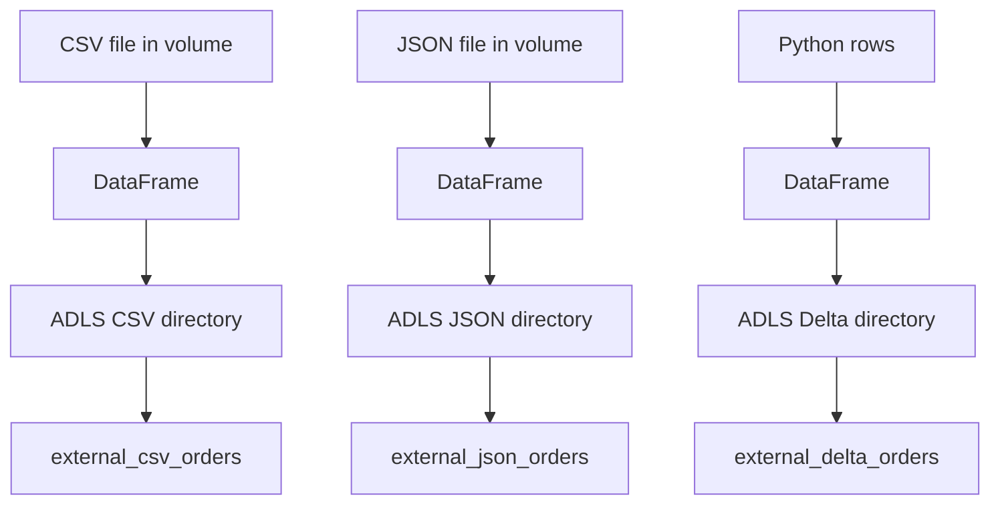

---

# Part H — Compare Managed and External Paths

# 49. Inspect the Managed CSV-Origin Table

```sql
DESCRIBE DETAIL
training_catalog.session_demo.managed_csv_orders;
```

Observe:

```text
format = delta
location = Unity Catalog selected path
```

---

# 50. Inspect the Managed JSON-Origin Table

```sql
DESCRIBE DETAIL
training_catalog.session_demo.managed_json_orders;
```

Observe:

```text
format = delta
location = Unity Catalog selected path
```

---

# 51. Inspect the Managed Delta Source Table

```sql
DESCRIBE DETAIL
training_catalog.session_demo.managed_delta_orders;
```

Observe:

```text
format = delta
location = Unity Catalog selected path
```

---

# 52. Inspect the External Delta Table

```sql
DESCRIBE DETAIL
training_catalog.session_demo.external_delta_orders;
```

Observe:

```text
format = delta
location = the ADLS path you supplied
```

`DESCRIBE DETAIL` is most useful for Delta tables.

For CSV and JSON external tables, the location can also be checked through Catalog Explorer or table metadata.

---

# 53. Managed Versus External Comparison

| Table | Source | Final format | Who selected the table path? |
|---|---|---|---|
| `managed_csv_orders` | CSV file | Delta | Unity Catalog |
| `managed_json_orders` | JSON file | Delta | Unity Catalog |
| `managed_delta_orders` | SQL rows | Delta | Unity Catalog |
| `external_csv_orders` | CSV directory | CSV | You |
| `external_json_orders` | JSON directory | JSON | You |
| `external_delta_orders` | Delta directory | Delta | You |

---

# 54. The Key Difference

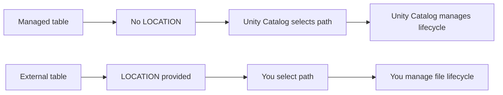

---

# Part I — Demonstrate Path-Overlap Protection

# 55. One Path Must Belong to One Governed Object

Unity Catalog prevents overlapping table and volume paths.

Examples of invalid designs:

```text
Two tables using the same directory

A table and a volume using the same directory

A table using a child directory of another table

An external object placed inside managed storage
```

---

# 56. Attempt to Register a Second Table on the CSV Path

Run:

```sql
CREATE TABLE
    training_catalog.session_demo.invalid_csv_copy
(
    order_id          INT,
    customer_name     STRING,
    city              STRING,
    product_category  STRING,
    order_amount      DECIMAL(10,2),
    order_date        DATE
)
USING CSV
OPTIONS (
    header = 'true'
)
LOCATION
'abfss://<container>@<storage-account>.dfs.core.windows.net/uc_session_demo/external_csv_orders';
```

Expected result:

```text
The command fails with a location-overlap or path-conflict error.
```

The exact error wording can vary by runtime and interface.

The important result is:

```text
external_csv_orders already owns the governed path

invalid_csv_copy is not created
```

---

# 57. Confirm That the Invalid Table Was Not Created

```sql
SHOW TABLES IN training_catalog.session_demo;
```

You should not see:

```text
invalid_csv_copy
```

---

# 58. Path-Overlap Flow

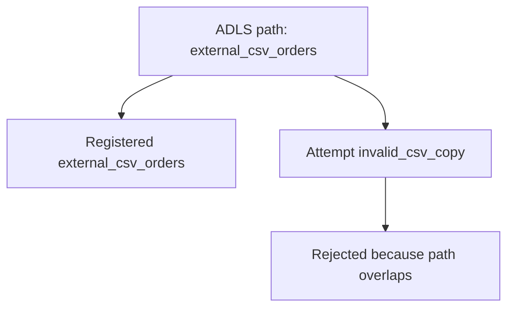

---

# 59. Correct Path Design

```text
/uc_session_demo/external_csv_orders/
/uc_session_demo/external_json_orders/
/uc_session_demo/external_delta_orders/
```

Each table has a separate directory.

---

# Part J — Managed Table Lifecycle

# 60. Use the Managed Delta Source Table

The lifecycle demonstration uses:

```text
managed_delta_orders
```

Check its data:

```sql
SELECT *
FROM training_catalog.session_demo.managed_delta_orders
ORDER BY order_id;
```

Expected count:

```text
8
```

---

# 61. Drop the Managed Table

```sql
DROP TABLE
training_catalog.session_demo.managed_delta_orders;
```

Confirm that it is gone:

```sql
SHOW TABLES IN training_catalog.session_demo;
```

Try to query it:

```sql
SELECT *
FROM training_catalog.session_demo.managed_delta_orders;
```

Expected result:

```text
The query fails because the table is currently dropped.
```

---

# 62. Recover the Managed Table

```sql
UNDROP TABLE
training_catalog.session_demo.managed_delta_orders;
```

Query it again:

```sql
SELECT *
FROM training_catalog.session_demo.managed_delta_orders
ORDER BY order_id;
```

Expected result:

```text
The table is available again.

All 8 rows are recovered.
```

---

# 63. Managed Lifecycle Flow

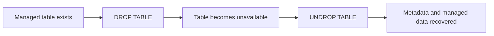

By default, eligible Unity Catalog tables can normally be recovered during the configured recovery period.

The parent catalog and schema must still exist.

---

# 64. Verify the Recovered Table

```sql
SELECT COUNT(*) AS recovered_rows
FROM training_catalog.session_demo.managed_delta_orders;
```

Expected result:

```text
8
```

---

# Part K — External Table Lifecycle

# 65. Use the External CSV Table

Check it before dropping:

```sql
SELECT *
FROM training_catalog.session_demo.external_csv_orders
ORDER BY order_id;
```

Expected count:

```text
4
```

---

# 66. Drop the External Table

```sql
DROP TABLE
training_catalog.session_demo.external_csv_orders;
```

Confirm that its metadata is removed:

```sql
SHOW TABLES IN training_catalog.session_demo;
```

The table name should no longer be listed.

---

# 67. Confirm That the CSV Files Still Exist

Run in Python:

```python
external_csv_path = (
    "abfss://<container>@<storage-account>."
    "dfs.core.windows.net/uc_session_demo/"
    "external_csv_orders"
)

display(
    dbutils.fs.ls(external_csv_path)
)
```

Expected result:

```text
The CSV files are still present.
```

Dropping an external table removes the Unity Catalog table registration.

It does not delete the external files.

---

# 68. Re-register the External CSV Table

```sql
CREATE TABLE
    training_catalog.session_demo.external_csv_orders
(
    order_id          INT,
    customer_name     STRING,
    city              STRING,
    product_category  STRING,
    order_amount      DECIMAL(10,2),
    order_date        DATE
)
USING CSV
OPTIONS (
    header = 'true'
)
LOCATION
'abfss://<container>@<storage-account>.dfs.core.windows.net/uc_session_demo/external_csv_orders'
COMMENT 'Re-registered external CSV source table';
```

No data is copied.

The existing files are registered again.

---

# 69. Verify the Re-registered Table

```sql
SELECT *
FROM training_catalog.session_demo.external_csv_orders
ORDER BY order_id;
```

Expected result:

```text
The same 4 records are available again.
```

---

# 70. External Lifecycle Flow

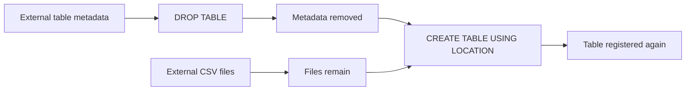

---

# 71. Why Re-registration Is Useful Here

Unity Catalog can support `UNDROP` for eligible managed and external relations.

This POC uses re-registration for the external CSV table because it clearly shows:

```text
Table metadata
    and
physical files
```

have different lifecycles.

---

# Part L — Query the Six Source Tables

# 72. Verify Every Source Count

```sql
SELECT
    'managed_csv_orders' AS table_name,
    COUNT(*) AS row_count
FROM training_catalog.session_demo.managed_csv_orders

UNION ALL

SELECT
    'managed_json_orders',
    COUNT(*)
FROM training_catalog.session_demo.managed_json_orders

UNION ALL

SELECT
    'managed_delta_orders',
    COUNT(*)
FROM training_catalog.session_demo.managed_delta_orders

UNION ALL

SELECT
    'external_csv_orders',
    COUNT(*)
FROM training_catalog.session_demo.external_csv_orders

UNION ALL

SELECT
    'external_json_orders',
    COUNT(*)
FROM training_catalog.session_demo.external_json_orders

UNION ALL

SELECT
    'external_delta_orders',
    COUNT(*)
FROM training_catalog.session_demo.external_delta_orders;
```

Expected counts:

| Table | Expected rows |
|---|---:|
| `managed_csv_orders` | 4 |
| `managed_json_orders` | 4 |
| `managed_delta_orders` | 8 |
| `external_csv_orders` | 4 |
| `external_json_orders` | 4 |
| `external_delta_orders` | 4 |
| **Total** | **28** |

---

# 73. Why `UNION ALL` Is Used

`UNION ALL` keeps every source record.

```text
UNION
    → removes duplicate rows

UNION ALL
    → keeps all rows
```

The source tables use different order ID ranges, so all 28 rows are expected to remain.

---

# Part M — Combine and Standardize the Source Data

# 74. Create a Temporary Combined View

```sql
CREATE OR REPLACE TEMP VIEW all_order_sources
AS

SELECT
    order_id,
    customer_name,
    city,
    product_category,
    CAST(order_amount AS DECIMAL(10,2))
        AS order_amount,
    CAST(order_date AS DATE)
        AS order_date,
    'managed_csv' AS source_name
FROM training_catalog.session_demo.managed_csv_orders

UNION ALL

SELECT
    order_id,
    customer_name,
    city,
    product_category,
    CAST(order_amount AS DECIMAL(10,2)),
    CAST(order_date AS DATE),
    'managed_json'
FROM training_catalog.session_demo.managed_json_orders

UNION ALL

SELECT
    order_id,
    customer_name,
    city,
    product_category,
    CAST(order_amount AS DECIMAL(10,2)),
    CAST(order_date AS DATE),
    'managed_delta'
FROM training_catalog.session_demo.managed_delta_orders

UNION ALL

SELECT
    order_id,
    customer_name,
    city,
    product_category,
    CAST(order_amount AS DECIMAL(10,2)),
    CAST(order_date AS DATE),
    'external_csv'
FROM training_catalog.session_demo.external_csv_orders

UNION ALL

SELECT
    order_id,
    customer_name,
    city,
    product_category,
    CAST(order_amount AS DECIMAL(10,2)),
    CAST(order_date AS DATE),
    'external_json'
FROM training_catalog.session_demo.external_json_orders

UNION ALL

SELECT
    order_id,
    customer_name,
    city,
    product_category,
    CAST(order_amount AS DECIMAL(10,2)),
    CAST(order_date AS DATE),
    'external_delta'
FROM training_catalog.session_demo.external_delta_orders;
```

---

# 75. Query the Combined View

```sql
SELECT *
FROM all_order_sources
ORDER BY order_id;
```

Expected row count:

```sql
SELECT COUNT(*) AS total_rows
FROM all_order_sources;
```

Expected result:

```text
28
```

---

# 76. Check Source Distribution

```sql
SELECT
    source_name,
    COUNT(*) AS total_orders,
    ROUND(SUM(order_amount), 2)
        AS total_sales
FROM all_order_sources
GROUP BY source_name
ORDER BY source_name;
```

This confirms that every source contributed records.

---

# 77. Check for Duplicate Order IDs

```sql
SELECT
    order_id,
    COUNT(*) AS duplicate_count
FROM all_order_sources
GROUP BY order_id
HAVING COUNT(*) > 1;
```

Expected result:

```text
No rows
```

---

# 78. Check for Missing Important Values

```sql
SELECT *
FROM all_order_sources
WHERE
    order_id IS NULL
    OR city IS NULL
    OR order_amount IS NULL
    OR order_date IS NULL;
```

Expected result:

```text
No rows
```

---

# 79. Standardization Flow

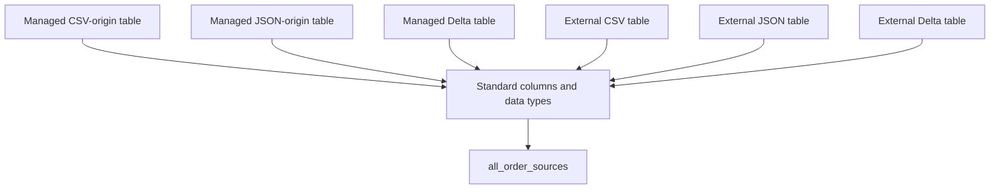

---

# Part N — Create the Gold-Layer Table

# 80. What Makes the Destination Look Like Gold Data

A gold-layer table should answer a business question.

Instead of storing every detailed order again, the destination table will summarize:

```text
How many orders were received each day in each city?

What was the total sales amount?

What was the average order value?

How many source types contributed?
```

The gold table will be:

```text
gold_daily_city_sales
```

---

# 81. Create the Managed Gold Delta Table

```sql
CREATE OR REPLACE TABLE
    training_catalog.session_demo.gold_daily_city_sales
USING DELTA
COMMENT 'Daily city-level sales summary created from all managed and external order sources'
AS
SELECT
    order_date,
    city,
    COUNT(*) AS total_orders,
    ROUND(
        SUM(order_amount),
        2
    ) AS total_sales,
    ROUND(
        AVG(order_amount),
        2
    ) AS average_order_amount,
    COUNT(
        DISTINCT source_name
    ) AS source_type_count,
    CURRENT_TIMESTAMP() AS refreshed_at
FROM all_order_sources
GROUP BY
    order_date,
    city;
```

No `LOCATION` is supplied.

Therefore:

```text
gold_daily_city_sales
    =
Managed Delta table
```

---

# 82. Query the Gold Table

```sql
SELECT *
FROM training_catalog.session_demo.gold_daily_city_sales
ORDER BY
    order_date,
    city;
```

---

# 83. Validate the Gold Totals

Check the number of detailed orders represented by the gold table:

```sql
SELECT
    SUM(total_orders) AS represented_orders,
    ROUND(
        SUM(total_sales),
        2
    ) AS represented_sales
FROM training_catalog.session_demo.gold_daily_city_sales;
```

Expected result:

```text
represented_orders = 28

represented_sales = 49100.00
```

---

# 84. Inspect the Gold Table

```sql
DESCRIBE DETAIL
training_catalog.session_demo.gold_daily_city_sales;
```

Focus on:

```text
format
location
numFiles
sizeInBytes
```

Expected format:

```text
delta
```

Expected storage behaviour:

```text
Unity Catalog selected the managed path
```

---

# 85. Final Architecture

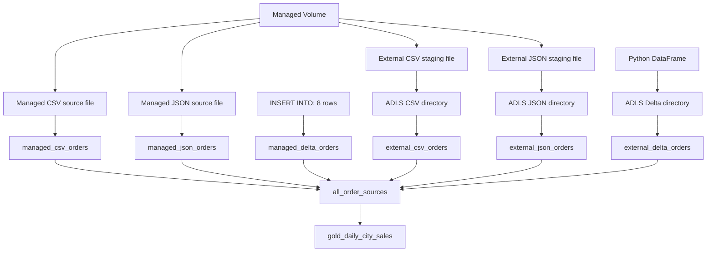

---

# 86. Layered View

```text
Source file area
    → Managed volume

Source table area
    → Managed Delta source tables
    → External CSV, JSON, and Delta tables

Combined processing area
    → Temporary standardized view

Gold area
    → Managed Delta aggregation table
```

---

# Part O — Key Comparisons

# 87. File Format Versus Table Type

| Source file | Created table | Table type |
|---|---|---|
| CSV | `managed_csv_orders` | Managed Delta |
| JSON | `managed_json_orders` | Managed Delta |
| SQL rows | `managed_delta_orders` | Managed Delta |
| CSV directory | `external_csv_orders` | External CSV |
| JSON directory | `external_json_orders` | External JSON |
| Delta directory | `external_delta_orders` | External Delta |

---

# 88. Managed Versus External Lifecycle

| Behaviour | Managed table | External table |
|---|---|---|
| Path selected by | Unity Catalog | You |
| `LOCATION` supplied | No | Yes |
| Metadata managed by Unity Catalog | Yes | Yes |
| File lifecycle managed by Unity Catalog | Yes | No |
| Drop removes registration | Yes | Yes |
| External files remain after drop | Not applicable | Yes |
| Recovery pattern shown | `UNDROP TABLE` | Re-register with `LOCATION` |

---

# 89. Volume Versus Table

| Volume | Table |
|---|---|
| Stores files | Stores governed tabular data |
| Accessed by a path | Accessed by a three-part name |
| Can contain CSV, JSON, images, or other files | Has a defined schema |
| Does not automatically turn files into tables | Supports table operations |
| Good for staging | Good for analytics and transformations |

---

# Part P — Common Questions

# 90. Can CSV and JSON Files Create Managed Tables?

Yes.

The files are read, and their records are written into a managed Delta table.

```text
CSV or JSON source
    ↓
Read records
    ↓
Write managed Delta table
```

The final managed table format is Delta, not CSV or JSON.

---

# 91. Can CSV and JSON Be External Tables?

Yes.

Unity Catalog external tables can directly reference CSV and JSON directories.

The table requires:

- A declared schema
- A `USING CSV` or `USING JSON` clause
- A unique `LOCATION`
- An approved external location

---

# 92. Can Two Tables Use the Same Location?

No.

Unity Catalog prevents path overlap.

Create a view when two logical names are needed for the same data:

```sql
CREATE OR REPLACE VIEW
    training_catalog.session_demo.external_csv_orders_view
AS
SELECT *
FROM training_catalog.session_demo.external_csv_orders;
```

The view does not register the storage path again.

---

# 93. Can an External Table Be Recovered with `UNDROP`?

Eligible Unity Catalog external relations can support `UNDROP`.

This POC uses re-registration to make the file-lifecycle behaviour visible.

```text
DROP external table
    ↓
Files remain
    ↓
CREATE TABLE USING LOCATION
    ↓
Same files become queryable again
```

---

# 94. Can a Managed CSV Table Be Created?

Use careful wording.

This is not a managed CSV table:

```text
CSV source
    → Managed Delta table
```

Managed Unity Catalog tables use Delta or supported managed Iceberg.

---

# Part Q — Troubleshooting

# 95. `CREATE TABLE` from Volume Fails

Check:

- The volume exists.
- The path includes catalog, schema, and volume.
- The file was uploaded into the correct directory.
- The compute supports Unity Catalog volumes.
- The account has `READ VOLUME`.
- The account has `CREATE TABLE` on the destination schema.

---

# 96. External Data Write Fails

Check:

- The ADLS path is covered by an external location.
- The managed identity can access the storage.
- The current principal has permission to write files.
- The path is not inside managed storage.
- The path does not overlap an existing table or volume.
- The placeholders were replaced.

---

# 97. External Table Creation Fails

Check:

- `CREATE EXTERNAL TABLE` is granted on the external location.
- `USE CATALOG` and `USE SCHEMA` are granted.
- `CREATE TABLE` is granted on the schema.
- The path is unique.
- The CSV header option is included.
- The provided schema matches the source data.

---

# 98. CSV Columns Are Shifted or Incorrect

Check:

- `header = 'true'`
- Delimiter
- Column order
- Number of fields
- Date format
- Decimal values
- Extra commas in text values

---

# 99. JSON Records Are Missing

The example uses newline-delimited JSON.

Each line must contain one complete JSON object:

```json
{"order_id":1,"customer_name":"A"}
{"order_id":2,"customer_name":"B"}
```

Do not upload a formatted JSON array unless the reading options are adjusted.

---

# 100. `UNDROP TABLE` Fails

Check:

- The table was registered in Unity Catalog.
- The recovery period has not expired.
- The catalog still exists.
- The schema still exists.
- Another active object is not using the same name.
- The current identity has the required privileges.

---

# 101. Gold Count Is Not 28

Run the source-count query again.

Expected source counts:

```text
managed_csv_orders       4
managed_json_orders      4
managed_delta_orders     8
external_csv_orders      4
external_json_orders     4
external_delta_orders    4
```

Check that the combined view uses `UNION ALL`.

---

# Part R — Quick Recap

# 102. Question 1

Which managed location takes priority?

<details>
<summary>Show answer</summary>

```text
Schema
    then
Catalog
    then
Metastore
```

</details>

---

# 103. Question 2

What is the final format of `managed_csv_orders`?

<details>
<summary>Show answer</summary>

```text
Delta
```

CSV is the source format.

</details>

---

# 104. Question 3

Why can `external_csv_orders` not share a location with another table?

<details>
<summary>Show answer</summary>

Unity Catalog allows one governed table or volume to own a path.

Overlapping paths are rejected.

</details>

---

# 105. Question 4

What happened when `managed_delta_orders` was dropped?

<details>
<summary>Show answer</summary>

The table became unavailable.

`UNDROP TABLE` recovered the managed relation and its data during the recovery period.

</details>

---

# 106. Question 5

What happened to the CSV files when `external_csv_orders` was dropped?

<details>
<summary>Show answer</summary>

The table metadata was removed.

The CSV files remained in ADLS.

</details>

---

# 107. Question 6

Why is `gold_daily_city_sales` considered a gold table?

<details>
<summary>Show answer</summary>

It contains business-ready aggregated information:

- Daily totals
- City-level totals
- Order count
- Total sales
- Average order amount
- Number of contributing source types

</details>

---

# 108. Final Takeaways

```text
Managed table
    → Unity Catalog selects the path
```

```text
External table
    → You provide the path
```

```text
Files in a volume
    → Must be read before becoming table data
```

```text
CSV and JSON files
    → Can become managed Delta tables
```

```text
CSV, JSON, and Delta directories
    → Can be registered as external tables
```

```text
Overlapping paths
    → Are rejected
```

```text
Managed table drop
    → Can be recovered with UNDROP during the recovery period
```

```text
External table drop
    → Files remain and can be registered again
```

```text
Multiple source tables
    → Can be standardized and combined
```

```text
Combined detail data
    → Can produce a managed Delta gold table
```

---

# Part S — Optional Cleanup

# 109. Drop the Gold Table

```sql
DROP TABLE IF EXISTS
training_catalog.session_demo.gold_daily_city_sales;
```

---

# 110. Drop the Managed Source Tables

```sql
DROP TABLE IF EXISTS
training_catalog.session_demo.managed_csv_orders;

DROP TABLE IF EXISTS
training_catalog.session_demo.managed_json_orders;

DROP TABLE IF EXISTS
training_catalog.session_demo.managed_delta_orders;
```

Managed tables follow Unity Catalog lifecycle rules.

---

# 111. Drop the External Table Registrations

```sql
DROP TABLE IF EXISTS
training_catalog.session_demo.external_csv_orders;

DROP TABLE IF EXISTS
training_catalog.session_demo.external_json_orders;

DROP TABLE IF EXISTS
training_catalog.session_demo.external_delta_orders;
```

The external ADLS files remain.

Delete them separately only when they are no longer required.

---

# 112. Drop the Volume

```sql
DROP VOLUME IF EXISTS
training_catalog.session_demo.source_files;
```

This removes the managed volume according to Unity Catalog managed-object lifecycle rules.

---

# 113. Drop the Schema

Run this only when the schema contains no other required objects:

```sql
DROP SCHEMA IF EXISTS
training_catalog.session_demo
CASCADE;
```

---

# 114. Official References

- [Managed versus external assets](https://learn.microsoft.com/en-us/azure/databricks/data-governance/unity-catalog/managed-versus-external)
- [Unity Catalog managed tables](https://learn.microsoft.com/en-us/azure/databricks/tables/managed)
- [Unity Catalog external tables](https://learn.microsoft.com/en-us/azure/databricks/tables/external)
- [Unity Catalog table types](https://learn.microsoft.com/en-us/azure/databricks/tables/types)
- [Unity Catalog volumes](https://learn.microsoft.com/en-us/azure/databricks/volumes/)
- [Path rules for tables and volumes](https://learn.microsoft.com/en-us/azure/databricks/volumes/paths)
- [Work with files in volumes](https://learn.microsoft.com/en-us/azure/databricks/volumes/volume-files)
- [`read_files` table-valued function](https://learn.microsoft.com/en-us/azure/databricks/sql/language-manual/functions/read_files)
- [`CREATE TABLE USING`](https://learn.microsoft.com/en-us/azure/databricks/sql/language-manual/sql-ref-syntax-ddl-create-table-using)
- [`UNDROP TABLE`](https://learn.microsoft.com/en-us/azure/databricks/sql/language-manual/sql-ref-syntax-ddl-undrop-table)
