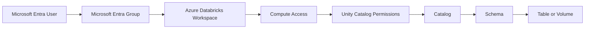
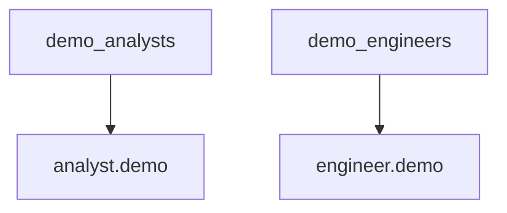
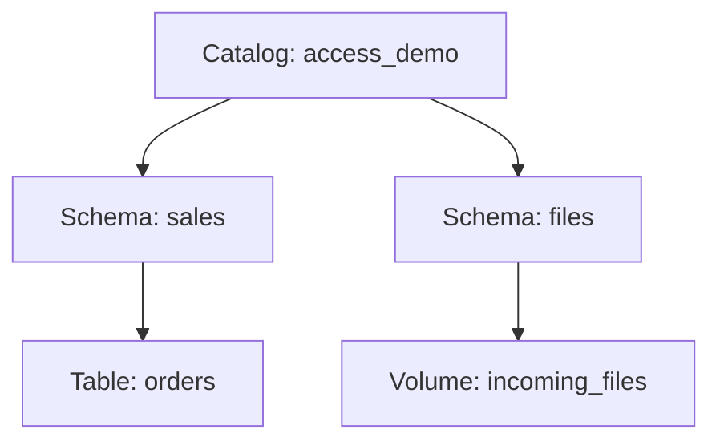
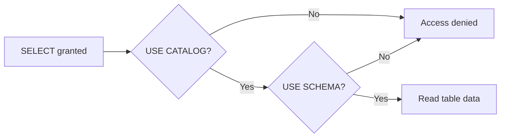
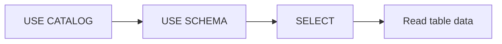
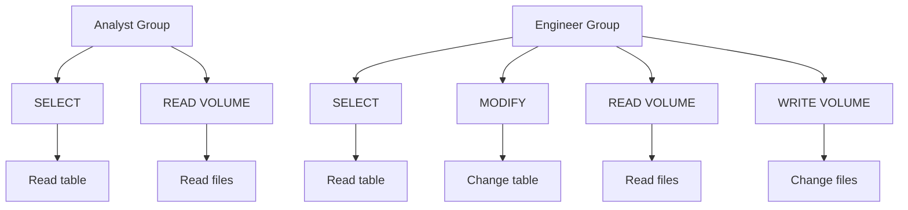
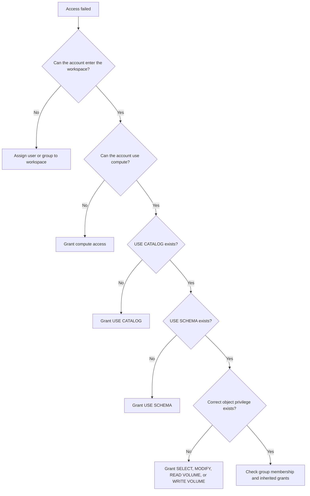

# Unity Catalog Permissions

## One-Hour Hands-on POC

---

# 1. What You Will Build

In this POC, you will create a small Unity Catalog setup and test two access levels:

- **Analyst:** can read data but cannot change it
- **Engineer:** can read and change data

You will work with:

- Two Microsoft Entra users
- Two Microsoft Entra groups
- One Azure Databricks workspace
- One Unity Catalog catalog
- Two schemas
- One managed Delta table
- One managed volume
- One Unity Catalog-compatible compute resource

The main idea is:

```text
Who needs access?
        ↓
Which object do they need?
        ↓
What action should they perform?
        ↓
Which permission is required?
```

---

# 2. Easy Names Used in This POC

| Item | Name |
|---|---|
| Analyst user | `analyst.demo@<your-domain>` |
| Engineer user | `engineer.demo@<your-domain>` |
| Analyst group | `demo_analysts` |
| Engineer group | `demo_engineers` |
| Catalog | `access_demo` |
| Table schema | `sales` |
| File schema | `files` |
| Managed table | `access_demo.sales.orders` |
| Managed volume | `access_demo.files.incoming_files` |

Replace `<your-domain>` with your Microsoft Entra tenant domain.

Example:

```text
analyst.demo@companydemo.onmicrosoft.com
engineer.demo@companydemo.onmicrosoft.com
```

---

# 3. What You Will Understand

By the end, you should be able to explain:

- What a principal is
- What a securable object is
- What a privilege is
- Why `SELECT` alone may not be enough
- Why parent permissions are required
- How table permissions differ from volume permissions
- How groups simplify access management
- How to grant, inspect, and revoke access

For a table:

```text
USE CATALOG
    +
USE SCHEMA
    +
SELECT or MODIFY
```

For a volume:

```text
USE CATALOG
    +
USE SCHEMA
    +
READ VOLUME
    +
WRITE VOLUME when file changes are required
```

---

# 4. Complete Access Flow



A successful login does not automatically provide data access.

```text
Login access
    ≠
Workspace access
    ≠
Compute access
    ≠
Unity Catalog data access
```

---

# 5. One-Hour Flow

| Time | Activity |
|---:|---|
| 0–10 minutes | Confirm users, groups, login, and compute access |
| 10–20 minutes | Create the catalog, schemas, table, and volume |
| 20–35 minutes | Test table permissions |
| 35–48 minutes | Test volume permissions |
| 48–55 minutes | Inspect and revoke permissions |
| 55–60 minutes | Complete the recap |

---

# Part A — Prepare Users and Groups

# 6. Create the Two Microsoft Entra Users

Open the Microsoft Entra admin center.

Navigate to:

```text
Microsoft Entra ID
→ Users
→ New user
→ Create new user
```

Create the Analyst account:

```text
Display name: Demo Analyst
User principal name: analyst.demo@<your-domain>
```

Create the Engineer account:

```text
Display name: Demo Engineer
User principal name: engineer.demo@<your-domain>
```

Use temporary passwords during account creation and save them securely.

The accounts may be asked to change the password during first login.

---

# 7. Complete Microsoft Authenticator Setup

Sign in once using the Analyst account.

1. Open a private browser window.
2. Open the Azure Databricks workspace URL.
3. Sign in with:

   ```text
   analyst.demo@<your-domain>
   ```

4. Enter the temporary password.
5. Change the password when requested.
6. Follow the security setup screen.
7. Open Microsoft Authenticator on your phone.
8. Add a **Work or school account**.
9. Scan the QR code.
10. Approve the test notification.
11. Complete the sign-in.

Repeat the same steps for:

```text
engineer.demo@<your-domain>
```

Both accounts can be added to the same Microsoft Authenticator application.

Complete this setup before testing permissions.

---

# 8. Create the Two Microsoft Entra Groups

Open:

```text
Microsoft Entra ID
→ Groups
→ All groups
→ New group
```

Create the Analyst group:

```text
Group type: Security
Group name: demo_analysts
Membership type: Assigned
```

Add this member:

```text
analyst.demo@<your-domain>
```

Create the Engineer group:

```text
Group type: Security
Group name: demo_engineers
Membership type: Assigned
```

Add this member:

```text
engineer.demo@<your-domain>
```



Do not add the same user to both groups. Permissions are additive, so the read-only test would become unclear.

---

# 9. Add the Groups to Azure Databricks

Sign in to Azure Databricks using an administrator account.

Open:

```text
Profile
→ Settings
→ Identity and access
→ Groups
→ Manage
```

Search for:

```text
demo_analysts
demo_engineers
```

Add both groups to the workspace.

Make sure both groups have normal workspace user access.

Do not give them administrator access.

---

# 10. Prepare Compute Access

Use one Unity Catalog-compatible compute resource.

The easiest option is:

```text
Serverless notebook compute
```

When serverless compute is unavailable, use:

```text
A shared compute resource
with Standard access mode
```

Give both groups permission to use or attach to the same compute resource.

Keep the compute setup identical:

```text
Analyst:
    Same workspace
    Same compute

Engineer:
    Same workspace
    Same compute
```

Only the Unity Catalog permissions should be different.

---

# 11. Prepare Three Browser Profiles

| Browser profile | Login |
|---|---|
| Admin | Your administrator account |
| Analyst | `analyst.demo@<your-domain>` |
| Engineer | `engineer.demo@<your-domain>` |

A simple arrangement is:

```text
Chrome Profile 1
    → Admin

Edge InPrivate
    → Analyst

Chrome Profile 2
    → Engineer
```

Always confirm the signed-in identity before running a test.

---

# Part B — Understand the Permission Model

# 12. Principal, Object, and Privilege

## Principal

A principal is the identity receiving access.

Examples:

```text
User
Group
Service principal
```

This POC grants access to:

```text
demo_analysts
demo_engineers
```

## Securable object

A securable object is something Unity Catalog can protect.

Examples:

```text
Catalog
Schema
Table
Volume
```

## Privilege

A privilege defines the allowed action.

| Privilege | Meaning |
|---|---|
| `USE CATALOG` | Access objects through the catalog |
| `USE SCHEMA` | Access objects through the schema |
| `SELECT` | Read table data |
| `MODIFY` | Insert, update, delete, or merge table data |
| `READ VOLUME` | Read files in a volume |
| `WRITE VOLUME` | Create, update, or delete files in a volume |

The SQL pattern is:

```sql
GRANT <privilege>
ON <object>
TO `<group>`;
```

---

# 13. Object Hierarchy



Think of it as a building:

```text
USE CATALOG
    → Enter the building

USE SCHEMA
    → Enter the room

SELECT
    → Read table data

MODIFY
    → Change table data

READ VOLUME
    → Read files

WRITE VOLUME
    → Add, change, or remove files
```

---

# Part C — Create the Objects

# 14. Create an Admin Notebook

Sign in using the Admin browser profile.

Create a notebook named:

```text
01_access_demo_setup
```

Attach it to the Unity Catalog-compatible compute.

Use SQL cells unless a Python cell is shown.

---

# 15. Create the Catalog

```sql
CREATE CATALOG IF NOT EXISTS access_demo
COMMENT 'Catalog used for the Unity Catalog permission POC';
```

Select it:

```sql
USE CATALOG access_demo;
```

Check it:

```sql
SELECT current_catalog();
```

Expected result:

```text
access_demo
```

---

# 16. Create the Schemas

```sql
CREATE SCHEMA IF NOT EXISTS access_demo.sales
COMMENT 'Schema containing sales tables';
```

```sql
CREATE SCHEMA IF NOT EXISTS access_demo.files
COMMENT 'Schema containing governed file volumes';
```

Show the schemas:

```sql
SHOW SCHEMAS IN access_demo;
```

Expected result includes:

```text
sales
files
information_schema
```

---

# 17. Create the Managed Delta Table

```sql
CREATE OR REPLACE TABLE access_demo.sales.orders
(
    order_id      INT,
    customer_name STRING,
    order_amount  DECIMAL(10,2),
    order_status  STRING
)
USING DELTA
COMMENT 'Simple order data used for permission testing';
```

Insert data:

```sql
INSERT INTO access_demo.sales.orders
VALUES
    (1, 'Aditi', 120.00, 'PLACED'),
    (2, 'Rahul', 250.00, 'SHIPPED'),
    (3, 'Neha', 180.00, 'DELIVERED');
```

Check the data:

```sql
SELECT *
FROM access_demo.sales.orders
ORDER BY order_id;
```

Expected result:

| order_id | customer_name | order_amount | order_status |
|---:|---|---:|---|
| 1 | Aditi | 120.00 | PLACED |
| 2 | Rahul | 250.00 | SHIPPED |
| 3 | Neha | 180.00 | DELIVERED |

---

# 18. Create the Managed Volume

```sql
CREATE VOLUME IF NOT EXISTS
    access_demo.files.incoming_files
COMMENT 'Managed volume used for permission testing';
```

Check it:

```sql
DESCRIBE VOLUME access_demo.files.incoming_files;
```

The path is:

```text
/Volumes/access_demo/files/incoming_files/
```

---

# 19. Create a CSV File in the Volume

Create a Python cell in the Admin notebook.

```python
file_path = (
    "/Volumes/access_demo/files/"
    "incoming_files/new_orders.csv"
)

file_content = """order_id,customer_name,order_amount
10,Aman,300
11,Priya,450
"""

dbutils.fs.put(
    file_path,
    file_content,
    overwrite=True,
)

print(f"Created file: {file_path}")
```

List the files:

```python
display(
    dbutils.fs.ls(
        "/Volumes/access_demo/files/incoming_files/"
    )
)
```

Read the CSV:

```sql
SELECT *
FROM read_files(
    '/Volumes/access_demo/files/incoming_files/new_orders.csv',
    format => 'csv',
    header => true,
    inferSchema => true
);
```

Expected result:

| order_id | customer_name | order_amount |
|---:|---|---:|
| 10 | Aman | 300 |
| 11 | Priya | 450 |

---

# Part D — Test Table Permissions

# 20. Grant Only `SELECT` to the Analyst Group

In the Admin notebook, run:

```sql
GRANT SELECT
ON TABLE access_demo.sales.orders
TO `demo_analysts`;
```

Inspect it:

```sql
SHOW GRANTS
ON TABLE access_demo.sales.orders;
```

The output should include:

```text
demo_analysts
SELECT
```

---

# 21. Test as the Analyst

Open the Analyst browser profile.

Confirm the account:

```text
analyst.demo@<your-domain>
```

Create a notebook named:

```text
02_analyst_tests
```

Attach it to the same compute.

Run:

```sql
SELECT *
FROM access_demo.sales.orders;
```

Expected result:

```text
The query should fail.
```

The group has `SELECT`, but cannot yet pass through the catalog and schema.



If the query succeeds, check whether the group already has inherited permissions.

---

# 22. Grant `USE CATALOG`

In the Admin notebook:

```sql
GRANT USE CATALOG
ON CATALOG access_demo
TO `demo_analysts`;
```

Run the table query again in the Analyst notebook.

Expected result:

```text
The query should still fail.
```

The group can enter the catalog, but cannot enter the `sales` schema.

---

# 23. Grant `USE SCHEMA`

In the Admin notebook:

```sql
GRANT USE SCHEMA
ON SCHEMA access_demo.sales
TO `demo_analysts`;
```

In the Analyst notebook:

```sql
SELECT *
FROM access_demo.sales.orders
ORDER BY order_id;
```

Expected result:

```text
The query succeeds.
```



---

# 24. Prove That the Analyst Is Read-Only

In the Analyst notebook:

```sql
UPDATE access_demo.sales.orders
SET order_status = 'CANCELLED'
WHERE order_id = 1;
```

Expected result:

```text
Permission denied.
```

The group has `SELECT`, but not `MODIFY`.

Confirm the row remains unchanged:

```sql
SELECT *
FROM access_demo.sales.orders
WHERE order_id = 1;
```

---

# 25. Grant Engineer Table Access

In the Admin notebook:

```sql
GRANT USE CATALOG
ON CATALOG access_demo
TO `demo_engineers`;
```

```sql
GRANT USE SCHEMA
ON SCHEMA access_demo.sales
TO `demo_engineers`;
```

```sql
GRANT SELECT, MODIFY
ON TABLE access_demo.sales.orders
TO `demo_engineers`;
```

The Engineer group now has:

```text
USE CATALOG
+
USE SCHEMA
+
SELECT
+
MODIFY
```

---

# 26. Test as the Engineer

Open the Engineer browser profile.

Confirm the account:

```text
engineer.demo@<your-domain>
```

Create a notebook named:

```text
03_engineer_tests
```

Attach it to the same compute.

Read the table:

```sql
SELECT *
FROM access_demo.sales.orders
ORDER BY order_id;
```

Update a row:

```sql
UPDATE access_demo.sales.orders
SET order_status = 'CANCELLED'
WHERE order_id = 1;
```

Verify:

```sql
SELECT *
FROM access_demo.sales.orders
WHERE order_id = 1;
```

Expected result:

| order_id | customer_name | order_amount | order_status |
|---:|---|---:|---|
| 1 | Aditi | 120.00 | CANCELLED |

Insert a new row:

```sql
INSERT INTO access_demo.sales.orders
VALUES
    (4, 'Vikram', 400.00, 'PLACED');
```

`MODIFY` allows operations such as:

```text
INSERT
UPDATE
DELETE
MERGE
```

---

# Part E — Test Volume Permissions

# 27. Give the Analyst Read-Only Volume Access

In the Admin notebook:

```sql
GRANT USE SCHEMA
ON SCHEMA access_demo.files
TO `demo_analysts`;
```

```sql
GRANT READ VOLUME
ON VOLUME access_demo.files.incoming_files
TO `demo_analysts`;
```

The complete read path is:

```text
USE CATALOG
+
USE SCHEMA
+
READ VOLUME
```

---

# 28. Test Analyst Volume Read Access

In the Analyst notebook:

```sql
SELECT *
FROM read_files(
    '/Volumes/access_demo/files/incoming_files/new_orders.csv',
    format => 'csv',
    header => true,
    inferSchema => true
);
```

Expected result:

| order_id | customer_name | order_amount |
|---:|---|---:|
| 10 | Aman | 300 |
| 11 | Priya | 450 |

---

# 29. Prove That the Analyst Cannot Write Files

Create a Python cell in the Analyst notebook.

```python
analyst_file = (
    "/Volumes/access_demo/files/"
    "incoming_files/analyst_note.txt"
)

dbutils.fs.put(
    analyst_file,
    "This file should not be created.",
    overwrite=True,
)
```

Expected result:

```text
Permission denied.
```

The group has `READ VOLUME`, but not `WRITE VOLUME`.

---

# 30. Give the Engineer Read and Write Volume Access

In the Admin notebook:

```sql
GRANT USE SCHEMA
ON SCHEMA access_demo.files
TO `demo_engineers`;
```

```sql
GRANT READ VOLUME, WRITE VOLUME
ON VOLUME access_demo.files.incoming_files
TO `demo_engineers`;
```

For file creation, updates, and deletion, use both:

```text
READ VOLUME
WRITE VOLUME
```

---

# 31. Test Engineer Volume Write Access

Create a Python cell in the Engineer notebook.

```python
engineer_file = (
    "/Volumes/access_demo/files/"
    "incoming_files/engineer_note.txt"
)

dbutils.fs.put(
    engineer_file,
    "This file was created by the Engineer account.",
    overwrite=True,
)

print("File created successfully.")
```

List the files:

```python
display(
    dbutils.fs.ls(
        "/Volumes/access_demo/files/incoming_files/"
    )
)
```

Expected result includes:

```text
new_orders.csv
engineer_note.txt
```

---

# 32. Compare the Results

| Action | Analyst | Engineer |
|---|---:|---:|
| Read the table | Yes | Yes |
| Update the table | No | Yes |
| Insert into the table | No | Yes |
| Read a file | Yes | Yes |
| Write a file | No | Yes |



---

# Part F — Inspect and Revoke Permissions

# 33. Inspect the Grants

Catalog:

```sql
SHOW GRANTS
ON CATALOG access_demo;
```

Schemas:

```sql
SHOW GRANTS
ON SCHEMA access_demo.sales;
```

```sql
SHOW GRANTS
ON SCHEMA access_demo.files;
```

Table:

```sql
SHOW GRANTS
ON TABLE access_demo.sales.orders;
```

Volume:

```sql
SHOW GRANTS
ON VOLUME access_demo.files.incoming_files;
```

Expected table pattern:

```text
demo_analysts
    → SELECT

demo_engineers
    → SELECT
    → MODIFY
```

Expected volume pattern:

```text
demo_analysts
    → READ VOLUME

demo_engineers
    → READ VOLUME
    → WRITE VOLUME
```

---

# 34. Revoke Analyst Table Access

In the Admin notebook:

```sql
REVOKE SELECT
ON TABLE access_demo.sales.orders
FROM `demo_analysts`;
```

In the Analyst notebook:

```sql
SELECT *
FROM access_demo.sales.orders;
```

Expected result:

```text
Permission denied.
```

Restore the permission:

```sql
GRANT SELECT
ON TABLE access_demo.sales.orders
TO `demo_analysts`;
```

---

# 35. Revoke Engineer Volume Write Access

```sql
REVOKE WRITE VOLUME
ON VOLUME access_demo.files.incoming_files
FROM `demo_engineers`;
```

The Engineer can still read files but can no longer create, change, or delete them.

Restore it:

```sql
GRANT WRITE VOLUME
ON VOLUME access_demo.files.incoming_files
TO `demo_engineers`;
```

---

# Part G — Troubleshooting

# 36. Permission Troubleshooting Flow



---

# 37. The Analyst Query Works Too Early

Possible reasons:

- A broad catalog grant already exists.
- A broad schema grant already exists.
- The user belongs to another group with access.
- The user was added to the Engineer group.

Check:

```sql
SHOW GRANTS ON CATALOG access_demo;
```

```sql
SHOW GRANTS ON SCHEMA access_demo.sales;
```

```sql
SHOW GRANTS ON TABLE access_demo.sales.orders;
```

---

# 38. Login Works but Workspace Access Fails

Check:

- The user or group is assigned to the workspace.
- The group has normal workspace user access.
- The correct workspace URL is being used.
- Microsoft Authenticator approval completed successfully.
- The account is using the correct tenant.

---

# 39. Notebook Compute Fails

Check:

- The compute is running.
- The user or group can use or attach to it.
- The compute supports Unity Catalog.
- Standard access mode or serverless compute is being used.
- The notebook is attached to the correct compute.

---

# 40. Group Changes Are Not Visible

After changing group membership:

1. Wait a few minutes.
2. Sign out of Azure Databricks.
3. Close the browser profile.
4. Sign in again.
5. Confirm the account.
6. Repeat the test.

---

# Part H — Recap

# 41. Table Permission Formula

To read a table:

```text
USE CATALOG
+
USE SCHEMA
+
SELECT
```

To change a table:

```text
USE CATALOG
+
USE SCHEMA
+
SELECT
+
MODIFY
```

---

# 42. Volume Permission Formula

To read files:

```text
USE CATALOG
+
USE SCHEMA
+
READ VOLUME
```

To create, update, or delete files:

```text
USE CATALOG
+
USE SCHEMA
+
READ VOLUME
+
WRITE VOLUME
```

---

# 43. Quick Questions

## Question 1

A group has `SELECT` but cannot read a table. What should be checked?

<details>
<summary>Show answer</summary>

Check:

```text
USE CATALOG
USE SCHEMA
```

</details>

## Question 2

Which privilege allows table updates?

<details>
<summary>Show answer</summary>

```text
MODIFY
```

</details>

## Question 3

Which privilege allows files to be read from a volume?

<details>
<summary>Show answer</summary>

```text
READ VOLUME
```

</details>

## Question 4

Why are permissions granted to groups?

<details>
<summary>Show answer</summary>

Adding or removing a user from a group automatically adds or removes the permissions assigned to that group.

</details>

---

# 44. Key Takeaways

```text
Login access
    is not the same as
workspace access
```

```text
Workspace access
    is not the same as
compute access
```

```text
Compute access
    is not the same as
Unity Catalog access
```

Use:

```sql
GRANT
```

to provide access.

Use:

```sql
SHOW GRANTS
```

to inspect access.

Use:

```sql
REVOKE
```

to remove access.

---

# Part I — Cleanup

# 45. Revoke the POC Permissions

```sql
REVOKE SELECT
ON TABLE access_demo.sales.orders
FROM `demo_analysts`;
```

```sql
REVOKE SELECT, MODIFY
ON TABLE access_demo.sales.orders
FROM `demo_engineers`;
```

```sql
REVOKE READ VOLUME
ON VOLUME access_demo.files.incoming_files
FROM `demo_analysts`;
```

```sql
REVOKE READ VOLUME, WRITE VOLUME
ON VOLUME access_demo.files.incoming_files
FROM `demo_engineers`;
```

---

# 46. Drop the POC Objects

Run only when the objects are no longer needed.

```sql
DROP TABLE IF EXISTS access_demo.sales.orders;
```

```sql
DROP VOLUME IF EXISTS access_demo.files.incoming_files;
```

```sql
DROP SCHEMA IF EXISTS access_demo.sales;
```

```sql
DROP SCHEMA IF EXISTS access_demo.files;
```

```sql
DROP CATALOG IF EXISTS access_demo;
```

The Microsoft Entra users and groups can be removed separately after the POC is complete.

---

# 47. Official References

- [Manage Azure Databricks users](https://learn.microsoft.com/en-us/azure/databricks/admin/users-groups/users)
- [Manage Azure Databricks groups](https://learn.microsoft.com/en-us/azure/databricks/admin/users-groups/manage-groups)
- [Unity Catalog permission model](https://learn.microsoft.com/en-us/azure/databricks/data-governance/unity-catalog/access-control/permissions-concepts)
- [Unity Catalog privileges](https://learn.microsoft.com/en-us/azure/databricks/sql/language-manual/sql-ref-privileges)
- [Unity Catalog volume privileges](https://learn.microsoft.com/en-us/azure/databricks/volumes/privileges)
- [Create Microsoft Entra users](https://learn.microsoft.com/en-us/entra/fundamentals/how-to-create-delete-users)
- [Manage Microsoft Entra groups](https://learn.microsoft.com/en-us/entra/fundamentals/how-to-manage-groups)
- [Microsoft Authenticator](https://learn.microsoft.com/en-us/entra/identity/authentication/concept-authentication-authenticator-app)
