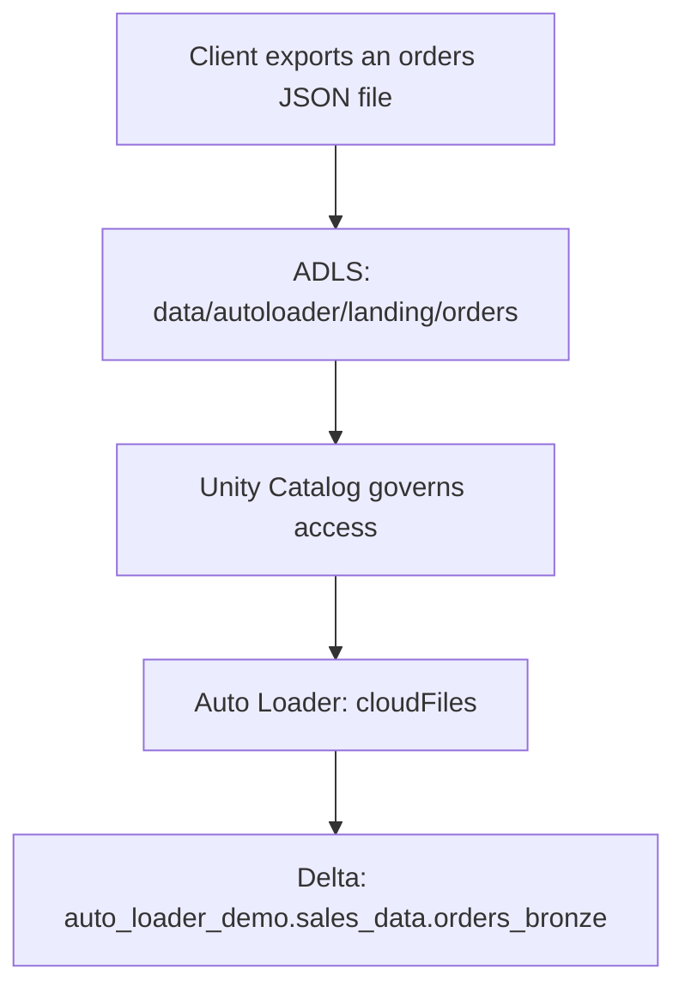
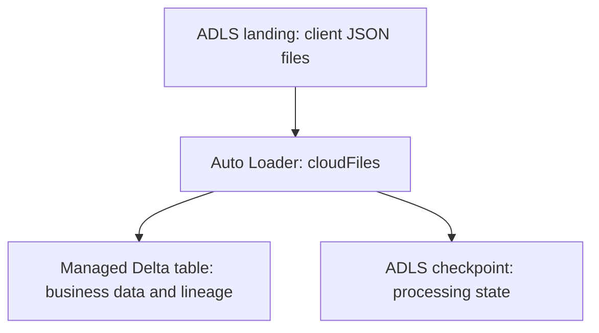

# Databricks Auto Loader Session 1: Ingesting Client JSON Files from ADLS

In the earlier local PySpark exercise, files arrived in a folder on the local machine and Spark Structured Streaming moved their data into a raw zone. In this session, the same idea is implemented as a cloud ingestion pipeline on Azure Databricks Serverless compute.

An e-commerce client uploads JSON order files to Azure Data Lake Storage (ADLS). A Unity Catalog external location governs Databricks access to the ADLS path. Auto Loader discovers newly arrived files and appends their records to a Delta table.



## Session index

1. [The ingestion requirement: process each client delivery once](#1-the-ingestion-requirement)
2. [The three storage concerns: landing, checkpoint, and Delta data](#2-the-three-storage-concerns)
3. [Environment and Serverless readiness: use the exact session objects](#3-environment-and-serverless-readiness)
4. [Hands-on Task 1: validate the catalog, schema, and ADLS access](#4-hands-on-task-1-validate-the-environment)
5. [Hands-on Task 2: upload and inspect the first JSON delivery](#5-hands-on-task-2-upload-the-first-json-file)
6. [Hands-on Task 3: run the complete Auto Loader pipeline](#6-hands-on-task-3-run-the-complete-pipeline)
7. [Pipeline breakdown: understand every part of the complete script](#7-pipeline-breakdown)
8. [Triggers: control when and how the stream runs](#8-triggers)
9. [Output modes: control which rows the stream emits](#9-output-modes)
10. [Hands-on Task 4: validate the first ingestion](#10-hands-on-task-4-validate-the-first-ingestion)
11. [Hands-on Task 5: ingest the second client delivery incrementally](#11-hands-on-task-5-ingest-the-second-delivery)
12. [Hands-on Task 6: rerun with no new files](#12-hands-on-task-6-run-with-no-new-files)
13. [Hands-on Task 7: inspect source, processing state, and target together](#13-hands-on-task-7-inspect-the-complete-state)
14. [Local PySpark and Databricks Auto Loader: compare the completed designs](#14-local-pyspark-and-databricks-auto-loader)
15. [Common mistakes and troubleshooting](#15-common-mistakes-and-troubleshooting)
16. [Knowledge check](#16-knowledge-check)
17. [Session recap](#17-session-recap)

## 1. The ingestion requirement

An e-commerce client generates order files during the day. The client does not connect directly to the destination Delta table. Instead, it uploads each completed delivery to an ADLS landing folder.

The requirement is:

> Ingest every newly delivered JSON file from ADLS into a Delta table without processing an already completed file again.

The session uses two client deliveries:

```text
orders_001.json
orders_002.json
```

The pipeline should behave as follows:

| Pipeline run | Files present in landing | File contributing new rows | Expected Delta rows |
| --- | --- | --- | ---: |
| Run 1 | `orders_001.json` | `orders_001.json` | 5 |
| Run 2 | `orders_001.json`, `orders_002.json` | `orders_002.json` only | 9 |
| Run 3 | No additional file | None | 9 |

This is an append-only landing pattern. After delivering a file, the client does not edit or replace it. A later delivery uses a new filename.

## 2. The three storage concerns

The pipeline has three different storage concerns.

| Concern | Exact object or path | Purpose |
| --- | --- | --- |
| Landing data | `abfss://data@demodb117.dfs.core.windows.net/autoloader/landing/orders/` | Stores JSON files uploaded by the client. |
| Checkpoint state | `abfss://data@demodb117.dfs.core.windows.net/autoloader/checkpoints/orders/` | Stores streaming progress and Auto Loader file state. |
| Destination data | `auto_loader_demo.sales_data.orders_bronze` | Stores ingested records in Delta format. |



The landing and checkpoint directories are deliberately separate. The checkpoint is also separate from the managed Delta table's physical data directory.

### ADLS path and external location are different concepts

The files are physically stored in ADLS. A Unity Catalog external location is a governance object that combines:

- A cloud storage path.
- A storage credential that authorizes Databricks to access that path.

The client uploads files to ADLS, not “into” an external location. The external location gives Databricks governed access to the covered ADLS path.

The external location's name is not required in the Auto Loader code. The `abfss://` source and checkpoint paths must be covered by an existing external location.

## 3. Environment and Serverless readiness

The exercises use these exact names throughout the session.

| Item | Name or path |
| --- | --- |
| Storage account | `demodb117` |
| ADLS container | `data` |
| Landing folder | `autoloader/landing/orders/` |
| Checkpoint folder | `autoloader/checkpoints/orders/` |
| Source file format | JSON |
| Catalog | `auto_loader_demo` |
| Schema | `sales_data` |
| Target table | `auto_loader_demo.sales_data.orders_bronze` |
| Destination format | Delta |
| Compute | Azure Databricks Serverless |

### Confirm the setup before starting

- The Azure Databricks workspace is enabled for Unity Catalog.
- The catalog `auto_loader_demo` already exists, or you have permission to create it separately.
- The ADLS container or the `autoloader/` folder is covered by a Unity Catalog external location.
- You have `READ FILES` on the external location for the landing path.
- You have `WRITE FILES` on the external location for the checkpoint path.
- You have `USE CATALOG` on `auto_loader_demo`.
- You have `USE SCHEMA` and `CREATE TABLE` on `auto_loader_demo.sales_data`.
- The notebook is connected to Serverless compute.
- The landing directory is fresh and does not contain files from an earlier attempt.
- The checkpoint and target table have not been used by another streaming query.

The creation of the Azure managed identity, storage credential, and external location is assumed to be complete. These are administrative setup activities rather than the focus of Session 1.

### Serverless choices used in this lesson

| Design choice | Reason |
| --- | --- |
| Direct `abfss://` paths | Works with storage governed through Unity Catalog; DBFS mounts are not needed. |
| Explicit `.trigger(availableNow=True)` | `AvailableNow` is supported and recommended for incremental work on Serverless compute. |
| Managed Unity Catalog table | Serverless can write to the table by its three-part name. |
| Explicit schema | Keeps Session 1 focused on ingestion rather than schema inference and evolution. |
| `.outputMode("append")` | Each new order record is appended once in this stateless Bronze ingestion. |

## 4. Hands-on Task 1: Validate the environment

### Goal

Prove that the notebook can use the intended catalog and access the governed ADLS path before starting Auto Loader.

### Step 1: Create the schema if required

Run this in a SQL cell. If the schema already exists, the command leaves it unchanged.

```sql
CREATE SCHEMA IF NOT EXISTS auto_loader_demo.sales_data;

USE CATALOG auto_loader_demo;
USE SCHEMA sales_data;

SELECT
    current_catalog() AS active_catalog,
    current_schema() AS active_schema;
```

### Expected result

| active_catalog | active_schema |
| --- | --- |
| `auto_loader_demo` | `sales_data` |

If `CREATE SCHEMA` fails because of permissions, ask the catalog owner to create `auto_loader_demo.sales_data`. The remaining exercises require only the existing schema and the appropriate privileges.

### Step 2: Validate ADLS access

Run this in a Python cell:

```python
landing_path = (
    "abfss://data@demodb117.dfs.core.windows.net/"
    "autoloader/landing/orders/"
)

display(dbutils.fs.ls(landing_path))
```

An empty result is acceptable before the first file arrives. A permissions or path error is not.

### What this task proves

- The notebook is using the intended catalog and schema.
- Databricks can resolve the ADLS path through Unity Catalog-governed access.
- A storage or permission problem is detected before streaming code is introduced.

## 5. Hands-on Task 2: Upload the first JSON file

### Goal

Simulate the client's first delivery and confirm that only the intended file is present.

### Step 1: Create `orders_001.json`

Create a UTF-8 file with one complete JSON object per line:

```jsonl
{"order_id":1001,"customer_name":"Aarav Sharma","product":"Laptop Stand","quantity":1,"order_status":"CONFIRMED"}
{"order_id":1002,"customer_name":"Priya Deshmukh","product":"Wireless Mouse","quantity":2,"order_status":"SHIPPED"}
{"order_id":1003,"customer_name":"Neha Verma","product":"USB-C Hub","quantity":1,"order_status":"CONFIRMED"}
{"order_id":1004,"customer_name":"Rohan Patel","product":"Mechanical Keyboard","quantity":1,"order_status":"PROCESSING"}
{"order_id":1005,"customer_name":"Ishita Rao","product":"Webcam","quantity":1,"order_status":"DELIVERED"}
```

This is newline-delimited JSON, sometimes called JSON Lines or NDJSON. Each line is one record. Do not wrap these records in a surrounding JSON array for this exercise.

### Step 2: Upload the file to ADLS

Using Azure Portal, Azure Storage Explorer, or the client-upload process available in your environment, upload the file to:

```text
Storage account: demodb117
Container:       data
Folder:          autoloader/landing/orders/
File:            orders_001.json
```

Do not upload `orders_002.json` yet.

### Step 3: List the landing folder

```python
display(
    dbutils.fs.ls(
        "abfss://data@demodb117.dfs.core.windows.net/"
        "autoloader/landing/orders/"
    )
)
```

### Expected observation

The folder contains `orders_001.json` and does not contain `orders_002.json`.

## 6. Hands-on Task 3: Run the complete pipeline

### Goal

See and run the entire ingestion pipeline before studying each part separately.

Run this complete script in one Python cell:

```python
from pyspark.sql.functions import col, current_timestamp
from pyspark.sql.types import (
    StructType,
    StructField,
    LongType,
    StringType,
    IntegerType
)

# The schema describes the business fields expected in each JSON record.
orders_schema = StructType([
    StructField("order_id", LongType(), True),
    StructField("customer_name", StringType(), True),
    StructField("product", StringType(), True),
    StructField("quantity", IntegerType(), True),
    StructField("order_status", StringType(), True)
])

# Auto Loader incrementally discovers JSON files in this ADLS folder.
orders_stream_df = (
    spark.readStream
    .format("cloudFiles")
    .option("cloudFiles.format", "json")
    .schema(orders_schema)
    .load(
        "abfss://data@demodb117.dfs.core.windows.net/"
        "autoloader/landing/orders/"
    )
)

# Add technical metadata so every Bronze row can be traced to its source file.
orders_bronze_df = (
    orders_stream_df
    .withColumn("source_file_path", col("_metadata.file_path"))
    .withColumn("source_file_name", col("_metadata.file_name"))
    .withColumn(
        "source_file_modified_at",
        col("_metadata.file_modification_time")
    )
    .withColumn("ingested_at", current_timestamp())
)

# Write all currently available records to a managed Delta table and stop.
orders_query = (
    orders_bronze_df.writeStream
    .format("delta")
    .outputMode("append")
    .option(
        "checkpointLocation",
        "abfss://data@demodb117.dfs.core.windows.net/"
        "autoloader/checkpoints/orders/"
    )
    .trigger(availableNow=True)
    .toTable("auto_loader_demo.sales_data.orders_bronze")
)

orders_query.awaitTermination()
```

### Expected observation

- The query starts on Serverless compute.
- Auto Loader discovers `orders_001.json`.
- Five records are appended to `auto_loader_demo.sales_data.orders_bronze`.
- The destination table is stored in Delta format.
- The query terminates after all currently available data is processed.

The same complete script will be rerun for later client deliveries. Do not change its source path, checkpoint path, or target table between runs.

## 7. Pipeline breakdown

### 7.1 Explicit business schema

```python
orders_schema = StructType([
    StructField("order_id", LongType(), True),
    StructField("customer_name", StringType(), True),
    StructField("product", StringType(), True),
    StructField("quantity", IntegerType(), True),
    StructField("order_status", StringType(), True)
])
```

The schema tells Spark how to represent the business fields. Session 1 deliberately uses an explicit schema. Schema inference, schema tracking, and schema evolution belong to a later Auto Loader session.

### 7.2 Structured Streaming and `cloudFiles`

The local exercise used the file format as the streaming source:

```python
spark.readStream.format("json")
```

Auto Loader uses the `cloudFiles` source and specifies JSON as the underlying file format:

```python
spark.readStream \
    .format("cloudFiles") \
    .option("cloudFiles.format", "json")
```

| Earlier local approach | Auto Loader approach |
| --- | --- |
| `.format("json")` | `.format("cloudFiles")` |
| JSON is the streaming source format. | `cloudFiles` is the Auto Loader source. |
| Local folder | ADLS `abfss://` path governed through Unity Catalog |
| Streaming checkpoint | Streaming checkpoint plus Auto Loader file-processing state |

Auto Loader does not replace Structured Streaming. It provides the `cloudFiles` Structured Streaming source for discovering and processing files incrementally.

### 7.3 Source path

```text
.load(
    "abfss://data@demodb117.dfs.core.windows.net/"
    "autoloader/landing/orders/"
)
```

The source is a folder, not a hardcoded filename. Auto Loader discovers eligible files inside that folder.

### 7.4 File and ingestion metadata

```python
orders_bronze_df = (
    orders_stream_df
    .withColumn("source_file_path", col("_metadata.file_path"))
    .withColumn("source_file_name", col("_metadata.file_name"))
    .withColumn(
        "source_file_modified_at",
        col("_metadata.file_modification_time")
    )
    .withColumn("ingested_at", current_timestamp())
)
```

| Column | Meaning |
| --- | --- |
| `source_file_path` | Full ADLS path of the client file that supplied the row. |
| `source_file_name` | Client filename, such as `orders_001.json`. |
| `source_file_modified_at` | When the source file was last modified in ADLS. |
| `ingested_at` | When this pipeline processed the row. |

These columns give the Delta table file-level lineage and operational timestamps.

### 7.5 Delta destination

```text
.format("delta")
.toTable("auto_loader_demo.sales_data.orders_bronze")
```

The source format and destination format are independent:

```text
Source file format: JSON
         ↓
Auto Loader reads and parses records
         ↓
Destination table format: Delta
```

`toTable()` uses the three-part Unity Catalog name. Because this is a managed table, Unity Catalog manages its physical storage location.

### 7.6 Checkpoint

```text
.option(
    "checkpointLocation",
    "abfss://data@demodb117.dfs.core.windows.net/"
    "autoloader/checkpoints/orders/"
)
```

The checkpoint preserves the processing state for this logical query. Auto Loader uses this state to remember discovered and processed files.

Keep these rules:

- Reuse this exact checkpoint for every run of this orders pipeline.
- Do not share it with another streaming query.
- Do not manually edit its internal files.
- Keep it outside the landing folder and outside the Delta table's directory.

### 7.7 `awaitTermination()`

```python
orders_query.awaitTermination()
```

The notebook cell waits until the `AvailableNow` query finishes. Validation runs only after the current backlog has been processed.

## 8. Triggers

A trigger controls when and how a Structured Streaming query executes.

This is different from an output mode:

```text
Trigger
Controls when the query runs and processes available input.

Output mode
Controls which result rows are emitted during each trigger.
```

### Trigger choices on Serverless compute

| Trigger | Serverless notebook/job support | Session treatment |
| --- | --- | --- |
| `.trigger(availableNow=True)` | Supported and recommended | Use in every hands-on run. |
| `.trigger(once=True)` | Supported but deprecated | Mention only; do not use for new code. |
| `.trigger(processingTime="30 seconds")` | Not supported | Discuss conceptually only. |
| Continuous trigger | Not supported | Use Lakeflow pipelines in continuous mode for an always-on pattern. |
| No `.trigger(...)` | Not supported on Serverless | Spark defaults to a processing-time trigger, which fails on Serverless. |

### Why `AvailableNow` fits this scenario

```text
Client uploads completed files
          ↓
Scheduled or manual job starts
          ↓
AvailableNow processes the current backlog
          ↓
Query stops
          ↓
Later delivery is processed by the next run
```

`AvailableNow` can use one or more micro-batches to process all data available when the run begins. Files completing after the run starts can be processed in the next run.

For a large production backlog, `cloudFiles.maxFilesPerTrigger` or `cloudFiles.maxBytesPerTrigger` can limit each micro-batch. Those tuning options are intentionally deferred from this fundamentals session.

## 9. Output modes

An output mode controls which records a streaming query emits during each trigger.

| Output mode | General meaning | Relevance to this pipeline |
| --- | --- | --- |
| `append` | Emits new rows that the query will not change later. | Correct for direct, stateless ingestion of new order records. |
| `update` | Emits rows changed since the previous trigger. | Used for certain stateful results, but the direct Delta sink does not support update mode. |
| `complete` | Emits the complete result of a streaming aggregation. | Not appropriate because this pipeline does not produce an aggregation. |

This pipeline uses:

```text
.outputMode("append")
```

The source-to-Bronze transformation is stateless: it reads source rows and adds metadata without aggregating them. Each newly processed source record is therefore appended to the Delta table.

`append` does not independently prevent a file from being read twice. Incremental file progress comes from Auto Loader and the checkpoint. The output mode and checkpoint solve different problems.

## 10. Hands-on Task 4: Validate the first ingestion

Validation should happen immediately after the write.

### Validation 1: Check total and distinct orders

```sql
SELECT
    COUNT(*) AS total_rows,
    COUNT(DISTINCT order_id) AS distinct_orders
FROM auto_loader_demo.sales_data.orders_bronze;
```

### Expected result

| total_rows | distinct_orders |
| ---: | ---: |
| 5 | 5 |

### Validation 2: Inspect the records and lineage

```sql
SELECT
    order_id,
    customer_name,
    product,
    quantity,
    order_status,
    source_file_name,
    source_file_modified_at,
    ingested_at
FROM auto_loader_demo.sales_data.orders_bronze
ORDER BY order_id;
```

Expected observations:

- Order IDs range from `1001` through `1005`.
- Every row has `orders_001.json` as `source_file_name`.
- The source modification and ingestion timestamps are populated.

### Validation 3: Count rows by source file

```sql
SELECT
    source_file_name,
    COUNT(*) AS rows_from_file
FROM auto_loader_demo.sales_data.orders_bronze
GROUP BY source_file_name
ORDER BY source_file_name;
```

### Expected result

| source_file_name | rows_from_file |
| --- | ---: |
| `orders_001.json` | 5 |

### Validation 4: Confirm the destination format and location

```sql
DESCRIBE DETAIL auto_loader_demo.sales_data.orders_bronze;
```

Check these fields:

| Field | Expected observation |
| --- | --- |
| `format` | `delta` |
| `location` | Managed table storage path; different from landing and checkpoint paths. |
| `numFiles` | Number of active Delta data files; not the number of business rows. |

## 11. Hands-on Task 5: Ingest the second delivery

### Goal

Prove that the same pipeline processes a new client file without adding the first file's rows again.

### Step 1: Create `orders_002.json`

```jsonl
{"order_id":1006,"customer_name":"Kabir Singh","product":"Noise-Cancelling Headphones","quantity":1,"order_status":"CONFIRMED"}
{"order_id":1007,"customer_name":"Ananya Iyer","product":"Portable SSD","quantity":2,"order_status":"PROCESSING"}
{"order_id":1008,"customer_name":"Vivaan Kulkarni","product":"Monitor Arm","quantity":1,"order_status":"SHIPPED"}
{"order_id":1009,"customer_name":"Meera Nair","product":"Desk Lamp","quantity":2,"order_status":"CONFIRMED"}
```

### Step 2: Upload it to the same landing folder

```text
Storage account: demodb117
Container:       data
Folder:          autoloader/landing/orders/
File:            orders_002.json
```

Keep `orders_001.json` in the landing folder.

### Step 3: Confirm both deliveries are present

```python
display(
    dbutils.fs.ls(
        "abfss://data@demodb117.dfs.core.windows.net/"
        "autoloader/landing/orders/"
    )
)
```

### Predict before rerunning

The landing folder now contains nine records in two files. Should the second run:

- Process all nine source records again and produce fourteen target rows?
- Process only four new records and produce nine target rows?

The correct expectation is nine total rows because the pipeline reuses its checkpoint.

### Step 4: Rerun the complete pipeline script

Run the complete Python cell from [Hands-on Task 3](#6-hands-on-task-3-run-the-complete-pipeline) again without changing the source, checkpoint, output mode, trigger, or target.

### Step 5: Validate the new total

```sql
SELECT
    COUNT(*) AS total_rows,
    COUNT(DISTINCT order_id) AS distinct_orders
FROM auto_loader_demo.sales_data.orders_bronze;
```

### Expected result

| total_rows | distinct_orders |
| ---: | ---: |
| 9 | 9 |

### Step 6: Prove each file's contribution

```sql
SELECT
    source_file_name,
    COUNT(*) AS rows_from_file,
    MIN(order_id) AS minimum_order_id,
    MAX(order_id) AS maximum_order_id
FROM auto_loader_demo.sales_data.orders_bronze
GROUP BY source_file_name
ORDER BY source_file_name;
```

### Expected result

| source_file_name | rows_from_file | minimum_order_id | maximum_order_id |
| --- | ---: | ---: | ---: |
| `orders_001.json` | 5 | 1001 | 1005 |
| `orders_002.json` | 4 | 1006 | 1009 |

## 12. Hands-on Task 6: Run with no new files

### Goal

Show that rerunning the same query does not duplicate records when the client has not delivered another file.

### Step 1: Do not upload or modify any file

The landing folder still contains only:

```text
orders_001.json
orders_002.json
```

### Step 2: Rerun the same complete script

Use the same source, checkpoint, output mode, trigger, and target.

### Step 3: Validate the unchanged count

```sql
SELECT COUNT(*) AS total_rows
FROM auto_loader_demo.sales_data.orders_bronze;
```

### Expected result

| total_rows |
| ---: |
| 9 |

Streaming writes can create operational Delta commits that do not add business rows. Validate ingestion using row counts, business keys, and source-file contribution rather than assuming every Delta version represents new rows.

## 13. Hands-on Task 7: Inspect the complete state

### Goal

Observe the three sides of the pipeline together:

1. Files physically present in ADLS.
2. Auto Loader file-processing state associated with the checkpoint.
3. Records physically represented through the Delta table.

### Check 1: Landing files

```python
display(
    dbutils.fs.ls(
        "abfss://data@demodb117.dfs.core.windows.net/"
        "autoloader/landing/orders/"
    )
)
```

Expected business files:

```text
orders_001.json
orders_002.json
```

### Check 2: Auto Loader file state

Run this in a SQL cell:

```sql
SELECT
    path,
    discovery_time,
    processed_time
FROM cloud_files_state(
    'abfss://data@demodb117.dfs.core.windows.net/autoloader/checkpoints/orders/'
)
ORDER BY path;
```

The result should include the two ingested source-file paths. Use `cloud_files_state()` instead of manually opening or editing checkpoint internals.

### Check 3: Delta records by source file

```sql
SELECT
    source_file_name,
    COUNT(*) AS delta_rows
FROM auto_loader_demo.sales_data.orders_bronze
GROUP BY source_file_name
ORDER BY source_file_name;
```

### Expected result

| source_file_name | delta_rows |
| --- | ---: |
| `orders_001.json` | 5 |
| `orders_002.json` | 4 |

### Check 4: Managed Delta table location

```sql
DESCRIBE DETAIL auto_loader_demo.sales_data.orders_bronze;
```

Compare the returned `location` with the landing and checkpoint paths. All three support the same pipeline, but each stores a different kind of information.

## 14. Local PySpark and Databricks Auto Loader

| Area | Earlier local implementation | Databricks Auto Loader implementation |
| --- | --- | --- |
| File producer | Files copied to a local folder | Client uploads JSON files to ADLS |
| Landing storage | Local Windows or Linux folder | `data` container in `demodb117` |
| Governance | Operating-system file access | Unity Catalog external location and privileges |
| Streaming API | `spark.readStream` | `spark.readStream` |
| Source | `.format("json")` | `.format("cloudFiles")` |
| File format | JSON source itself | `.option("cloudFiles.format", "json")` |
| Schema | Explicit schema | Explicit schema |
| File lineage | Local source-file column | Databricks `_metadata` fields |
| Progress | Streaming checkpoint | Checkpoint plus Auto Loader file state |
| Execution | Local streaming run | Explicit `AvailableNow` run on Serverless |
| Destination | Local raw zone | Delta table in `auto_loader_demo.sales_data` |

## 15. Common mistakes and troubleshooting

### Mistake 1: Using CSV-specific options for JSON

JSON does not use a CSV header option. Do not add `.option("header", "true")`.

### Mistake 2: Uploading a JSON array instead of JSON Lines

This session expects one complete JSON object per line. Do not wrap the records in `[` and `]` unless the reader is configured for multiline JSON, which is outside this session.

### Mistake 3: Using `spark.read` with `cloudFiles`

Auto Loader uses `spark.readStream`:

```python
spark.readStream \
    .format("cloudFiles") \
    .option("cloudFiles.format", "json")
```

### Mistake 4: Omitting the trigger on Serverless

A streaming query without an explicit trigger defaults to a processing-time trigger, which is unsupported on Serverless compute. Use:

```text
.trigger(availableNow=True)
```

### Mistake 5: Using a time-based trigger on Serverless

`processingTime` and continuous triggers are not supported in Serverless notebooks or jobs. Use `AvailableNow` for this exercise.

### Mistake 6: Changing the checkpoint between runs

A different checkpoint represents fresh streaming state. Reuse the exact orders checkpoint for every run of this logical pipeline.

### Mistake 7: Sharing a checkpoint

Every independent streaming query needs its own checkpoint directory. Never point two different pipelines to the same checkpoint.

### Mistake 8: Confusing append mode with deduplication

Append mode controls emitted rows. The checkpoint and Auto Loader state remember processed files. Append mode alone does not stop a fresh query from reading existing files.

### Mistake 9: Having read access but no checkpoint write access

The landing path requires `READ FILES`. The checkpoint path requires `WRITE FILES` and must be covered by an external location that allows writes.

### Mistake 10: Uploading the second file too early

`AvailableNow` processes the current backlog. To observe two deliveries clearly, upload only `orders_001.json` before Run 1 and add `orders_002.json` after validation.

### Quick troubleshooting table

| Symptom | Likely cause | Check |
| --- | --- | --- |
| `PERMISSION_DENIED` while listing landing | Missing Unity Catalog or Azure permission | External location coverage, `READ FILES`, and storage credential access |
| Cannot create checkpoint | Missing write permission or read-only external location | `WRITE FILES` and external location configuration |
| `INFINITE_STREAMING_TRIGGER_NOT_SUPPORTED` | Trigger omitted or unsupported trigger used | Explicit `.trigger(availableNow=True)` |
| Target table cannot be created | Missing catalog/schema privilege | `USE CATALOG`, `USE SCHEMA`, and `CREATE TABLE` |
| JSON fields are null | Field names/types do not match explicit schema, or file is multiline JSON | Inspect one source record and its JSON layout |
| Second file does not appear in Delta | Wrong folder, incomplete upload, or run started before upload completed | Landing listing and the next `AvailableNow` run |
| Old rows appear again in a fresh exercise | Original checkpoint was not reused | Exact `checkpointLocation` used by every run |
| Unexpected rows already exist | Reused landing, checkpoint, or target from an earlier demo | Begin with a coordinated fresh source, checkpoint, and table |

## 16. Knowledge check

### Question 1

What is Auto Loader in relation to Spark Structured Streaming?

<details>
<summary>Show answer</summary>

Auto Loader provides the `cloudFiles` Structured Streaming source for incrementally discovering and processing files in cloud storage. It uses Structured Streaming rather than replacing it.

</details>

### Question 2

Why is `cloudFiles.format` set to `json` while the destination is Delta?

<details>
<summary>Show answer</summary>

`cloudFiles.format` describes the arriving source files. `.format("delta")` describes the streaming sink. The pipeline parses JSON source records and stores the result in a Delta table.

</details>

### Question 3

Why must this Serverless exercise explicitly use `AvailableNow`?

<details>
<summary>Show answer</summary>

Serverless notebooks and jobs support and recommend `AvailableNow` for triggered Structured Streaming. Omitting the trigger defaults to a processing-time trigger, which is unsupported on Serverless.

</details>

### Question 4

What is the difference between a trigger and an output mode?

<details>
<summary>Show answer</summary>

A trigger controls when and how a streaming query executes. An output mode controls which result rows are emitted during each trigger.

</details>

### Question 5

Why is append mode appropriate here?

<details>
<summary>Show answer</summary>

The pipeline performs stateless source-to-Bronze ingestion. Newly processed order records are added to the target and are not later revised by an aggregation.

</details>

### Question 6

Why does Run 2 produce nine total rows instead of fourteen?

<details>
<summary>Show answer</summary>

Run 1 processed five rows from `orders_001.json`. Reusing the same checkpoint allows Run 2 to process only four rows from `orders_002.json`, producing `5 + 4 = 9` total rows.

</details>

### Question 7

What is the risk of changing the checkpoint path before Run 2?

<details>
<summary>Show answer</summary>

The query starts with fresh streaming state. Existing landing files can be treated as unprocessed and can append duplicate business rows to the target.

</details>

### Question 8

Why is `source_file_name` stored in the Delta table?

<details>
<summary>Show answer</summary>

It provides file-level lineage. Engineers can trace a Bronze record back to the client delivery that supplied it.

</details>

## 17. Session recap

The completed pipeline is:

```text
Client creates newline-delimited orders JSON
          ↓
Client uploads the file to data@demodb117
          ↓
Unity Catalog external location governs access
          ↓
Auto Loader uses the cloudFiles source
          ↓
Explicit schema parses the JSON business fields
          ↓
File lineage and ingestion metadata are added
          ↓
AvailableNow processes the current backlog on Serverless
          ↓
Checkpoint preserves incremental file-processing progress
          ↓
Append mode emits newly processed rows
          ↓
Records are stored in a managed Delta table
          ↓
The next run processes only newly delivered files
```

The key ideas are:

- The client uploads JSON files to ADLS storage account `demodb117`, container `data`.
- Auto Loader is built on Spark Structured Streaming and uses `cloudFiles`.
- The source file format is JSON; the destination table format is Delta.
- The target is `auto_loader_demo.sales_data.orders_bronze`.
- An explicit schema keeps Session 1 focused on ingestion fundamentals.
- `AvailableNow` is the correct hands-on trigger for Serverless notebooks and jobs.
- Append mode is appropriate for direct, stateless Bronze ingestion.
- Trigger, output mode, and checkpoint have different responsibilities.
- The checkpoint must remain stable for the logical stream.
- Validation covers the ADLS files, Auto Loader state, Delta row counts, lineage, format, and table location.

## Official references

- [What is Auto Loader?](https://learn.microsoft.com/en-us/azure/databricks/ingestion/cloud-object-storage/auto-loader/)
- [Streaming on Serverless compute](https://learn.microsoft.com/en-us/azure/databricks/compute/serverless/streaming)
- [Serverless compute limitations](https://learn.microsoft.com/en-us/azure/databricks/compute/serverless/limitations)
- [Using Unity Catalog with Structured Streaming](https://learn.microsoft.com/en-us/azure/databricks/structured-streaming/unity-catalog)
- [Select an output mode for Structured Streaming](https://learn.microsoft.com/en-us/azure/databricks/structured-streaming/output-mode)
- [Configure Structured Streaming trigger intervals](https://learn.microsoft.com/en-us/azure/databricks/structured-streaming/triggers)
- [File metadata column](https://learn.microsoft.com/en-us/azure/databricks/ingestion/file-metadata-column)
- [`cloud_files_state` table-valued function](https://learn.microsoft.com/en-us/azure/databricks/sql/language-manual/functions/cloud_files_state)
- [Structured Streaming checkpoints](https://learn.microsoft.com/en-us/azure/databricks/structured-streaming/checkpoints)
