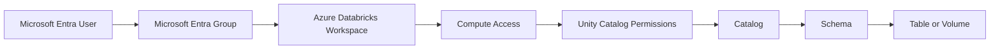

# Unity Catalog Permissions

> Run the Python cells on Databricks serverless notebook compute. Direct `abfss://` operations require `READ FILES` and `WRITE FILES` on the external location. The examples use `demodb117/data` and dedicated session directories so reruns do not affect unrelated data.


### One-Hour Hands-on POC

## 2. Easy Names Used in This POC

| Item | Name |
|---|---|
| Analyst user | `analyst.demo@<your-domain>` |
| Engineer user | `engineer.demo@<your-domain>` |
| Analyst group | `demo_analysts` |
| Engineer group | `demo_engineers` |
| Catalog | `access_demo` |
| Table schema | `sales` |
| File schema | `files` |
| Managed table | `access_demo.sales.orders` |
| Managed volume | `access_demo.files.incoming_files` |
Replace `<your-domain>` with your Microsoft Entra tenant domain.

Example:

## 4. Complete Access Flow



A successful login does not automatically provide data access.

## Part A — Prepare Users and Groups

## 6. Create the Two Microsoft Entra Users

Open the Microsoft Entra admin center.

Navigate to:

## 7. Complete Microsoft Authenticator Setup

Sign in once using the Analyst account.

1. Open a private browser window.
2. Open the Azure Databricks workspace URL.
3. Sign in with:
4. Enter the temporary password.
5. Change the password when requested.
6. Follow the security setup screen.
7. Open Microsoft Authenticator on your phone.
8. Add a **Work or school account**.
Repeat the same steps for:

## 8. Create the Two Microsoft Entra Groups

Open:

Create the Analyst group:

## 9. Add the Groups to Azure Databricks

Sign in to Azure Databricks using an administrator account.

Open:

## 10. Prepare Compute Access

Use one Unity Catalog-compatible compute resource.

The easiest option is:

## 11. Prepare Three Browser Profiles

| Browser profile | Login |
|---|---|
| Admin | Your administrator account |
| Analyst | `analyst.demo@<your-domain>` |
| Engineer | `engineer.demo@<your-domain>` |
A simple arrangement is:

Always confirm the signed-in identity before running a test.

## Part B — Understand the Permission Model

## 12. Principal, Object, and Privilege

### Principal

A principal is the identity receiving access.

Examples:

### Securable object

A securable object is something Unity Catalog can protect.

Examples:

### Privilege

A privilege defines the allowed action.

| Privilege | Meaning |
|---|---|
| `USE CATALOG` | Access objects through the catalog |
| `USE SCHEMA` | Access objects through the schema |
| `SELECT` | Read table data |
| `MODIFY` | Insert, update, delete, or merge table data |
| `READ VOLUME` | Read files in a volume |
| `WRITE VOLUME` | Create, update, or delete files in a volume |
The SQL pattern is:

```sql
GRANT <privilege>
ON <object>
TO `<group>`;
```

## 13. Object Hierarchy

Think of it as a building:

## Part C — Create the Objects

## 14. Create an Admin Notebook

Sign in using the Admin browser profile.

Create a notebook named:

## 15. Create the Catalog

```sql
CREATE CATALOG IF NOT EXISTS access_demo
COMMENT 'Catalog used for the Unity Catalog permission POC';
```

Select it:

```sql
USE CATALOG access_demo;
```

Check it:

```sql
SELECT current_catalog();
```

## 16. Create the Schemas

```sql
CREATE SCHEMA IF NOT EXISTS access_demo.sales
COMMENT 'Schema containing sales tables';
```

```sql
CREATE SCHEMA IF NOT EXISTS access_demo.files
COMMENT 'Schema containing governed file volumes';
```

Show the schemas:

```sql
SHOW SCHEMAS IN access_demo;
```

Expected result includes:

## 17. Create the Managed Delta Table

```sql
CREATE OR REPLACE TABLE access_demo.sales.orders
(
    order_id      INT,
    customer_name STRING,
    order_amount  DECIMAL(10,2),
    order_status  STRING
)
USING DELTA
COMMENT 'Simple order data used for permission testing';
```

Insert data:

```sql
INSERT INTO access_demo.sales.orders
VALUES
    (1, 'Aditi', 120.00, 'PLACED'),
    (2, 'Rahul', 250.00, 'SHIPPED'),
    (3, 'Neha', 180.00, 'DELIVERED');
```

Check the data:

```sql
SELECT *
FROM access_demo.sales.orders
ORDER BY order_id;
```

| order_id | customer_name | order_amount | order_status |
|---:|---|---:|---|
| 1 | Aditi | 120.00 | PLACED |
| 2 | Rahul | 250.00 | SHIPPED |
| 3 | Neha | 180.00 | DELIVERED |
## 18. Create the Managed Volume

```sql
CREATE VOLUME IF NOT EXISTS
    access_demo.files.incoming_files
COMMENT 'Managed volume used for permission testing';
```

Check it:

```sql
DESCRIBE VOLUME access_demo.files.incoming_files;
```

The path is:

## 19. Create a CSV File in the Volume

Create a Python cell in the Admin notebook.

```python
file_path = (
    "/Volumes/access_demo/files/"
    "incoming_files/new_orders.csv"
)

file_content = """order_id,customer_name,order_amount
10,Aman,300
11,Priya,450
"""

dbutils.fs.put(
    file_path,
    file_content,
    overwrite=True,
)

print(f"Created file: {file_path}")
```

List the files:

```python
display(
    dbutils.fs.ls(
        "/Volumes/access_demo/files/incoming_files/"
    )
)
```

```sql
SELECT *
FROM read_files(
    '/Volumes/access_demo/files/incoming_files/new_orders.csv',
    format => 'csv',
    header => true,
    inferSchema => true
);
```

| order_id | customer_name | order_amount |
|---:|---|---:|
| 10 | Aman | 300 |
| 11 | Priya | 450 |
## Part D — Test Table Permissions

## 20. Grant Only `SELECT` to the Analyst Group

In the Admin notebook, run:

```sql
GRANT SELECT
ON TABLE access_demo.sales.orders
TO `demo_analysts`;
```

Inspect it:

```sql
SHOW GRANTS
ON TABLE access_demo.sales.orders;
```

## 21. Test as the Analyst

Open the Analyst browser profile.

Confirm the account:

```sql
SELECT *
FROM access_demo.sales.orders;
```

## 22. Grant `USE CATALOG`

In the Admin notebook:

```sql
GRANT USE CATALOG
ON CATALOG access_demo
TO `demo_analysts`;
```

Run the table query again in the Analyst notebook.

## 23. Grant `USE SCHEMA`

In the Admin notebook:

```sql
GRANT USE SCHEMA
ON SCHEMA access_demo.sales
TO `demo_analysts`;
```

In the Analyst notebook:

```sql
SELECT *
FROM access_demo.sales.orders
ORDER BY order_id;
```

## 24. Prove That the Analyst Is Read-Only

In the Analyst notebook:

```sql
UPDATE access_demo.sales.orders
SET order_status = 'CANCELLED'
WHERE order_id = 1;
```

Expected result:

```sql
SELECT *
FROM access_demo.sales.orders
WHERE order_id = 1;
```

## 25. Grant Engineer Table Access

In the Admin notebook:

```sql
GRANT USE CATALOG
ON CATALOG access_demo
TO `demo_engineers`;
```

```sql
GRANT USE SCHEMA
ON SCHEMA access_demo.sales
TO `demo_engineers`;
```

```sql
GRANT SELECT, MODIFY
ON TABLE access_demo.sales.orders
TO `demo_engineers`;
```

The Engineer group now has:

## 26. Test as the Engineer

Open the Engineer browser profile.

Confirm the account:

```sql
SELECT *
FROM access_demo.sales.orders
ORDER BY order_id;
```

```sql
UPDATE access_demo.sales.orders
SET order_status = 'CANCELLED'
WHERE order_id = 1;
```

```sql
SELECT *
FROM access_demo.sales.orders
WHERE order_id = 1;
```

| order_id | customer_name | order_amount | order_status |
|---:|---|---:|---|
| 1 | Aditi | 120.00 | CANCELLED |
```sql
INSERT INTO access_demo.sales.orders
VALUES
    (4, 'Vikram', 400.00, 'PLACED');
```

## Part E — Test Volume Permissions

## 27. Give the Analyst Read-Only Volume Access

In the Admin notebook:

```sql
GRANT USE SCHEMA
ON SCHEMA access_demo.files
TO `demo_analysts`;
```

```sql
GRANT READ VOLUME
ON VOLUME access_demo.files.incoming_files
TO `demo_analysts`;
```

The complete read path is:

## 28. Test Analyst Volume Read Access

In the Analyst notebook:

```sql
SELECT *
FROM read_files(
    '/Volumes/access_demo/files/incoming_files/new_orders.csv',
    format => 'csv',
    header => true,
    inferSchema => true
);
```

Expected result:

| order_id | customer_name | order_amount |
|---:|---|---:|
| 10 | Aman | 300 |
| 11 | Priya | 450 |
## 29. Prove That the Analyst Cannot Write Files

Create a Python cell in the Analyst notebook.

```python
analyst_file = (
    "/Volumes/access_demo/files/"
    "incoming_files/analyst_note.txt"
)

dbutils.fs.put(
    analyst_file,
    "This file should not be created.",
    overwrite=True,
)
```

Expected result:

## 30. Give the Engineer Read and Write Volume Access

In the Admin notebook:

```sql
GRANT USE SCHEMA
ON SCHEMA access_demo.files
TO `demo_engineers`;
```

```sql
GRANT READ VOLUME, WRITE VOLUME
ON VOLUME access_demo.files.incoming_files
TO `demo_engineers`;
```

For file creation, updates, and deletion, use both:

## 31. Test Engineer Volume Write Access

Create a Python cell in the Engineer notebook.

```python
engineer_file = (
    "/Volumes/access_demo/files/"
    "incoming_files/engineer_note.txt"
)

dbutils.fs.put(
    engineer_file,
    "This file was created by the Engineer account.",
    overwrite=True,
)

print("File created successfully.")
```

List the files:

```python
display(
    dbutils.fs.ls(
        "/Volumes/access_demo/files/incoming_files/"
    )
)
```

## 32. Compare the Results

| Action | Analyst | Engineer |
|---|---:|---:|
| Read the table | Yes | Yes |
| Update the table | No | Yes |
| Insert into the table | No | Yes |
| Read a file | Yes | Yes |
| Write a file | No | Yes |
## Part F — Inspect and Revoke Permissions

## 33. Inspect the Grants

Catalog:

```sql
SHOW GRANTS
ON CATALOG access_demo;
```

Schemas:

```sql
SHOW GRANTS
ON SCHEMA access_demo.sales;
```

```sql
SHOW GRANTS
ON SCHEMA access_demo.files;
```

```sql
SHOW GRANTS
ON TABLE access_demo.sales.orders;
```

```sql
SHOW GRANTS
ON VOLUME access_demo.files.incoming_files;
```

## 34. Revoke Analyst Table Access

In the Admin notebook:

```sql
REVOKE SELECT
ON TABLE access_demo.sales.orders
FROM `demo_analysts`;
```

In the Analyst notebook:

```sql
SELECT *
FROM access_demo.sales.orders;
```

```sql
GRANT SELECT
ON TABLE access_demo.sales.orders
TO `demo_analysts`;
```

## 35. Revoke Engineer Volume Write Access

```sql
REVOKE WRITE VOLUME
ON VOLUME access_demo.files.incoming_files
FROM `demo_engineers`;
```

The Engineer can still read files but can no longer create, change, or delete them.

Restore it:

```sql
GRANT WRITE VOLUME
ON VOLUME access_demo.files.incoming_files
TO `demo_engineers`;
```

## 37. The Analyst Query Works Too Early

Possible reasons:

- A broad catalog grant already exists.
- A broad schema grant already exists.
- The user belongs to another group with access.
- The user was added to the Engineer group.
Check:

```sql
SHOW GRANTS ON CATALOG access_demo;
```

```sql
SHOW GRANTS ON SCHEMA access_demo.sales;
```

```sql
SHOW GRANTS ON TABLE access_demo.sales.orders;
```

## 38. Login Works but Workspace Access Fails

Check:

- The user or group is assigned to the workspace.
- The group has normal workspace user access.
- The correct workspace URL is being used.
- Microsoft Authenticator approval completed successfully.
- The account is using the correct tenant.
## 39. Notebook Compute Fails

Check:

- The compute is running.
- The user or group can use or attach to it.
- The compute supports Unity Catalog.
- Standard access mode or serverless compute is being used.
- The notebook is attached to the correct compute.
## 40. Group Changes Are Not Visible

After changing group membership:

1. Wait a few minutes.
2. Sign out of Azure Databricks.
3. Close the browser profile.
4. Sign in again.
5. Confirm the account.
6. Repeat the test.
## Part H — Recap

## 41. Table Permission Formula

To read a table:

To change a table:

## 42. Volume Permission Formula

To read files:

To create, update, or delete files:

## 43. Quick Questions

### Question 1

A group has `SELECT` but cannot read a table. What should be checked?

### Question 2

Which privilege allows table updates?

### Question 3

Which privilege allows files to be read from a volume?

### Question 4

Why are permissions granted to groups?

## 44. Key Takeaways

Use:

```sql
GRANT
```

to provide access.

```sql
SHOW GRANTS
```

```sql
REVOKE
```

## Part I — Cleanup

## 45. Revoke the POC Permissions

```sql
REVOKE SELECT
ON TABLE access_demo.sales.orders
FROM `demo_analysts`;
```

```sql
REVOKE SELECT, MODIFY
ON TABLE access_demo.sales.orders
FROM `demo_engineers`;
```

```sql
REVOKE READ VOLUME
ON VOLUME access_demo.files.incoming_files
FROM `demo_analysts`;
```

```sql
REVOKE READ VOLUME, WRITE VOLUME
ON VOLUME access_demo.files.incoming_files
FROM `demo_engineers`;
```

## 46. Drop the POC Objects

Run only when the objects are no longer needed.

```sql
DROP TABLE IF EXISTS access_demo.sales.orders;
```

```sql
DROP VOLUME IF EXISTS access_demo.files.incoming_files;
```

```sql
DROP SCHEMA IF EXISTS access_demo.sales;
```

```sql
DROP SCHEMA IF EXISTS access_demo.files;
```

```sql
DROP CATALOG IF EXISTS access_demo;
```

The Microsoft Entra users and groups can be removed separately after the POC is complete.
