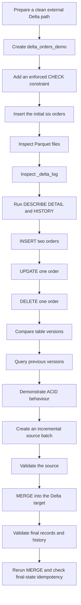

# Delta Lake Transaction Log, ACID, Time Travel, and MERGE

> Run the Python cells on Databricks serverless notebook compute. Direct `abfss://` operations require `READ FILES` and `WRITE FILES` on the external location. The examples use `demodb117/data` and dedicated session directories so reruns do not affect unrelated data.


### 1.5-Hour Hands-on Guide

## 2. Complete Workflow



## 6. Table Structure

The target table contains:

The business key is:

## Part A — Prepare a Clean Environment

## 9. Select the Namespace

Run in a SQL cell:

```sql
USE CATALOG training_catalog;
```

Create the schema when required:

```sql
CREATE SCHEMA IF NOT EXISTS training_catalog.session_demo
COMMENT 'Schema used for Delta Lake transaction demonstrations';
```

```sql
USE SCHEMA session_demo;
```

```sql
SELECT
    current_catalog() AS current_catalog,
    current_schema() AS current_schema;
```

## 10. Drop an Earlier Table Registration

Run:

```sql
DROP TABLE IF EXISTS
training_catalog.session_demo.delta_orders_demo;
```

This removes an earlier table registration.

## 11. Remove the Dedicated POC Directory

Run in a Python cell after replacing the path:

```python
delta_path = (
    "abfss://data@demodb117.dfs.core.windows.net/delta_session/"
    "delta_orders_demo"
)

required_suffix = (
    "/delta_session/delta_orders_demo"
)

if not delta_path.endswith(required_suffix):
    raise ValueError(
        "The path does not match the dedicated POC directory."
    )

removed = dbutils.fs.rm(
    delta_path,
    recurse=True,
)

print(
    f"Existing POC path removed: {removed}"
)
```

This command is intentionally destructive.

## 12. Why a Clean Start Is Important

The expected table-version numbers assume a clean directory.

When the history contains additional versions, use the actual version values returned by:

```sql
DESCRIBE HISTORY
training_catalog.session_demo.delta_orders_demo;
```

## Part B — Create the Delta Table

## 13. Create the External Delta Table

```sql
CREATE TABLE
training_catalog.session_demo.delta_orders_demo
(
    order_id          INT,
    customer_name     STRING,
    city              STRING,
    order_amount      DECIMAL(10,2),
    order_status      STRING,
    updated_at        TIMESTAMP
)
USING DELTA
LOCATION
'abfss://data@demodb117.dfs.core.windows.net/delta_session/delta_orders_demo'
COMMENT 'External Delta table used for transaction log, ACID, time travel, and MERGE demonstrations';
```

Because `LOCATION` is provided, this is an external Delta table.

The external format is still Delta:

## 14. Add an Enforced Check Constraint

The following constraint allows only positive order amounts and known statuses:

```sql
ALTER TABLE
training_catalog.session_demo.delta_orders_demo
ADD CONSTRAINT valid_order_values
CHECK
(
    order_amount > 0
    AND order_status IN
    (
        'PLACED',
        'SHIPPED',
        'DELIVERED',
        'CANCELLED',
        'RETURNED'
    )
);
```

A Delta `CHECK` constraint is enforced.

## 15. Insert the Initial Six Orders

```sql
INSERT INTO
training_catalog.session_demo.delta_orders_demo
VALUES
    (
        1001,
        'Aditi',
        'Pune',
        1250.00,
        'PLACED',
        TIMESTAMP '2026-07-30 09:00:00'
    ),
    (
        1002,
        'Rahul',
        'Mumbai',
        650.00,
        'PLACED',
        TIMESTAMP '2026-07-30 09:05:00'
    ),
    (
        1003,
        'Neha',
        'Bengaluru',
        2100.00,
        'SHIPPED',
        TIMESTAMP '2026-07-30 09:10:00'
    ),
    (
        1004,
        'Aman',
        'Pune',
        1800.00,
        'PLACED',
        TIMESTAMP '2026-07-30 09:15:00'
    ),
    (
        1005,
        'Priya',
        'Mumbai',
        3200.00,
        'DELIVERED',
        TIMESTAMP '2026-07-30 09:20:00'
    ),
    (
        1006,
        'Vikram',
        'Bengaluru',
        950.00,
        'CANCELLED',
        TIMESTAMP '2026-07-30 09:25:00'
    );
```

Verify the rows:

```sql
SELECT *
FROM training_catalog.session_demo.delta_orders_demo
ORDER BY order_id;
```

Verify the count:

```sql
SELECT COUNT(*) AS initial_row_count
FROM training_catalog.session_demo.delta_orders_demo;
```

## 16. Expected Version Map So Far

With a clean path, the expected history is:

| Version | Operation |
|---:|---|
| 0 | Table creation |
| 1 | Constraint metadata change |
| 2 | Initial six-row insert |
The exact operation name shown in history for metadata changes can vary.

## Part C — Understand the Physical Delta Structure

## 17. Delta Table Directory

A Delta table contains:

The file names and number of Parquet files can vary.

## 18. List the Root Directory

Run in Python:

```python
display(
    dbutils.fs.ls(delta_path)
)
```

Look for:

## 19. List the Transaction Log

```python
delta_log_path = (
    f"{delta_path}/_delta_log"
)

log_entries = sorted(
    dbutils.fs.ls(delta_log_path),
    key=lambda entry: entry.name,
)

for entry in log_entries:
    print(
        entry.name,
        entry.size,
    )
```

Expected numbered files include:

A small POC might not create a checkpoint file.

## 20. Read the JSON Transaction Actions

Use this only to understand the log structure.

Applications should use Delta APIs and table commands instead of directly depending on log JSON structure.

```python
from pyspark.sql import functions as F

json_log_files = [
    entry.path
    for entry in log_entries
    if entry.name.endswith(".json")
]

log_actions_df = spark.read.json(
    json_log_files
)

display(
    log_actions_df.select(
        F.col(
            "commitInfo.operation"
        ).alias("operation"),
        F.col(
            "commitInfo.timestamp"
        ).alias("commit_timestamp"),
        F.col(
            "add.path"
        ).alias("added_file"),
        F.col(
            "remove.path"
        ).alias("removed_file"),
        F.col(
            "metaData.id"
        ).alias("table_id"),
        F.col(
            "protocol.minReaderVersion"
        ).alias("min_reader_version"),
        F.col(
            "protocol.minWriterVersion"
        ).alias("min_writer_version"),
    )
)
```

| Action | Meaning |
|---|---|
| `commitInfo` | Describes the committed operation |
| `protocol` | Describes reader and writer requirements |
| `metaData` | Stores schema and table configuration |
| `add` | Makes a data file active |
| `remove` | Removes a data file from the active snapshot |
## 21. Inspect the Latest JSON Commit

```python
latest_json_log = sorted(
    json_log_files
)[-1]

print(
    dbutils.fs.head(
        latest_json_log,
        12000,
    )
)
```

The contents are newline-delimited JSON actions.

Do not edit these files.

## 22. How Delta Builds the Current Table

Delta does not read every Parquet file found in the directory.

It uses the transaction log to determine:

## Part D — Inspect Table Metadata and History

## 23. Run `DESCRIBE DETAIL`

```sql
DESCRIBE DETAIL
training_catalog.session_demo.delta_orders_demo;
```

Focus on:

The available columns can vary by runtime and enabled table features.

## 24. Run `DESCRIBE HISTORY`

```sql
DESCRIBE HISTORY
training_catalog.session_demo.delta_orders_demo;
```

Focus on:

History is returned in reverse chronological order.

## 25. Difference Between DETAIL and HISTORY

| Command | Main purpose |
|---|---|
| `DESCRIBE DETAIL` | Shows the current table metadata and storage details |
| `DESCRIBE HISTORY` | Shows committed writes and table versions |
## Part E — Create More Delta Versions

## 26. Insert Two New Orders

```sql
INSERT INTO
training_catalog.session_demo.delta_orders_demo
VALUES
    (
        1007,
        'Meera',
        'Pune',
        1450.00,
        'PLACED',
        TIMESTAMP '2026-07-30 10:00:00'
    ),
    (
        1008,
        'Karan',
        'Mumbai',
        1100.00,
        'PLACED',
        TIMESTAMP '2026-07-30 10:05:00'
    );
```

Verify:

```sql
SELECT *
FROM training_catalog.session_demo.delta_orders_demo
ORDER BY order_id;
```

Expected count:

```sql
SELECT COUNT(*) AS row_count_after_insert
FROM training_catalog.session_demo.delta_orders_demo;
```

```sql
DESCRIBE HISTORY
training_catalog.session_demo.delta_orders_demo;
```

## 27. Update Order 1002

```sql
UPDATE
training_catalog.session_demo.delta_orders_demo
SET
    order_amount = 700.00,
    order_status = 'SHIPPED',
    updated_at = TIMESTAMP '2026-07-30 10:10:00'
WHERE order_id = 1002;
```

Verify:

```sql
SELECT *
FROM training_catalog.session_demo.delta_orders_demo
WHERE order_id = 1002;
```

Expected values:

```sql
DESCRIBE HISTORY
training_catalog.session_demo.delta_orders_demo;
```

## 28. Delete the Cancelled Order

```sql
DELETE FROM
training_catalog.session_demo.delta_orders_demo
WHERE order_id = 1006;
```

Verify:

```sql
SELECT *
FROM training_catalog.session_demo.delta_orders_demo
ORDER BY order_id;
```

Expected count:

```sql
SELECT COUNT(*) AS row_count_after_delete
FROM training_catalog.session_demo.delta_orders_demo;
```

```sql
DESCRIBE HISTORY
training_catalog.session_demo.delta_orders_demo;
```

## 29. Version Timeline

The version numbers above assume the clean-run steps were followed exactly.

Always confirm the actual versions using table history.

## 30. What Happens to Parquet Files During Changes

Delta operations usually create new data files and update the transaction log.

Without considering runtime optimizations, an update can be understood as:

## Part F — Introduce Time Travel

## 31. Why Time Travel Works

The transaction log records which files were active at each version.

That allows Delta to reconstruct an earlier snapshot.

## 32. Query the Table Before the Update

Under the clean-run version map, version `3` is after the additional insert but before the update of order `1002`.

```sql
SELECT *
FROM training_catalog.session_demo.delta_orders_demo
VERSION AS OF 3
WHERE order_id = 1002;
```

Expected result:

```sql
SELECT *
FROM training_catalog.session_demo.delta_orders_demo
WHERE order_id = 1002;
```

## 33. Query the Table Before the Delete

Under the clean-run version map, version `4` is after the update but before order `1006` was deleted.

```sql
SELECT *
FROM training_catalog.session_demo.delta_orders_demo
VERSION AS OF 4
WHERE order_id = 1006;
```

Expected result:

```sql
SELECT *
FROM training_catalog.session_demo.delta_orders_demo
WHERE order_id = 1006;
```

## 34. Use Actual Version Numbers When History Differs

First run:

```sql
DESCRIBE HISTORY
training_catalog.session_demo.delta_orders_demo;
```

Then replace the number:

```sql
SELECT *
FROM training_catalog.session_demo.delta_orders_demo
VERSION AS OF <version_number>;
```

## 35. Time Travel Scope in This Session

This session covers only:

- Finding versions with `DESCRIBE HISTORY`
- Querying an earlier version
- Comparing an earlier snapshot with the current table
The following topics can be covered later:

- `TIMESTAMP AS OF`
- `RESTORE TABLE`
- Retention settings
- The effect of `VACUUM`
- Long-term history requirements
## Part G — ACID Hands-on Demonstrations

## 36. ACID Overview

| Property | Meaning |
|---|---|
| Atomicity | A transaction commits completely or does not commit |
| Consistency | A successful transaction moves the table to another valid state |
| Isolation | Readers and writers work with committed table snapshots |
| Durability | A committed change remains stored after compute stops |
## 37. Atomicity Demonstration

Before the test, check the current history:

```sql
DESCRIBE HISTORY
training_catalog.session_demo.delta_orders_demo;
```

Now attempt one multi-row insert.

```sql
INSERT INTO
training_catalog.session_demo.delta_orders_demo
VALUES
    (
        1101,
        'Valid Row',
        'Pune',
        500.00,
        'PLACED',
        TIMESTAMP '2026-07-30 11:00:00'
    ),
    (
        1102,
        'Invalid Row',
        'Mumbai',
        -100.00,
        'PLACED',
        TIMESTAMP '2026-07-30 11:01:00'
    );
```

```sql
SELECT *
FROM training_catalog.session_demo.delta_orders_demo
WHERE order_id IN (1101, 1102);
```

```sql
DESCRIBE HISTORY
training_catalog.session_demo.delta_orders_demo;
```

## 38. Consistency Demonstration

Order `1001` currently has a valid status.

Check it:

```sql
SELECT *
FROM training_catalog.session_demo.delta_orders_demo
WHERE order_id = 1001;
```

```sql
UPDATE
training_catalog.session_demo.delta_orders_demo
SET
    order_status = 'UNKNOWN',
    updated_at = TIMESTAMP '2026-07-30 11:10:00'
WHERE order_id = 1001;
```

```sql
SELECT *
FROM training_catalog.session_demo.delta_orders_demo
WHERE order_id = 1001;
```

```sql
DESCRIBE HISTORY
training_catalog.session_demo.delta_orders_demo;
```

## 39. Isolation Observation

Use two notebook sessions or two browser profiles.

### Session A

Query order `1005` from version `5`:

```sql
SELECT *
FROM training_catalog.session_demo.delta_orders_demo
VERSION AS OF 5
WHERE order_id = 1005;
```

Expected result:

### Session B

Commit a new update:

```sql
UPDATE
training_catalog.session_demo.delta_orders_demo
SET
    order_amount = 3100.00,
    order_status = 'RETURNED',
    updated_at = TIMESTAMP '2026-07-30 11:30:00'
WHERE order_id = 1005;
```

Check the current row:

```sql
SELECT *
FROM training_catalog.session_demo.delta_orders_demo
WHERE order_id = 1005;
```

### Session A

Run the version `5` query again:

```sql
SELECT *
FROM training_catalog.session_demo.delta_orders_demo
VERSION AS OF 5
WHERE order_id = 1005;
```

The earlier snapshot still shows:

```sql
SELECT *
FROM training_catalog.session_demo.delta_orders_demo
WHERE order_id = 1005;
```

## 40. Durability Demonstration

After Session B commits the update:

1. Open another notebook or attach another compatible compute.
2. Run the current-table query.
3. Confirm that order `1005` remains `RETURNED`.
4. Run table history and confirm that the update remains recorded.
```sql
SELECT *
FROM training_catalog.session_demo.delta_orders_demo
WHERE order_id = 1005;
```

```sql
DESCRIBE HISTORY
training_catalog.session_demo.delta_orders_demo;
```

The committed state is stored in ADLS through the Delta data files and transaction log.

## 41. ACID Mapped to the Delta Log

| Property | Delta behaviour |
|---|---|
| Atomicity | The log commit makes the complete transaction visible together |
| Consistency | Schema, constraints, and transaction checks protect valid states |
| Isolation | Readers use committed snapshots and writes are checked at commit |
| Durability | Data files and log commits remain in cloud storage |
## Part H — Build the Incremental Source Batch

## 42. Incremental Changes

The batch contains:

| Order ID | Change | Expected target action |
|---:|---|---|
| 1001 | New amount and status | Update |
| 1003 | New city and status | Update |
| 1004 | Delete instruction | Delete |
| 1009 | New order | Insert |
| 1010 | New order | Insert |
The control column is:

## 43. Create the Temporary Source View

Run the remaining temporary-view and merge commands in the same notebook session.

```sql
CREATE OR REPLACE TEMP VIEW incremental_orders
AS
SELECT *
FROM VALUES
    (
        1001,
        'Aditi',
        'Pune',
        CAST(1300.00 AS DECIMAL(10,2)),
        'SHIPPED',
        TIMESTAMP '2026-07-30 12:00:00',
        'UPSERT'
    ),
    (
        1003,
        'Neha',
        'Hyderabad',
        CAST(2200.00 AS DECIMAL(10,2)),
        'DELIVERED',
        TIMESTAMP '2026-07-30 12:05:00',
        'UPSERT'
    ),
    (
        1004,
        'Aman',
        'Pune',
        CAST(1800.00 AS DECIMAL(10,2)),
        'PLACED',
        TIMESTAMP '2026-07-30 12:06:00',
        'DELETE'
    ),
    (
        1009,
        'Sana',
        'Pune',
        CAST(1850.00 AS DECIMAL(10,2)),
        'PLACED',
        TIMESTAMP '2026-07-30 12:10:00',
        'UPSERT'
    ),
    (
        1010,
        'Mohit',
        'Mumbai',
        CAST(2900.00 AS DECIMAL(10,2)),
        'PLACED',
        TIMESTAMP '2026-07-30 12:15:00',
        'UPSERT'
    )
AS source
(
    order_id,
    customer_name,
    city,
    order_amount,
    order_status,
    updated_at,
    change_type
);
```

Query it:

```sql
SELECT *
FROM incremental_orders
ORDER BY order_id;
```

## 44. Validate One Source Row Per Key

A `MERGE` should not receive multiple update records for the same target key.

Run:

```sql
SELECT
    order_id,
    COUNT(*) AS records_per_order
FROM incremental_orders
GROUP BY order_id
HAVING COUNT(*) > 1;
```

```sql
SELECT DISTINCT change_type
FROM incremental_orders
ORDER BY change_type;
```

## 45. MERGE Decision Flow

## Part I — Run the Incremental MERGE

## 46. MERGE into the Target

```sql
MERGE INTO
training_catalog.session_demo.delta_orders_demo AS target

USING incremental_orders AS source

ON target.order_id = source.order_id

WHEN MATCHED
    AND source.change_type = 'DELETE'
THEN DELETE

WHEN MATCHED
    AND source.change_type = 'UPSERT'
    AND source.updated_at > target.updated_at
THEN UPDATE SET
    target.customer_name = source.customer_name,
    target.city = source.city,
    target.order_amount = source.order_amount,
    target.order_status = source.order_status,
    target.updated_at = source.updated_at

WHEN NOT MATCHED
    AND source.change_type = 'UPSERT'
THEN INSERT
(
    order_id,
    customer_name,
    city,
    order_amount,
    order_status,
    updated_at
)
VALUES
(
    source.order_id,
    source.customer_name,
    source.city,
    source.order_amount,
    source.order_status,
    source.updated_at
);
```

This single transaction can:

- Delete matched records
- Update matched records
- Insert new records
The target must be a Delta table.

## 47. Expected Row Count

Before the merge:

The isolation update changed values but did not change the count.

## 48. Validate the Final Count

```sql
SELECT COUNT(*) AS final_row_count
FROM training_catalog.session_demo.delta_orders_demo;
```

Expected result:

## 49. Validate Updated Records

```sql
SELECT *
FROM training_catalog.session_demo.delta_orders_demo
WHERE order_id IN (1001, 1003)
ORDER BY order_id;
```

Expected:

## 50. Validate Inserted Records

```sql
SELECT *
FROM training_catalog.session_demo.delta_orders_demo
WHERE order_id IN (1009, 1010)
ORDER BY order_id;
```

Expected:

## 51. Validate the Deleted Record

```sql
SELECT *
FROM training_catalog.session_demo.delta_orders_demo
WHERE order_id = 1004;
```

Expected result:

## 52. Inspect the MERGE History

```sql
DESCRIBE HISTORY
training_catalog.session_demo.delta_orders_demo;
```

The latest successful operation should be a merge operation.

Look at:

## 53. Inspect the Transaction Log Again

Run the Python log-listing cell again:

```python
log_entries_after_merge = sorted(
    dbutils.fs.ls(delta_log_path),
    key=lambda entry: entry.name,
)

for entry in log_entries_after_merge:
    print(
        entry.name,
        entry.size,
    )
```

A new numbered JSON commit should appear for the successful merge.

## Part J — Rerun and Discuss Idempotency

## 54. Rerun the Same MERGE

Run the `MERGE` statement again without changing `incremental_orders`.

Then query:

```sql
SELECT *
FROM training_catalog.session_demo.delta_orders_demo
ORDER BY order_id;
```

- Orders `1009` and `1010` now match target rows.
- Their timestamps are equal to the target timestamps.
- The update condition requires a strictly newer source timestamp.
- Order `1004` is already absent.
- The delete instruction does not insert a missing row.
## 55. Why the Timestamp Condition Matters

Without:

```sql
source.updated_at > target.updated_at
```

the same records could be updated again during every rerun.

## Part K — Final Architecture

## 56. Key Takeaways

## Part L — Quick Recap

## 57. What is stored in Parquet files?

## 58. What is the main role of `_delta_log`?

## 59. Why did order 1101 not get inserted?

## 60. How was the older value of order 1002 viewed?

## 61. What does the MERGE source require?

## 62. Table Creation Fails

Check:

- The placeholders were replaced.
- The path is covered by an external location.
- The external location is available in the workspace.
- The external location is not read-only.
- The path does not overlap another table or volume.
- The running identity has `CREATE EXTERNAL TABLE`.
## 63. Direct Path Listing Fails

Check:

- The identity has `READ FILES`.
- The storage credential can access ADLS.
- The path is correct.
- The notebook compute supports Unity Catalog access.
## 64. Path Cleanup Fails

Check:

- The identity has `WRITE FILES`.
- The managed identity has delete permission in ADLS.
- The path is not read-only.
- The table registration was dropped first.
- The path suffix matches the dedicated POC directory.
## 65. Constraint Creation Fails

Check:

- The table is Delta.
- The constraint name is not already in use on the table.
- Existing rows satisfy the condition.
- The current identity owns the table or has the required table-management permission.
- The table uses a compatible default collation.
## 66. Expected Version Numbers Do Not Match

Run:

```sql
DESCRIBE HISTORY
training_catalog.session_demo.delta_orders_demo;
```

Use the actual versions.

- An earlier run
- An additional metadata change
- An additional insert, update, or delete
- A repeated merge
- Runtime-managed table-feature changes
## 67. Time Travel Query Fails

Check:

- The version exists.
- Required log files are still retained.
- Required data files have not been removed.
- The correct three-part table name is used.
- The value after `VERSION AS OF` is numeric.
## 68. The Failed Atomicity Test Inserted a Row

This should not happen when both rows are executed in one `INSERT` statement and the constraint is active.

Check:

```sql
SHOW TBLPROPERTIES
training_catalog.session_demo.delta_orders_demo;
```

## 69. MERGE Fails with Multiple Matches

Run:

```sql
SELECT
    order_id,
    COUNT(*) AS records_per_order
FROM incremental_orders
GROUP BY order_id
HAVING COUNT(*) > 1;
```

Deduplicate or resolve the source before the merge.

## 70. Temporary View Is Missing

`incremental_orders` is session-scoped.

Create it again in the same notebook session used for the merge.

## Part N — Cleanup

## 71. Drop the Temporary View

```sql
DROP VIEW IF EXISTS incremental_orders;
```

## 72. Drop the External Delta Table

```sql
DROP TABLE IF EXISTS
training_catalog.session_demo.delta_orders_demo;
```

This removes the table registration.

The external files remain.

## 73. Delete the Dedicated External Directory

Run the protected Python cleanup command again:

```python
delta_path = (
    "abfss://data@demodb117.dfs.core.windows.net/delta_session/"
    "delta_orders_demo"
)

required_suffix = (
    "/delta_session/delta_orders_demo"
)

if not delta_path.endswith(required_suffix):
    raise ValueError(
        "The path does not match the dedicated POC directory."
    )

removed = dbutils.fs.rm(
    delta_path,
    recurse=True,
)

print(
    f"POC path removed: {removed}"
)
```

## Part O — Command Validation Status

## 74. Validation Performed

The commands in this guide were reviewed against Azure Databricks documentation current in July 2026.

The following local checks were completed:

- All Python code blocks compile.
- SQL blocks have balanced quotes and parentheses.
- The sample records were simulated in memory.
- Expected counts were verified.
- Expected time-travel states were verified.
- The invalid atomicity batch was confirmed to leave the simulated state unchanged.
- The invalid consistency update was confirmed to leave the simulated state unchanged.
- The merge produced the expected final eight records.
## 75. Workspace-Dependent Behaviour

The commands were not executed in your Azure Databricks workspace.

They can still fail when:

- The catalog or schema name differs.
- Placeholders are not replaced.
- The external location does not cover the path.
- The external location is read-only.
- Required Unity Catalog privileges are missing.
- The ADLS managed identity lacks permissions.
- The path overlaps another governed object.
- The notebook uses unsupported compute.
