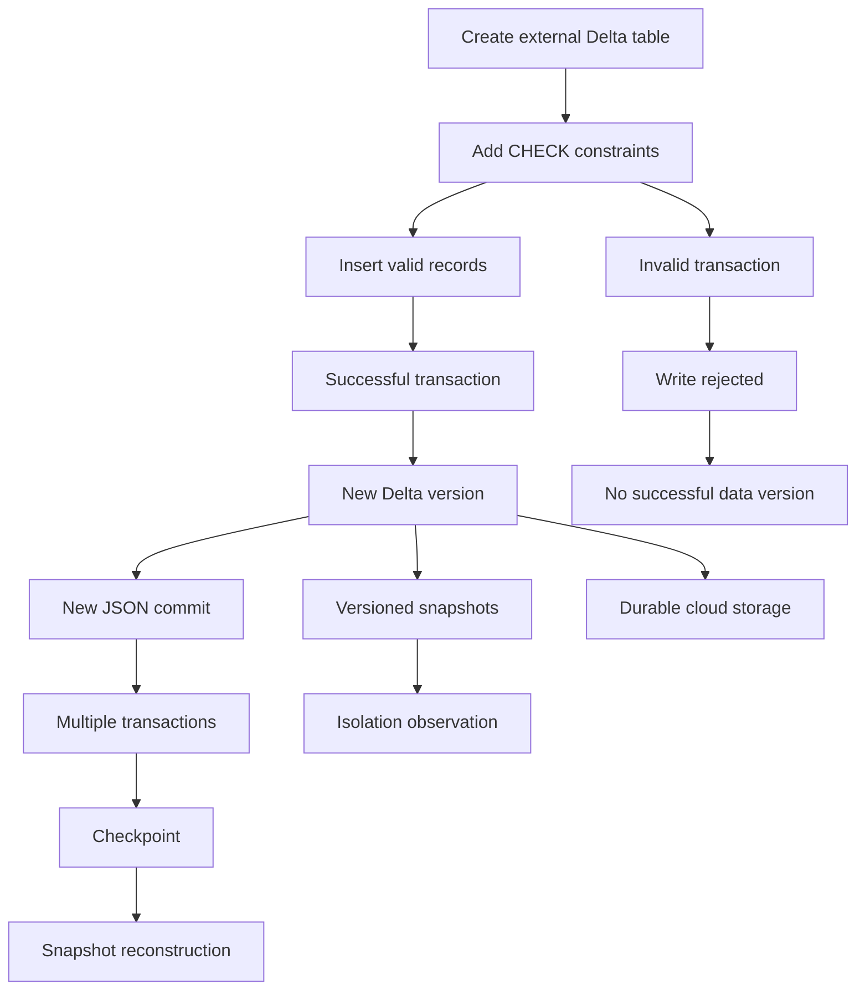

# Delta Lake ACID Transactions, Schema Enforcement, and Checkpoints

> Run the Python cells on Databricks serverless notebook compute. Direct `abfss://` operations require `READ FILES` and `WRITE FILES` on the external location. The examples use `demodb117/data` and dedicated session directories so reruns do not affect unrelated data.


### Hands-on Session Guide

## 1. Session Objective

In this session, you will understand how Delta Lake makes data lake tables reliable.

You will:

- Create a fresh external Delta table
- Inspect Parquet files and the `_delta_log` directory
- Understand transactions and table versions
- Understand Atomicity, Consistency, Isolation, and Durability
- Add and test enforced `CHECK` constraints
- Observe schema enforcement during invalid writes
- Compare committed and failed operations in table history
- Create multiple Delta transactions
## 3. End-to-End Architecture



## 8. Replace the Storage Values

The guide uses:

Replace:

## Part A — Prepare a Clean Environment

## Task 1 — Select the Catalog

Run in a SQL cell:

```sql
USE CATALOG training_catalog;
```

Verify:

```sql
SELECT current_catalog() AS current_catalog;
```

## Task 2 — Create and Select the Schema

```sql
CREATE SCHEMA IF NOT EXISTS
training_catalog.delta_foundations_demo
COMMENT 'Schema used for Delta ACID and checkpoint exercises';
```

```sql
USE SCHEMA delta_foundations_demo;
```

Verify:

```sql
SELECT
    current_catalog() AS current_catalog,
    current_schema() AS current_schema;
```

Expected result:

## Task 3 — Remove an Earlier Table Registration

```sql
DROP TABLE IF EXISTS
training_catalog.delta_foundations_demo.orders_acid_checkpoint;
```

Because this is an external table, dropping the registration does not remove its physical files.

## Task 4 — Remove the Dedicated POC Directory

Run in a Python cell after replacing the path:

```python
table_path = (
    "abfss://data@demodb117.dfs.core.windows.net/delta_foundations/"
    "orders_acid_checkpoint"
)

required_suffix = (
    "/delta_foundations/orders_acid_checkpoint"
)

if not table_path.endswith(required_suffix):
    raise ValueError(
        "The path does not match the dedicated POC directory."
    )

removed = dbutils.fs.rm(
    table_path,
    recurse=True,
)

print(
    f"Existing POC directory removed: {removed}"
)
```

This command is destructive. Run it only against the dedicated POC path.

## Part B — Create the Delta Table

## Task 5 — Create a Fresh External Delta Table

```sql
CREATE TABLE
training_catalog.delta_foundations_demo.orders_acid_checkpoint
(
    order_id       INT,
    customer_name  STRING,
    city           STRING,
    order_amount   DECIMAL(10,2),
    order_status   STRING,
    updated_at     TIMESTAMP
)
USING DELTA
LOCATION
'abfss://data@demodb117.dfs.core.windows.net/delta_foundations/orders_acid_checkpoint'
COMMENT 'External Delta table used for ACID, schema enforcement, and checkpoint exercises';
```

Because `LOCATION` is supplied, the table is external.

The storage format is still Delta.

## Task 6 — Inspect the Empty Table

```sql
DESCRIBE DETAIL
training_catalog.delta_foundations_demo.orders_acid_checkpoint;
```

Focus on:

Inspect history:

```sql
DESCRIBE HISTORY
training_catalog.delta_foundations_demo.orders_acid_checkpoint;
```

## Task 7 — Inspect the Physical Directory

Run in Python:

```python
root_entries = dbutils.fs.ls(
    table_path
)

display(
    root_entries
)
```

Look for:

## Task 8 — Inspect `_delta_log`

```python
delta_log_path = (
    f"{table_path}/_delta_log"
)

log_entries = sorted(
    dbutils.fs.ls(delta_log_path),
    key=lambda entry: entry.name,
)

for entry in log_entries:
    print(
        entry.name,
        entry.size,
    )
```

You should see a numbered JSON commit such as:

## 9. Parquet Files and the Transaction Log

A Delta table contains two important parts:

Delta does not treat every Parquet file in the directory as active data. It uses the transaction log to determine the files that belong to the requested table version.

## Part C — Add Schema and Business Rules

## 10. What Is Schema Enforcement?

Schema enforcement means Delta validates the incoming write against the target table structure.

During an insert or append, Delta checks that:

- Incoming columns exist in the target table
- Data types match or can be safely cast
- The write does not silently introduce an unknown structure
## 11. What Is a CHECK Constraint?

A `CHECK` constraint is a rule that every written row must satisfy.

For this POC:

## Task 9 — Add a Positive Amount Constraint

```sql
ALTER TABLE
training_catalog.delta_foundations_demo.orders_acid_checkpoint
ADD CONSTRAINT positive_order_amount
CHECK
(
    order_amount > 0
);
```

## Task 10 — Add an Approved Status Constraint

```sql
ALTER TABLE
training_catalog.delta_foundations_demo.orders_acid_checkpoint
ADD CONSTRAINT valid_order_status
CHECK
(
    order_status IN
    (
        'PLACED',
        'SHIPPED',
        'DELIVERED',
        'CANCELLED',
        'RETURNED'
    )
);
```

Inspect the updated history:

```sql
DESCRIBE HISTORY
training_catalog.delta_foundations_demo.orders_acid_checkpoint;
```

Constraint additions are committed metadata changes and can create new table versions.

## Task 11 — Insert Valid Initial Records

```sql
INSERT INTO
training_catalog.delta_foundations_demo.orders_acid_checkpoint
VALUES
    (
        1001,
        'Aditi',
        'Pune',
        1250.00,
        'PLACED',
        TIMESTAMP '2026-08-01 09:00:00'
    ),
    (
        1002,
        'Rahul',
        'Mumbai',
        650.00,
        'PLACED',
        TIMESTAMP '2026-08-01 09:05:00'
    ),
    (
        1003,
        'Neha',
        'Bengaluru',
        2100.00,
        'SHIPPED',
        TIMESTAMP '2026-08-01 09:10:00'
    ),
    (
        1004,
        'Aman',
        'Pune',
        1800.00,
        'DELIVERED',
        TIMESTAMP '2026-08-01 09:15:00'
    ),
    (
        1005,
        'Priya',
        'Mumbai',
        3200.00,
        'CANCELLED',
        TIMESTAMP '2026-08-01 09:20:00'
    );
```

Verify:

```sql
SELECT *
FROM training_catalog.delta_foundations_demo.orders_acid_checkpoint
ORDER BY order_id;
```

```sql
SELECT COUNT(*) AS initial_count
FROM training_catalog.delta_foundations_demo.orders_acid_checkpoint;
```

Expected count:

## Part D — Understand ACID

## 12. What Does ACID Mean?

ACID stands for:

These properties make table operations reliable even when writes fail, multiple users work simultaneously, or compute stops.

## 13. Atomicity

### Meaning

Atomicity means:

> A transaction succeeds completely or fails completely.
There is no partial commit.

## Task 12 — Demonstrate Atomicity

The first row is valid. The second row violates `positive_order_amount`.

```sql
INSERT INTO
training_catalog.delta_foundations_demo.orders_acid_checkpoint
VALUES
    (
        1101,
        'Valid Row',
        'Pune',
        500.00,
        'PLACED',
        current_timestamp()
    ),
    (
        1102,
        'Invalid Row',
        'Mumbai',
        -100.00,
        'PLACED',
        current_timestamp()
    );
```

This statement is expected to fail.

```sql
SELECT *
FROM training_catalog.delta_foundations_demo.orders_acid_checkpoint
WHERE order_id IN (1101, 1102);
```

```sql
SELECT COUNT(*) AS count_after_failed_insert
FROM training_catalog.delta_foundations_demo.orders_acid_checkpoint;
```

```sql
DESCRIBE HISTORY
training_catalog.delta_foundations_demo.orders_acid_checkpoint;
```

## 14. How Delta Supports Atomicity

A simplified write flow is:

If the transaction-log commit does not succeed, the new files are not part of the table snapshot.

## 15. Consistency

### Meaning

Consistency means:

> A successful transaction moves the table from one valid state to another valid state.
The table must continue to follow its declared rules, such as:

- Column names
- Data types
- Enforced constraints
- Delta protocol requirements
## Task 13 — Demonstrate Consistency with an Invalid Status

Check the current row:

```sql
SELECT *
FROM training_catalog.delta_foundations_demo.orders_acid_checkpoint
WHERE order_id = 1001;
```

Attempt an invalid update:

```sql
UPDATE
training_catalog.delta_foundations_demo.orders_acid_checkpoint
SET
    order_status = 'UNKNOWN',
    updated_at = current_timestamp()
WHERE order_id = 1001;
```

```sql
SELECT *
FROM training_catalog.delta_foundations_demo.orders_acid_checkpoint
WHERE order_id = 1001;
```

```sql
DESCRIBE HISTORY
training_catalog.delta_foundations_demo.orders_acid_checkpoint;
```

## 16. Atomicity and Consistency Together

The invalid multi-row insert demonstrates both concepts:

## Part E — Schema Enforcement Exercises

## Task 14 — Attempt to Insert an Unknown Column

The target table does not contain `source_system`.

```sql
INSERT INTO
training_catalog.delta_foundations_demo.orders_acid_checkpoint
(
    order_id,
    customer_name,
    city,
    order_amount,
    order_status,
    updated_at,
    source_system
)
VALUES
(
    1201,
    'Unknown Column Test',
    'Pune',
    750.00,
    'PLACED',
    current_timestamp(),
    'APP'
);
```

This statement is expected to fail because `source_system` does not exist in the target schema.

```sql
SELECT *
FROM training_catalog.delta_foundations_demo.orders_acid_checkpoint
WHERE order_id = 1201;
```

## Task 15 — Attempt an Incompatible Data Type

Run in Python:

```python
from datetime import datetime

invalid_rows = [
    (
        "ORDER-1202",
        "Type Mismatch Test",
        "Mumbai",
        900.00,
        "PLACED",
        datetime.now(),
    )
]

invalid_df = spark.createDataFrame(
    invalid_rows,
    [
        "order_id",
        "customer_name",
        "city",
        "order_amount",
        "order_status",
        "updated_at",
    ],
)

(
    invalid_df.write
    .format("delta")
    .mode("append")
    .saveAsTable(
        "training_catalog."
        "delta_foundations_demo."
        "orders_acid_checkpoint"
    )
)
```

This write is expected to fail because the target expects `order_id INT`, while the source contains a non-numeric string.

```sql
SELECT COUNT(*) AS count_after_schema_tests
FROM training_catalog.delta_foundations_demo.orders_acid_checkpoint;
```

## 17. Schema Enforcement Versus Schema Evolution

This session focuses on schema enforcement.

Schema evolution will be covered separately.

## 18. Isolation

### Meaning

Isolation means:

> Simultaneous operations do not expose partial or mixed table states.
Readers work with committed snapshots.

## Task 16 — Record the Current Version

```sql
DESCRIBE HISTORY
training_catalog.delta_foundations_demo.orders_acid_checkpoint;
```

Write down the latest version:

## Task 17 — Query a Fixed Snapshot

Replace the placeholder:

```sql
SELECT *
FROM training_catalog.delta_foundations_demo.orders_acid_checkpoint
VERSION AS OF <version_before_isolation_update>
WHERE order_id = 1002;
```

Expected value before the update:

## Task 18 — Commit a New Current Version

In another notebook tab or session, run:

```sql
UPDATE
training_catalog.delta_foundations_demo.orders_acid_checkpoint
SET
    order_amount = 700.00,
    order_status = 'SHIPPED',
    updated_at = current_timestamp()
WHERE order_id = 1002;
```

Query the current table:

```sql
SELECT *
FROM training_catalog.delta_foundations_demo.orders_acid_checkpoint
WHERE order_id = 1002;
```

## Task 19 — Query the Fixed Snapshot Again

```sql
SELECT *
FROM training_catalog.delta_foundations_demo.orders_acid_checkpoint
VERSION AS OF <version_before_isolation_update>
WHERE order_id = 1002;
```

Expected older values:

This shows that the historical snapshot did not become a mixture of the old and new states.

## 19. Isolation and Concurrent Writers

The previous exercise demonstrates snapshot isolation conceptually.

For simultaneous writers, Delta uses commit-time checks. Conflicting writes can fail rather than silently overwrite each other or corrupt the table.

- The operations being performed
- Whether the same files or rows are modified
- Isolation level
- Deletion vectors and row-level concurrency
- Databricks Runtime behaviour
## 20. Durability

### Meaning

Durability means:

> Once a transaction is successfully committed, its changes remain stored.
A committed change does not depend on the notebook or cluster remaining active.

- Data files in cloud object storage
- Transaction-log commits in the table directory
## Task 20 — Demonstrate Durability

After the update to order `1002` commits:

1. Open another notebook or use another compatible compute.
2. Query the same table.
3. Confirm that the committed update is still present.
```sql
SELECT *
FROM training_catalog.delta_foundations_demo.orders_acid_checkpoint
WHERE order_id = 1002;
```

Inspect history:

```sql
DESCRIBE HISTORY
training_catalog.delta_foundations_demo.orders_acid_checkpoint;
```

## 21. ACID Summary

| Property | Meaning | POC observation |
|---|---|---|
| Atomicity | Complete success or complete failure | Invalid two-row insert adds neither row |
| Consistency | Successful writes preserve declared rules | Constraints and schema reject invalid writes |
| Isolation | Readers observe committed snapshots | Old version remains stable after a new update |
| Durability | Committed changes remain stored | Another session reads the committed update |
## Part F — Generate Multiple Delta Transactions

## 22. Why Multiple Transactions Are Needed

Every successful table-changing transaction normally creates:

Several transactions make it easier to inspect:

- Version progression
- JSON commit files
- Automatic checkpoint creation
## Task 21 — Create Fifteen Separate Transactions

Run in Python:

```python
target_table = (
    "training_catalog."
    "delta_foundations_demo."
    "orders_acid_checkpoint"
)

cities = [
    "Pune",
    "Mumbai",
    "Bengaluru",
]

for transaction_number in range(1, 16):
    order_id = 2000 + transaction_number
    city = cities[
        (transaction_number - 1) % len(cities)
    ]
    amount = 500 + (transaction_number * 50)

    spark.sql(
        f"""
        INSERT INTO {target_table}
        VALUES
        (
            {order_id},
            'Checkpoint Customer {transaction_number}',
            '{city}',
            CAST({amount} AS DECIMAL(10,2)),
            'PLACED',
            current_timestamp()
        )
        """
    )

    print(
        f"Committed transaction {transaction_number}, "
        f"order_id {order_id}"
    )
```

Each `spark.sql()` call runs separately and is intended to create a separate Delta transaction.

## Task 22 — Verify the Final Count

```sql
SELECT COUNT(*) AS count_after_separate_transactions
FROM training_catalog.delta_foundations_demo.orders_acid_checkpoint;
```

Expected count:

The update to order `1002` changed values but did not change the count.

## Task 23 — Inspect Version History

```sql
DESCRIBE HISTORY
training_catalog.delta_foundations_demo.orders_acid_checkpoint;
```

Focus on:

The exact version numbers can differ because constraint additions and reruns also create commits.

## Part G — Delta Checkpoints

## 23. What Is a Delta Checkpoint?

A Delta checkpoint is a compact representation of the transaction-log state at a particular table version.

It summarizes information needed to reconstruct the table, including:

- Active data files
- Removed-file actions that still need tracking
- Schema
- Table properties
- Reader and writer protocol
- Partition metadata
## 24. Why Are Checkpoints Needed?

Suppose a table reaches version `10,000`.

Without a checkpoint, Delta might need to process a long sequence of JSON commits to understand the requested state.

## 25. When Does Checkpointing Occur?

Checkpoint creation is automatic.

It is not triggered by `VACUUM`.

## Task 24 — List JSON and Checkpoint Files

Run in Python:

```python
log_entries_after_writes = sorted(
    dbutils.fs.ls(delta_log_path),
    key=lambda entry: entry.name,
)

json_entries = [
    entry
    for entry in log_entries_after_writes
    if entry.name.endswith(".json")
]

checkpoint_entries = [
    entry
    for entry in log_entries_after_writes
    if (
        "checkpoint" in entry.name
        or entry.name == "_last_checkpoint"
    )
]

print(
    f"JSON commit files found: {len(json_entries)}"
)

print(
    "Checkpoint-related entries found:",
    len(checkpoint_entries),
)

for entry in checkpoint_entries:
    print(entry.name)
```

Possible entries include:

## Task 25 — Read `_last_checkpoint` When Available

```python
last_checkpoint_path = next(
    (
        entry.path
        for entry in log_entries_after_writes
        if entry.name == "_last_checkpoint"
    ),
    None,
)

if last_checkpoint_path:
    print(
        dbutils.fs.head(
            last_checkpoint_path,
            5000,
        )
    )
else:
    print(
        "No _last_checkpoint file was found. "
        "Checkpoint frequency is selected automatically."
    )
```

Do not manually modify `_last_checkpoint` or checkpoint files.

## 26. How Delta Reconstructs a Snapshot

Suppose:

Delta can reconstruct version `17` using:

## 27. Checkpoint and Old JSON Cleanup

Checkpoints and transaction-log retention are related to log maintenance.

Broadly:

## Part H — Final Comparison

## 28. JSON Commit Versus Checkpoint

| Item | Purpose |
|---|---|
| Numbered JSON commit | Records the actions for one table version |
| Delta checkpoint | Summarizes accumulated transaction-log state |
| `_last_checkpoint` | Helps locate the most recent checkpoint |
## 29. Checkpoint Versus OPTIMIZE Versus VACUUM

| Feature | Main purpose | Mainly works with |
|---|---|---|
| Checkpoint | Speed up transaction-log state reconstruction | `_delta_log` metadata |
| `OPTIMIZE` | Compact active data files into a better layout | Active Parquet data files |
| `VACUUM` | Delete eligible unreferenced data files | Old physical data files |
## 30. Complete Mental Model

## Part I — Observation Worksheet

## Task 26 — Record Your Results

| Observation | Value |
|---|---|
| Initial table version | |
| Version after constraints | |
| Initial row count | |
| Did the atomicity test insert any row? | |
| Did the invalid status update create a version? | |
| Did the unknown-column insert succeed? | |
| Version before the isolation update | |
| Current value of order `1002` | |
| Historical value of order `1002` | |
| Final row count | |
| Number of JSON commit files | |
| Was `_last_checkpoint` present? | |
| Latest checkpoint version | |
## Part J — Answers

## 31. What Does Atomicity Mean?

## 32. Why Were Neither Test Rows Inserted?

## 33. What Does Consistency Mean?

## 34. Does Delta Know Every Business Rule Automatically?

## 35. What Is Schema Enforcement?

## 36. What Does Isolation Protect Readers From?

## 37. What Does Durability Mean?

## 38. What Creates a Numbered JSON Commit?

## 39. What Does a Checkpoint Contain?

## 40. Does a Checkpoint Store Business Rows?

## 41. Is Checkpoint Creation Automatic?

## 42. Does VACUUM Create Checkpoints?

## 43. Checkpoint Versus OPTIMIZE

## 44. Checkpoint Versus VACUUM

## 45. Table Creation Fails

Check:

- Storage placeholders were replaced
- The external location covers the path
- The external location is writable
- The path is not already used by another table or volume
- The identity has `CREATE EXTERNAL TABLE`
## 46. Constraint Creation Fails

Check:

- The object is a Delta table
- The constraint name is not already used
- Existing data satisfies the constraint
- The current identity can modify the table
## 47. Invalid Tests Unexpectedly Succeed

Check:

- The constraints were added successfully
- Both atomicity rows were executed in one `INSERT` statement
- The unknown column was included in the target column list
- Schema evolution was not enabled for the DataFrame write
## 48. No Checkpoint Is Visible

This is not necessarily an error.

Possible reasons:

- Azure Databricks selected a different checkpoint frequency
- The table has not accumulated enough log activity
- A later commit might trigger a checkpoint
- The runtime uses a newer checkpoint layout
- The notebook was partially rerun
## 49. Version Numbers Do Not Match

Run:

```sql
DESCRIBE HISTORY
training_catalog.delta_foundations_demo.orders_acid_checkpoint;
```

Use the actual versions.

- Commands are rerun
- Additional constraints are added
- Extra writes are performed
- Metadata changes occur
## 50. Historical Query Fails

Check:

- The version exists
- The placeholder was replaced with a number
- Required transaction-log and data files still exist
- The correct three-part table name is used
## Part L — Cleanup

## Task 28 — Drop the Table Registration

```sql
DROP TABLE IF EXISTS
training_catalog.delta_foundations_demo.orders_acid_checkpoint;
```

The external files remain after the table is dropped.

## Task 29 — Delete the Dedicated Directory

```python
table_path = (
    "abfss://data@demodb117.dfs.core.windows.net/delta_foundations/"
    "orders_acid_checkpoint"
)

required_suffix = (
    "/delta_foundations/orders_acid_checkpoint"
)

if not table_path.endswith(required_suffix):
    raise ValueError(
        "The path does not match the dedicated POC directory."
    )

removed = dbutils.fs.rm(
    table_path,
    recurse=True,
)

print(
    f"POC directory removed: {removed}"
)
```

## Task 30 — Drop the Schema

Run only when the schema does not contain required objects:

```sql
DROP SCHEMA IF EXISTS
training_catalog.delta_foundations_demo
CASCADE;
```

## Part M — Validation Status

## 51. Validation Performed

The code in this guide was reviewed against current Azure Databricks documentation.

The following checks were completed:

- Python blocks compile successfully
- SQL blocks have balanced quotes and parentheses
- Sample row counts were simulated
- Failed atomicity and consistency tests were verified logically
- The schema-enforcement test structures were reviewed
- Historical and current isolation states were simulated
- Markdown fences are balanced
- Mermaid diagrams are balanced
## 52. Workspace-Dependent Behaviour

The commands were not executed inside your Azure Databricks workspace.

Results can differ when:

- The catalog or schema name differs
- Storage placeholders are not replaced
- Required Unity Catalog privileges are missing
- The external location does not cover the path
- ADLS permissions are missing
- Old files remain from an earlier run
- Actual table versions differ
- Checkpoint frequency differs
