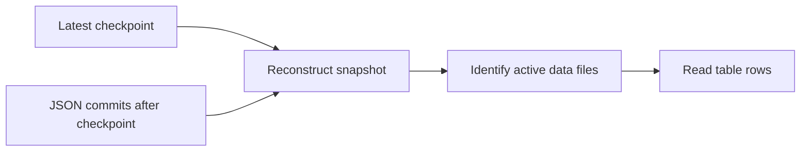

# Delta Lake Maintenance: Checkpoints, OPTIMIZE, Time Travel, RESTORE, and VACUUM

> Run the Python cells on Databricks serverless notebook compute. Direct `abfss://` operations require `READ FILES` and `WRITE FILES` on the external location. The examples use `demodb117/data` and dedicated session directories so reruns do not affect unrelated data.


### Hands-on Session Guide

## 1. Session Objective

In this session, you will create a fresh external Delta table and examine how Delta Lake maintains data files and transaction history.

You will:

- Create a new external Delta table.
- Insert initial records.
- Perform multiple separate small writes.
- Compare active files with physical files.
- Inspect `_delta_log` JSON commits.
- Look for Delta checkpoint files.
- Understand how Delta reconstructs a table snapshot.
- Compact small files using `OPTIMIZE`.
## Part A — Prepare a Clean Environment

## Task 1 — Select the Catalog

```sql
USE CATALOG training_catalog;
```

```sql
SELECT current_catalog() AS current_catalog;
```

## Task 2 — Create and Select the Schema

```sql
CREATE SCHEMA IF NOT EXISTS
training_catalog.delta_maintenance_demo
COMMENT 'Schema used for Delta maintenance exercises';
```

```sql
USE SCHEMA delta_maintenance_demo;
```

```sql
SELECT
    current_catalog() AS current_catalog,
    current_schema() AS current_schema;
```

## Task 3 — Remove an Earlier Table Registration

```sql
DROP TABLE IF EXISTS
training_catalog.delta_maintenance_demo.customer_orders;
```

Because the table is external, dropping the table does not remove its files.

## Task 4 — Remove the Dedicated Directory

Run after replacing the path:

```python
table_path = (
    "abfss://data@demodb117.dfs.core.windows.net/delta_maintenance/"
    "customer_orders"
)

required_suffix = "/delta_maintenance/customer_orders"

if not table_path.endswith(required_suffix):
    raise ValueError(
        "The path does not match the dedicated POC directory."
    )

removed = dbutils.fs.rm(
    table_path,
    recurse=True,
)

print(f"Existing POC directory removed: {removed}")
```

This is destructive. Run it only against the dedicated POC directory.

## Part B — Create the Fresh Delta Table

## Task 5 — Create the External Table

```sql
CREATE TABLE
training_catalog.delta_maintenance_demo.customer_orders
(
    order_id          INT,
    customer_name     STRING,
    city              STRING,
    product_category  STRING,
    order_amount      DECIMAL(10,2),
    order_status      STRING,
    order_date        DATE,
    updated_at        TIMESTAMP
)
USING DELTA
LOCATION
'abfss://data@demodb117.dfs.core.windows.net/delta_maintenance/customer_orders'
COMMENT 'External Delta table used for checkpoint and maintenance exercises';
```

Because `LOCATION` is supplied, this is an external Delta table.

## Task 6 — Insert the Initial Eight Records

```sql
INSERT INTO
training_catalog.delta_maintenance_demo.customer_orders
VALUES
    (1001, 'Aditi', 'Pune', 'Electronics', 1250.00, 'PLACED',
     DATE '2026-07-20', TIMESTAMP '2026-07-20 09:00:00'),
    (1002, 'Rahul', 'Mumbai', 'Books', 650.00, 'PLACED',
     DATE '2026-07-20', TIMESTAMP '2026-07-20 09:05:00'),
    (1003, 'Neha', 'Bengaluru', 'Home', 2100.00, 'SHIPPED',
     DATE '2026-07-21', TIMESTAMP '2026-07-21 10:00:00'),
    (1004, 'Aman', 'Pune', 'Fitness', 1800.00, 'PLACED',
     DATE '2026-07-21', TIMESTAMP '2026-07-21 10:05:00'),
    (1005, 'Priya', 'Mumbai', 'Electronics', 3200.00, 'DELIVERED',
     DATE '2026-07-22', TIMESTAMP '2026-07-22 11:00:00'),
    (1006, 'Vikram', 'Bengaluru', 'Books', 950.00, 'CANCELLED',
     DATE '2026-07-22', TIMESTAMP '2026-07-22 11:05:00'),
    (1007, 'Meera', 'Pune', 'Home', 1450.00, 'PLACED',
     DATE '2026-07-23', TIMESTAMP '2026-07-23 12:00:00'),
    (1008, 'Karan', 'Mumbai', 'Fitness', 1100.00, 'PLACED',
     DATE '2026-07-23', TIMESTAMP '2026-07-23 12:05:00');
```

```sql
SELECT *
FROM training_catalog.delta_maintenance_demo.customer_orders
ORDER BY order_id;
```

```sql
SELECT COUNT(*) AS initial_count
FROM training_catalog.delta_maintenance_demo.customer_orders;
```

Expected count:

## Task 7 — Inspect Initial History

```sql
DESCRIBE HISTORY
training_catalog.delta_maintenance_demo.customer_orders;
```

A clean run normally starts with:

Use the actual history output as the source of truth.

## Part C — Generate Separate Small Transactions

## 6. Why Separate Writes Are Used

Each separate successful write normally creates:

Several small writes also make the small-file problem easier to observe.

## Task 8 — Run Twelve Separate Writes

```python
target_table = (
    "training_catalog."
    "delta_maintenance_demo."
    "customer_orders"
)

cities = [
    "Pune",
    "Mumbai",
    "Bengaluru",
]

categories = [
    "Books",
    "Home",
    "Fitness",
    "Electronics",
]

for batch_number in range(1, 13):
    order_id = 2000 + batch_number
    city = cities[
        (batch_number - 1) % len(cities)
    ]
    category = categories[
        (batch_number - 1) % len(categories)
    ]
    amount = 500 + (batch_number * 100)

    spark.sql(
        f"""
        INSERT INTO {target_table}
        VALUES
        (
            {order_id},
            'Checkpoint Customer {batch_number}',
            '{city}',
            '{category}',
            CAST({amount} AS DECIMAL(10,2)),
            'PLACED',
            current_date(),
            current_timestamp()
        )
        """
    )

    print(
        f"Committed batch {batch_number}, "
        f"order_id {order_id}"
    )
```

Each loop iteration calls `spark.sql` separately and is intended to create a separate transaction.

## Task 9 — Verify the Count and History

```sql
SELECT COUNT(*) AS rows_after_small_writes
FROM training_catalog.delta_maintenance_demo.customer_orders;
```

Expected:

```sql
DESCRIBE HISTORY
training_catalog.delta_maintenance_demo.customer_orders;
```

A clean run will normally reach approximately version `13`, although actual versions can differ.

## Part D — Inspect Active and Physical Files

## Task 10 — Inspect Active Files

```sql
DESCRIBE DETAIL
training_catalog.delta_maintenance_demo.customer_orders;
```

Record:

| Metric | Before `OPTIMIZE` |
|---|---:|
| `numFiles` | |
| `sizeInBytes` | |
`numFiles` represents files active in the current snapshot.

## Task 11 — Count Physical Parquet Files

```python
root_entries_before = dbutils.fs.ls(
    table_path
)

physical_parquet_before = [
    entry
    for entry in root_entries_before
    if entry.name.endswith(".parquet")
]

print(
    "Physical Parquet files before OPTIMIZE:",
    len(physical_parquet_before),
)

display(root_entries_before)
```

Understand the difference:

## Part E — Inspect `_delta_log`

## Task 12 — List Log Files

```python
delta_log_path = f"{table_path}/_delta_log"

log_entries = sorted(
    dbutils.fs.ls(delta_log_path),
    key=lambda entry: entry.name,
)

for entry in log_entries:
    print(
        entry.name,
        entry.size,
    )
```

Look for numbered files such as:

## Task 13 — Separate JSON and Checkpoint Entries

```python
json_entries = [
    entry
    for entry in log_entries
    if entry.name.endswith(".json")
]

checkpoint_entries = [
    entry
    for entry in log_entries
    if (
        "checkpoint" in entry.name
        or entry.name == "_last_checkpoint"
    )
]

print(
    f"JSON commit files found: "
    f"{len(json_entries)}"
)

print(
    f"Checkpoint-related entries found: "
    f"{len(checkpoint_entries)}"
)

for entry in checkpoint_entries:
    print(entry.name)
```

Checkpoint frequency is automatically selected. A checkpoint may appear, but it is not guaranteed at an exact version.

## Task 14 — Read `_last_checkpoint` When Present

```python
last_checkpoint_path = next(
    (
        entry.path
        for entry in log_entries
        if entry.name == "_last_checkpoint"
    ),
    None,
)

if last_checkpoint_path:
    print(
        dbutils.fs.head(
            last_checkpoint_path,
            5000,
        )
    )
else:
    print(
        "No _last_checkpoint file was found. "
        "Checkpoint frequency is selected automatically."
    )
```

Do not edit `_last_checkpoint`.

## Part F — Understand Delta Checkpoints

## 7. What Is a Delta Checkpoint?

A Delta checkpoint is a compact representation of the transaction-log state at a particular table version.

It can summarize:

- Active data files
- Removed-file actions that must still be tracked
- Table schema
- Table properties
- Protocol information
- Partition metadata
## 8. Why Checkpoints Are Needed

Without checkpoints, a reader could need to replay every JSON commit from version `0`.

With a checkpoint:



## Part G — Run OPTIMIZE

## 9. What OPTIMIZE Does

Basic `OPTIMIZE` performs bin-packing for a compatible Delta table.

It does not guarantee one output file.

- Total data size
- Target file size
- Existing file sizes
- Data distribution
- Partition boundaries
- Runtime behaviour
## Task 15 — Record the State Before OPTIMIZE

```sql
DESCRIBE DETAIL
training_catalog.delta_maintenance_demo.customer_orders;
```

```sql
SELECT COUNT(*) AS count_before_optimize
FROM training_catalog.delta_maintenance_demo.customer_orders;
```

Expected count:

## Task 16 — Run OPTIMIZE

```sql
OPTIMIZE
training_catalog.delta_maintenance_demo.customer_orders;
```

Review the returned metrics, including file counts when available.

## Task 17 — Validate the Result

```sql
SELECT COUNT(*) AS count_after_optimize
FROM training_catalog.delta_maintenance_demo.customer_orders;
```

Expected:

```sql
DESCRIBE DETAIL
training_catalog.delta_maintenance_demo.customer_orders;
```

Complete:

| Metric | Before | After |
|---|---:|---:|
| `numFiles` | | |
| `sizeInBytes` | | |
| Row count | 20 | 20 |
## Task 18 — Count Physical Files Again

```python
root_entries_after_optimize = dbutils.fs.ls(
    table_path
)

physical_parquet_after_optimize = [
    entry
    for entry in root_entries_after_optimize
    if entry.name.endswith(".parquet")
]

print(
    "Physical Parquet files after OPTIMIZE:",
    len(physical_parquet_after_optimize),
)

display(root_entries_after_optimize)
```

The physical file count might remain high even when active file count decreases.

## 10. Why Old Files Remain

`OPTIMIZE`:

1. Reads smaller active files.
2. Writes one or multiple compacted files.
3. Adds the new files to a new version.
4. Marks old files as removed.
It does not immediately delete the old files because earlier versions can still need them.

## Task 19 — Inspect the OPTIMIZE Version

```sql
DESCRIBE HISTORY
training_catalog.delta_maintenance_demo.customer_orders;
```

Look for:

## Part H — Create UPDATE and DELETE Versions

## Task 20 — Record the Version Before UPDATE

```sql
DESCRIBE HISTORY
training_catalog.delta_maintenance_demo.customer_orders;
```

Write:

## Task 21 — Update Order 1001

```sql
UPDATE
training_catalog.delta_maintenance_demo.customer_orders
SET
    order_amount = 1350.00,
    order_status = 'SHIPPED',
    updated_at = current_timestamp()
WHERE order_id = 1001;
```

```sql
SELECT *
FROM training_catalog.delta_maintenance_demo.customer_orders
WHERE order_id = 1001;
```

## Task 22 — Record the Version Before DELETE

```sql
DESCRIBE HISTORY
training_catalog.delta_maintenance_demo.customer_orders;
```

Write:

## Task 23 — Delete Order 1003

```sql
DELETE FROM
training_catalog.delta_maintenance_demo.customer_orders
WHERE order_id = 1003;
```

```sql
SELECT COUNT(*) AS count_after_delete
FROM training_catalog.delta_maintenance_demo.customer_orders;
```

Expected:

```sql
DESCRIBE HISTORY
training_catalog.delta_maintenance_demo.customer_orders;
```

## Part I — Time Travel

Time travel requires both:

## Task 24 — Query Before the UPDATE

Replace the placeholder:

```sql
SELECT *
FROM training_catalog.delta_maintenance_demo.customer_orders
VERSION AS OF <version_before_update>
WHERE order_id = 1001;
```

Expected older values:

## Task 25 — Query the Deleted Record

```sql
SELECT *
FROM training_catalog.delta_maintenance_demo.customer_orders
VERSION AS OF <version_before_delete>
WHERE order_id = 1003;
```

Expected:

## Task 26 — Query by Timestamp

```sql
DESCRIBE HISTORY
training_catalog.delta_maintenance_demo.customer_orders;
```

Copy the timestamp of the version before delete and run:

```sql
SELECT *
FROM training_catalog.delta_maintenance_demo.customer_orders
TIMESTAMP AS OF '<timestamp_from_history>'
WHERE order_id = 1003;
```

Use the actual timestamp from history.

## Task 27 — Compare Counts

```sql
SELECT
    'before_delete' AS table_state,
    COUNT(*) AS row_count
FROM training_catalog.delta_maintenance_demo.customer_orders
VERSION AS OF <version_before_delete>

UNION ALL

SELECT
    'current',
    COUNT(*)
FROM training_catalog.delta_maintenance_demo.customer_orders;
```

Expected:

| State | Count |
|---|---:|
| Before delete | 20 |
| Current | 19 |
## Part J — RESTORE

`VERSION AS OF` only reads an older state.

`RESTORE` creates a new current version matching an earlier state.

## Task 28 — Restore the Version Before DELETE

```sql
RESTORE TABLE
training_catalog.delta_maintenance_demo.customer_orders
TO VERSION AS OF <version_before_delete>;
```

## Task 29 — Validate RESTORE

```sql
SELECT *
FROM training_catalog.delta_maintenance_demo.customer_orders
WHERE order_id = 1003;
```

```sql
SELECT COUNT(*) AS count_after_restore
FROM training_catalog.delta_maintenance_demo.customer_orders;
```

Expected:

```sql
DESCRIBE HISTORY
training_catalog.delta_maintenance_demo.customer_orders;
```

Look for:

## Part K — Data Retention and Log Retention

Delta maintains two separate lifecycles.

| Item | Main control | Normal default |
|---|---|---:|
| Removed Parquet files | `delta.deletedFileRetentionDuration` | 7 days |
| Transaction-log history | `delta.logRetentionDuration` | 30 days |
## 11. Data-File Lifecycle

When a file is replaced:

The retention age is based on when the file was logically removed.

## 12. Transaction-Log Lifecycle

JSON commits and checkpoints are stored in `_delta_log`.

Old log entries are cleaned separately according to log retention and checkpoint maintenance.

## Task 30 — Inspect Table Properties

```sql
SHOW TBLPROPERTIES
training_catalog.delta_maintenance_demo.customer_orders;
```

Look for:

Defaults might not appear when they have not been explicitly assigned as table properties.

## 13. Example: Current Version 21, Historical Version 3

Assume:

After version 4:

## Part L — VACUUM

## Task 31 — Preview Eligible Files

```sql
VACUUM
training_catalog.delta_maintenance_demo.customer_orders
DRY RUN;
```

Because all files were created recently, the expected result is normally:

## Task 32 — Run Safe VACUUM

```sql
VACUUM
training_catalog.delta_maintenance_demo.customer_orders;
```

Do not reduce retention or disable the retention safety check during this POC.

## Task 33 — Validate the Current Table

```sql
SELECT COUNT(*) AS count_after_vacuum
FROM training_catalog.delta_maintenance_demo.customer_orders;
```

Expected:

## Task 34 — Recheck Recent Time Travel

```sql
SELECT *
FROM training_catalog.delta_maintenance_demo.customer_orders
VERSION AS OF <version_before_delete>
WHERE order_id = 1003;
```

Because safe `VACUUM` uses the default retention and the files are recent, this version should normally remain readable.

## 14. Effect on Historical Versions

The transaction history can temporarily show a version even when a required data file has been deleted.

## Part M — Final Comparison

| Feature | Purpose |
|---|---|
| JSON commit | Records actions for one Delta transaction |
| Delta checkpoint | Summarizes log state at a particular version |
| `OPTIMIZE` | Rewrites active files into a better layout |
| `VERSION AS OF` | Reads an older version |
| `TIMESTAMP AS OF` | Reads an older state by time |
| `RESTORE` | Makes an older state the new current version |
| `VACUUM` | Deletes eligible old physical data files |
| Log cleanup | Cleans eligible old log entries separately |
## 15. Final Mental Model

## Part N — Observation Worksheet

| Observation | Value |
|---|---|
| Initial count | |
| Count after 12 writes | |
| Number of JSON commits | |
| Was `_last_checkpoint` present? | |
| Latest checkpoint version | |
| Active files before `OPTIMIZE` | |
| Physical files before `OPTIMIZE` | |
| Active files after `OPTIMIZE` | |
| Physical files after `OPTIMIZE` | |
| Version before `UPDATE` | |
| Version before `DELETE` | |
| Count after `DELETE` | |
| Count after `RESTORE` | |
| Files reported by `VACUUM DRY RUN` | |
## Part P — Answers


## Part R — Cleanup

## Task 35 — Drop the Table

```sql
DROP TABLE IF EXISTS
training_catalog.delta_maintenance_demo.customer_orders;
```

## Task 36 — Delete the Dedicated Directory

```python
table_path = (
    "abfss://data@demodb117.dfs.core.windows.net/delta_maintenance/"
    "customer_orders"
)

required_suffix = "/delta_maintenance/customer_orders"

if not table_path.endswith(required_suffix):
    raise ValueError(
        "The path does not match the dedicated POC directory."
    )

removed = dbutils.fs.rm(
    table_path,
    recurse=True,
)

print(f"POC directory removed: {removed}")
```

## Task 37 — Drop the Schema

Run only when the schema contains no required objects:

```sql
DROP SCHEMA IF EXISTS
training_catalog.delta_maintenance_demo
CASCADE;
```
