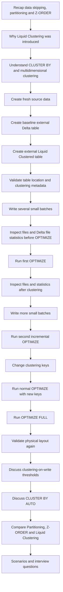

# Delta Lake Liquid Clustering

> Run the Python cells on Databricks serverless notebook compute. Direct `abfss://` operations require `READ FILES` and `WRITE FILES` on the external location. The examples use `demodb117/data` and dedicated session directories so reruns do not affect unrelated data.


### Session Overview

Liquid Clustering is a Delta Lake data-layout technique that organizes records using one or more clustering keys without creating fixed partition folders.

This session connects Liquid Clustering with the topics already covered:

- Why Liquid Clustering was introduced.
- How `CLUSTER BY` differs from partitioning, bucketing, and Z-ORDER.
- How clustering keys are selected.
- What clustering-on-write means.
- Why small writes may still need `OPTIMIZE`.
- How normal `OPTIMIZE` works incrementally.
- How `OPTIMIZE FULL` differs from normal `OPTIMIZE`.
- What happens when clustering keys change.
## Session Flow



## 1. Environment Used in This Session

Storage:

Session root:

## 2. Compute and Runtime Check

Before beginning, check the current Databricks version.

Liquid Clustering is generally available for Delta tables on Databricks Runtime 15.4 LTS and above.

> If `OPTIMIZE FULL` is not supported by the compute being used, skip that command and continue with the conceptual explanation.
## 3. Important Serverless Compute Note

The session does not depend on unrestricted-cluster Spark configurations.

For example, do not make the demonstration dependent on:

## 4. Create the Session Namespace and Clean Old Objects

Create the catalog and schema first.

```sql
CREATE CATALOG IF NOT EXISTS delta_liquid_clustering_lab;

CREATE SCHEMA IF NOT EXISTS delta_liquid_clustering_lab.sales_demo;
```

Now drop any old copies of the session tables.

```sql
DROP TABLE IF EXISTS delta_liquid_clustering_lab.sales_demo.sales_liquid_clustered;
DROP TABLE IF EXISTS delta_liquid_clustering_lab.sales_demo.sales_baseline;
DROP TABLE IF EXISTS delta_liquid_clustering_lab.sales_demo.sales_source;
DROP TABLE IF EXISTS delta_liquid_clustering_lab.sales_demo.sales_auto_demo;
```

```python
dbutils.fs.rm(
    "abfss://data@demodb117.dfs.core.windows.net/delta_liquid_clustering_session/sales_liquid_clustered",
    True
)

dbutils.fs.rm(
    "abfss://data@demodb117.dfs.core.windows.net/delta_liquid_clustering_session/sales_baseline",
    True
)

dbutils.fs.rm(
    "abfss://data@demodb117.dfs.core.windows.net/delta_liquid_clustering_session/sales_source",
    True
)
```

## 5. Recap: Why Does Data Layout Matter?

Delta Lake uses file-level statistics to avoid reading files that cannot contain matching records.

For example:

## 6. Recap: Partitioning

Partitioning creates fixed value-based physical boundaries.

Example:

- Partition pruning can skip complete partitions.
- Works well for some very large tables with stable filter patterns.
- High-cardinality partition columns can create too many partitions.
- Layout is rigid.
- Changing the partitioning strategy can require significant migration or rewriting.
## 7. Recap: Z-ORDER

Z-ORDER improves locality for selected columns.

The Z-ORDER columns are specified as part of the optimization operation.

## 8. Why Liquid Clustering?

Liquid Clustering moves the layout decision into the table definition.

The table now knows:

## 9. Liquid Clustering Is Not Hive Bucketing

Traditional bucketing follows a fixed hash-bucket design.

Conceptually:

## 10. What Does Multidimensional Clustering Mean?

A clustering column can be considered a dimension.

One key:

| customer_id | region | country_code |
|---:|---|---|
| 10542 | NORTH | IN |
| 10542 | SOUTH | UK |
| 10542 | EAST | SG |
| 20891 | NORTH | US |
| 20891 | WEST | DE |
## 11. Restrictions to Remember

A Liquid Clustered Delta table cannot simultaneously use traditional table partitioning.

A Liquid Clustered table also cannot use Z-ORDER.

```sql
OPTIMIZE delta_liquid_clustering_lab.sales_demo.sales_liquid_clustered
ZORDER BY (customer_id);
```

## 12. Create the Source Dataset

The source contains 600,000 records.

It contains:

```sql
CREATE TABLE delta_liquid_clustering_lab.sales_demo.sales_source
USING DELTA
LOCATION 'abfss://data@demodb117.dfs.core.windows.net/delta_liquid_clustering_session/sales_source'
AS
SELECT
    1000000 + id AS order_id,

    CAST(
        10000 + pmod(id, 20000)
        AS INT
    ) AS customer_id,

    date_add(
        DATE '2025-01-01',
        CAST(pmod(id, 365) AS INT)
    ) AS order_date,

    CASE
        pmod(
            CAST(floor(id / 60000) AS BIGINT)
            +
            CAST(floor(pmod(id, 20000) / 5000) AS BIGINT),
            4
        )
        WHEN 0 THEN 'NORTH'
        WHEN 1 THEN 'SOUTH'
        WHEN 2 THEN 'EAST'
        ELSE 'WEST'
    END AS region,

    CASE
        pmod(
            2 * CAST(floor(id / 60000) AS BIGINT)
            +
            CAST(floor(pmod(id, 20000) / 4000) AS BIGINT),
            5
        )
        WHEN 0 THEN 'IN'
        WHEN 1 THEN 'US'
        WHEN 2 THEN 'UK'
        WHEN 3 THEN 'DE'
        ELSE 'SG'
    END AS country_code,

    CASE pmod(id, 6)
        WHEN 0 THEN 'ELECTRONICS'
        WHEN 1 THEN 'BOOKS'
        WHEN 2 THEN 'FASHION'
        WHEN 3 THEN 'HOME'
        WHEN 4 THEN 'SPORTS'
        ELSE 'GROCERY'
    END AS product_category,

    CASE pmod(id, 4)
        WHEN 0 THEN 'PLACED'
        WHEN 1 THEN 'SHIPPED'
        WHEN 2 THEN 'DELIVERED'
        ELSE 'CANCELLED'
    END AS order_status,

    CAST(
        500 + pmod(id * 37, 25000) / 10.0
        AS DECIMAL(12,2)
    ) AS order_amount,

    CAST(
        floor(id / 60000) + 1
        AS INT
    ) AS ingestion_batch

FROM range(0, 600000);
```

## 13. Validate the Source Data

Check the total records.

```sql
SELECT COUNT(*) AS total_records
FROM delta_liquid_clustering_lab.sales_demo.sales_source;
```

Expected:

```sql
SELECT
    ingestion_batch,
    COUNT(*) AS records
FROM delta_liquid_clustering_lab.sales_demo.sales_source
GROUP BY ingestion_batch
ORDER BY ingestion_batch;
```

```sql
SELECT
    COUNT(DISTINCT customer_id) AS unique_customers
FROM delta_liquid_clustering_lab.sales_demo.sales_source;
```

```sql
SELECT
    customer_id,
    ingestion_batch,
    region,
    country_code,
    order_date,
    order_amount
FROM delta_liquid_clustering_lab.sales_demo.sales_source
WHERE customer_id = 10542
ORDER BY ingestion_batch, order_id;
```

## 14. Validate the Source Table Location

Use table metadata.

```sql
DESCRIBE DETAIL
delta_liquid_clustering_lab.sales_demo.sales_source;
```

Confirm that the `location` is:

```sql
SELECT
    path,
    length
FROM read_files(
    'abfss://data@demodb117.dfs.core.windows.net/delta_liquid_clustering_session/sales_source',
    format => 'binaryFile'
)
WHERE path LIKE '%.parquet'
  AND path NOT LIKE '%/_delta_log/%'
ORDER BY path;
```

## 15. Create an Unclustered Baseline Table

```sql
CREATE TABLE delta_liquid_clustering_lab.sales_demo.sales_baseline
(
    order_id BIGINT,
    customer_id INT,
    order_date DATE,
    region STRING,
    country_code STRING,
    product_category STRING,
    order_status STRING,
    order_amount DECIMAL(12,2),
    ingestion_batch INT
)
USING DELTA
LOCATION 'abfss://data@demodb117.dfs.core.windows.net/delta_liquid_clustering_session/sales_baseline';
```

This table has:

## 16. Create the Liquid Clustered External Table

Use two clustering keys:

```sql
CREATE TABLE delta_liquid_clustering_lab.sales_demo.sales_liquid_clustered
(
    order_id BIGINT,
    customer_id INT,
    order_date DATE,
    region STRING,
    country_code STRING,
    product_category STRING,
    order_status STRING,
    order_amount DECIMAL(12,2),
    ingestion_batch INT
)
USING DELTA
CLUSTER BY (customer_id, region)
LOCATION 'abfss://data@demodb117.dfs.core.windows.net/delta_liquid_clustering_session/sales_liquid_clustered';
```

Why these keys?

## 17. Validate the Liquid Clustered Table Definition

Check table details.

```sql
DESCRIBE DETAIL
delta_liquid_clustering_lab.sales_demo.sales_liquid_clustered;
```

Confirm the location:

```sql
SHOW TBLPROPERTIES
delta_liquid_clustering_lab.sales_demo.sales_liquid_clustered;
```

## 18. Why We Are Using Small Writes

The external table has two clustering keys.

For non-managed Delta tables, the clustering-on-write threshold for two clustering columns is approximately:

## 19. Load the First Eight Batches into the Baseline Table

Each batch contains 60,000 rows.

```sql
INSERT INTO delta_liquid_clustering_lab.sales_demo.sales_baseline
SELECT * FROM delta_liquid_clustering_lab.sales_demo.sales_source
WHERE ingestion_batch = 1;
```

```sql
INSERT INTO delta_liquid_clustering_lab.sales_demo.sales_baseline
SELECT * FROM delta_liquid_clustering_lab.sales_demo.sales_source
WHERE ingestion_batch = 2;
```

```sql
INSERT INTO delta_liquid_clustering_lab.sales_demo.sales_baseline
SELECT * FROM delta_liquid_clustering_lab.sales_demo.sales_source
WHERE ingestion_batch = 3;
```

```sql
INSERT INTO delta_liquid_clustering_lab.sales_demo.sales_baseline
SELECT * FROM delta_liquid_clustering_lab.sales_demo.sales_source
WHERE ingestion_batch = 4;
```

```sql
INSERT INTO delta_liquid_clustering_lab.sales_demo.sales_baseline
SELECT * FROM delta_liquid_clustering_lab.sales_demo.sales_source
WHERE ingestion_batch = 5;
```

```sql
INSERT INTO delta_liquid_clustering_lab.sales_demo.sales_baseline
SELECT * FROM delta_liquid_clustering_lab.sales_demo.sales_source
WHERE ingestion_batch = 6;
```

```sql
INSERT INTO delta_liquid_clustering_lab.sales_demo.sales_baseline
SELECT * FROM delta_liquid_clustering_lab.sales_demo.sales_source
WHERE ingestion_batch = 7;
```

```sql
INSERT INTO delta_liquid_clustering_lab.sales_demo.sales_baseline
SELECT * FROM delta_liquid_clustering_lab.sales_demo.sales_source
WHERE ingestion_batch = 8;
```

## 20. Load the Same Eight Batches into the Liquid Clustered Table

```sql
INSERT INTO delta_liquid_clustering_lab.sales_demo.sales_liquid_clustered
SELECT * FROM delta_liquid_clustering_lab.sales_demo.sales_source
WHERE ingestion_batch = 1;
```

```sql
INSERT INTO delta_liquid_clustering_lab.sales_demo.sales_liquid_clustered
SELECT * FROM delta_liquid_clustering_lab.sales_demo.sales_source
WHERE ingestion_batch = 2;
```

```sql
INSERT INTO delta_liquid_clustering_lab.sales_demo.sales_liquid_clustered
SELECT * FROM delta_liquid_clustering_lab.sales_demo.sales_source
WHERE ingestion_batch = 3;
```

```sql
INSERT INTO delta_liquid_clustering_lab.sales_demo.sales_liquid_clustered
SELECT * FROM delta_liquid_clustering_lab.sales_demo.sales_source
WHERE ingestion_batch = 4;
```

```sql
INSERT INTO delta_liquid_clustering_lab.sales_demo.sales_liquid_clustered
SELECT * FROM delta_liquid_clustering_lab.sales_demo.sales_source
WHERE ingestion_batch = 5;
```

```sql
INSERT INTO delta_liquid_clustering_lab.sales_demo.sales_liquid_clustered
SELECT * FROM delta_liquid_clustering_lab.sales_demo.sales_source
WHERE ingestion_batch = 6;
```

```sql
INSERT INTO delta_liquid_clustering_lab.sales_demo.sales_liquid_clustered
SELECT * FROM delta_liquid_clustering_lab.sales_demo.sales_source
WHERE ingestion_batch = 7;
```

```sql
INSERT INTO delta_liquid_clustering_lab.sales_demo.sales_liquid_clustered
SELECT * FROM delta_liquid_clustering_lab.sales_demo.sales_source
WHERE ingestion_batch = 8;
```

## 21. Validate the Initial Row Counts

```sql
SELECT COUNT(*) AS baseline_rows
FROM delta_liquid_clustering_lab.sales_demo.sales_baseline;
```

Expected:

```sql
SELECT COUNT(*) AS clustered_rows
FROM delta_liquid_clustering_lab.sales_demo.sales_liquid_clustered;
```

Expected:

```sql
SELECT COUNT(*) AS customer_10542_rows
FROM delta_liquid_clustering_lab.sales_demo.sales_liquid_clustered
WHERE customer_id = 10542;
```

## 22. Monitor the Physical Table Location Before OPTIMIZE

Check the active-table metadata.

```sql
DESCRIBE DETAIL
delta_liquid_clustering_lab.sales_demo.sales_liquid_clustered;
```

Record:

```sql
SELECT
    path,
    length
FROM read_files(
    'abfss://data@demodb117.dfs.core.windows.net/delta_liquid_clustering_session/sales_liquid_clustered',
    format => 'binaryFile'
)
WHERE path LIKE '%.parquet'
  AND path NOT LIKE '%/_delta_log/%'
ORDER BY path;
```

```sql
SELECT
    COUNT(*) AS physical_parquet_files,
    SUM(length) AS physical_bytes
FROM read_files(
    'abfss://data@demodb117.dfs.core.windows.net/delta_liquid_clustering_session/sales_liquid_clustered',
    format => 'binaryFile'
)
WHERE path LIKE '%.parquet'
  AND path NOT LIKE '%/_delta_log/%';
```

## 23. Inspect Active File Value Ranges Before OPTIMIZE

The `_metadata` column gives the physical file path for each active row.

```sql
SELECT
    _metadata.file_path AS file_path,
    COUNT(*) AS rows_in_file,
    MIN(customer_id) AS min_customer_id,
    MAX(customer_id) AS max_customer_id,
    MIN(region) AS min_region,
    MAX(region) AS max_region,
    MIN(country_code) AS min_country_code,
    MAX(country_code) AS max_country_code
FROM delta_liquid_clustering_lab.sales_demo.sales_liquid_clustered
GROUP BY _metadata.file_path
ORDER BY file_path;
```

Before clustering, many files may have broad or overlapping value ranges.

## 24. Inspect Delta File-Level Statistics Before OPTIMIZE

Read the JSON commits under `_delta_log`.

```python
from pyspark.sql.functions import col, get_json_object, regexp_extract

display(
    spark.read
    .json(
        "abfss://data@demodb117.dfs.core.windows.net/"
        "delta_liquid_clustering_session/sales_liquid_clustered/_delta_log/*.json"
    )
    .where(col("add.path").isNotNull())
    .select(
        regexp_extract(
            col("_metadata.file_name"),
            r"(\d{20})\.json",
            1
        ).cast("long").alias("commit_version"),

        col("add.path").alias("data_file"),

        get_json_object(
            col("add.stats"),
            "$.numRecords"
        ).alias("num_records"),

        get_json_object(
            col("add.stats"),
            "$.minValues.customer_id"
        ).alias("min_customer_id"),

        get_json_object(
            col("add.stats"),
            "$.maxValues.customer_id"
        ).alias("max_customer_id"),

        get_json_object(
            col("add.stats"),
            "$.minValues.region"
        ).alias("min_region"),

        get_json_object(
            col("add.stats"),
            "$.maxValues.region"
        ).alias("max_region"),

        get_json_object(
            col("add.stats"),
            "$.minValues.country_code"
        ).alias("min_country_code"),

        get_json_object(
            col("add.stats"),
            "$.maxValues.country_code"
        ).alias("max_country_code")
    )
    .orderBy(col("commit_version").desc())
)
```

Look for broad and overlapping ranges.

## 25. Run a Baseline Query

Use the same filter against both tables.

```sql
SELECT *
FROM delta_liquid_clustering_lab.sales_demo.sales_baseline
WHERE customer_id = 10542
ORDER BY ingestion_batch, order_id;
```

```sql
SELECT *
FROM delta_liquid_clustering_lab.sales_demo.sales_liquid_clustered
WHERE customer_id = 10542
ORDER BY ingestion_batch, order_id;
```

Before the first `OPTIMIZE`, the Liquid Clustered table might not yet show a major scan advantage because the small writes did not necessarily trigger clustering-on-write.

## 26. Run the First Liquid Clustering OPTIMIZE

```sql
OPTIMIZE
delta_liquid_clustering_lab.sales_demo.sales_liquid_clustered;
```

Notice the difference from Z-ORDER.

Z-ORDER:

## 27. Validate the Table After the First OPTIMIZE

Check history.

```sql
DESCRIBE HISTORY
delta_liquid_clustering_lab.sales_demo.sales_liquid_clustered
LIMIT 10;
```

Check the active table state.

```sql
DESCRIBE DETAIL
delta_liquid_clustering_lab.sales_demo.sales_liquid_clustered;
```

```sql
SHOW TBLPROPERTIES
delta_liquid_clustering_lab.sales_demo.sales_liquid_clustered;
```

## 28. Compare Active File Ranges After the First OPTIMIZE

```sql
SELECT
    _metadata.file_path AS file_path,
    COUNT(*) AS rows_in_file,
    MIN(customer_id) AS min_customer_id,
    MAX(customer_id) AS max_customer_id,
    MIN(region) AS min_region,
    MAX(region) AS max_region,
    MIN(country_code) AS min_country_code,
    MAX(country_code) AS max_country_code
FROM delta_liquid_clustering_lab.sales_demo.sales_liquid_clustered
GROUP BY _metadata.file_path
ORDER BY file_path;
```

Compare with the earlier output.

The goal is not to expect perfectly sorted files.

## 29. Inspect New `_delta_log` Statistics After OPTIMIZE

Run the same inspection again.

```python
from pyspark.sql.functions import col, get_json_object, regexp_extract

display(
    spark.read
    .json(
        "abfss://data@demodb117.dfs.core.windows.net/"
        "delta_liquid_clustering_session/sales_liquid_clustered/_delta_log/*.json"
    )
    .where(col("add.path").isNotNull())
    .select(
        regexp_extract(
            col("_metadata.file_name"),
            r"(\d{20})\.json",
            1
        ).cast("long").alias("commit_version"),

        col("add.path").alias("data_file"),

        get_json_object(
            col("add.stats"),
            "$.numRecords"
        ).alias("num_records"),

        get_json_object(
            col("add.stats"),
            "$.minValues.customer_id"
        ).alias("min_customer_id"),

        get_json_object(
            col("add.stats"),
            "$.maxValues.customer_id"
        ).alias("max_customer_id"),

        get_json_object(
            col("add.stats"),
            "$.minValues.region"
        ).alias("min_region"),

        get_json_object(
            col("add.stats"),
            "$.maxValues.region"
        ).alias("max_region"),

        get_json_object(
            col("add.stats"),
            "$.minValues.country_code"
        ).alias("min_country_code"),

        get_json_object(
            col("add.stats"),
            "$.maxValues.country_code"
        ).alias("max_country_code")
    )
    .orderBy(col("commit_version").desc())
)
```

The newest `add` records belong to files created by the optimization.

## 30. Important Physical-File Observation

After `OPTIMIZE`, the old files are no longer active, but they can still physically exist in ADLS.

Therefore:

## 31. Compare Query Scanning After Clustering

Run:

```sql
SELECT *
FROM delta_liquid_clustering_lab.sales_demo.sales_baseline
WHERE customer_id = 10542
ORDER BY ingestion_batch, order_id;
```

Then:

```sql
SELECT *
FROM delta_liquid_clustering_lab.sales_demo.sales_liquid_clustered
WHERE customer_id = 10542
ORDER BY ingestion_batch, order_id;
```

- Files read
- Files skipped
- Bytes read
- Scan time
## 32. Write Two More Small Batches

After the first `OPTIMIZE`, write batches 9 and 10.

Baseline:

```sql
INSERT INTO delta_liquid_clustering_lab.sales_demo.sales_baseline
SELECT * FROM delta_liquid_clustering_lab.sales_demo.sales_source
WHERE ingestion_batch = 9;
```

```sql
INSERT INTO delta_liquid_clustering_lab.sales_demo.sales_baseline
SELECT * FROM delta_liquid_clustering_lab.sales_demo.sales_source
WHERE ingestion_batch = 10;
```

```sql
INSERT INTO delta_liquid_clustering_lab.sales_demo.sales_liquid_clustered
SELECT * FROM delta_liquid_clustering_lab.sales_demo.sales_source
WHERE ingestion_batch = 9;
```

```sql
INSERT INTO delta_liquid_clustering_lab.sales_demo.sales_liquid_clustered
SELECT * FROM delta_liquid_clustering_lab.sales_demo.sales_source
WHERE ingestion_batch = 10;
```

## 33. Validate the New Row Counts

```sql
SELECT COUNT(*) AS baseline_rows
FROM delta_liquid_clustering_lab.sales_demo.sales_baseline;
```

Expected:

```sql
SELECT COUNT(*) AS clustered_rows
FROM delta_liquid_clustering_lab.sales_demo.sales_liquid_clustered;
```

Expected:

```sql
SELECT COUNT(*) AS customer_10542_rows
FROM delta_liquid_clustering_lab.sales_demo.sales_liquid_clustered
WHERE customer_id = 10542;
```

## 34. What Happened to the New Batches?

The clustering metadata already existed when batches 9 and 10 were written.

However, because each write is small:

## 35. Run the Second Normal OPTIMIZE

```sql
OPTIMIZE
delta_liquid_clustering_lab.sales_demo.sales_liquid_clustered;
```

Liquid Clustering optimization is incremental.

The important mental model is:

## 36. Validate Incremental Behavior

Check history.

```sql
DESCRIBE HISTORY
delta_liquid_clustering_lab.sales_demo.sales_liquid_clustered
LIMIT 10;
```

Inspect active file ranges again.

```sql
SELECT
    _metadata.file_path AS file_path,
    COUNT(*) AS rows_in_file,
    MIN(customer_id) AS min_customer_id,
    MAX(customer_id) AS max_customer_id,
    MIN(region) AS min_region,
    MAX(region) AS max_region
FROM delta_liquid_clustering_lab.sales_demo.sales_liquid_clustered
GROUP BY _metadata.file_path
ORDER BY file_path;
```

```sql
DESCRIBE DETAIL
delta_liquid_clustering_lab.sales_demo.sales_liquid_clustered;
```

## 37. What Makes Data a Potential OPTIMIZE Candidate?

Do not reduce the rule to:

For a Liquid Clustered table, Databricks can consider:

- File sizing
- Existing clustering state
- New incoming data
- Data that needs to be integrated into clustered ranges
- Data changes caused by writes and modifications
- Current clustering keys
## 38. Clustering-on-Write

Some write operations can cluster data while it is being written.

Supported operations include:

## 39. Clustering-on-Write Thresholds

Current thresholds:

| Clustering keys | UC managed table | Other Delta table, including external |
|---:|---:|---:|
| 1 | 64 MB | 256 MB |
| 2 | 256 MB | 1 GB |
| 3 | 512 MB | 2 GB |
| 4 | 1 GB | 4 GB |
Our external table uses:

## 40. Can We Configure the Clustering-on-Write Threshold?

There is no documented table property that lets us redefine these threshold values.

We choose:

## 41. What If Large Writes Are Already Well Clustered?

Suppose a write is large enough to trigger clustering-on-write and the output files are already well sized and well clustered.

Then:

## 42. Change the Clustering Keys

The original clustering strategy is:

Assume the workload changes.

```sql
ALTER TABLE
delta_liquid_clustering_lab.sales_demo.sales_liquid_clustered
CLUSTER BY (region, country_code);
```

## 43. Validate the New Clustering Metadata

```sql
SHOW TBLPROPERTIES
delta_liquid_clustering_lab.sales_demo.sales_liquid_clustered;
```

The current clustering keys should now be:

Check the table location again.

```sql
DESCRIBE DETAIL
delta_liquid_clustering_lab.sales_demo.sales_liquid_clustered;
```

## 44. Does Changing Clustering Keys Immediately Rewrite Existing Files?

No.

changes the clustering strategy stored in table metadata.

## 45. Run Normal OPTIMIZE After Changing Keys

```sql
OPTIMIZE
delta_liquid_clustering_lab.sales_demo.sales_liquid_clustered;
```

Normal `OPTIMIZE` uses the current clustering strategy.

It can rewrite data that it considers necessary.

## 46. Validate the Layout After Normal OPTIMIZE

```sql
SELECT
    _metadata.file_path AS file_path,
    COUNT(*) AS rows_in_file,
    MIN(region) AS min_region,
    MAX(region) AS max_region,
    MIN(country_code) AS min_country_code,
    MAX(country_code) AS max_country_code,
    MIN(customer_id) AS min_customer_id,
    MAX(customer_id) AS max_customer_id
FROM delta_liquid_clustering_lab.sales_demo.sales_liquid_clustered
GROUP BY _metadata.file_path
ORDER BY file_path;
```

Also inspect:

```sql
DESCRIBE HISTORY
delta_liquid_clustering_lab.sales_demo.sales_liquid_clustered
LIMIT 10;
```

and:

```sql
DESCRIBE DETAIL
delta_liquid_clustering_lab.sales_demo.sales_liquid_clustered;
```

## 47. `OPTIMIZE FULL`

When you want the complete table layout to reflect the current clustering keys, use:

```sql
OPTIMIZE
delta_liquid_clustering_lab.sales_demo.sales_liquid_clustered
FULL;
```

`OPTIMIZE FULL` requires Databricks Runtime 16.4 LTS or above.

## 48. Normal OPTIMIZE vs OPTIMIZE FULL

| Normal `OPTIMIZE` | `OPTIMIZE FULL` |
|---|---|
| Incremental | Whole-table rewrite |
| Rewrites data as needed | Rewrites all data files |
| Suitable for routine maintenance | Useful after enabling/changing clustering keys when full reclustering is required |
| Usually less expensive | Potentially expensive on large tables |
Teaching statement:

## 49. Validate the Table After `OPTIMIZE FULL`

Check metadata.

```sql
DESCRIBE DETAIL
delta_liquid_clustering_lab.sales_demo.sales_liquid_clustered;
```

Check clustering keys.

```sql
SHOW TBLPROPERTIES
delta_liquid_clustering_lab.sales_demo.sales_liquid_clustered;
```

```sql
SELECT
    _metadata.file_path AS file_path,
    COUNT(*) AS rows_in_file,
    MIN(region) AS min_region,
    MAX(region) AS max_region,
    MIN(country_code) AS min_country_code,
    MAX(country_code) AS max_country_code,
    MIN(customer_id) AS min_customer_id,
    MAX(customer_id) AS max_customer_id
FROM delta_liquid_clustering_lab.sales_demo.sales_liquid_clustered
GROUP BY _metadata.file_path
ORDER BY file_path;
```

```python
from pyspark.sql.functions import col, get_json_object, regexp_extract

display(
    spark.read
    .json(
        "abfss://data@demodb117.dfs.core.windows.net/"
        "delta_liquid_clustering_session/sales_liquid_clustered/_delta_log/*.json"
    )
    .where(col("add.path").isNotNull())
    .select(
        regexp_extract(
            col("_metadata.file_name"),
            r"(\d{20})\.json",
            1
        ).cast("long").alias("commit_version"),

        col("add.path").alias("data_file"),

        get_json_object(
            col("add.stats"),
            "$.numRecords"
        ).alias("num_records"),

        get_json_object(
            col("add.stats"),
            "$.minValues.region"
        ).alias("min_region"),

        get_json_object(
            col("add.stats"),
            "$.maxValues.region"
        ).alias("max_region"),

        get_json_object(
            col("add.stats"),
            "$.minValues.country_code"
        ).alias("min_country_code"),

        get_json_object(
            col("add.stats"),
            "$.maxValues.country_code"
        ).alias("max_country_code"),

        get_json_object(
            col("add.stats"),
            "$.minValues.customer_id"
        ).alias("min_customer_id"),

        get_json_object(
            col("add.stats"),
            "$.maxValues.customer_id"
        ).alias("max_customer_id")
    )
    .orderBy(col("commit_version").desc())
)
```

## 50. Monitor the Physical ADLS Location After Multiple Rewrites

List all physical Parquet files.

```sql
SELECT
    path,
    length
FROM read_files(
    'abfss://data@demodb117.dfs.core.windows.net/delta_liquid_clustering_session/sales_liquid_clustered',
    format => 'binaryFile'
)
WHERE path LIKE '%.parquet'
  AND path NOT LIKE '%/_delta_log/%'
ORDER BY path;
```

Compare the count with:

```sql
DESCRIBE DETAIL
delta_liquid_clustering_lab.sales_demo.sales_liquid_clustered;
```

## 51. Remove Clustering Keys

You can stop clustering by running:

```sql
ALTER TABLE
delta_liquid_clustering_lab.sales_demo.sales_liquid_clustered
CLUSTER BY NONE;
```

This changes the future clustering strategy.

## 52. Choosing Clustering Keys

The most important question is:

Examples:

## 53. Is High Cardinality a Problem?

High cardinality is not automatically a problem for Liquid Clustering.

For traditional partitioning:

## 54. How Many Clustering Keys?

Liquid Clustering supports up to four clustering keys.

Do not automatically choose four.

## 55. Why Do Clustering Columns Need Statistics?

Liquid Clustering improves query performance through data skipping.

Data skipping requires file-level statistics.

## 56. Manual Liquid Clustering vs Z-ORDER

On a small external-table demonstration, these can look similar because both aim to improve file locality.

The important difference is the management model.

## 57. Automatic Liquid Clustering

For Unity Catalog managed tables:

lets Databricks choose clustering keys automatically.

- Analyze historical query workload.
- Select useful clustering keys.
- Change keys when query patterns change.
- Consider whether the expected query savings justify clustering cost.
- Choose no keys when clustering is not beneficial.
## 58. Why `CLUSTER BY AUTO` Is More Powerful

Manual:

Automatic:

## 59. Optional Managed-Table Example

This section is optional because a small table with little query history might not immediately receive useful automatically selected keys.

```sql
CREATE OR REPLACE TABLE delta_liquid_clustering_lab.sales_demo.sales_auto_demo
(
    order_id BIGINT,
    customer_id INT,
    order_date DATE,
    region STRING,
    country_code STRING,
    order_amount DECIMAL(12,2)
)
CLUSTER BY AUTO;
```

Check:

```sql
SHOW TBLPROPERTIES
delta_liquid_clustering_lab.sales_demo.sales_auto_demo;
```

- The table is too small.
- Query history is insufficient.
- Natural data layout is already effective.
- Clustering cost would exceed expected benefit.
## 60. Partitioning vs Z-ORDER vs Liquid Clustering

| Feature | Partitioning | Z-ORDER | Liquid Clustering |
|---|---|---|---|
| Layout boundaries | Fixed | No fixed partition folders | Flexible |
| Main syntax | `PARTITIONED BY` | `OPTIMIZE ... ZORDER BY` | `CLUSTER BY` |
| High-cardinality columns | Usually problematic | Can work well | Can work well |
| Keys stored as flexible clustering strategy | No | No | Yes |
| Can change strategy easily | Difficult | Run future Z-ORDER with different columns | Yes |
| Incremental maintenance | Limited by partition design | Z-ORDER is incremental | Yes |
| Automatic workload-based key selection | No | No | `CLUSTER BY AUTO` |
| Recommended for new Delta tables | Usually not default | Usually not default | Yes |
## 61. Where Bucketing Fits

Liquid Clustering should not be described as Hive bucketing.

## 62. Important Blind Spots

### Blind Spot 1 — Small writes might not cluster on write

Five or ten records can be written successfully to a clustered table, but that does not mean those files are automatically well clustered.

A later `OPTIMIZE` can handle them.

### Blind Spot 2 — Normal OPTIMIZE does not mean full-table rewrite

Normal `OPTIMIZE` is incremental.

It does not blindly rewrite every active file.

### Blind Spot 3 — Changing keys does not rewrite old files immediately

```sql
ALTER TABLE ... CLUSTER BY (...)
```

changes metadata first.

Reorganization happens through later optimization.

### Blind Spot 4 — Normal OPTIMIZE can still do significant work after a key change

If the new clustering keys are very different from the old keys, a normal optimization might rewrite a large amount of data.

But this does not make it equivalent to `OPTIMIZE FULL`.

### Blind Spot 5 — File size is not the only consideration

A file can be well sized but poorly clustered.

Liquid `OPTIMIZE` also considers clustering quality.

### Blind Spot 6 — `CLUSTER BY AUTO` may choose no keys

That can be the correct decision for a small or rarely queried table.

### Blind Spot 7 — Serverless compute can restrict Spark configuration properties

Do not design the session around Spark-level file-size properties.

Use table metadata, physical files, query profiles, and `_delta_log` statistics for validation.

### Blind Spot 8 — Exact file counts are not deterministic

Different compute sizes, runtime versions, optimized writes, and execution plans can produce different file counts.

Focus on:

### Blind Spot 9 — Physical files and active files are different

After `OPTIMIZE`, old files can still physically exist.

Only the active files belong to the current Delta snapshot.

### Blind Spot 10 — Do not use `_metadata.file_path` with Unity Catalog

Use:

for file-level inspection.

### Blind Spot 11 — Direct path inspection needs file privileges

Table queries and direct file-path inspection are different access paths.

Commands using:

## 63. Query Scenarios

### Scenario A — Customer lookup

```sql
SELECT *
FROM delta_liquid_clustering_lab.sales_demo.sales_liquid_clustered
WHERE customer_id = 10542;
```

Possible key:

### Scenario B — Customer history by date

```sql
SELECT *
FROM delta_liquid_clustering_lab.sales_demo.sales_liquid_clustered
WHERE customer_id = 10542
  AND order_date BETWEEN DATE '2025-04-01'
                     AND DATE '2025-09-30';
```

Possible keys:

### Scenario C — Regional country reporting

```sql
SELECT
    region,
    country_code,
    SUM(order_amount)
FROM delta_liquid_clustering_lab.sales_demo.sales_liquid_clustered
WHERE region = 'WEST'
  AND country_code = 'IN'
GROUP BY region, country_code;
```

Possible keys:

### Scenario D — Frequently changing query patterns

Today's filters:

Six months later:

## 64. Interview Questions

1. What problem does Liquid Clustering solve?
2. How is it different from table partitioning?
3. How is it different from Z-ORDER?
4. Is Liquid Clustering hash bucketing?
5. What does multidimensional clustering mean?
6. Can a Liquid Clustered table also be partitioned?
7. Can it also use Z-ORDER?
8. How are clustering keys selected?
## 65. Final Mental Model

## 66. Session Validation Checklist

Before moving to the next section, confirm the following.

#### Source

- [ ] `sales_source` contains 600,000 rows.
- [ ] There are 10 ingestion batches.
- [ ] Every batch contains 60,000 rows.
- [ ] `customer_id = 10542` appears 30 times in the complete source.
#### Before first OPTIMIZE

- [ ] Baseline table contains 480,000 rows.
- [ ] Liquid Clustered table contains 480,000 rows.
- [ ] Liquid table location points to the expected ADLS directory.
- [ ] `SHOW TBLPROPERTIES` shows `customer_id` and `region` as clustering keys.
- [ ] Physical Parquet files are visible in the ADLS location.
- [ ] `_delta_log` contains file-level statistics.
#### After first OPTIMIZE

- [ ] `DESCRIBE HISTORY` contains an `OPTIMIZE` operation.
- [ ] Active file ranges can be compared with the pre-OPTIMIZE ranges.
- [ ] New `add.stats` records are visible in `_delta_log`.
- [ ] Old physical files may still remain in ADLS.
#### After additional writes

- [ ] Both tables contain 600,000 rows.
- [ ] Customer `10542` has 30 rows.
- [ ] New small writes appear after the first clustering operation.
- [ ] The second normal `OPTIMIZE` demonstrates incremental maintenance.
#### After changing keys

- [ ] Current keys are `region` and `country_code`.
- [ ] Table location has not changed.
- [ ] Normal `OPTIMIZE` uses the current strategy but is still incremental.
- [ ] `OPTIMIZE FULL`, when supported, rewrites the whole table using the current keys.
- [ ] File statistics can be inspected again after the full reclustering.
## 67. Cleanup

Drop the external tables.

```sql
DROP TABLE IF EXISTS delta_liquid_clustering_lab.sales_demo.sales_liquid_clustered;
DROP TABLE IF EXISTS delta_liquid_clustering_lab.sales_demo.sales_baseline;
DROP TABLE IF EXISTS delta_liquid_clustering_lab.sales_demo.sales_source;
DROP TABLE IF EXISTS delta_liquid_clustering_lab.sales_demo.sales_auto_demo;
```

External table data remains in ADLS after the tables are dropped.

```python
dbutils.fs.rm(
    "abfss://data@demodb117.dfs.core.windows.net/delta_liquid_clustering_session/sales_liquid_clustered",
    True
)

dbutils.fs.rm(
    "abfss://data@demodb117.dfs.core.windows.net/delta_liquid_clustering_session/sales_baseline",
    True
)

dbutils.fs.rm(
    "abfss://data@demodb117.dfs.core.windows.net/delta_liquid_clustering_session/sales_source",
    True
)
```

## 68. Final Summary

Liquid Clustering should be understood as a modern Delta data-layout strategy rather than as a new form of partitioning or Hive bucketing.

The most important ideas are:
