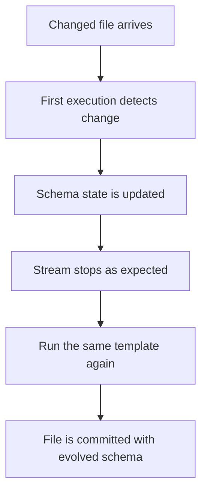

# Session 4 — Auto Loader Schema Evolution with Separate Mode Templates

Source systems change after data pipelines enter production. A source can add a column, stop sending a column, rename a field, change its casing, or send values that no longer match the approved datatype.

Auto Loader provides five schema-evolution modes. This session uses a separate, easy-to-follow ingestion template for every mode. The ingestion logic is not hidden inside one universal function.

The demonstrations use isolated source folders, checkpoints, schema locations, and Delta targets. A shared schema-audit table records what changed, whether the stream succeeded, and what action was taken.

## Session index

1. [Environment and execution requirements](#1-environment-and-execution-requirements)
2. [Schema layers and evolution modes](#2-schema-layers-and-evolution-modes)
3. [Expected failures and required restarts](#3-expected-failures-and-required-restarts)
4. [Create the isolated Session 4 environment](#4-create-the-isolated-session-4-environment)
5. [Create the schema-audit helper](#5-create-the-schema-audit-helper)
6. [Template 1 — `none`: continue and ignore new columns](#6-template-1--none-continue-and-ignore-new-columns)
7. [Template 2 — `rescue`: preserve and approve unexpected data](#7-template-2--rescue-preserve-and-approve-unexpected-data)
8. [Template 3 — `failOnNewColumns`: enforce a strict contract](#8-template-3--failonnewcolumns-enforce-a-strict-contract)
9. [Template 4 — `addNewColumns`: evolve after a restart](#9-template-4--addnewcolumns-evolve-after-a-restart)
10. [Template 5 — `addNewColumnsWithTypeWidening`](#10-template-5--addnewcolumnswithtypewidening)
11. [Compare the audit evidence](#11-compare-the-audit-evidence)
12. [Monitor schema and checkpoint state](#12-monitor-schema-and-checkpoint-state)
13. [Troubleshooting guide](#13-troubleshooting-guide)
14. [Production recommendations](#14-production-recommendations)
15. [Session summary](#15-session-summary)

---

## 1. Environment and execution requirements

This session uses the following environment.

| Item | Value |
| --- | --- |
| Storage account | `demodb117` |
| ADLS container | `data` |
| Unity Catalog catalog | `auto_loader_demo` |
| Unity Catalog schema | `sales_data` |
| Main source format | JSON Lines |
| Type-widening source format | CSV |
| Target format | Delta |
| Compute | Azure Databricks Serverless |

The type-widening demonstration uses CSV because CSV inference can establish a predictable `INT` baseline before a later file requires `LONG`. The other four mode demonstrations continue to use JSON.

### Required access

Before running the setup, the notebook identity must be able to:

- Use `auto_loader_demo.sales_data`.
- Create, modify, and select tables in the schema.
- Read and write the governed ADLS location.
- Create checkpoint and schema-state directories under the Session 4 root.

The existing external location must cover:

```text
abfss://data@demodb117.dfs.core.windows.net/autoloader/session_4_schema_evolution/
```

### Validate the catalog and ADLS path

Run this Python cell before the lab:

```python
spark.sql("CREATE SCHEMA IF NOT EXISTS auto_loader_demo.sales_data")
spark.sql("USE CATALOG auto_loader_demo")
spark.sql("USE SCHEMA sales_data")

display(
    spark.sql("""
        SELECT
            current_catalog() AS active_catalog,
            current_schema() AS active_schema
    """)
)

dbutils.fs.mkdirs(
    "abfss://data@demodb117.dfs.core.windows.net/"
    "autoloader/session_4_schema_evolution/"
)

display(
    dbutils.fs.ls(
        "abfss://data@demodb117.dfs.core.windows.net/"
        "autoloader/session_4_schema_evolution/"
    )
)
```

An empty folder is acceptable. A storage, catalog, or permission error is not part of the schema-evolution demonstration and must be corrected before continuing.

### Important run-order rule

For `addNewColumns` and `addNewColumnsWithTypeWidening`:

> Process the baseline file before creating any changed file.

Auto Loader samples files during initial schema inference. If a changed file already exists during the baseline run, its new column or wider datatype can become part of the starting schema and the expected first-run failure will not occur.

---

## 2. Schema layers and evolution modes

Schema evolution involves four independent states.

| State | What it stores |
| --- | --- |
| Source file | Fields and values delivered by the source system |
| Auto Loader read schema | Fields and datatypes used to parse arriving files |
| `cloudFiles.schemaLocation` | Inferred schema and schema changes over time |
| Delta target schema | Columns and datatypes accepted by the destination table |
| Checkpoint | Discovered files, offsets, commits, and streaming progress |

Changing a schema does not delete the checkpoint and does not automatically replay files already committed in the checkpoint.

### Mode comparison

| Mode | Schema strategy in this session | New-column behaviour |
| --- | --- | --- |
| `none` | Complete explicit schema | Continues and ignores the field |
| `rescue` | Complete explicit schema | Continues and stores the field in `_rescued_data` |
| `failOnNewColumns` | Complete explicit schema | Fails without updating the schema |
| `addNewColumns` | Schema hints and `schemaLocation` | Updates schema state, fails once, and needs a restart |
| `addNewColumnsWithTypeWidening` | Inference, schema hints, and `schemaLocation` | Adds columns and widens supported types after restart |

`addNewColumns` and `addNewColumnsWithTypeWidening` do not use a complete `.schema()`. Automatic evolution requires inference or schema hints.

---

## 3. Expected failures and required restarts

Some failures in this session are intentional and prove that the selected mode is working.

| Demonstration | First execution | Required next action |
| --- | --- | --- |
| `failOnNewColumns` receives a new column | Fails and does not update the schema | Approve the change, update source and target schemas, and run again |
| `addNewColumns` receives a new column | Updates `schemaLocation` and fails | Run the same processing template again with the same checkpoint and schema location |
| Type-widening mode receives a supported wider type | Updates `schemaLocation` and fails | Run the same processing template again with the same checkpoint and schema location |



### Do not do these things between the two executions

- Do not delete the checkpoint.
- Do not delete the schema location.
- Do not create another changed file.
- Do not change the target table.
- Do not change the source path.
- Do not change the processing template.

The expected-failure cells in this document catch the exception so the error can be audited and discussed during an interactive notebook demonstration. In a production Lakeflow Job, the exception should be allowed to propagate so the task fails and the configured retry can restart it.

---

## 4. Create the isolated Session 4 environment

### 4.1 Reset only the Session 4 resources

Run this cell once at the beginning. It removes only the isolated Session 4 ADLS root and the Session 4 tables.

```python
dbutils.fs.rm(
    "abfss://data@demodb117.dfs.core.windows.net/"
    "autoloader/session_4_schema_evolution/",
    True
)

for table_name in [
    "schema_evolution_audit",
    "orders_schema_none",
    "orders_schema_rescue",
    "orders_schema_fail",
    "orders_schema_add",
    "orders_schema_widening"
]:
    spark.sql(
        f"DROP TABLE IF EXISTS auto_loader_demo.sales_data.{table_name}"
    )
```

### 4.2 Create the audit and target tables

All target tables are created before streaming begins. This makes the starting Delta schema deterministic and allows every demonstration to capture a before-and-after schema.

```python
spark.sql("""
    CREATE TABLE auto_loader_demo.sales_data.schema_evolution_audit (
        audit_id STRING,
        entity_name STRING,
        schema_mode STRING,
        scenario_name STRING,
        attempt_number INT,
        change_type STRING,
        affected_columns STRING,
        source_file STRING,
        target_table STRING,
        schema_before STRING,
        schema_after STRING,
        stream_outcome STRING,
        handling_action STRING,
        restart_required BOOLEAN,
        approval_status STRING,
        error_message STRING,
        audited_at TIMESTAMP
    )
    USING DELTA
""")

spark.sql("""
    CREATE TABLE auto_loader_demo.sales_data.orders_schema_none (
        order_id BIGINT,
        customer_id BIGINT,
        order_timestamp TIMESTAMP,
        amount DOUBLE,
        quantity INT,
        status STRING,
        source_file_name STRING,
        source_file_path STRING,
        ingested_at TIMESTAMP
    )
    USING DELTA
""")

for table_name in [
    "orders_schema_rescue",
    "orders_schema_fail",
    "orders_schema_add"
]:
    spark.sql(f"""
        CREATE TABLE auto_loader_demo.sales_data.{table_name} (
            order_id BIGINT,
            customer_id BIGINT,
            order_timestamp TIMESTAMP,
            amount DOUBLE,
            quantity INT,
            status STRING,
            _rescued_data STRING,
            source_file_name STRING,
            source_file_path STRING,
            ingested_at TIMESTAMP
        )
        USING DELTA
    """)

spark.sql("""
    CREATE TABLE auto_loader_demo.sales_data.orders_schema_widening (
        order_id INT,
        customer_id INT,
        order_timestamp TIMESTAMP,
        amount DOUBLE,
        quantity INT,
        status STRING,
        _rescued_data STRING,
        source_file_name STRING,
        source_file_path STRING,
        ingested_at TIMESTAMP
    )
    USING DELTA
    TBLPROPERTIES ('delta.enableTypeWidening' = 'true')
""")
```

### 4.3 Validate the tables

```python
display(
    spark.sql("""
        SHOW TABLES IN auto_loader_demo.sales_data
        LIKE 'orders_schema*'
    """)
)

display(
    spark.sql("""
        DESCRIBE DETAIL
        auto_loader_demo.sales_data.orders_schema_widening
    """).selectExpr(
        "properties['delta.enableTypeWidening'] "
        "AS delta_enable_type_widening"
    )
)

type_widening_enabled = spark.sql("""
    DESCRIBE DETAIL
    auto_loader_demo.sales_data.orders_schema_widening
""").selectExpr(
    "properties['delta.enableTypeWidening'] "
    "AS property_value"
).first()["property_value"]

assert type_widening_enabled == "true"
```

The type-widening property must return `true` before that demonstration begins.

---

## 5. Create the schema-audit helper

Only file generation and audit writing are shared. Every ingestion mode receives its own processing template later in the document.

### 5.1 Imports and file writers

```python
import json
from uuid import uuid4

from pyspark.sql.functions import col, current_timestamp, lit


# Purpose: Write newline-delimited JSON records to one governed ADLS file.
def write_json_lines(file_path, records):
    parent_path = file_path.rsplit("/", 1)[0] + "/"
    dbutils.fs.mkdirs(parent_path)
    json_lines = "\n".join(
        json.dumps(record, separators=(",", ":"))
        for record in records
    )
    dbutils.fs.put(file_path, json_lines, True)
    print(f"Created: {file_path}")


# Purpose: Write a complete CSV file, including its header, to governed ADLS.
def write_csv_file(file_path, csv_text):
    parent_path = file_path.rsplit("/", 1)[0] + "/"
    dbutils.fs.mkdirs(parent_path)
    dbutils.fs.put(file_path, csv_text.strip() + "\n", True)
    print(f"Created: {file_path}")
```

### 5.2 Audit functions

```python
# Purpose: Return the current Delta target schema as JSON for audit comparison.
def get_target_schema_json(table_name):
    return spark.table(table_name).schema.json()


# Purpose: Append one schema-evolution observation to the shared audit table.
def append_schema_audit(
    schema_mode,
    scenario_name,
    attempt_number,
    change_type,
    affected_columns,
    source_file,
    target_table,
    schema_before,
    schema_after,
    stream_outcome,
    handling_action,
    restart_required,
    approval_status,
    error_message=None
):
    safe_error_message = (
        str(error_message)[:2000]
        if error_message is not None
        else None
    )

    audit_df = spark.range(1).select(
        lit(str(uuid4())).alias("audit_id"),
        lit("orders").alias("entity_name"),
        lit(schema_mode).alias("schema_mode"),
        lit(scenario_name).alias("scenario_name"),
        lit(attempt_number).cast("int").alias("attempt_number"),
        lit(change_type).alias("change_type"),
        lit(affected_columns).alias("affected_columns"),
        lit(source_file).alias("source_file"),
        lit(target_table).alias("target_table"),
        lit(schema_before).cast("string").alias("schema_before"),
        lit(schema_after).cast("string").alias("schema_after"),
        lit(stream_outcome).alias("stream_outcome"),
        lit(handling_action).alias("handling_action"),
        lit(restart_required).cast("boolean").alias("restart_required"),
        lit(approval_status).alias("approval_status"),
        lit(safe_error_message).cast("string").alias("error_message"),
        current_timestamp().alias("audited_at")
    )

    (
        audit_df.write
        .format("delta")
        .mode("append")
        .saveAsTable(
            "auto_loader_demo.sales_data.schema_evolution_audit"
        )
    )


# Purpose: Reject unrelated failures instead of mislabelling them as evolution.
def get_expected_schema_error(error):
    error_text = str(error)
    normalized_error = error_text.lower()

    expected_markers = [
        "unknownfieldexception",
        "unknown_field_exception",
        "schema evolution",
        "detected schema change",
        "new columns"
    ]

    if not any(
        marker in normalized_error
        for marker in expected_markers
    ):
        raise error

    return error_text[:2000]
```

The validation helper does not treat permissions, missing paths, invalid credentials, or unrelated coding errors as expected schema failures.

---

## 6. Template 1 — `none`: continue and ignore new columns

`none` keeps the supplied schema unchanged. A new field is ignored unless a rescued-data column is separately configured.

### 6.1 Define the explicit schema

```python
from pyspark.sql.types import (
    StructType,
    StructField,
    LongType,
    IntegerType,
    DoubleType,
    StringType,
    TimestampType
)

orders_none_schema = StructType([
    StructField("order_id", LongType(), True),
    StructField("customer_id", LongType(), True),
    StructField("order_timestamp", TimestampType(), True),
    StructField("amount", DoubleType(), True),
    StructField("quantity", IntegerType(), True),
    StructField("status", StringType(), True)
])
```

### 6.2 Processing template for `none`

```python
# Purpose: Process the isolated orders stream with schema mode none.
def run_none_stream():
    orders_df = (
        spark.readStream
        .format("cloudFiles")
        .option("cloudFiles.format", "json")
        .option("cloudFiles.schemaEvolutionMode", "none")
        .schema(orders_none_schema)
        .load(
            "abfss://data@demodb117.dfs.core.windows.net/"
            "autoloader/session_4_schema_evolution/none/source/"
        )
    )

    output_df = (
        orders_df
        .withColumn("source_file_name", col("_metadata.file_name"))
        .withColumn("source_file_path", col("_metadata.file_path"))
        .withColumn("ingested_at", current_timestamp())
    )

    query = (
        output_df.writeStream
        .format("delta")
        .outputMode("append")
        .option(
            "checkpointLocation",
            "abfss://data@demodb117.dfs.core.windows.net/"
            "autoloader/session_4_schema_evolution/none/checkpoint/"
        )
        .trigger(availableNow=True)
        .toTable("auto_loader_demo.sales_data.orders_schema_none")
    )

    query.awaitTermination()
```

### 6.3 Baseline file

#### Cell 1 — Generate

```python
write_json_lines(
    "abfss://data@demodb117.dfs.core.windows.net/"
    "autoloader/session_4_schema_evolution/none/source/"
    "orders_none_001_baseline.json",
    [
        {
            "order_id": 1001,
            "customer_id": 101,
            "order_timestamp": "2026-08-19T09:00:00Z",
            "amount": 1250.00,
            "quantity": 2,
            "status": "CONFIRMED"
        },
        {
            "order_id": 1002,
            "customer_id": 102,
            "order_timestamp": "2026-08-19T09:05:00Z",
            "amount": 850.50,
            "quantity": 1,
            "status": "SHIPPED"
        }
    ]
)
```

#### Cell 2 — Process and audit

```python
schema_before = get_target_schema_json(
    "auto_loader_demo.sales_data.orders_schema_none"
)

run_none_stream()

schema_after = get_target_schema_json(
    "auto_loader_demo.sales_data.orders_schema_none"
)

append_schema_audit(
    schema_mode="none",
    scenario_name="baseline",
    attempt_number=1,
    change_type="NONE",
    affected_columns="NONE",
    source_file="orders_none_001_baseline.json",
    target_table="auto_loader_demo.sales_data.orders_schema_none",
    schema_before=schema_before,
    schema_after=schema_after,
    stream_outcome="SUCCEEDED",
    handling_action="BASELINE_PROCESSED",
    restart_required=False,
    approval_status="NOT_REQUIRED"
)
```

#### Cell 3 — Validate

```python
none_baseline_count = spark.sql("""
    SELECT COUNT(*) AS row_count
    FROM auto_loader_demo.sales_data.orders_schema_none
""").first()["row_count"]

assert none_baseline_count == 2

display(
    spark.sql("""
        SELECT *
        FROM auto_loader_demo.sales_data.orders_schema_none
        ORDER BY order_id
    """)
)
```

### 6.4 New-column scenario

#### Cell 1 — Generate

```python
write_json_lines(
    "abfss://data@demodb117.dfs.core.windows.net/"
    "autoloader/session_4_schema_evolution/none/source/"
    "orders_none_002_new_column.json",
    [
        {
            "order_id": 1003,
            "customer_id": 103,
            "order_timestamp": "2026-08-19T09:10:00Z",
            "amount": 1499.00,
            "quantity": 1,
            "status": "CONFIRMED",
            "delivery_priority": "EXPRESS"
        }
    ]
)
```

#### Cell 2 — Process and audit

```python
schema_before = get_target_schema_json(
    "auto_loader_demo.sales_data.orders_schema_none"
)

run_none_stream()

schema_after = get_target_schema_json(
    "auto_loader_demo.sales_data.orders_schema_none"
)

append_schema_audit(
    schema_mode="none",
    scenario_name="new_column",
    attempt_number=1,
    change_type="ADD_COLUMN",
    affected_columns="delivery_priority",
    source_file="orders_none_002_new_column.json",
    target_table="auto_loader_demo.sales_data.orders_schema_none",
    schema_before=schema_before,
    schema_after=schema_after,
    stream_outcome="SUCCEEDED",
    handling_action="IGNORED",
    restart_required=False,
    approval_status="NOT_REVIEWED"
)
```

#### Cell 3 — Validate

```python
assert "delivery_priority" not in spark.table(
    "auto_loader_demo.sales_data.orders_schema_none"
).columns

none_changed_count = spark.sql("""
    SELECT COUNT(*) AS row_count
    FROM auto_loader_demo.sales_data.orders_schema_none
""").first()["row_count"]

assert none_changed_count == 3

display(
    spark.sql("""
        SELECT *
        FROM auto_loader_demo.sales_data.orders_schema_none
        WHERE order_id = 1003
    """)
)
```

The record is ingested, but `delivery_priority` is not preserved. This is why `none` can create silent data loss.

---

## 7. Template 2 — `rescue`: preserve and approve unexpected data

`rescue` keeps the approved schema unchanged and stores unexpected fields, datatype mismatches, and case mismatches in `_rescued_data`.

### 7.1 Define schema version 1

```python
orders_rescue_schema_v1 = StructType([
    StructField("order_id", LongType(), True),
    StructField("customer_id", LongType(), True),
    StructField("order_timestamp", TimestampType(), True),
    StructField("amount", DoubleType(), True),
    StructField("quantity", IntegerType(), True),
    StructField("status", StringType(), True),
    StructField("_rescued_data", StringType(), True)
])
```

### 7.2 Processing template for `rescue`

```python
# Purpose: Process orders with the supplied approved rescue-mode schema.
def run_rescue_stream(approved_schema):
    orders_df = (
        spark.readStream
        .format("cloudFiles")
        .option("cloudFiles.format", "json")
        .option("cloudFiles.schemaEvolutionMode", "rescue")
        .option("rescuedDataColumn", "_rescued_data")
        .option("readerCaseSensitive", "true")
        .schema(approved_schema)
        .load(
            "abfss://data@demodb117.dfs.core.windows.net/"
            "autoloader/session_4_schema_evolution/rescue/source/"
        )
    )

    output_df = (
        orders_df
        .withColumn("source_file_name", col("_metadata.file_name"))
        .withColumn("source_file_path", col("_metadata.file_path"))
        .withColumn("ingested_at", current_timestamp())
    )

    query = (
        output_df.writeStream
        .format("delta")
        .outputMode("append")
        .option(
            "checkpointLocation",
            "abfss://data@demodb117.dfs.core.windows.net/"
            "autoloader/session_4_schema_evolution/rescue/checkpoint/"
        )
        .trigger(availableNow=True)
        .toTable("auto_loader_demo.sales_data.orders_schema_rescue")
    )

    query.awaitTermination()
```

### 7.3 Establish the baseline

#### Cell 1 — Generate

```python
write_json_lines(
    "abfss://data@demodb117.dfs.core.windows.net/"
    "autoloader/session_4_schema_evolution/rescue/source/"
    "orders_rescue_001_baseline.json",
    [
        {
            "order_id": 2001,
            "customer_id": 201,
            "order_timestamp": "2026-08-19T10:00:00Z",
            "amount": 1200.00,
            "quantity": 2,
            "status": "CONFIRMED"
        },
        {
            "order_id": 2002,
            "customer_id": 202,
            "order_timestamp": "2026-08-19T10:05:00Z",
            "amount": 780.00,
            "quantity": 1,
            "status": "SHIPPED"
        }
    ]
)
```

#### Cell 2 — Process, audit, and validate

```python
schema_before = get_target_schema_json(
    "auto_loader_demo.sales_data.orders_schema_rescue"
)

run_rescue_stream(orders_rescue_schema_v1)

schema_after = get_target_schema_json(
    "auto_loader_demo.sales_data.orders_schema_rescue"
)

append_schema_audit(
    schema_mode="rescue",
    scenario_name="baseline",
    attempt_number=1,
    change_type="NONE",
    affected_columns="NONE",
    source_file="orders_rescue_001_baseline.json",
    target_table="auto_loader_demo.sales_data.orders_schema_rescue",
    schema_before=schema_before,
    schema_after=schema_after,
    stream_outcome="SUCCEEDED",
    handling_action="BASELINE_PROCESSED",
    restart_required=False,
    approval_status="NOT_REQUIRED"
)

assert spark.sql("""
    SELECT COUNT(*) AS row_count
    FROM auto_loader_demo.sales_data.orders_schema_rescue
""").first()["row_count"] == 2
```

### 7.4 Rescue a new column

#### Cell 1 — Generate

```python
write_json_lines(
    "abfss://data@demodb117.dfs.core.windows.net/"
    "autoloader/session_4_schema_evolution/rescue/source/"
    "orders_rescue_002_new_column.json",
    [
        {
            "order_id": 2003,
            "customer_id": 203,
            "order_timestamp": "2026-08-19T10:10:00Z",
            "amount": 1640.00,
            "quantity": 1,
            "status": "CONFIRMED",
            "delivery_priority": "EXPRESS"
        }
    ]
)
```

#### Cell 2 — Process and audit

```python
schema_before = get_target_schema_json(
    "auto_loader_demo.sales_data.orders_schema_rescue"
)

run_rescue_stream(orders_rescue_schema_v1)

schema_after = get_target_schema_json(
    "auto_loader_demo.sales_data.orders_schema_rescue"
)

append_schema_audit(
    schema_mode="rescue",
    scenario_name="new_column",
    attempt_number=1,
    change_type="ADD_COLUMN",
    affected_columns="delivery_priority",
    source_file="orders_rescue_002_new_column.json",
    target_table="auto_loader_demo.sales_data.orders_schema_rescue",
    schema_before=schema_before,
    schema_after=schema_after,
    stream_outcome="SUCCEEDED",
    handling_action="RESCUED",
    restart_required=False,
    approval_status="PENDING"
)
```

#### Cell 3 — Validate

```python
rescued_priority = spark.sql("""
    SELECT get_json_object(
        _rescued_data,
        '$.delivery_priority'
    ) AS delivery_priority
    FROM auto_loader_demo.sales_data.orders_schema_rescue
    WHERE order_id = 2003
""").first()["delivery_priority"]

assert rescued_priority == "EXPRESS"

display(
    spark.sql("""
        SELECT
            order_id,
            amount,
            status,
            _rescued_data,
            source_file_name
        FROM auto_loader_demo.sales_data.orders_schema_rescue
        WHERE order_id = 2003
    """)
)
```

### 7.5 Approve and promote schema version 2

The review decision is:

```text
Column:          delivery_priority
Approved type:   STRING
Decision:        APPROVED
New version:     v2
```

#### Cell 1 — Update the target and source schema

```python
schema_before_approval = get_target_schema_json(
    "auto_loader_demo.sales_data.orders_schema_rescue"
)

target_schema_changed = False

if "delivery_priority" not in spark.table(
    "auto_loader_demo.sales_data.orders_schema_rescue"
).columns:
    spark.sql("""
        ALTER TABLE auto_loader_demo.sales_data.orders_schema_rescue
        ADD COLUMN delivery_priority STRING
    """)
    target_schema_changed = True

schema_after_approval = get_target_schema_json(
    "auto_loader_demo.sales_data.orders_schema_rescue"
)

append_schema_audit(
    schema_mode="rescue",
    scenario_name="schema_approval",
    attempt_number=1,
    change_type="ADD_COLUMN",
    affected_columns="delivery_priority",
    source_file="orders_rescue_002_new_column.json",
    target_table="auto_loader_demo.sales_data.orders_schema_rescue",
    schema_before=schema_before_approval,
    schema_after=schema_after_approval,
    stream_outcome="SUCCEEDED",
    handling_action=(
        "TARGET_SCHEMA_ALTERED"
        if target_schema_changed
        else "TARGET_SCHEMA_ALREADY_APPROVED"
    ),
    restart_required=False,
    approval_status="APPROVED"
)

orders_rescue_schema_v2 = StructType([
    StructField("order_id", LongType(), True),
    StructField("customer_id", LongType(), True),
    StructField("order_timestamp", TimestampType(), True),
    StructField("amount", DoubleType(), True),
    StructField("quantity", IntegerType(), True),
    StructField("status", StringType(), True),
    StructField("delivery_priority", StringType(), True),
    StructField("_rescued_data", StringType(), True)
])
```

Do not change or delete the rescue checkpoint. The next file must continue from the existing checkpoint.

#### Cell 2 — Generate a version 2 file

```python
write_json_lines(
    "abfss://data@demodb117.dfs.core.windows.net/"
    "autoloader/session_4_schema_evolution/rescue/source/"
    "orders_rescue_003_approved_v2.json",
    [
        {
            "order_id": 2004,
            "customer_id": 204,
            "order_timestamp": "2026-08-19T10:15:00Z",
            "amount": 990.00,
            "quantity": 2,
            "status": "CONFIRMED",
            "delivery_priority": "STANDARD"
        }
    ]
)
```

#### Cell 3 — Process, audit, and validate

```python
schema_before = get_target_schema_json(
    "auto_loader_demo.sales_data.orders_schema_rescue"
)

run_rescue_stream(orders_rescue_schema_v2)

schema_after = get_target_schema_json(
    "auto_loader_demo.sales_data.orders_schema_rescue"
)

append_schema_audit(
    schema_mode="rescue",
    scenario_name="approved_new_column",
    attempt_number=1,
    change_type="ADD_COLUMN",
    affected_columns="delivery_priority",
    source_file="orders_rescue_003_approved_v2.json",
    target_table="auto_loader_demo.sales_data.orders_schema_rescue",
    schema_before=schema_before,
    schema_after=schema_after,
    stream_outcome="SUCCEEDED",
    handling_action="APPROVED_AND_PROMOTED",
    restart_required=False,
    approval_status="APPROVED"
)

assert spark.sql("""
    SELECT delivery_priority
    FROM auto_loader_demo.sales_data.orders_schema_rescue
    WHERE order_id = 2004
""").first()["delivery_priority"] == "STANDARD"
```

### 7.6 Recover the historical rescued value

The file containing order `2003` is already committed. Updating the schema does not make Auto Loader read it again. Recover the value from `_rescued_data` instead.

```python
schema_before = get_target_schema_json(
    "auto_loader_demo.sales_data.orders_schema_rescue"
)

spark.sql("""
    UPDATE auto_loader_demo.sales_data.orders_schema_rescue
    SET delivery_priority = get_json_object(
        _rescued_data,
        '$.delivery_priority'
    )
    WHERE order_id = 2003
      AND delivery_priority IS NULL
      AND _rescued_data IS NOT NULL
""")

schema_after = get_target_schema_json(
    "auto_loader_demo.sales_data.orders_schema_rescue"
)

append_schema_audit(
    schema_mode="rescue",
    scenario_name="historical_recovery",
    attempt_number=1,
    change_type="BACKFILL_RESCUED_VALUE",
    affected_columns="delivery_priority",
    source_file="orders_rescue_002_new_column.json",
    target_table="auto_loader_demo.sales_data.orders_schema_rescue",
    schema_before=schema_before,
    schema_after=schema_after,
    stream_outcome="SUCCEEDED",
    handling_action="RECOVERED_FROM_RESCUED_DATA",
    restart_required=False,
    approval_status="APPROVED"
)

assert spark.sql("""
    SELECT delivery_priority
    FROM auto_loader_demo.sales_data.orders_schema_rescue
    WHERE order_id = 2003
""").first()["delivery_priority"] == "EXPRESS"
```

The original `_rescued_data` is retained as evidence.

### 7.7 Incompatible datatype scenario

#### Cell 1 — Generate

```python
write_json_lines(
    "abfss://data@demodb117.dfs.core.windows.net/"
    "autoloader/session_4_schema_evolution/rescue/source/"
    "orders_rescue_004_type_mismatch.json",
    [
        {
            "order_id": 2005,
            "customer_id": 205,
            "order_timestamp": "2026-08-19T10:20:00Z",
            "amount": "not_available",
            "quantity": 1,
            "status": "PENDING",
            "delivery_priority": "STANDARD"
        }
    ]
)
```

#### Cell 2 — Process and validate

```python
schema_before = get_target_schema_json(
    "auto_loader_demo.sales_data.orders_schema_rescue"
)

run_rescue_stream(orders_rescue_schema_v2)

schema_after = get_target_schema_json(
    "auto_loader_demo.sales_data.orders_schema_rescue"
)

append_schema_audit(
    schema_mode="rescue",
    scenario_name="incompatible_datatype",
    attempt_number=1,
    change_type="TYPE_MISMATCH",
    affected_columns="amount",
    source_file="orders_rescue_004_type_mismatch.json",
    target_table="auto_loader_demo.sales_data.orders_schema_rescue",
    schema_before=schema_before,
    schema_after=schema_after,
    stream_outcome="SUCCEEDED",
    handling_action="RESCUED",
    restart_required=False,
    approval_status="REJECTED"
)

type_mismatch_row = spark.sql("""
    SELECT
        amount,
        get_json_object(_rescued_data, '$.amount') AS rescued_amount
    FROM auto_loader_demo.sales_data.orders_schema_rescue
    WHERE order_id = 2005
""").first()

assert type_mismatch_row["amount"] is None
assert type_mismatch_row["rescued_amount"] == "not_available"
```

### 7.8 Renamed-column scenario

Auto Loader does not infer that `order_status` is a rename of `status`. It sees one missing field and one unexpected field.

```python
write_json_lines(
    "abfss://data@demodb117.dfs.core.windows.net/"
    "autoloader/session_4_schema_evolution/rescue/source/"
    "orders_rescue_005_renamed_column.json",
    [
        {
            "order_id": 2006,
            "customer_id": 206,
            "order_timestamp": "2026-08-19T10:25:00Z",
            "amount": 650.00,
            "quantity": 1,
            "order_status": "CONFIRMED",
            "delivery_priority": "STANDARD"
        }
    ]
)

schema_before = get_target_schema_json(
    "auto_loader_demo.sales_data.orders_schema_rescue"
)

run_rescue_stream(orders_rescue_schema_v2)

schema_after = get_target_schema_json(
    "auto_loader_demo.sales_data.orders_schema_rescue"
)

append_schema_audit(
    schema_mode="rescue",
    scenario_name="renamed_column",
    attempt_number=1,
    change_type="RENAME_AS_NEW_COLUMN",
    affected_columns="status,order_status",
    source_file="orders_rescue_005_renamed_column.json",
    target_table="auto_loader_demo.sales_data.orders_schema_rescue",
    schema_before=schema_before,
    schema_after=schema_after,
    stream_outcome="SUCCEEDED",
    handling_action="NEW_NAME_RESCUED_OLD_NAME_NULL",
    restart_required=False,
    approval_status="PENDING"
)

renamed_row = spark.sql("""
    SELECT
        status,
        get_json_object(_rescued_data, '$.order_status')
            AS rescued_order_status
    FROM auto_loader_demo.sales_data.orders_schema_rescue
    WHERE order_id = 2006
""").first()

assert renamed_row["status"] is None
assert renamed_row["rescued_order_status"] == "CONFIRMED"
```

### 7.9 Case-mismatch scenario

The template explicitly uses `readerCaseSensitive = true` so `Status` is treated as different from `status`.

```python
write_json_lines(
    "abfss://data@demodb117.dfs.core.windows.net/"
    "autoloader/session_4_schema_evolution/rescue/source/"
    "orders_rescue_006_case_mismatch.json",
    [
        {
            "order_id": 2007,
            "customer_id": 207,
            "order_timestamp": "2026-08-19T10:30:00Z",
            "amount": 725.00,
            "quantity": 1,
            "Status": "SHIPPED",
            "delivery_priority": "STANDARD"
        }
    ]
)

schema_before = get_target_schema_json(
    "auto_loader_demo.sales_data.orders_schema_rescue"
)

run_rescue_stream(orders_rescue_schema_v2)

schema_after = get_target_schema_json(
    "auto_loader_demo.sales_data.orders_schema_rescue"
)

append_schema_audit(
    schema_mode="rescue",
    scenario_name="case_mismatch",
    attempt_number=1,
    change_type="CASE_MISMATCH",
    affected_columns="status,Status",
    source_file="orders_rescue_006_case_mismatch.json",
    target_table="auto_loader_demo.sales_data.orders_schema_rescue",
    schema_before=schema_before,
    schema_after=schema_after,
    stream_outcome="SUCCEEDED",
    handling_action="CASE_VARIANT_RESCUED",
    restart_required=False,
    approval_status="REJECTED"
)

case_row = spark.sql("""
    SELECT
        status,
        get_json_object(_rescued_data, '$.Status') AS rescued_status
    FROM auto_loader_demo.sales_data.orders_schema_rescue
    WHERE order_id = 2007
""").first()

assert case_row["status"] is None
assert case_row["rescued_status"] == "SHIPPED"
```

### 7.10 Missing-column scenario

An omitted nullable field is not a new column and is not malformed JSON. Its value becomes `NULL`.

```python
write_json_lines(
    "abfss://data@demodb117.dfs.core.windows.net/"
    "autoloader/session_4_schema_evolution/rescue/source/"
    "orders_rescue_007_missing_column.json",
    [
        {
            "order_id": 2008,
            "customer_id": 208,
            "order_timestamp": "2026-08-19T10:35:00Z",
            "amount": 450.00,
            "quantity": 1,
            "delivery_priority": "STANDARD"
        }
    ]
)

schema_before = get_target_schema_json(
    "auto_loader_demo.sales_data.orders_schema_rescue"
)

run_rescue_stream(orders_rescue_schema_v2)

schema_after = get_target_schema_json(
    "auto_loader_demo.sales_data.orders_schema_rescue"
)

append_schema_audit(
    schema_mode="rescue",
    scenario_name="missing_column",
    attempt_number=1,
    change_type="MISSING_NULLABLE_COLUMN",
    affected_columns="status",
    source_file="orders_rescue_007_missing_column.json",
    target_table="auto_loader_demo.sales_data.orders_schema_rescue",
    schema_before=schema_before,
    schema_after=schema_after,
    stream_outcome="SUCCEEDED",
    handling_action="POPULATED_NULL",
    restart_required=False,
    approval_status="NOT_REQUIRED"
)

missing_row = spark.sql("""
    SELECT status, _rescued_data
    FROM auto_loader_demo.sales_data.orders_schema_rescue
    WHERE order_id = 2008
""").first()

assert missing_row["status"] is None
assert missing_row["_rescued_data"] is None
```

---

## 8. Template 3 — `failOnNewColumns`: enforce a strict contract

`failOnNewColumns` stops ingestion when a new field is detected. It does not update the schema automatically.

### 8.1 Define schema version 1

```python
orders_fail_schema_v1 = StructType([
    StructField("order_id", LongType(), True),
    StructField("customer_id", LongType(), True),
    StructField("order_timestamp", TimestampType(), True),
    StructField("amount", DoubleType(), True),
    StructField("quantity", IntegerType(), True),
    StructField("status", StringType(), True),
    StructField("_rescued_data", StringType(), True)
])
```

### 8.2 Processing template for `failOnNewColumns`

```python
# Purpose: Process orders with a strict supplied schema and reject new columns.
def run_fail_on_new_columns_stream(approved_schema):
    orders_df = (
        spark.readStream
        .format("cloudFiles")
        .option("cloudFiles.format", "json")
        .option(
            "cloudFiles.schemaEvolutionMode",
            "failOnNewColumns"
        )
        .option("rescuedDataColumn", "_rescued_data")
        .schema(approved_schema)
        .load(
            "abfss://data@demodb117.dfs.core.windows.net/"
            "autoloader/session_4_schema_evolution/fail/source/"
        )
    )

    output_df = (
        orders_df
        .withColumn("source_file_name", col("_metadata.file_name"))
        .withColumn("source_file_path", col("_metadata.file_path"))
        .withColumn("ingested_at", current_timestamp())
    )

    query = (
        output_df.writeStream
        .format("delta")
        .outputMode("append")
        .option(
            "checkpointLocation",
            "abfss://data@demodb117.dfs.core.windows.net/"
            "autoloader/session_4_schema_evolution/fail/checkpoint/"
        )
        .trigger(availableNow=True)
        .toTable("auto_loader_demo.sales_data.orders_schema_fail")
    )

    query.awaitTermination()
```

### 8.3 Establish the baseline

```python
write_json_lines(
    "abfss://data@demodb117.dfs.core.windows.net/"
    "autoloader/session_4_schema_evolution/fail/source/"
    "orders_fail_001_baseline.json",
    [
        {
            "order_id": 3001,
            "customer_id": 301,
            "order_timestamp": "2026-08-19T11:00:00Z",
            "amount": 1100.00,
            "quantity": 2,
            "status": "CONFIRMED"
        },
        {
            "order_id": 3002,
            "customer_id": 302,
            "order_timestamp": "2026-08-19T11:05:00Z",
            "amount": 620.00,
            "quantity": 1,
            "status": "SHIPPED"
        }
    ]
)

schema_before = get_target_schema_json(
    "auto_loader_demo.sales_data.orders_schema_fail"
)

run_fail_on_new_columns_stream(orders_fail_schema_v1)

schema_after = get_target_schema_json(
    "auto_loader_demo.sales_data.orders_schema_fail"
)

append_schema_audit(
    schema_mode="failOnNewColumns",
    scenario_name="baseline",
    attempt_number=1,
    change_type="NONE",
    affected_columns="NONE",
    source_file="orders_fail_001_baseline.json",
    target_table="auto_loader_demo.sales_data.orders_schema_fail",
    schema_before=schema_before,
    schema_after=schema_after,
    stream_outcome="SUCCEEDED",
    handling_action="BASELINE_PROCESSED",
    restart_required=False,
    approval_status="NOT_REQUIRED"
)

assert spark.sql("""
    SELECT COUNT(*) AS row_count
    FROM auto_loader_demo.sales_data.orders_schema_fail
""").first()["row_count"] == 2
```

### 8.4 New-column scenario: expected failure

#### Cell 1 — Generate

```python
write_json_lines(
    "abfss://data@demodb117.dfs.core.windows.net/"
    "autoloader/session_4_schema_evolution/fail/source/"
    "orders_fail_002_new_column.json",
    [
        {
            "order_id": 3003,
            "customer_id": 303,
            "order_timestamp": "2026-08-19T11:10:00Z",
            "amount": 1425.00,
            "quantity": 1,
            "status": "CONFIRMED",
            "delivery_priority": "EXPRESS"
        }
    ]
)
```

#### Before running the next cell

The next execution is expected to fail because `delivery_priority` is not in the supplied schema. The target must remain at two rows.

#### Cell 2 — Run once and audit the expected failure

```python
schema_before = get_target_schema_json(
    "auto_loader_demo.sales_data.orders_schema_fail"
)

try:
    run_fail_on_new_columns_stream(orders_fail_schema_v1)
    raise AssertionError(
        "Expected failOnNewColumns to reject delivery_priority, "
        "but the stream succeeded. Reset Session 4 before retrying."
    )
except AssertionError:
    raise
except Exception as error:
    expected_error = get_expected_schema_error(error)
    print("Expected schema-contract failure captured.")
    print(expected_error[:1000])

schema_after = get_target_schema_json(
    "auto_loader_demo.sales_data.orders_schema_fail"
)

append_schema_audit(
    schema_mode="failOnNewColumns",
    scenario_name="new_column",
    attempt_number=1,
    change_type="ADD_COLUMN",
    affected_columns="delivery_priority",
    source_file="orders_fail_002_new_column.json",
    target_table="auto_loader_demo.sales_data.orders_schema_fail",
    schema_before=schema_before,
    schema_after=schema_after,
    stream_outcome="FAILED_AS_EXPECTED",
    handling_action="REJECTED_PENDING_APPROVAL",
    restart_required=False,
    approval_status="PENDING",
    error_message=expected_error
)

assert spark.sql("""
    SELECT COUNT(*) AS row_count
    FROM auto_loader_demo.sales_data.orders_schema_fail
""").first()["row_count"] == 2
```

The file has not been committed. Do not delete it and do not delete the checkpoint.

### 8.5 Approve the change and process the pending file

#### Cell 1 — Update source and target schemas

```python
schema_before_approval = get_target_schema_json(
    "auto_loader_demo.sales_data.orders_schema_fail"
)

target_schema_changed = False

if "delivery_priority" not in spark.table(
    "auto_loader_demo.sales_data.orders_schema_fail"
).columns:
    spark.sql("""
        ALTER TABLE auto_loader_demo.sales_data.orders_schema_fail
        ADD COLUMN delivery_priority STRING
    """)
    target_schema_changed = True

schema_after_approval = get_target_schema_json(
    "auto_loader_demo.sales_data.orders_schema_fail"
)

append_schema_audit(
    schema_mode="failOnNewColumns",
    scenario_name="schema_approval",
    attempt_number=1,
    change_type="ADD_COLUMN",
    affected_columns="delivery_priority",
    source_file="orders_fail_002_new_column.json",
    target_table="auto_loader_demo.sales_data.orders_schema_fail",
    schema_before=schema_before_approval,
    schema_after=schema_after_approval,
    stream_outcome="SUCCEEDED",
    handling_action=(
        "TARGET_SCHEMA_ALTERED"
        if target_schema_changed
        else "TARGET_SCHEMA_ALREADY_APPROVED"
    ),
    restart_required=False,
    approval_status="APPROVED"
)

orders_fail_schema_v2 = StructType([
    StructField("order_id", LongType(), True),
    StructField("customer_id", LongType(), True),
    StructField("order_timestamp", TimestampType(), True),
    StructField("amount", DoubleType(), True),
    StructField("quantity", IntegerType(), True),
    StructField("status", StringType(), True),
    StructField("delivery_priority", StringType(), True),
    StructField("_rescued_data", StringType(), True)
])
```

#### Cell 2 — Run again with the same checkpoint

Do not generate another file. This execution processes the previously rejected file.

```python
schema_before = get_target_schema_json(
    "auto_loader_demo.sales_data.orders_schema_fail"
)

run_fail_on_new_columns_stream(orders_fail_schema_v2)

schema_after = get_target_schema_json(
    "auto_loader_demo.sales_data.orders_schema_fail"
)

append_schema_audit(
    schema_mode="failOnNewColumns",
    scenario_name="new_column",
    attempt_number=2,
    change_type="ADD_COLUMN",
    affected_columns="delivery_priority",
    source_file="orders_fail_002_new_column.json",
    target_table="auto_loader_demo.sales_data.orders_schema_fail",
    schema_before=schema_before,
    schema_after=schema_after,
    stream_outcome="SUCCEEDED",
    handling_action="APPROVED_AND_REPROCESSED",
    restart_required=False,
    approval_status="APPROVED"
)

fail_recovery_row = spark.sql("""
    SELECT delivery_priority
    FROM auto_loader_demo.sales_data.orders_schema_fail
    WHERE order_id = 3003
""").first()

assert fail_recovery_row["delivery_priority"] == "EXPRESS"
```

---

## 9. Template 4 — `addNewColumns`: evolve after a restart

`addNewColumns` uses schema inference or schema hints. When a new column is detected, Auto Loader updates the schema state and stops the stream. The same template must then be executed again.

### 9.1 Processing template for `addNewColumns`

This template deliberately does not call `.schema()`.

```python
# Purpose: Infer and automatically add new order columns after a restart.
def run_add_new_columns_stream():
    orders_df = (
        spark.readStream
        .format("cloudFiles")
        .option("cloudFiles.format", "json")
        .option(
            "cloudFiles.schemaLocation",
            "abfss://data@demodb117.dfs.core.windows.net/"
            "autoloader/session_4_schema_evolution/add/schema/"
        )
        .option(
            "cloudFiles.schemaHints",
            "order_id BIGINT, customer_id BIGINT, "
            "order_timestamp TIMESTAMP, amount DOUBLE, "
            "quantity INT, status STRING"
        )
        .option(
            "cloudFiles.schemaEvolutionMode",
            "addNewColumns"
        )
        .option("rescuedDataColumn", "_rescued_data")
        .load(
            "abfss://data@demodb117.dfs.core.windows.net/"
            "autoloader/session_4_schema_evolution/add/source/"
        )
    )

    output_df = (
        orders_df
        .withColumn("source_file_name", col("_metadata.file_name"))
        .withColumn("source_file_path", col("_metadata.file_path"))
        .withColumn("ingested_at", current_timestamp())
    )

    query = (
        output_df.writeStream
        .format("delta")
        .outputMode("append")
        .option("mergeSchema", "true")
        .option(
            "checkpointLocation",
            "abfss://data@demodb117.dfs.core.windows.net/"
            "autoloader/session_4_schema_evolution/add/checkpoint/"
        )
        .trigger(availableNow=True)
        .toTable("auto_loader_demo.sales_data.orders_schema_add")
    )

    query.awaitTermination()
```

### 9.2 Establish the inferred baseline

#### Cell 1 — Generate only the baseline

```python
write_json_lines(
    "abfss://data@demodb117.dfs.core.windows.net/"
    "autoloader/session_4_schema_evolution/add/source/"
    "orders_add_001_baseline.json",
    [
        {
            "order_id": 4001,
            "customer_id": 401,
            "order_timestamp": "2026-08-19T12:00:00Z",
            "amount": 1300.00,
            "quantity": 2,
            "status": "CONFIRMED"
        },
        {
            "order_id": 4002,
            "customer_id": 402,
            "order_timestamp": "2026-08-19T12:05:00Z",
            "amount": 540.00,
            "quantity": 1,
            "status": "SHIPPED"
        }
    ]
)
```

Do not create `orders_add_002_new_column.json` yet.

#### Cell 2 — Process and validate the baseline

```python
schema_before = get_target_schema_json(
    "auto_loader_demo.sales_data.orders_schema_add"
)

run_add_new_columns_stream()

schema_after = get_target_schema_json(
    "auto_loader_demo.sales_data.orders_schema_add"
)

append_schema_audit(
    schema_mode="addNewColumns",
    scenario_name="baseline",
    attempt_number=1,
    change_type="NONE",
    affected_columns="NONE",
    source_file="orders_add_001_baseline.json",
    target_table="auto_loader_demo.sales_data.orders_schema_add",
    schema_before=schema_before,
    schema_after=schema_after,
    stream_outcome="SUCCEEDED",
    handling_action="BASELINE_SCHEMA_INFERRED",
    restart_required=False,
    approval_status="NOT_REQUIRED"
)

assert spark.sql("""
    SELECT COUNT(*) AS row_count
    FROM auto_loader_demo.sales_data.orders_schema_add
""").first()["row_count"] == 2

display(
    dbutils.fs.ls(
        "abfss://data@demodb117.dfs.core.windows.net/"
        "autoloader/session_4_schema_evolution/add/schema/_schemas/"
    )
)
```

### 9.3 New-column scenario: first execution must fail

#### Cell 1 — Generate the changed file

```python
write_json_lines(
    "abfss://data@demodb117.dfs.core.windows.net/"
    "autoloader/session_4_schema_evolution/add/source/"
    "orders_add_002_new_column.json",
    [
        {
            "order_id": 4003,
            "customer_id": 403,
            "order_timestamp": "2026-08-19T12:10:00Z",
            "amount": 1750.00,
            "quantity": 1,
            "status": "CONFIRMED",
            "delivery_priority": "EXPRESS"
        }
    ]
)
```

#### Before running the next cell

Expected sequence:

1. Auto Loader detects `delivery_priority`.
2. It updates the schema under `add/schema/_schemas/`.
3. It raises an `UnknownFieldException`.
4. The target remains at two rows.
5. The same processing template must be executed again.

#### Cell 2 — First execution: capture the expected failure

```python
schema_before = get_target_schema_json(
    "auto_loader_demo.sales_data.orders_schema_add"
)

try:
    run_add_new_columns_stream()
    raise AssertionError(
        "Expected addNewColumns to fail on its first detection of "
        "delivery_priority. Reset Session 4 before retrying."
    )
except AssertionError:
    raise
except Exception as error:
    expected_error = get_expected_schema_error(error)
    print("Expected first-run schema-evolution failure captured.")
    print(expected_error[:1000])

schema_after = get_target_schema_json(
    "auto_loader_demo.sales_data.orders_schema_add"
)

append_schema_audit(
    schema_mode="addNewColumns",
    scenario_name="new_column",
    attempt_number=1,
    change_type="ADD_COLUMN",
    affected_columns="delivery_priority",
    source_file="orders_add_002_new_column.json",
    target_table="auto_loader_demo.sales_data.orders_schema_add",
    schema_before=schema_before,
    schema_after=schema_after,
    stream_outcome="FAILED_AS_EXPECTED",
    handling_action="SCHEMA_LOCATION_UPDATED",
    restart_required=True,
    approval_status="AUTOMATIC",
    error_message=expected_error
)

assert spark.sql("""
    SELECT COUNT(*) AS row_count
    FROM auto_loader_demo.sales_data.orders_schema_add
""").first()["row_count"] == 2

display(
    dbutils.fs.ls(
        "abfss://data@demodb117.dfs.core.windows.net/"
        "autoloader/session_4_schema_evolution/add/schema/_schemas/"
    )
)
```

#### Cell 3 — Second execution: run the same template again

Do not generate another file. Do not change the schema location or checkpoint.

```python
schema_before = get_target_schema_json(
    "auto_loader_demo.sales_data.orders_schema_add"
)

run_add_new_columns_stream()

schema_after = get_target_schema_json(
    "auto_loader_demo.sales_data.orders_schema_add"
)

append_schema_audit(
    schema_mode="addNewColumns",
    scenario_name="new_column",
    attempt_number=2,
    change_type="ADD_COLUMN",
    affected_columns="delivery_priority",
    source_file="orders_add_002_new_column.json",
    target_table="auto_loader_demo.sales_data.orders_schema_add",
    schema_before=schema_before,
    schema_after=schema_after,
    stream_outcome="SUCCEEDED",
    handling_action="EVOLVED_AFTER_RESTART",
    restart_required=False,
    approval_status="AUTOMATIC"
)

assert "delivery_priority" in spark.table(
    "auto_loader_demo.sales_data.orders_schema_add"
).columns

add_result = spark.sql("""
    SELECT delivery_priority
    FROM auto_loader_demo.sales_data.orders_schema_add
    WHERE order_id = 4003
""").first()

assert add_result["delivery_priority"] == "EXPRESS"
```

Older rows contain `NULL` in `delivery_priority`; the previously pending file is now committed using the evolved schema.

---

## 10. Template 5 — `addNewColumnsWithTypeWidening`

This mode supports automatic additive evolution and selected compatible datatype widening. It requires Databricks Runtime 16.4 or later. When writing to Delta, the target must have type widening enabled.

This isolated template uses CSV so the baseline `quantity` can be inferred as `INT`, followed by a value that requires `LONG`.

### 10.1 Processing template for type widening

```python
# Purpose: Add new columns and widen compatible order datatypes after restart.
def run_type_widening_stream():
    orders_df = (
        spark.readStream
        .format("cloudFiles")
        .option("cloudFiles.format", "csv")
        .option("header", "true")
        .option("cloudFiles.inferColumnTypes", "true")
        .option(
            "cloudFiles.schemaLocation",
            "abfss://data@demodb117.dfs.core.windows.net/"
            "autoloader/session_4_schema_evolution/widening/schema/"
        )
        .option(
            "cloudFiles.schemaHints",
            "order_id INT, customer_id INT, "
            "order_timestamp TIMESTAMP, amount DOUBLE, status STRING"
        )
        .option(
            "cloudFiles.schemaEvolutionMode",
            "addNewColumnsWithTypeWidening"
        )
        .option("rescuedDataColumn", "_rescued_data")
        .load(
            "abfss://data@demodb117.dfs.core.windows.net/"
            "autoloader/session_4_schema_evolution/widening/source/"
        )
    )

    output_df = (
        orders_df
        .withColumn("source_file_name", col("_metadata.file_name"))
        .withColumn("source_file_path", col("_metadata.file_path"))
        .withColumn("ingested_at", current_timestamp())
    )

    query = (
        output_df.writeStream
        .format("delta")
        .outputMode("append")
        .option("mergeSchema", "true")
        .option(
            "checkpointLocation",
            "abfss://data@demodb117.dfs.core.windows.net/"
            "autoloader/session_4_schema_evolution/widening/checkpoint/"
        )
        .trigger(availableNow=True)
        .toTable("auto_loader_demo.sales_data.orders_schema_widening")
    )

    query.awaitTermination()
```

Notice that `quantity` is intentionally absent from `schemaHints`. The baseline values allow it to be inferred as `INT`, and the later large value can then trigger `INT → LONG` widening.

### 10.2 Establish the `INT` baseline

#### Cell 1 — Generate only the baseline

```python
write_csv_file(
    "abfss://data@demodb117.dfs.core.windows.net/"
    "autoloader/session_4_schema_evolution/widening/source/"
    "orders_widening_001_baseline.csv",
    """
order_id,customer_id,order_timestamp,amount,quantity,status
5001,501,2026-08-19 13:00:00,1200.00,2,CONFIRMED
5002,502,2026-08-19 13:05:00,640.00,5,SHIPPED
    """
)
```

Do not create any other widening file yet.

#### Cell 2 — Process and validate

```python
schema_before = get_target_schema_json(
    "auto_loader_demo.sales_data.orders_schema_widening"
)

run_type_widening_stream()

schema_after = get_target_schema_json(
    "auto_loader_demo.sales_data.orders_schema_widening"
)

append_schema_audit(
    schema_mode="addNewColumnsWithTypeWidening",
    scenario_name="baseline",
    attempt_number=1,
    change_type="NONE",
    affected_columns="NONE",
    source_file="orders_widening_001_baseline.csv",
    target_table="auto_loader_demo.sales_data.orders_schema_widening",
    schema_before=schema_before,
    schema_after=schema_after,
    stream_outcome="SUCCEEDED",
    handling_action="BASELINE_INT_SCHEMA_INFERRED",
    restart_required=False,
    approval_status="NOT_REQUIRED"
)

quantity_type = dict(
    spark.sql("""
        DESCRIBE TABLE auto_loader_demo.sales_data.orders_schema_widening
    """)
    .select("col_name", "data_type")
    .collect()
)["quantity"]

assert quantity_type == "int"
```

If this assertion fails before any changed file is created, stop the demonstration and run the cleanup again. The widening scenario requires the starting type to be `INT`.

### 10.3 New-column scenario

This confirms that the widening mode also supports the additive behaviour of `addNewColumns`.

#### Cell 1 — Generate

```python
write_csv_file(
    "abfss://data@demodb117.dfs.core.windows.net/"
    "autoloader/session_4_schema_evolution/widening/source/"
    "orders_widening_002_new_column.csv",
    """
order_id,customer_id,order_timestamp,amount,quantity,status,delivery_priority
5003,503,2026-08-19 13:10:00,900.00,3,CONFIRMED,EXPRESS
    """
)
```

#### Cell 2 — First execution: expected failure

```python
schema_before = get_target_schema_json(
    "auto_loader_demo.sales_data.orders_schema_widening"
)

try:
    run_type_widening_stream()
    raise AssertionError(
        "Expected the first new-column execution to fail. "
        "Reset Session 4 before retrying."
    )
except AssertionError:
    raise
except Exception as error:
    expected_error = get_expected_schema_error(error)
    print("Expected first-run new-column failure captured.")
    print(expected_error[:1000])

schema_after = get_target_schema_json(
    "auto_loader_demo.sales_data.orders_schema_widening"
)

append_schema_audit(
    schema_mode="addNewColumnsWithTypeWidening",
    scenario_name="new_column",
    attempt_number=1,
    change_type="ADD_COLUMN",
    affected_columns="delivery_priority",
    source_file="orders_widening_002_new_column.csv",
    target_table="auto_loader_demo.sales_data.orders_schema_widening",
    schema_before=schema_before,
    schema_after=schema_after,
    stream_outcome="FAILED_AS_EXPECTED",
    handling_action="SCHEMA_LOCATION_UPDATED",
    restart_required=True,
    approval_status="AUTOMATIC",
    error_message=expected_error
)
```

#### Cell 3 — Second execution: same template, state, and file

```python
schema_before = get_target_schema_json(
    "auto_loader_demo.sales_data.orders_schema_widening"
)

run_type_widening_stream()

schema_after = get_target_schema_json(
    "auto_loader_demo.sales_data.orders_schema_widening"
)

append_schema_audit(
    schema_mode="addNewColumnsWithTypeWidening",
    scenario_name="new_column",
    attempt_number=2,
    change_type="ADD_COLUMN",
    affected_columns="delivery_priority",
    source_file="orders_widening_002_new_column.csv",
    target_table="auto_loader_demo.sales_data.orders_schema_widening",
    schema_before=schema_before,
    schema_after=schema_after,
    stream_outcome="SUCCEEDED",
    handling_action="EVOLVED_AFTER_RESTART",
    restart_required=False,
    approval_status="AUTOMATIC"
)

assert spark.sql("""
    SELECT delivery_priority
    FROM auto_loader_demo.sales_data.orders_schema_widening
    WHERE order_id = 5003
""").first()["delivery_priority"] == "EXPRESS"
```

### 10.4 Compatible widening: `INT → LONG`

#### Cell 1 — Generate a value outside the `INT` range

```python
write_csv_file(
    "abfss://data@demodb117.dfs.core.windows.net/"
    "autoloader/session_4_schema_evolution/widening/source/"
    "orders_widening_003_int_to_long.csv",
    """
order_id,customer_id,order_timestamp,amount,quantity,status,delivery_priority
5004,504,2026-08-19 13:15:00,1500.00,2147483648,CONFIRMED,STANDARD
    """
)
```

`2147483648` is greater than the maximum signed 32-bit integer value, so the source value requires `LONG`.

#### Cell 2 — First execution: expected widening failure

```python
schema_before = get_target_schema_json(
    "auto_loader_demo.sales_data.orders_schema_widening"
)

try:
    run_type_widening_stream()
    raise AssertionError(
        "Expected the first INT-to-LONG execution to fail. "
        "Confirm Runtime 16.4+, reset Session 4, and retry."
    )
except AssertionError:
    raise
except Exception as error:
    expected_error = get_expected_schema_error(error)
    print("Expected first-run type-widening failure captured.")
    print(expected_error[:1000])

schema_after = get_target_schema_json(
    "auto_loader_demo.sales_data.orders_schema_widening"
)

append_schema_audit(
    schema_mode="addNewColumnsWithTypeWidening",
    scenario_name="compatible_type_widening",
    attempt_number=1,
    change_type="TYPE_WIDENING",
    affected_columns="quantity:INT->LONG",
    source_file="orders_widening_003_int_to_long.csv",
    target_table="auto_loader_demo.sales_data.orders_schema_widening",
    schema_before=schema_before,
    schema_after=schema_after,
    stream_outcome="FAILED_AS_EXPECTED",
    handling_action="SCHEMA_LOCATION_WIDENED",
    restart_required=True,
    approval_status="AUTOMATIC",
    error_message=expected_error
)
```

#### Cell 3 — Second execution: process using the widened schema

```python
schema_before = get_target_schema_json(
    "auto_loader_demo.sales_data.orders_schema_widening"
)

run_type_widening_stream()

schema_after = get_target_schema_json(
    "auto_loader_demo.sales_data.orders_schema_widening"
)

append_schema_audit(
    schema_mode="addNewColumnsWithTypeWidening",
    scenario_name="compatible_type_widening",
    attempt_number=2,
    change_type="TYPE_WIDENING",
    affected_columns="quantity:INT->LONG",
    source_file="orders_widening_003_int_to_long.csv",
    target_table="auto_loader_demo.sales_data.orders_schema_widening",
    schema_before=schema_before,
    schema_after=schema_after,
    stream_outcome="SUCCEEDED",
    handling_action="TYPE_WIDENED_AFTER_RESTART",
    restart_required=False,
    approval_status="AUTOMATIC"
)

widened_quantity_type = dict(
    spark.sql("""
        DESCRIBE TABLE auto_loader_demo.sales_data.orders_schema_widening
    """)
    .select("col_name", "data_type")
    .collect()
)["quantity"]

assert widened_quantity_type == "bigint"

widened_value = spark.sql("""
    SELECT quantity
    FROM auto_loader_demo.sales_data.orders_schema_widening
    WHERE order_id = 5004
""").first()["quantity"]

assert widened_value == 2147483648
```

### 10.5 Unsupported type change

Type widening does not mean that every datatype change is accepted. A later string cannot automatically replace the approved numeric type.

#### Cell 1 — Generate

```python
write_csv_file(
    "abfss://data@demodb117.dfs.core.windows.net/"
    "autoloader/session_4_schema_evolution/widening/source/"
    "orders_widening_004_unsupported_type.csv",
    """
order_id,customer_id,order_timestamp,amount,quantity,status,delivery_priority
5005,505,2026-08-19 13:20:00,700.00,not_available,PENDING,STANDARD
    """
)
```

#### Cell 2 — Process, audit, and validate

This execution should succeed. The unsupported value should be rescued instead of widening `quantity` to `STRING`.

```python
schema_before = get_target_schema_json(
    "auto_loader_demo.sales_data.orders_schema_widening"
)

run_type_widening_stream()

schema_after = get_target_schema_json(
    "auto_loader_demo.sales_data.orders_schema_widening"
)

append_schema_audit(
    schema_mode="addNewColumnsWithTypeWidening",
    scenario_name="unsupported_type_change",
    attempt_number=1,
    change_type="UNSUPPORTED_TYPE_CHANGE",
    affected_columns="quantity:LONG->STRING",
    source_file="orders_widening_004_unsupported_type.csv",
    target_table="auto_loader_demo.sales_data.orders_schema_widening",
    schema_before=schema_before,
    schema_after=schema_after,
    stream_outcome="SUCCEEDED",
    handling_action="RESCUED",
    restart_required=False,
    approval_status="REJECTED"
)

unsupported_row = spark.sql("""
    SELECT
        quantity,
        get_json_object(_rescued_data, '$.quantity')
            AS rescued_quantity
    FROM auto_loader_demo.sales_data.orders_schema_widening
    WHERE order_id = 5005
""").first()

assert unsupported_row["quantity"] is None
assert unsupported_row["rescued_quantity"] == "not_available"
```

---

## 11. Compare the audit evidence

The audit table provides a common record across all five independent templates.

```python
display(
    spark.sql("""
        SELECT
            schema_mode,
            scenario_name,
            attempt_number,
            change_type,
            affected_columns,
            stream_outcome,
            handling_action,
            restart_required,
            approval_status,
            source_file,
            audited_at
        FROM auto_loader_demo.sales_data.schema_evolution_audit
        ORDER BY audited_at, audit_id
    """)
)
```

### New-column comparison

```python
display(
    spark.sql("""
        SELECT
            schema_mode,
            attempt_number,
            stream_outcome,
            handling_action,
            restart_required,
            approval_status
        FROM auto_loader_demo.sales_data.schema_evolution_audit
        WHERE scenario_name = 'new_column'
        ORDER BY schema_mode, attempt_number
    """)
)
```

Expected interpretation:

| Mode | Initial result | New-field result |
| --- | --- | --- |
| `none` | Succeeds | Field ignored |
| `rescue` | Succeeds | Field preserved in `_rescued_data` |
| `failOnNewColumns` | Fails | Processes only after manual approval |
| `addNewColumns` | Fails once | Processes after restart |
| `addNewColumnsWithTypeWidening` | Fails once | Processes after restart |

### Inspect recorded schema changes

```python
display(
    spark.sql("""
        SELECT
            schema_mode,
            scenario_name,
            attempt_number,
            schema_before,
            schema_after
        FROM auto_loader_demo.sales_data.schema_evolution_audit
        WHERE schema_before <> schema_after
        ORDER BY audited_at
    """)
)
```

The first automatic-evolution failure can update Auto Loader's schema location while leaving the Delta target unchanged. The Delta target schema changes on the successful restart.

---

## 12. Monitor schema and checkpoint state

### 12.1 Inspect all target schemas

```python
for table_name in [
    "orders_schema_none",
    "orders_schema_rescue",
    "orders_schema_fail",
    "orders_schema_add",
    "orders_schema_widening"
]:
    print(f"\nSchema: {table_name}")
    spark.table(
        f"auto_loader_demo.sales_data.{table_name}"
    ).printSchema()
```

### 12.2 Inspect Auto Loader schema-state files

Only the two automatic modes use `schemaLocation`.

```python
display(
    dbutils.fs.ls(
        "abfss://data@demodb117.dfs.core.windows.net/"
        "autoloader/session_4_schema_evolution/add/schema/_schemas/"
    )
)

display(
    dbutils.fs.ls(
        "abfss://data@demodb117.dfs.core.windows.net/"
        "autoloader/session_4_schema_evolution/widening/schema/_schemas/"
    )
)
```

### 12.3 Inspect file state from checkpoints

```python
display(
    spark.sql("""
        SELECT path, size, create_time
        FROM cloud_files_state(
            'abfss://data@demodb117.dfs.core.windows.net/autoloader/session_4_schema_evolution/add/checkpoint/'
        )
        ORDER BY path
    """)
)

display(
    spark.sql("""
        SELECT path, size, create_time
        FROM cloud_files_state(
            'abfss://data@demodb117.dfs.core.windows.net/autoloader/session_4_schema_evolution/widening/checkpoint/'
        )
        ORDER BY path
    """)
)
```

The selected columns are available across a wider range of supported runtimes. Newer runtimes can expose additional fields such as `discovery_time`, `processed_time`, `commit_time`, and `ingestion_state`.

### 12.4 Inspect Delta history

```python
display(
    spark.sql("""
        DESCRIBE HISTORY
        auto_loader_demo.sales_data.orders_schema_add
    """)
)

display(
    spark.sql("""
        DESCRIBE HISTORY
        auto_loader_demo.sales_data.orders_schema_widening
    """)
)
```

### 12.5 Validate the registered Delta table locations

```python
display(
    spark.sql("""
        DESCRIBE DETAIL
        auto_loader_demo.sales_data.orders_schema_add
    """).select("format", "location")
)

display(
    spark.sql("""
        DESCRIBE DETAIL
        auto_loader_demo.sales_data.orders_schema_widening
    """).select("format", "location")
)
```

Both targets must report `delta` as the format. Their locations belong to the managed Unity Catalog storage because the tables were created without explicit `LOCATION` clauses.

---

## 13. Troubleshooting guide

### The first `addNewColumns` execution succeeds unexpectedly

Most likely causes:

- The schema location already contains `delivery_priority`.
- The changed file existed during baseline inference.
- The changed file was already committed by an earlier run.
- The cleanup cell was not executed.

Resolution:

1. Run the Session 4 cleanup cell.
2. Recreate the tables.
3. Create and process only the baseline file.
4. Create the changed file afterward.

### The second `addNewColumns` execution fails again

Check that both attempts use exactly the same:

- Source path
- `schemaLocation`
- Checkpoint path
- Target table
- Schema-evolution mode

Also confirm that the template contains `mergeSchema = true` for the Delta writer.

### `failOnNewColumns` still fails after approval

Confirm that:

- `delivery_priority` was added to the PySpark schema passed to the second run.
- `delivery_priority` was added to the Delta target.
- The same checkpoint was retained.
- The processing call uses `orders_fail_schema_v2`, not version 1.

### Type widening does not produce an initial `INT`

Run the cleanup again and confirm:

- Only `orders_widening_001_baseline.csv` exists before baseline processing.
- The template has `cloudFiles.inferColumnTypes = true`.
- `quantity` is not included in `schemaHints`.
- Baseline values fit inside the `INT` range.

### Type widening is unsupported or does not occur

Confirm:

- The environment supports Databricks Runtime 16.4 or later.
- `addNewColumnsWithTypeWidening` is available in the workspace.
- The target property `delta.enableTypeWidening` is `true`.
- The change is supported, such as `INT → LONG`.
- The second execution uses the same checkpoint and schema location.

If the workspace does not expose the preview feature, keep this part as an observation and comparison exercise rather than changing the mode name or deleting the checkpoint.

### A permissions or ADLS error appears in an expected-failure cell

This is not an expected schema-evolution failure. The helper rethrows unrelated errors. Correct the external-location coverage, Unity Catalog privileges, or execution identity before continuing.

### A row-count assertion fails

The most common cause is rerunning a file-generation cell after earlier partial execution without resetting the isolated environment. Run the complete Session 4 cleanup and restart the demonstrations in order.

---

## 14. Production recommendations

| Requirement | Recommended mode |
| --- | --- |
| Intentionally ignore unknown fields | `none` |
| Continue processing while preserving unexpected data | `rescue` |
| Block every unapproved new field | `failOnNewColumns` |
| Automatically accept trusted additive changes | `addNewColumns` |
| Accept additive changes and supported widening | `addNewColumnsWithTypeWidening` |

For strict production ingestion, a common pattern is:

```text
Explicit schema
    → rescue unexpected data
    → write schema-audit evidence
    → review the proposed change
    → update the source contract
    → alter the Delta target
    → recover historical rescued values when required
```

Each production entity should have an independent:

- Source path
- Checkpoint
- Schema location when inference is used
- Target table
- Approved schema definition
- Schema-change review process

### Interactive notebook versus Lakeflow Job

The expected-failure cells catch exceptions only to keep the live notebook demonstration readable and to insert audit evidence.

For a production Lakeflow Job:

- Allow `UnknownFieldException` to fail the task.
- Configure an appropriate retry policy for automatic modes.
- Do not suppress unrelated failures.
- Preserve the same checkpoint and schema location across retries.
- Do not allow arbitrary schema modes to be selected without governance.

---

## 15. Session summary

| Mode | Schema changes automatically | Preserves unknown data | Stops for new columns |
| --- | ---: | ---: | ---: |
| `none` | No | No, unless rescue is separately configured | No |
| `rescue` | No | Yes | No |
| `failOnNewColumns` | No | File stays pending | Yes |
| `addNewColumns` | Additive columns | Yes | Yes, once per detected change |
| `addNewColumnsWithTypeWidening` | Additive columns and supported widening | Yes | Yes, once per detected change |

The key operational lesson is:

> An automatic schema change is not complete after the first failed execution. The schema state is updated first, and the same stream must restart with the same state before the pending file is committed.

## References

- [Configure schema inference and evolution in Auto Loader](https://learn.microsoft.com/en-us/azure/databricks/ingestion/cloud-object-storage/auto-loader/schema)
- [Automatic type widening with Auto Loader](https://learn.microsoft.com/en-us/azure/databricks/ingestion/cloud-object-storage/auto-loader/type-widening)
- [ALTER TABLE column syntax](https://learn.microsoft.com/en-us/azure/databricks/sql/language-manual/sql-ref-syntax-ddl-alter-table-manage-column)
- [`cloud_files_state` table-valued function](https://learn.microsoft.com/en-us/azure/databricks/sql/language-manual/functions/cloud_files_state)
